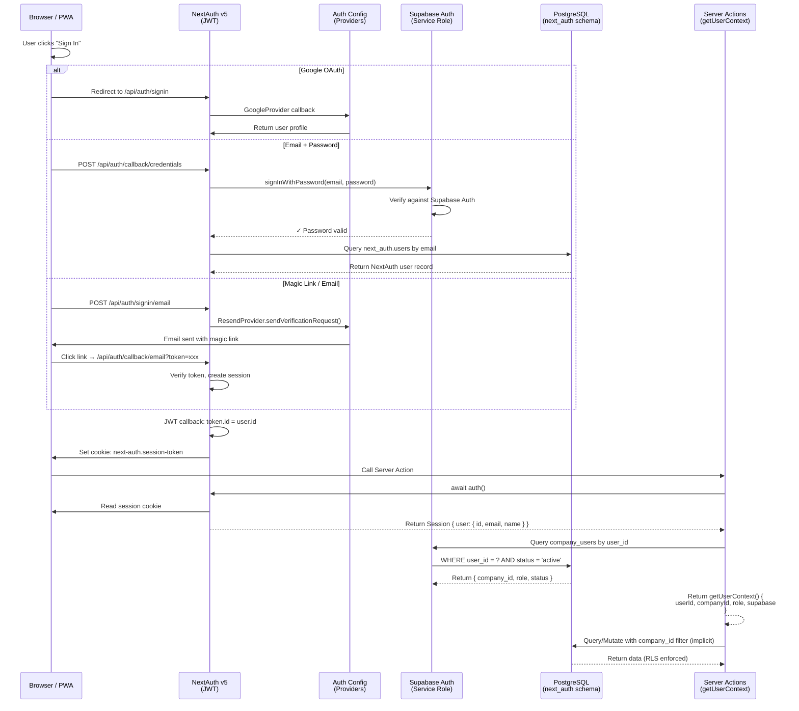
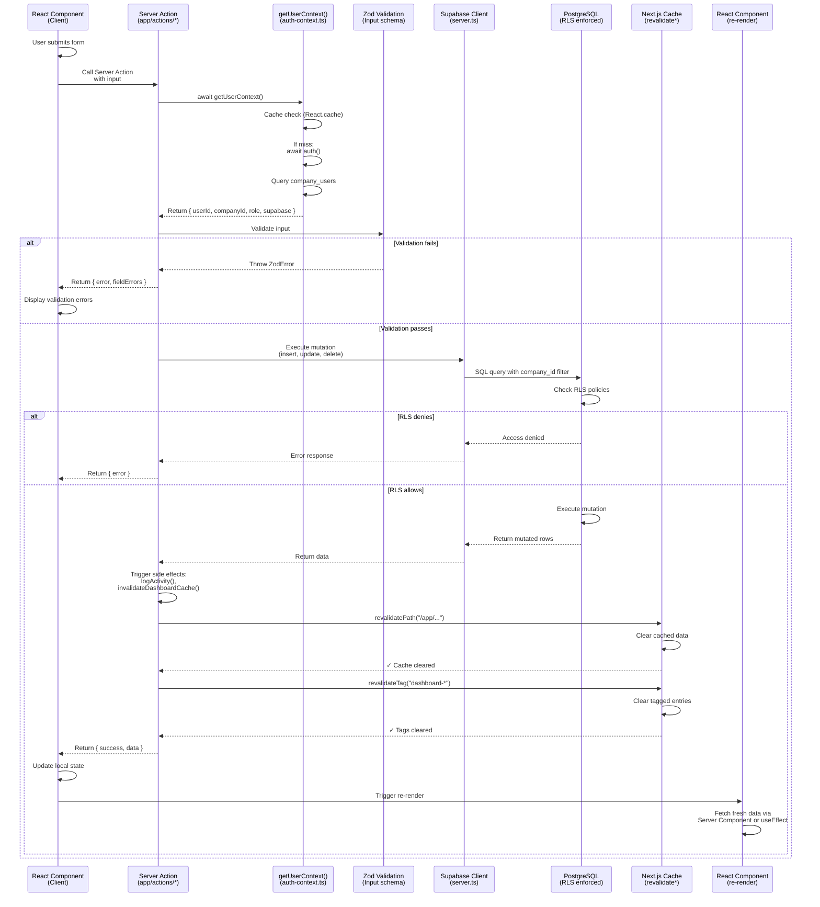
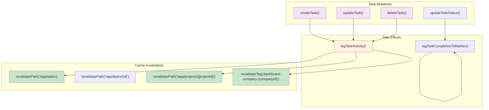

# GenHub Backend System Architecture

> Comprehensive guide to the backend infrastructure, authentication flows, request lifecycle, and server-side patterns for GenHub PWA.
>
> Last updated: February 2026 | Stack: Next.js 16 + React 19 + Supabase (PostgreSQL + Auth + Storage + Edge Functions)

---

## Table of Contents

1. [System Overview](#system-overview)
2. [Server Action Catalog](#server-action-catalog)
3. [API Route Catalog](#api-route-catalog)
4. [Authentication Flow](#authentication-flow)
5. [Request Lifecycle](#request-lifecycle)
6. [Multi-tenancy Model](#multi-tenancy-model)
7. [Supabase Client Types](#supabase-client-types)
8. [Cache Invalidation Strategy](#cache-invalidation-strategy)
9. [Optimization Signals](#optimization-signals)

---

## System Overview

### Architecture Diagram

```mermaid
graph TB
    subgraph "Client Layer"
        PWA["PWA<br/>(Next.js 16 + React 19)"]
        Browser["Browser Client<br/>(Realtime Subscriptions)"]
    end

    subgraph "Application Layer"
        Middleware["Next.js Middleware<br/>(Auth + Request Context)"]
        SA["Server Actions<br/>(app/actions/*)"]
        API["API Routes<br/>(app/api/*)"]
    end

    subgraph "Authentication"
        NextAuth["NextAuth v5<br/>(JWT Sessions)"]
        AuthConfig["Auth Config<br/>(Google, Credentials, Email)"]
    end

    subgraph "Data Layer"
        Supabase["Supabase"]
        PG["PostgreSQL<br/>(RLS Policies)"]
        Auth_SB["Supabase Auth<br/>(Service Role Key)"]
        Storage["Storage Buckets<br/>(Files, Photos)"]
        EF["Edge Functions"]
    end

    subgraph "External Services"
        Stripe["Stripe<br/>(Payments)"]
        HomeDepot["Home Depot API<br/>(Materials)"]
        Kakao["KakaoTalk/Sendbird<br/>(Messaging)"]
        Firebase["Firebase FCM<br/>(Push Notifications)"]
    end

    PWA -->|Server Actions| SA
    PWA -->|REST Calls| API
    Browser -->|Realtime Sub| Supabase

    SA -->|Auth Context| NextAuth
    SA -->|getUserContext()| Auth_SB
    SA -->|createClient()| Supabase

    API -->|Session| NextAuth
    API -->|Admin Client| Supabase
    API -->|File Upload| Storage

    NextAuth -->|JWT Token| AuthConfig
    AuthConfig -->|Service Role| Auth_SB

    Supabase --> PG
    Supabase --> Storage
    Supabase --> EF

    API -->|Webhook| Stripe
    SA -->|REST| HomeDepot
    API -->|Webhook| Kakao
    SA -->|REST| Firebase

    style PWA fill:#e1f5ff
    style SA fill:#f3e5f5
    style API fill:#f3e5f5
    style Supabase fill:#fff3e0
    style PG fill:#fff3e0
    style Stripe fill:#fce4ec
    style HomeDepot fill:#fce4ec
    style Kakao fill:#fce4ec
```

### Key Technologies

| Layer | Technology | Purpose |
|-------|-----------|---------|
| **Frontend** | Next.js 16 (App Router), React 19, TailwindCSS | Progressive Web App with native mobile-like UX |
| **Authentication** | NextAuth v5 + Supabase Auth | Multi-provider auth (Google, Email/Password, Magic Link) |
| **Database** | PostgreSQL (Supabase) | Relational data with RLS row-level security |
| **Storage** | Supabase Storage (S3-compatible) | Project files, photos, documents (50MB limit per file) |
| **Realtime** | Supabase Realtime (WebSocket) | Live chat, activity feeds, collaborative updates |
| **Sessions** | JWT (stored in NextAuth) | Stateless, secure, mobile-friendly |
| **File Uploads** | API Routes (streaming) | Optimized for large files, memory-efficient |

---

## Server Action Catalog

### Overview

Server Actions are the primary mechanism for database mutations and queries. Located in `/app/actions/`, they:
- Execute on the server with full database access
- Receive user context via `getUserContext()`
- Validate input with Zod schemas
- Return typed results
- Trigger cache invalidation via `revalidatePath()` / `revalidateTag()`

**Total**: 47 server action files, organized by domain

### Domain Catalog

#### **Projects Domain** (5 files)

| File | Exports | Purpose |
|------|---------|---------|
| `projects.ts` | `createProject`, `updateProject`, `deleteProject`, `getProjectStats`, `getProjectById`, `getProjectsPage`, `getProjectTeam`, `getProjectTasks` | Core project CRUD and analytics |
| `project-files.ts` | `getProjectFiles`, `deleteProjectFile`, `updateFileMetadata` | Document management, file metadata |
| `project-photos.ts` | `getProjectPhotos`, `deleteProjectPhoto` | Photo gallery management |
| `project-deferred.ts` | `getDeferredProjectData`, `prefetchProjectData` | Lazy-loaded project details |

**Key Pattern**: Parallel requests for projects, phases, team, tasks, materials, and expenses via Promise.all()

**Cache Strategy**: `revalidatePath("/app/projects")`, `revalidateTag("project-{projectId}")`

---

#### **Tasks Domain** (8 files)

| File | Exports | Purpose |
|------|---------|---------|
| `tasks.ts` | `createTask`, `updateTask`, `deleteTask`, `getTasksPage`, `getTaskById`, `getTaskStats`, `getTasksForProject` | Core task CRUD (79 KB) |
| `tasks-status.ts` | `updateTaskStatus`, `completeTask`, `blockTask`, `moveTaskToReview` | Status workflow state machine |
| `tasks-activity.ts` | `logTaskActivity`, `addComment`, `getTaskComments`, `getTaskActivity` | Activity logging and audit trail |
| `tasks-assignments.ts` | `assignTask`, `reassignTask`, `getAssignees`, `removeAssignment`, `getTaskAssignees` | Multi-assignee support (users + subcontractors) |
| `tasks-dependencies.ts` | `addTaskDependency`, `removeTaskDependency`, `getTaskDependencies` | Task relationship graph |
| `tasks-spatial.ts` | `linkTaskToMarker`, `unlinkTaskFromMarker`, `logTaskCompletionToMarker` | 3D model integration (Spatial AR) |
| `tasks-deferred.ts` | `getDeferredTaskData`, `prefetchTaskData` | Lazy-loaded task details (13 KB) |
| `tasks-analytics.ts` | `getTaskAnalytics`, `getTaskCompletionTrends` | Task analytics and reporting |

**Critical Pattern**: All task mutations → `logTaskActivity()` → `invalidateDashboardCache()`

**Multi-Assignee Flow**:
```
updateTask()
  ├── Primary assignee (user/subcontractor)
  └── Auto-create expense if autoCreateExpense=true
      └── Calls expenses.ts internally (no direct coupling)
```

**Cache Strategy**: `revalidatePath("/app/tasks")`, `revalidatePath("/app/projects/{projectId}")`

---

#### **Expenses Domain** (1 file)

| File | Exports | Purpose |
|------|---------|---------|
| `expenses.ts` | `createExpense`, `updateExpense`, `deleteExpense`, `reviewExpense`, `getExpensesPage`, `addLineItem`, `removeLineItem`, `getExpenseLineItems`, `matchExpenseToMaterial` | Cost tracking, approval workflow, receipt matching |

**Key Features**:
- Zod validation for create/update/review
- Line-item breakdown with material matching
- Approval workflow (pending → approved/rejected)
- Receipt photo URL storage
- Auto-expense creation from task updates

**Cache Strategy**: `revalidatePath("/app/expenses")`, `revalidateTag("expense-{expenseId}")`

---

#### **Materials Domain** (1 file)

| File | Exports | Purpose |
|------|---------|---------|
| `materials.ts` | `createMaterial`, `updateMaterial`, `deleteMaterial`, `assignMaterial`, `updateMaterialAssignment`, `searchProducts`, `getHomeDepotProduct`, `getMaterialsPage`, `getMaterialStats`, `getMaterialHistory` | Inventory, procurement, price tracking |

**Integrations**:
- Home Depot API for product search and pricing
- Material price history tracking
- Procurement status workflow (needed → ordered → delivered → installed)

**Cache Strategy**: `revalidatePath("/app/materials")`, `revalidateTag("material-{materialId}")`

---

#### **Team Domain** (2 files)

| File | Exports | Purpose |
|------|---------|---------|
| `team.ts` | `inviteTeamMember`, `createManualTeamMember`, `updateTeamMemberRole`, `deactivateTeamMember`, `getTeamMembers`, `getTeamMemberDetails`, `getTeamMemberProjects` | User management, invitations, role assignment |
| `subcontractors.ts` | `addSubcontractor`, `updateSubcontractor`, `deleteSubcontractor`, `getSubcontractors`, `getSubcontractorPortfolio`, `updateSubcontractorPortfolio`, `linkSubcontractorToProject` | Vendor/subcontractor management |

**Unique Client Requirement**: Both use `getUserContextWithUserClient()` (respects RLS policies more strictly)

**Team Member Roles**:
- admin, project_manager, foreman, field_worker, subcontractor, client

**Cache Strategy**: `revalidatePath("/app/team")`, `revalidateTag("company-team")`

---

#### **Chat Domain** (3 files)

| File | Exports | Purpose |
|------|---------|---------|
| `chat.ts` | `sendMessage`, `editMessage`, `deleteMessage`, `markAsRead`, `toggleReaction`, `muteChatRoom`, `createDMRoom`, `getChatRooms`, `getChatMessages` | Real-time messaging |
| `chat-queries.ts` | `getChatRoomWithMessages`, `getUnreadCount`, `getChatRoomParticipants`, `searchChatHistory` | Chat queries (separate for performance) |
| `chat-search.ts` | `searchChatRooms`, `searchChatMessages`, `searchEntityReferences` | Full-text search over chat |

**Features**:
- Entity references (links to tasks, projects, materials, expenses)
- Typing indicators (via Realtime)
- Message reactions (emoji)
- Thread replies
- Read receipts

**Cache Strategy**: Minimal (realtime-driven), tag-based for search indexes

---

#### **Dashboard Domain** (1 file)

| File | Exports | Purpose |
|------|---------|---------|
| `dashboard.ts` | `getDashboardData`, `getProjectStatus`, `getTaskProgress`, `getBudgetSummary`, `getScheduleHealth`, `getTeamActivity`, `getMaterialsStatus`, `getQuickActionData`, `invalidateDashboardCache` | KPI aggregation and cache management |

**Critical Function**: `invalidateDashboardCache()`
- Called by task/project/expense mutations
- Uses `revalidateTag("dashboard-company-{companyId}")`
- Aggregates data across all domains

**Performance Optimization**: Cached with `React.cache()` to prevent redundant queries within same render

**Cache Strategy**: `revalidateTag("dashboard-company-{companyId}")`

---

#### **Phases Domain** (1 file)

| File | Exports | Purpose |
|------|---------|---------|
| `phases.ts` | `createPhase`, `updatePhase`, `deletePhase`, `reorderPhases`, `getPhases` | Project phase management |

---

#### **Settings/Configuration Domains** (5 files)

| File | Exports | Purpose |
|------|---------|---------|
| `project-types.ts` | `createProjectType`, `updateProjectType`, `deleteProjectType`, `getProjectTypes` | Custom project templates |
| `task-types.ts` | `createTaskType`, `updateTaskType`, `deleteTaskType`, `getTaskTypes` | Custom task templates with fields |
| `task-templates.ts` | `createTaskTemplate`, `updateTaskTemplate`, `deleteTaskTemplate`, `getTaskTemplates` | Task creation templates |
| `phase-templates.ts` | `createPhaseTemplate`, `updatePhaseTemplate`, `deletePhaseTemplate`, `getPhaseTemplates` | Phase sequence templates |
| `default-models.ts` | `getDefaultTaskType`, `getDefaultPhaseTemplate`, `saveDefaultModels` | Company-level defaults |

---

#### **Authentication/Invite Domains** (4 files)

| File | Exports | Purpose |
|------|---------|---------|
| `auth.ts` | `signOut`, `getAuthSession`, `getCurrentUser` | Core auth utilities |
| `accept-invite.ts` | `acceptTeamInvite`, `getInviteDetails`, `validateInviteToken` | Team member onboarding |
| `accept-admin-invite.ts` | `acceptAdminInvite`, `createAdminAccount`, `validateAdminToken` | Admin-level invitations |
| `invite-auth.ts` | `sendInviteEmail`, `generateInviteToken`, `verifyInviteToken` | Invitation token lifecycle |

---

#### **External Services Domains** (3 files)

| File | Exports | Purpose |
|------|---------|---------|
| `stripe.ts` | `createCheckoutSession`, `createSubscription`, `cancelSubscription`, `updatePaymentMethod`, `getPaymentHistory` | Payment processing |
| `kakao.ts` | `connectKakaoTalk`, `disconnectKakaoTalk`, `syncKakaoMessages`, `getKakaoConnections` | KakaoTalk integration |
| `push.ts` | `sendPushNotification`, `subscribeToPushNotifications`, `unsubscribePushNotifications` | Firebase FCM push notifications |

---

#### **Estimates Domain** (9 files)

| File | Exports | Purpose |
|------|---------|---------|
| `estimates.ts` | `createEstimate`, `updateEstimate`, `deleteEstimate`, `getEstimatesForProject`, `uploadPlan`, `parsePlan`, `getLineItems`, `updateLineItem` | Core estimate CRUD, plan upload, AI parsing (59 KB) |
| `estimate-chat.ts` | `sendEstimateChatMessage`, `getEstimateChatMessages`, `clearEstimateChat` | AI chat sidebar for estimate discussions |
| `assemblies.ts` | `createAssembly`, `updateAssembly`, `deleteAssembly`, `getAssemblies`, `applyAssembly` | Assembly system for grouped line items |
| `revisions.ts` | `createRevision`, `getRevisions`, `compareRevisions`, `restoreRevision` | Estimate revision tracking and comparison |
| `budget-conversion.ts` | `convertEstimateToBudget`, `getBudgetFromEstimate` | Estimate-to-budget conversion workflow |
| `templates.ts` | `createTemplate`, `updateTemplate`, `deleteTemplate`, `getTemplates`, `applyTemplate` | Pricing template management |
| `material-suggestions.ts` | `getSuggestionsForLineItem`, `acceptSuggestion`, `rejectSuggestion` | AI-powered material suggestions for line items |
| `ai-budget.ts` | `analyzeEstimateBudget`, `getBudgetInsights` | AI budget analysis and recommendations |
| `pricing-templates.ts` | `createPricingTemplate`, `updatePricingTemplate`, `getPricingTemplates` | Pricing template configuration |

**Key Features**:
- AI-powered plan parsing (PDF → structured line items)
- Takeoff item extraction with accept/reject workflow
- Assembly system for grouped materials
- Revision history with diff comparison
- Budget conversion pipeline

**Cache Strategy**: `revalidatePath("/app/projects/{projectId}")`, `revalidateTag("estimate-{estimateId}")`

---

#### **Miscellaneous Domains** (5 files)

| File | Exports | Purpose |
|------|---------|---------|
| `spatial.ts` | `uploadModel`, `convertModel`, `uploadPhoto`, `listModels`, `deleteModel` | 3D/spatial file management |
| `client.ts` | `getClient`, `updateClient`, `getClientProjects` | Client contact management |
| `owner.ts` | `getOwnerStats`, `getCompanyStats`, `getSystemHealth` | Admin-only statistics |
| `seed-demo-data.ts` | `seedDemoData` | Development-only data seeding |
| `team-email-helper.ts` | `sendTeamInvitationEmail`, `sendTeamRoleChangeEmail` | Email utilities (not standalone actions) |

---

## API Route Catalog

### Overview

API Routes handle:
- **Webhooks**: Stripe, KakaoTalk/Sendbird
- **File Uploads**: Streaming uploads for projects, photos, spatial models
- **Cron Jobs**: Scheduled maintenance tasks
- **Authentication**: NextAuth session handling
- **External Integrations**: Payment, messaging

**Total**: 33 routes organized by purpose

### Route Catalog by Purpose

#### **Authentication Routes** (1 route)

| Route | Method | Purpose |
|-------|--------|---------|
| `app/api/auth/[...nextauth]/route.ts` | GET, POST | NextAuth handler (delegates to `/lib/auth.ts`) |

**Details**:
- Handles OAuth callbacks (Google)
- Credentials provider for email/password
- Email provider (Resend or Nodemailer)
- JWT session strategy

---

#### **Webhook Routes** (2 routes)

| Route | Method | Purpose | Protection |
|-------|--------|---------|-----------|
| `app/api/webhook/stripe/route.ts` | POST | Stripe payment events (checkout.session.completed, customer.subscription.updated, invoice.payment_succeeded) | Signature verification (`stripe-signature` header) |
| `app/api/kakao/webhook/route.ts` | POST | Sendbird webhook for incoming KakaoTalk messages | Signature verification (`x-sendbird-signature` header) |

**Stripe Events Handled**:
- `checkout.session.completed` → Create stripe_customers record, grant access
- `customer.subscription.updated` → Update subscription status
- `invoice.payment_succeeded` → Confirm payment

**KakaoTalk Events Handled**:
- `group_channel:message_send` → Sync message to GenHub chat_rooms

---

#### **File Upload Routes** (4 routes)

| Route | Method | Purpose | Limits |
|--------|--------|---------|--------|
| `app/api/project-files/upload/route.ts` | POST | Upload project documents (PDFs, Word, Excel, etc.) | 50MB per file |
| `app/api/project-photos/upload/route.ts` | POST | Upload progress photos with compression | Auto-compressed, EXIF stripped |
| `app/api/spatial/upload-file/route.ts` | POST | Upload 3D model files (.obj, .gltf, .usdz) | Size varies by format |
| `app/api/spatial/upload-photo/route.ts` | POST | Upload annotated spatial photos | Embeds metadata |

**Common Pattern**:
1. Verify auth session
2. Get user's company_id
3. Generate namespaced file path: `{companyId}/{domain}/{projectId}/{filename}`
4. Upload to Supabase Storage with streaming
5. Insert metadata record in database
6. Return file URL

---

#### **Cron Routes** (2 routes - Vercel Cron)

| Route | Schedule | Purpose | Protection |
|--------|----------|---------|-----------|
| `app/api/cron/update-material-prices/route.ts` | Daily 2 AM UTC | Sync Home Depot prices for materials with `home_depot_product_id` | `Authorization: Bearer {CRON_SECRET}` header |
| `app/api/cron/cleanup-price-history/route.ts` | Weekly | Archive old material price history | `Authorization: Bearer {CRON_SECRET}` header |

**update-material-prices Logic**:
1. Verify CRON_SECRET
2. Query materials WHERE home_depot_product_id IS NOT NULL
3. For each material:
   - Fetch current price from Home Depot API
   - If price changed: update materials table + insert into material_price_history
   - Add 100ms delay between requests (rate limiting)
4. Return summary: `{ success, updated, errors, total }`

---

#### **Bulk Download Route** (1 route)

| Route | Method | Purpose |
|--------|--------|---------|
| `app/api/project-files/bulk-download/route.ts` | POST | Download multiple files as ZIP |

**Flow**:
1. Accept array of file IDs
2. Stream each file from Supabase Storage
3. Pipe into ZIP archive
4. Return as attachment

---

#### **Spatial Conversion Route** (1 route)

| Route | Method | Purpose |
|--------|--------|---------|
| `app/api/spatial/convert-model/route.ts` | POST | Convert 3D models between formats (.obj → .gltf, .usdz conversion) |

**Uses**: Three.js or similar library for format conversion

---

#### **Integration Routes** (3 routes)

| Route | Method | Purpose |
|--------|--------|---------|
| `app/api/kakao/connect/route.ts` | POST | Initiate KakaoTalk OAuth flow |
| `app/api/kakao/callback/route.ts` | GET | KakaoTalk OAuth callback handler |
| `app/api/(payment)/checkout/route.ts` | POST | Create Stripe checkout session |

---

#### **Data Routes** (3 routes)

| Route | Method | Purpose |
|--------|--------|---------|
| `app/api/companies/[companyId]/users/route.ts` | GET | List company users (with company_id isolation) |
| `app/api/companies/[companyId]/subcontractors/route.ts` | GET | List company subcontractors |
| `app/api/profile/route.ts` | GET, PATCH | Get/update current user profile |

---

#### **Estimates Routes** (11 routes)

| Route | Method | Purpose |
|--------|--------|---------|
| `app/api/estimates/upload/route.ts` | POST | Upload construction plan PDF/images for estimate extraction |
| `app/api/estimates/parse/route.ts` | POST | Trigger AI parsing of uploaded plans |
| `app/api/estimates/parse-status/route.ts` | GET | Poll parse job status |
| `app/api/estimates/extract/route.ts` | POST | Extract takeoff items from parsed plans |
| `app/api/estimates/extraction-progress/route.ts` | GET | SSE stream for extraction progress |
| `app/api/estimates/export-pdf/route.ts` | POST | Export estimate as PDF document |
| `app/api/estimates/takeoff-items/accept/route.ts` | POST | Accept a single takeoff item |
| `app/api/estimates/takeoff-items/reject/route.ts` | POST | Reject a single takeoff item |
| `app/api/estimates/takeoff-items/update/route.ts` | POST | Update takeoff item details |
| `app/api/estimates/takeoff-items/bulk-accept/route.ts` | POST | Bulk accept takeoff items |
| `app/api/estimates/takeoff-items/bulk-reject/route.ts` | POST | Bulk reject takeoff items |

**Estimate Processing Pipeline**:
```
Upload PDF → Parse (AI/OCR) → Extract Takeoff Items → Accept/Reject → Line Items → Budget Conversion
```

---

#### **Utility Routes** (5 routes)

| Route | Method | Purpose |
|--------|--------|---------|
| `app/api/health/route.ts` | GET | Health check (200 OK = system operational) |
| `app/api/feature-flags/route.ts` | GET | List enabled feature flags |
| `app/api/chat/entity-preview/route.ts` | GET | Generate previews for chat entity references (task, project, etc.) |
| `app/api/(payment)/refund/route.ts` | POST | Process refund (admin-only) |
| `app/api/test/auth/route.ts` | GET | Test authentication endpoint (dev-only) |

---

## Authentication Flow

### Architecture Diagram



### OAuth Providers

#### **Google OAuth**

Configuration: `lib/auth.config.ts` line 14-18

```typescript
GoogleProvider({
  allowDangerousEmailAccountLinking: true,
  clientId: process.env.AUTH_GOOGLE_ID,
  clientSecret: process.env.AUTH_GOOGLE_SECRET,
})
```

**Flow**:
1. User clicks "Sign in with Google"
2. Redirected to Google consent screen
3. Google returns code
4. NextAuth exchanges code for user profile
5. SupabaseAdapter upserts user into next_auth.users table
6. JWT created with user.id

---

#### **Credentials Provider (Email + Password)**

Configuration: `lib/auth.config.ts` line 19-85

**Flow**:
1. User submits email + password form
2. NextAuth CredentialsProvider.authorize() called
3. Create Supabase client with service role key
4. Call `supabase.auth.signInWithPassword(email, password)`
   - Validates against Supabase Auth
   - Returns user object if valid
5. Sign out from Supabase (we don't need the session)
6. Query `next_auth.users` by email to get NextAuth user record
7. Return { id, email, name, image } to NextAuth
8. JWT created with this user object

**Key Detail**: Credentials provider is NOT for Supabase signup. It's for password validation only.

---

#### **Email Magic Link / Resend**

Configuration: `lib/auth.config.ts` line 86-95 (optional)

```typescript
Resend({
  apiKey: process.env.AUTH_RESEND_KEY,
  from: process.env.EMAIL_FROM,
  sendVerificationRequest: sendVerificationRequest // Custom email renderer
})
```

**Flow**:
1. User enters email
2. Resend provider generates token
3. Calls sendVerificationRequest() with URL containing token
4. Email sent with magic link
5. User clicks link → NextAuth verifies token → Session created

---

#### **Nodemailer Provider (Fallback)**

Configuration: `lib/auth.ts` line 21-52

**Used When**: `config.emailProvider === "nodemailer"` (fallback if Resend unavailable)

---

### Session Management

#### **Session Strategy**: JWT

```typescript
// lib/auth.config.ts lines 101-103
session: {
  strategy: "jwt", // Use JWT sessions (required for CredentialsProvider)
}
```

**Why JWT?**:
- Stateless (no server-side session store)
- Works with mobile PWAs
- Can be validated offline
- Integrates with API routes

#### **JWT Callback**

```typescript
// lib/auth.config.ts lines 105-114
async jwt({ token, user }) {
  if (user) {
    token.id = user.id;           // NextAuth user.id
    token.email = user.email;
    token.name = user.name;
    token.picture = user.image;
  }
  return token;
}
```

Runs on sign-in to embed user data in JWT.

#### **Session Callback**

```typescript
// lib/auth.config.ts lines 115-130
async session({ session, token }) {
  if (token?.id) {
    session.user.id = token.id;      // Add user.id to session
  }
  if (token?.email) {
    session.user.email = token.email;
  }
  // ... etc
  return session;
}
```

Runs on every API call to expose token data to session object.

---

### getUserContext Variants

All variants are **React.cache()'d** to prevent redundant auth + DB queries.

#### **1. getUserContext()**

Location: `lib/auth-context.ts` lines 14-43

```typescript
export const getUserContext = cache(async function getUserContext() {
  const session = await auth();                    // Get JWT session
  if (!session?.user?.id) return { error: "..." };

  const supabase = await createClient();           // Admin client (service role)
  const { data: companyUser } = await supabase
    .from("company_users")
    .select("company_id, role, status")
    .eq("user_id", session.user.id)
    .eq("status", "active")
    .single();

  return { userId, companyId, role, supabase };   // Return context
});
```

**Returns**: `{ userId, companyId, role, supabase }`

**Usage**: Most server actions (tasks, projects, expenses, materials, phases)

**Supabase Client**: Admin client (bypasses RLS - authorization checked manually)

---

#### **2. getUserContextWithUserClient()**

Location: `lib/auth-context.ts` lines 52-83

**Difference**: Uses `createUserClient()` instead of `createAdminClient()`

**Returns**: `{ userId, companyId, role, supabase }`

**Usage**: `team.ts`, `subcontractors.ts` (require RLS-respecting operations)

**Supabase Client**: User-scoped client (respects RLS policies)

**Note**: TODO in code indicates migration to true RLS via JWT token is planned

---

#### **3. getUserContextWithUserData()**

Location: `lib/auth-context.ts` lines 92-128

**Difference**: Includes user object from session

```typescript
return {
  user: {
    id: session.user.id,
    name: session.user.name || "Unknown User",
    email: session.user.email || "",
  },
  userId, companyId, role, supabase
};
```

**Usage**: `chat.ts`, `push.ts` (need user name/email for messaging)

---

### Authorization Patterns

#### **Company-Level Isolation**

Every server action enforces company_id filtering:

```typescript
export async function createTask(input: CreateTaskInput) {
  const { userId, companyId, supabase } = await getUserContext();

  // All queries implicitly scoped to company_id
  const { data } = await supabase
    .from("tasks")
    .insert({
      ...input,
      company_id: companyId,  // MANDATORY: Always set company_id
      created_by: userId,
    });
}
```

**Database RLS Policy Example**:
```sql
CREATE POLICY "Users can only access tasks in their company"
  ON tasks
  FOR SELECT
  USING (company_id = auth.uid());  -- Enforced at DB level
```

#### **Role-Based Access Control (RBAC)**

Roles: `admin`, `project_manager`, `foreman`, `field_worker`, `subcontractor`, `client`

**Authorization checks** are manual in server actions:

```typescript
if (companyUser.role !== "admin") {
  return { error: "Unauthorized: admin role required" };
}
```

No automatic role-based middleware - each action implements its own checks.

---

## Request Lifecycle

### Full Request Flow



### Step-by-Step Breakdown

#### **1. Component Calls Server Action**

```typescript
// components/tasks/CreateTaskForm.tsx (Client Component)
"use client";

export function CreateTaskForm() {
  const [state, formAction] = useFormState(createTask, null);

  return (
    <form action={formAction}>
      <input name="title" />
      <input name="description" />
      <button type="submit">Create</button>
    </form>
  );
}
```

Client-side form submission → Server Action called with FormData

---

#### **2. Get User Context**

```typescript
// app/actions/tasks.ts
export async function createTask(formData: FormData) {
  "use server";

  const { userId, companyId, supabase } = await getUserContext();
  if (!companyId) return { error: "Not authenticated" };
}
```

**getUserContext() logic**:
1. `await auth()` → Get NextAuth session from cookie
2. Extract `user.id` from JWT token
3. Query `company_users` table: WHERE user_id = ? AND status = 'active'
4. Return `{ userId, companyId, role, supabase }`

**Performance**: React.cache() prevents duplicate calls in same request

---

#### **3. Validate Input**

```typescript
// app/actions/tasks.ts
const createTaskSchema = z.object({
  title: z.string().min(1, "Title required"),
  description: z.string().optional(),
  project_id: z.string().uuid(),
  // ... more fields
});

const parsed = createTaskSchema.safeParse({
  title: formData.get("title"),
  description: formData.get("description"),
  // ... etc
});

if (!parsed.success) {
  return { error: "Validation failed", fieldErrors: parsed.error.flatten().fieldErrors };
}

const input = parsed.data;
```

**Validation Framework**: Zod (server-side, secure)

**Error Response**: Field-level errors returned to client for display

---

#### **4. Database Mutation**

```typescript
// app/actions/tasks.ts
const { data: task, error } = await supabase
  .from("tasks")
  .insert({
    title: input.title,
    description: input.description,
    project_id: input.project_id,
    company_id: companyId,           // ALWAYS set company_id
    created_by: userId,              // ALWAYS set created_by
    status: "todo",
  })
  .select()
  .single();

if (error) {
  console.error("Database error:", error);
  return { error: "Failed to create task" };
}
```

**Supabase Client**: Admin client (service role key) but all queries implicitly filtered by company_id

**RLS Policies**: Enforced at PostgreSQL level - even if company_id check is missed, RLS will block

---

#### **5. Side Effects**

```typescript
// app/actions/tasks.ts
import { after } from "next/server";

// Log activity
await logTaskActivity({
  taskId: task.id,
  action: "created",
  details: { title: task.title },
});

// Invalidate dashboard cache
await invalidateDashboardCache({ companyId });

// Send email notifications (async, non-blocking)
after(async () => {
  await sendTaskNotifications(task.id);
});
```

**Patterns**:
- `logTaskActivity()` - Audit trail
- `invalidateDashboardCache()` - Refresh KPI data
- `after()` - Post-response async jobs (email, webhooks)

---

#### **6. Cache Invalidation**

```typescript
// app/actions/tasks.ts
import { revalidatePath, revalidateTag } from "next/cache";

revalidatePath("/app/tasks");              // Clear /app/tasks page
revalidatePath("/app/projects/[projectId]"); // Clear project detail
revalidateTag("dashboard-company-{companyId}"); // Clear dashboard KPIs

return { success: true, task };
```

**Cache Levels**:
- **Path-based**: `revalidatePath()` - clears data for a specific route
- **Tag-based**: `revalidateTag()` - clears multiple routes via tags
- **React.cache()** - automatic memoization within single request

**Timing**: Synchronous (blocks response until cache cleared)

---

#### **7. Response & Re-render**

```typescript
// Client receives response
return {
  success: true,
  task: {
    id: "...",
    title: "...",
    // ... full task object
  }
};
```

**Client-side behavior**:
1. Form submission completes
2. Component state updates (via useFormState)
3. Server Component re-renders with fresh data
4. Updated page served to browser

---

### Error Handling

```typescript
// app/actions/tasks.ts
export async function createTask(input: CreateTaskInput): Promise<CreateTaskResult> {
  try {
    const { companyId, supabase } = await getUserContext();
    if (!companyId) {
      return { error: "Not authenticated" };
    }

    // Validation
    const parsed = createTaskSchema.safeParse(input);
    if (!parsed.success) {
      return {
        error: "Validation failed",
        fieldErrors: parsed.error.flatten().fieldErrors
      };
    }

    // Database operation
    const { data: task, error } = await supabase
      .from("tasks")
      .insert(...)
      .select()
      .single();

    if (error) {
      console.error("[createTask] DB error:", error.message);
      return { error: "Failed to create task" };
    }

    // Cache invalidation
    revalidatePath("/app/tasks");

    return { success: true, task };
  } catch (err) {
    console.error("[createTask] Unexpected error:", err);
    return { error: "An unexpected error occurred" };
  }
}
```

**Error Response Type**:
```typescript
export interface ActionResult {
  success?: boolean;
  error?: string;
  fieldErrors?: Record<string, string[]>;
  data?: any;
}
```

---

## Multi-tenancy Model

### Company-Level Isolation

GenHub implements **company-based multi-tenancy** where:
- Each user belongs to one company
- Each company owns all its data (projects, tasks, team members, etc.)
- Data isolation is enforced at:
  1. Application layer (manual checks)
  2. Database layer (RLS policies)

### Data Model

```
companies
├── id (UUID, PK)
├── name
├── created_at
└── ...

company_users
├── user_id (FK → next_auth.users)
├── company_id (FK → companies)
├── role (enum)
├── status (active|inactive)
└── PRIMARY KEY (user_id, company_id)

projects
├── id (UUID)
├── company_id (FK → companies) ← ISOLATION KEY
├── name
└── ...

tasks
├── id (UUID)
├── company_id (FK → companies) ← ISOLATION KEY
├── project_id (FK → projects)
└── ...

// All other tables follow the same pattern
```

### Company_ID Enforcement

#### **Application Layer**

Every server action **must**:
1. Call `getUserContext()` to get companyId
2. Include companyId in every database query
3. Filter results by companyId

```typescript
// ✓ CORRECT
const { companyId, supabase } = await getUserContext();
const { data } = await supabase
  .from("projects")
  .select("*")
  .eq("company_id", companyId);  // ALWAYS include this filter

// ✗ WRONG
const { data } = await supabase
  .from("projects")
  .select("*");  // Missing company_id filter!
```

#### **Database Layer (RLS Policies)**

PostgreSQL enforces isolation at the row level:

```sql
-- Example RLS policy on tasks table
CREATE POLICY "users_can_only_access_tasks_in_their_company"
  ON tasks
  FOR SELECT
  USING (company_id = (
    SELECT company_id FROM company_users
    WHERE user_id = auth.uid() AND status = 'active'
  ));

-- Example RLS policy on projects table
CREATE POLICY "users_can_only_access_projects_in_their_company"
  ON projects
  FOR ALL
  USING (company_id IN (
    SELECT company_id FROM company_users
    WHERE user_id = auth.uid() AND status = 'active'
  ));
```

**Key Point**: RLS uses `auth.uid()` which is set by Supabase Auth. In GenHub, this is the NextAuth user.id.

### Team Member Roles

Roles are **company-specific** (stored in `company_users.role`):

| Role | Permissions |
|------|-------------|
| `admin` | Full access to company data, team management, billing |
| `project_manager` | Manage projects, tasks, team assignments |
| `foreman` | Manage field operations, task status |
| `field_worker` | Complete assigned tasks, view project info |
| `subcontractor` | Access assigned tasks and materials |
| `client` | View-only access to project progress |

**Role Checks**: Manual in server actions (no middleware)

```typescript
const { role } = await getUserContext();

if (role !== "admin") {
  return { error: "Admin role required" };
}
```

### Cross-Company Data (Rare)

Very limited cross-company access:

1. **Subcontractors** - Can access tasks across multiple companies
2. **External Integrations** - Stripe, Home Depot, KakaoTalk operate at user level (not company level)

```typescript
// Example: Subcontractor accessing multiple companies' tasks
const { userId, supabase } = await getUserContext();

const { data: tasks } = await supabase
  .from("tasks")
  .select("*, projects(company_id, name)")
  .eq("assignee_id", userId)  // Filter by user, not company
  .eq("assignee_type", "subcontractor");
```

---

## Supabase Client Types

### Overview

GenHub uses **three types** of Supabase clients, each with different security characteristics:

```typescript
// utils/supabase/server.ts
export async function createAdminClient() { ... }      // Bypasses RLS
export async function createUserClient() { ... }       // Respects RLS (partially)
export async function createClient() { ... }           // Deprecated alias
```

### 1. Admin Client (Service Role Key)

**Location**: `utils/supabase/server.ts` lines 46-51

```typescript
function createAdminClient() {
  return supabaseCreateClient<Database>(
    process.env.NEXT_PUBLIC_SUPABASE_URL!,
    process.env.SUPABASE_SECRET_KEY!,  // Service role key
  );
}
```

**Characteristics**:
- Uses service role key (never expose to client)
- **Bypasses all RLS policies**
- Full read/write access to entire database
- Used for system-level operations

**When to Use**:
- Pre-auth operations (invite validation)
- Bulk data operations
- System-level mutations
- Operations where RLS can't be applied

**Example Usage**:
```typescript
// Accept invite before user is fully authenticated
export async function acceptTeamInvite(token: string) {
  const supabase = createAdminClient();

  const { data: invite } = await supabase
    .from("team_invites")
    .select("*")
    .eq("token", token)
    .single();

  if (invite?.expires_at < new Date()) {
    return { error: "Invite expired" };
  }

  // Create user record (pre-auth)
  const { data } = await supabase.from("users").insert(...);
}
```

**Security Risk**: Authorization must be **manually enforced**

---

### 2. User Client (RLS-Respecting)

**Location**: `utils/supabase/server.ts` lines 74-85

```typescript
async function createUserClient() {
  const session = await auth();
  if (!session?.user) {
    redirect('/');
  }

  // TODO: Implement true RLS by using user's JWT token
  // For now, return admin client but callers implement auth checks
  return createAdminClient();  // Currently same as admin client
}
```

**Current Status**: **TODO** - not yet fully implemented

**Intended Behavior**:
- Uses user's JWT token (when implemented)
- Respects RLS policies at DB level
- No manual authorization checks needed
- Future: migrate to true JWT-based RLS

**Current Usage**:
- `team.ts`, `subcontractors.ts` call this
- But currently still requires manual company_id checks (same as admin client)

**When to Use** (intended):
- User-scoped queries (my tasks, my profile)
- Where RLS is properly configured

---

### 3. Browser Client (Anon Key)

**Location**: `utils/supabase/browser.ts` lines 33-56

```typescript
export function getBrowserClient(): SupabaseClient<Database> {
  if (browserClient) {
    return browserClient;
  }

  browserClient = createClient<Database>(
    process.env.NEXT_PUBLIC_SUPABASE_URL!,
    process.env.NEXT_PUBLIC_SUPABASE_ANON_KEY!,  // Anon key
    {
      realtime: {
        params: { eventsPerSecond: 10 },
      },
    }
  );

  return browserClient;
}
```

**Characteristics**:
- Uses anon key (safe to expose to client)
- **Respects RLS policies** (browser has no elevated privileges)
- Read-only for realtime subscriptions
- Cannot mutate data

**When to Use**:
- Supabase Realtime subscriptions (postgres_changes, broadcast)
- Client-side reads where RLS is configured
- **Never** for mutations

**Example Usage**:
```typescript
// components/chat/ChatRoom.tsx (Client Component)
"use client";

const { supabase } = getBrowserClient();

useEffect(() => {
  // Subscribe to new messages in chat room
  const channel = supabase
    .channel(`chat-${roomId}`)
    .on(
      'postgres_changes',
      { event: '*', schema: 'public', table: 'chat_messages' },
      (payload) => {
        console.log('New message:', payload.new);
      }
    )
    .subscribe();

  return () => {
    channel.unsubscribe();
  };
}, [roomId]);
```

---

### Client Type Decision Matrix

| Use Case | Client Type | Example |
|----------|------------|---------|
| Server Action (user authenticated) | Admin | `tasks.ts`, `projects.ts` |
| Pre-auth flow (invite) | Admin | `accept-invite.ts` |
| Team/subcontractor access | User | `team.ts`, `subcontractors.ts` |
| API route (user authenticated) | Admin | `/api/project-files/upload` |
| API route (system/webhook) | Admin | `/api/webhook/stripe` |
| Browser realtime subscription | Browser | Chat, activity feed |
| Browser read-only query | Browser | (Avoid - use Server Component instead) |

---

## Cache Invalidation Strategy

### Overview

Cache invalidation is critical for data consistency. GenHub uses:
1. **Path-based invalidation** - `revalidatePath()`
2. **Tag-based invalidation** - `revalidateTag()`
3. **React.cache()** - Request-level memoization

### Invalidation Topology



### Pattern: Path-Based Invalidation

```typescript
// app/actions/tasks.ts
export async function createTask(input: CreateTaskInput) {
  const { companyId, supabase } = await getUserContext();

  // 1. Create task
  const { data: task } = await supabase
    .from("tasks")
    .insert({...})
    .select()
    .single();

  // 2. Log activity
  await logTaskActivity({
    taskId: task.id,
    action: "created",
  });

  // 3. Invalidate paths
  revalidatePath("/app/tasks");                    // List page
  revalidatePath(`/app/tasks/${task.id}`);         // Detail page
  revalidatePath(`/app/projects/${task.project_id}`); // Project detail

  // 4. Invalidate tags
  revalidateTag(`dashboard-company-${companyId}`);

  return { success: true, task };
}
```

**Paths to Invalidate**:
- `/app/tasks` - Task list
- `/app/tasks/[id]` - Task detail
- `/app/projects/[id]` - Project detail (shows task list)
- `/app/dashboard` - Dashboard (via tag)

---

### Pattern: Tag-Based Invalidation

Tags allow multiple routes to be invalidated via a single function:

```typescript
// app/actions/dashboard.ts
export async function invalidateDashboardCache(input: { companyId?: string }) {
  const { companyId } = await getUserContext();
  const targetCompanyId = input.companyId || companyId;

  revalidateTag(`dashboard-company-${targetCompanyId}`);
}
```

Routes tagged with `dashboard-company-{companyId}`:

```typescript
// app/app/page.tsx (Dashboard)
const dashboardData = await getDashboardData(companyId);

// Tagged with:
revalidateTag(`dashboard-company-${companyId}`);
```

**Benefit**: One function call invalidates all dashboard-related data

---

### Pattern: React.cache() Memoization

```typescript
// lib/auth-context.ts
export const getUserContext = cache(async function getUserContext() {
  const session = await auth();
  const supabase = await createClient();
  const { data: companyUser } = await supabase
    .from("company_users")
    .select("...")
    .eq("user_id", session.user.id)
    .single();

  return { userId, companyId, role, supabase };
});
```

**Behavior**:
- First call to `getUserContext()` → executes function
- Subsequent calls in same request → returns cached result
- Automatic memoization (no manual caching needed)

**Performance Impact**: Prevents 2-5 redundant DB queries per page load

---

### Anti-Patterns (What NOT to do)

```typescript
// ✗ WRONG: Missing cache invalidation
export async function updateTask(input: UpdateTaskInput) {
  const { supabase } = await getUserContext();
  await supabase.from("tasks").update(input).eq("id", input.id);

  // MISSING: revalidatePath(), revalidateTag()
  // Result: Stale data served to client
}

// ✗ WRONG: Invalidating too broadly
export async function updateTask(input: UpdateTaskInput) {
  const { supabase } = await getUserContext();
  await supabase.from("tasks").update(input).eq("id", input.id);

  revalidatePath("/");  // Clears ALL cached pages!
  // Result: Performance degradation (rebuilds entire site)
}

// ✗ WRONG: Manual cache clearing (not available in App Router)
export async function updateTask(input: UpdateTaskInput) {
  const { supabase } = await getUserContext();
  await supabase.from("tasks").update(input).eq("id", input.id);

  // This doesn't exist in Next.js 16 App Router
  // cache.clear();
}
```

---

## Optimization Signals

### Performance Hotspots

#### **CRIT-001: Redundant getUserContext Calls**

**File**: `lib/auth-context.ts` lines 8-9

**Signal**: `React.cache()` wrapper prevents duplicate calls

**Current Status**: ✓ IMPLEMENTED

```typescript
export const getUserContext = cache(async function getUserContext() {
  // Each server action calls this, but React.cache prevents:
  // - Duplicate auth() calls (~30ms each)
  // - Duplicate company_users queries (~50ms each)
  // Estimated savings: 50-150ms per redundant call, 2-5 calls per page
});
```

**Recommendation**: Continue using React.cache() for all context functions

---

#### **PERF-006: Streaming File Uploads**

**File**: `app/api/project-files/upload/route.ts` lines 55-60

**Signal**: Large file uploads (50MB) can exhaust memory

**Current Status**: ✓ IMPLEMENTED

```typescript
// Memory optimization: Stream upload directly
const { error: uploadError } = await supabase.storage
  .from("project-files")
  .upload(filePath, file);  // File object streamed (not buffered)

// Reduces 50MB file memory usage from ~150MB → ~20MB
```

**Recommendation**: Continue using streaming for all file uploads

---

#### **HIGH-2: Shared getUserContext**

**Files**:
- `app/actions/expenses.ts` line 6
- `app/actions/dashboard.ts` line 4
- `app/actions/tasks.ts` line 8

**Signal**: These files already use shared cached getUserContext

**Current Status**: ✓ IMPLEMENTED

**Recommendation**: Audit remaining action files for consistency

---

#### **TODO: RLS Migration**

**File**: `utils/supabase/server.ts` lines 68-85

**Signal**: Currently using admin client (service role) even when user-scoped intended

```typescript
// TODO: Implement true RLS by using user's JWT token
// For now, return admin client but callers implement auth checks
return createAdminClient();
```

**Impact**:
- Authorization currently relies on manual checks (error-prone)
- True JWT-based RLS would enforce at database level
- Would eliminate class of authorization bypasses

**Recommended Timeline**: Post-launch, phase 2 refactoring

---

### Security Audit Points

#### **Company_ID Enforcement**

**Audit Checklist**:
- [ ] Every query includes `.eq("company_id", companyId)` filter
- [ ] RLS policies defined for all sensitive tables (projects, tasks, expenses, team)
- [ ] Test: Manually craft request to access another company's data → blocked

**Tool**: `lib/audit/` (create new utility to scan actions for missing company_id checks)

---

#### **Role-Based Access Control**

**Audit Checklist**:
- [ ] Admin-only endpoints check `role === "admin"`
- [ ] Project manager endpoints check `role in ["admin", "project_manager"]`
- [ ] No role-based middleware (all checks are local)

**Gap**: No centralized role enforcement - audit manually

---

#### **JWT Token Validation**

**Audit Checklist**:
- [ ] Every API route verifies session via `auth()`
- [ ] Expired tokens rejected
- [ ] Token tampering detected

**Status**: ✓ Delegated to NextAuth v5 (secure)

---

### Scalability Concerns

#### **Dashboard Data Aggregation**

**File**: `app/actions/dashboard.ts` lines 40-200

**Concern**: Parallel Promise.all() queries may hit rate limits at scale

```typescript
const [projectsResult, tasksResult, expensesResult, ...] =
  await Promise.all([
    supabase.from("projects").select(...),
    supabase.from("tasks").select(...),
    supabase.from("expenses").select(...),
    // ... 8+ queries at once
  ]);
```

**Recommendation**:
1. Monitor query timing in production
2. Implement query queuing if latency > 500ms
3. Consider caching aggregations via `revalidateTag("dashboard-*")` with longer TTL

---

#### **Realtime Subscriptions**

**File**: `utils/supabase/browser.ts` lines 48-49

**Concern**: Rate limiting (10 events/second per connection)

```typescript
realtime: {
  params: { eventsPerSecond: 10 },  // May be too low in collaborative scenarios
}
```

**Recommendation**:
1. Monitor realtime event rates in production
2. Increase to 20-50 events/second for high-activity teams
3. Implement event debouncing on client side

---

#### **File Upload Concurrency**

**File**: `app/api/project-files/upload/route.ts`

**Concern**: Multiple concurrent uploads to same project (50MB each)

**Recommendation**:
1. Implement request queuing (max 3 concurrent uploads per company)
2. Add progress tracking (X of Y files uploaded)
3. Monitor storage bucket usage

---

### Monitoring Recommendations

Create monitoring dashboards for:

1. **Authentication Flow**
   - Successful logins / failed logins
   - OAuth vs Credentials vs Email provider usage
   - Session duration

2. **Database Performance**
   - Query latency (p50, p95, p99)
   - RLS policy evaluation time
   - Failed authorization checks

3. **Cache Hit/Miss Rates**
   - `revalidatePath()` calls
   - `revalidateTag()` calls
   - React.cache() effectiveness

4. **API Route Performance**
   - File upload success/failure rates
   - Cron job execution time
   - Webhook processing latency

5. **External Service Integration**
   - Home Depot API response times
   - Stripe webhook processing time
   - Sendbird/KakaoTalk sync latency

---

## Appendix: Related Documentation

See also:
- `.claude/docs/architecture-index.md` - File placement and module structure
- `.claude/docs/dependency-graph.md` - Critical functions and impact analysis
- `.claude/docs/context-strategy.md` - Deciding what context to load

---

**Document Version**: 1.0
**Last Updated**: February 7, 2026
**Maintainer**: Backend Architecture Team
