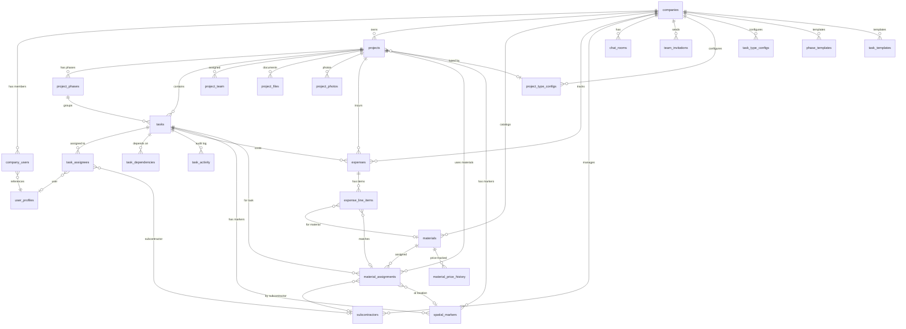
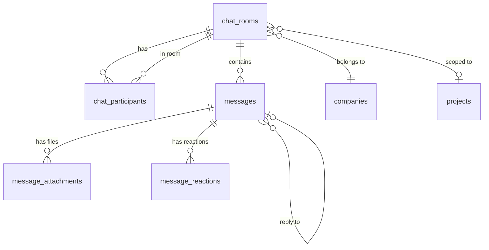
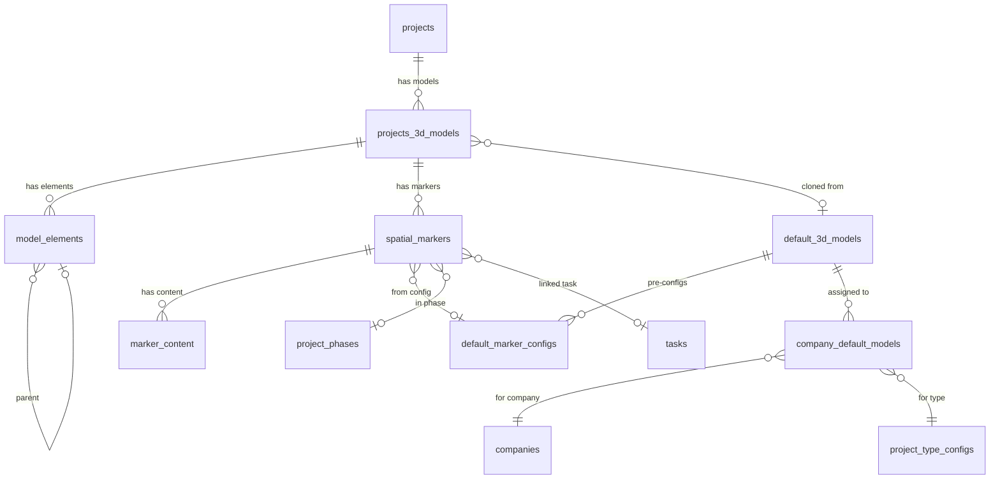
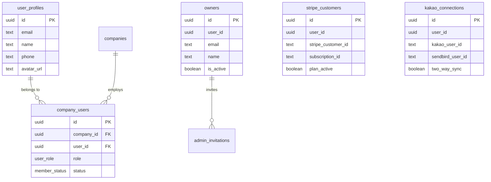

# Report 02: Data Model & Entity Relationships

> GenHub Construction PWA — Complete Database Schema Documentation
>
> **Source:** `types/database.types.ts` (3,339 lines), `types/db/enums.ts`, 62 migration files
> **Generated:** 2026-02-07

---

## Table of Contents

1. [Schema Overview](#1-schema-overview)
2. [Entity-Relationship Diagrams](#2-entity-relationship-diagrams)
3. [Table Catalog by Domain](#3-table-catalog-by-domain)
4. [Relationship Map](#4-relationship-map)
5. [RLS Policy Summary](#5-rls-policy-summary)
6. [RPC Functions Catalog](#6-rpc-functions-catalog)
7. [Materialized Views](#7-materialized-views)
8. [Database Functions & Triggers](#8-database-functions--triggers)
9. [Enum Reference](#9-enum-reference)
10. [Index Inventory](#10-index-inventory)
11. [Validation Constraints](#11-validation-constraints)
12. [Migration Timeline](#12-migration-timeline)
13. [Optimization Signals](#13-optimization-signals)

---

## 1. Schema Overview

GenHub's database consists of **42 tables**, **1 materialized view**, **22 RPC functions**, **22 enum types**, and **30+ indexes** across 7 domain groups.

### Domain Summary

| Domain | Tables | Core Table | Description |
|--------|--------|------------|-------------|
| **Organization** | 5 | `companies` | Company, users, owners, invitations |
| **Projects** | 6 | `projects` | Projects, phases, team, type configs |
| **Tasks** | 6 | `tasks` | Tasks, assignees, dependencies, activity, templates |
| **Expenses** | 2 | `expenses` | Expense tracking with line items |
| **Materials** | 4 | `materials` | Materials, assignments, price history, tracking |
| **Files & Media** | 4 | `project_files` | Files, photos, attachments, audit log |
| **Chat** | 5 | `chat_rooms` | Rooms, messages, participants, reactions, attachments |
| **Spatial/3D** | 5 | `spatial_markers` | 3D models, markers, marker content, elements |
| **Integrations** | 3 | `stripe_customers` | Stripe, Kakao, push notifications |
| **Notifications** | 1 | `notifications` | User notifications |
| **Subcontractors** | 1 | `subcontractors` | Trade subcontractor management |

### Table Count by Primary Key Pattern

- **UUID primary key (`id`):** 41 tables
- **Materialized view (no PK):** 1 (`mv_dashboard_kpis`)
- **All tables use `created_at`/`updated_at` timestamps** (except `notifications`, `push_subscriptions`)

---

## 2. Entity-Relationship Diagrams

### 2.1 Core Domain ERD



### 2.2 Chat & Messaging ERD



### 2.3 Spatial/3D Domain ERD



### 2.4 Organization & Auth ERD



---

## 3. Table Catalog by Domain

### 3.1 Organization Domain

#### `companies`
> Root tenant entity. All data is isolated by `company_id`.

| Column | Type | Nullable | Notes |
|--------|------|----------|-------|
| `id` | uuid | PK | |
| `name` | text | NOT NULL | Company display name |
| `email` | text | null | Contact email |
| `phone` | text | null | Contact phone |
| `address` | text | null | Physical address |
| `logo_url` | text | null | Logo image URL |
| `client_can_view_budget` | boolean | NOT NULL | Default false; controls client portal access |
| `created_at` | timestamptz | NOT NULL | |
| `updated_at` | timestamptz | NOT NULL | |

**FKs:** None (root entity)

#### `user_profiles`
> User identity. Linked to NextAuth `next_auth.users` table.

| Column | Type | Nullable | Notes |
|--------|------|----------|-------|
| `id` | uuid | PK | Matches `next_auth.users.id` |
| `email` | text | NOT NULL | |
| `name` | text | NOT NULL | |
| `phone` | text | null | |
| `avatar_url` | text | null | |
| `created_at` | timestamptz | NOT NULL | |
| `updated_at` | timestamptz | NOT NULL | |

**FKs:** None (identity table)

#### `company_users`
> Junction table: User membership in a company with role and status.

| Column | Type | Nullable | Notes |
|--------|------|----------|-------|
| `id` | uuid | PK | |
| `company_id` | uuid | FK → `companies` | NOT NULL |
| `user_id` | uuid | FK → `user_profiles` | NOT NULL |
| `role` | `user_role` | NOT NULL | Enum: admin, project_manager, foreman, field_worker, subcontractor, client |
| `status` | `member_status` | NOT NULL | Enum: active, invited, inactive |
| `invitation_token` | text | null | For invite flow |
| `invited_at` | timestamptz | null | |
| `invited_by` | uuid | null | |
| `activated_at` | timestamptz | null | When user accepted invite |
| `created_at` | timestamptz | NOT NULL | |
| `updated_at` | timestamptz | NOT NULL | |

**FKs:** `company_id` → `companies.id`, `user_id` → `user_profiles.id`

#### `owners`
> Platform-level super admin accounts (above company level).

| Column | Type | Nullable | Notes |
|--------|------|----------|-------|
| `id` | uuid | PK | |
| `user_id` | uuid | NOT NULL | Links to auth user |
| `email` | text | NOT NULL | |
| `name` | text | NOT NULL | |
| `is_active` | boolean | NOT NULL | |
| `created_at` | timestamptz | NOT NULL | |
| `updated_at` | timestamptz | NOT NULL | |

#### `admin_invitations`
> Platform-level admin invitation system (owner-to-owner invites).

| Column | Type | Nullable | Notes |
|--------|------|----------|-------|
| `id` | uuid | PK | |
| `email` | text | NOT NULL | |
| `name` | text | null | |
| `invitation_token` | text | NOT NULL | Unique, auto-generated |
| `invited_by` | uuid | FK → `owners` | NOT NULL |
| `invited_at` | timestamptz | NOT NULL | |
| `expires_at` | timestamptz | NOT NULL | |
| `used_at` | timestamptz | null | |
| `created_at` | timestamptz | NOT NULL | |
| `updated_at` | timestamptz | NOT NULL | |

**FKs:** `invited_by` → `owners.id`

#### `team_invitations`
> Company-level team invitation system.

| Column | Type | Nullable | Notes |
|--------|------|----------|-------|
| `id` | uuid | PK | |
| `company_id` | uuid | FK → `companies` | NOT NULL |
| `email` | text | NOT NULL | |
| `name` | text | NOT NULL | |
| `role` | text | NOT NULL | Target role for invitee |
| `invitation_token` | text | NOT NULL | |
| `invited_by` | uuid | FK → `user_profiles` | NOT NULL |
| `invited_at` | timestamptz | NOT NULL | |
| `expires_at` | timestamptz | NOT NULL | |
| `used_at` | timestamptz | null | |
| `created_at` | timestamptz | NOT NULL | |
| `updated_at` | timestamptz | NOT NULL | |

**FKs:** `company_id` → `companies.id`, `invited_by` → `user_profiles.id`

### 3.2 Projects Domain

#### `projects`
> Core project entity with financial tracking and geolocation.

| Column | Type | Nullable | Notes |
|--------|------|----------|-------|
| `id` | uuid | PK | |
| `company_id` | uuid | FK → `companies` | NOT NULL |
| `name` | text | NOT NULL | |
| `description` | text | null | |
| `status` | `project_status` | NOT NULL | Enum: active, on_hold, completed, archived, planning, in_progress |
| `project_type` | text | NOT NULL | Legacy text field |
| `project_type_config_id` | uuid | FK → `project_type_configs` | null; new typed config |
| `client_name` | text | NOT NULL | |
| `client_email` | text | null | |
| `client_phone` | text | null | |
| `start_date` | date | null | |
| `end_date` | date | null | |
| `budget` | numeric | null | Total project budget |
| `actual_cost` | numeric | null | Running actual cost |
| `completion_percentage` | numeric | null | 0-100, constrained |
| `health_score` | integer | null | 0-100, calculated by RPC |
| `image_url` | text | null | Project cover image |
| `address` | text | null | |
| `city` | text | null | |
| `state` | text | null | |
| `zip_code` | text | null | |
| `latitude` | numeric | null | GPS coordinates |
| `longitude` | numeric | null | GPS coordinates |
| `created_by` | uuid | null | |
| `created_at` | timestamptz | NOT NULL | |
| `updated_at` | timestamptz | NOT NULL | |

**FKs:** `company_id` → `companies.id`, `project_type_config_id` → `project_type_configs.id`
**Constraints:** `health_score` 0-100, `completion_percentage` 0-100, `end_date >= start_date`

#### `project_phases`
> Project workflow phases (e.g., Initiation, Pre-Construction, Construction).

| Column | Type | Nullable | Notes |
|--------|------|----------|-------|
| `id` | uuid | PK | |
| `project_id` | uuid | FK → `projects` | NOT NULL |
| `name` | text | NOT NULL | |
| `status` | `phase_status` | NOT NULL | Enum: not_started, in_progress, completed, on_hold |
| `order_index` | integer | NOT NULL | Display order |
| `icon_name` | text | null | Lucide icon name |
| `notes` | text | null | |
| `completion_percentage` | numeric | null | 0-100, constrained |
| `started_at` | timestamptz | null | |
| `completed_at` | timestamptz | null | |
| `created_at` | timestamptz | NOT NULL | |
| `updated_at` | timestamptz | NOT NULL | |

**FKs:** `project_id` → `projects.id`
**Constraints:** `completion_percentage` 0-100

#### `project_team`
> Junction: Users and subcontractors assigned to projects.

| Column | Type | Nullable | Notes |
|--------|------|----------|-------|
| `id` | uuid | PK | |
| `project_id` | uuid | FK → `projects` | NOT NULL |
| `user_id` | uuid | null | User team member |
| `subcontractor_id` | uuid | FK → `subcontractors` | null | Subcontractor team member |
| `role` | `user_role` | NOT NULL | |
| `assigned_at` | timestamptz | NOT NULL | |
| `assigned_by` | uuid | null | |

**FKs:** `project_id` → `projects.id`, `subcontractor_id` → `subcontractors.id`

#### `project_type_configs`
> Company-specific project type definitions (residential, commercial, etc.).

| Column | Type | Nullable | Notes |
|--------|------|----------|-------|
| `id` | uuid | PK | |
| `company_id` | uuid | FK → `companies` | NOT NULL |
| `name` | text | NOT NULL | |
| `description` | text | null | |
| `icon_name` | text | null | |
| `color` | text | null | Hex color |
| `order_index` | integer | null | |
| `is_active` | boolean | null | Soft-delete |
| `is_default` | boolean | null | Default type flag |
| `created_at` | timestamptz | null | |
| `updated_at` | timestamptz | null | |

**FKs:** `company_id` → `companies.id`

#### `phase_templates`
> Template phases auto-created when a project is created.

| Column | Type | Nullable | Notes |
|--------|------|----------|-------|
| `id` | uuid | PK | |
| `company_id` | uuid | FK → `companies` | NOT NULL |
| `project_type_config_id` | uuid | FK → `project_type_configs` | NOT NULL |
| `name` | text | NOT NULL | |
| `description` | text | null | |
| `icon_name` | text | null | |
| `order_index` | integer | null | |
| `is_active` | boolean | null | |
| `created_at` | timestamptz | null | |
| `updated_at` | timestamptz | null | |

**FKs:** `company_id` → `companies.id`, `project_type_config_id` → `project_type_configs.id`

### 3.3 Tasks Domain

#### `tasks`
> Core work item entity.

| Column | Type | Nullable | Notes |
|--------|------|----------|-------|
| `id` | uuid | PK | |
| `project_id` | uuid | FK → `projects` | NOT NULL |
| `phase_id` | uuid | FK → `project_phases` | null |
| `title` | text | NOT NULL | |
| `description` | text | null | |
| `status` | `task_status` | NOT NULL | Enum: todo, in_progress, review, blocked, completed |
| `priority` | `task_priority` | NOT NULL | Enum: low, medium, high, critical |
| `task_type` | text | NOT NULL | Free text (was enum, migrated) |
| `assignee_id` | uuid | null | Legacy single-assignee field |
| `start_date` | date | null | |
| `due_date` | date | null | |
| `completed_at` | timestamptz | null | |
| `planned_cost` | numeric | null | |
| `actual_cost` | numeric | null | |
| `blocked_reason` | text | null | |
| `approval_status` | `approval_status` | null | Enum: pending, approved, rejected, revision_requested |
| `approval_notes` | text | null | |
| `approved_by` | uuid | null | |
| `approved_at` | timestamptz | null | |
| `receipt_photo_url` | text | null | |
| `spatial_marker_id` | uuid | FK → `spatial_markers` | null |
| `created_by` | uuid | null | |
| `created_at` | timestamptz | NOT NULL | |
| `updated_at` | timestamptz | NOT NULL | |

**FKs:** `project_id` → `projects.id`, `phase_id` → `project_phases.id`, `spatial_marker_id` → `spatial_markers.id`
**Constraints:** `due_date >= start_date`

#### `task_assignees`
> Multi-assignee junction table (replaces legacy `assignee_id`).

| Column | Type | Nullable | Notes |
|--------|------|----------|-------|
| `id` | uuid | PK | |
| `task_id` | uuid | FK → `tasks` | NOT NULL |
| `user_id` | uuid | FK → `user_profiles` | null |
| `subcontractor_id` | uuid | FK → `subcontractors` | null |
| `is_primary` | boolean | NOT NULL | Primary assignee flag |
| `assigned_by` | uuid | FK → `user_profiles` | null |
| `assigned_at` | timestamptz | NOT NULL | |
| `created_at` | timestamptz | NOT NULL | |
| `updated_at` | timestamptz | NOT NULL | |

**FKs:** `task_id` → `tasks.id`, `user_id` → `user_profiles.id`, `subcontractor_id` → `subcontractors.id`, `assigned_by` → `user_profiles.id`

#### `task_dependencies`
> Directed dependency graph between tasks.

| Column | Type | Nullable | Notes |
|--------|------|----------|-------|
| `id` | uuid | PK | |
| `task_id` | uuid | FK → `tasks` | NOT NULL |
| `depends_on_task_id` | uuid | FK → `tasks` | NOT NULL |
| `created_at` | timestamptz | NOT NULL | |

**FKs:** `task_id` → `tasks.id`, `depends_on_task_id` → `tasks.id`

#### `task_activity`
> Audit log for task changes.

| Column | Type | Nullable | Notes |
|--------|------|----------|-------|
| `id` | uuid | PK | |
| `task_id` | uuid | FK → `tasks` | NOT NULL |
| `user_id` | uuid | null | Who made the change |
| `old_value` | text | null | |
| `new_value` | text | null | |
| `comment` | text | null | |
| `created_at` | timestamptz | NOT NULL | |

**FKs:** `task_id` → `tasks.id`

#### `task_templates`
> Template tasks auto-created within phase templates.

| Column | Type | Nullable | Notes |
|--------|------|----------|-------|
| `id` | uuid | PK | |
| `company_id` | uuid | FK → `companies` | NOT NULL |
| `phase_template_id` | uuid | FK → `phase_templates` | NOT NULL |
| `title` | text | NOT NULL | |
| `description` | text | null | |
| `default_priority` | `task_priority` | null | |
| `default_task_type` | text | null | |
| `days_offset` | integer | null | Offset from project start |
| `order_index` | integer | null | |
| `is_active` | boolean | null | |
| `created_at` | timestamptz | null | |
| `updated_at` | timestamptz | null | |

**FKs:** `company_id` → `companies.id`, `phase_template_id` → `phase_templates.id`

#### `task_type_configs`
> Company-specific task type definitions.

| Column | Type | Nullable | Notes |
|--------|------|----------|-------|
| `id` | uuid | PK | |
| `company_id` | uuid | FK → `companies` | NOT NULL |
| `name` | text | NOT NULL | |
| `description` | text | null | |
| `icon_name` | text | null | |
| `color` | text | null | |
| `is_active` | boolean | null | |
| `is_default` | boolean | null | |
| `created_at` | timestamptz | null | |
| `updated_at` | timestamptz | null | |

**FKs:** `company_id` → `companies.id`

### 3.4 Expenses Domain

#### `expenses`
> Expense submissions with OCR receipt processing.

| Column | Type | Nullable | Notes |
|--------|------|----------|-------|
| `id` | uuid | PK | |
| `company_id` | uuid | FK → `companies` | NOT NULL |
| `project_id` | uuid | FK → `projects` | null |
| `task_id` | uuid | FK → `tasks` | null |
| `description` | text | NOT NULL | |
| `amount` | numeric | NOT NULL | Must be > 0 |
| `category` | `expense_category` | NOT NULL | |
| `status` | `expense_status` | NOT NULL | Enum: submitted, under_review, approved, rejected, paid |
| `expense_date` | date | NOT NULL | |
| `vendor_name` | text | null | |
| `vendor_address` | text | null | |
| `receipt_url` | text | null | |
| `receipt_ocr_data` | jsonb | null | Raw OCR output |
| `ocr_processed` | boolean | NOT NULL | Default false |
| `ocr_confidence_score` | numeric | null | 0.0-1.0, constrained |
| `submitted_by` | uuid | NOT NULL | |
| `submitted_at` | timestamptz | NOT NULL | |
| `reviewed_by` | uuid | null | |
| `reviewed_at` | timestamptz | null | |
| `approval_notes` | text | null | |
| `created_at` | timestamptz | NOT NULL | |
| `updated_at` | timestamptz | NOT NULL | |

**FKs:** `company_id` → `companies.id`, `project_id` → `projects.id`, `task_id` → `tasks.id`
**Constraints:** `amount > 0`, `ocr_confidence_score` 0-1

#### `expense_line_items`
> Individual items within an expense (OCR-extracted or manual).

| Column | Type | Nullable | Notes |
|--------|------|----------|-------|
| `id` | uuid | PK | |
| `expense_id` | uuid | FK → `expenses` | NOT NULL |
| `description` | text | NOT NULL | |
| `unit_price` | numeric | NOT NULL | |
| `quantity` | numeric | null | |
| `line_total` | numeric | null | Computed |
| `material_id` | uuid | FK → `materials` | null | Matched to catalog |
| `material_assignment_id` | uuid | FK → `material_assignments` | null |
| `matched_by_ai` | boolean | NOT NULL | Default false |
| `manually_matched` | boolean | NOT NULL | Default false |
| `match_confidence_score` | numeric | null | |
| `ocr_extracted_data` | jsonb | null | |
| `created_at` | timestamptz | NOT NULL | |
| `updated_at` | timestamptz | NOT NULL | |

**FKs:** `expense_id` → `expenses.id`, `material_id` → `materials.id`, `material_assignment_id` → `material_assignments.id`

### 3.5 Materials Domain

#### `materials`
> Company material catalog with Home Depot integration.

| Column | Type | Nullable | Notes |
|--------|------|----------|-------|
| `id` | uuid | PK | |
| `company_id` | uuid | FK → `companies` | NOT NULL |
| `product_name` | text | NOT NULL | |
| `product_description` | text | null | |
| `category` | `material_category` | NOT NULL | 16 categories |
| `unit_price` | numeric | NOT NULL | |
| `unit_of_measure` | text | NOT NULL | Default 'each' |
| `sku` | text | null | |
| `manufacturer` | text | null | |
| `product_image_url` | text | null | |
| `specifications` | jsonb | null | |
| `stock_status` | text | null | |
| `lead_time_days` | integer | null | |
| `home_depot_product_id` | text | null | HD API integration |
| `home_depot_url` | text | null | |
| `is_active` | boolean | NOT NULL | |
| `created_by` | uuid | null | |
| `created_at` | timestamptz | NOT NULL | |
| `updated_at` | timestamptz | NOT NULL | |

**FKs:** `company_id` → `companies.id`

#### `material_assignments`
> Materials assigned to specific project tasks with procurement tracking.

| Column | Type | Nullable | Notes |
|--------|------|----------|-------|
| `id` | uuid | PK | |
| `material_id` | uuid | FK → `materials` | NOT NULL |
| `project_id` | uuid | FK → `projects` | NOT NULL |
| `task_id` | uuid | FK → `tasks` | NOT NULL |
| `quantity` | numeric | NOT NULL | Must be > 0 |
| `unit_cost` | numeric | NOT NULL | |
| `total_cost` | numeric | null | |
| `procurement_status` | `procurement_status` | NOT NULL | Enum: needed, ordered, delivered, installed |
| `purchaser_type` | `purchaser_type` | NOT NULL | Enum: gc, pm, subcontractor |
| `purchaser_id` | uuid | null | |
| `subcontractor_id` | uuid | FK → `subcontractors` | null |
| `spatial_marker_id` | uuid | FK → `spatial_markers` | null |
| `assigned_by` | uuid | null | |
| `ordered_date` | date | null | |
| `estimated_delivery_date` | date | null | |
| `delivered_date` | date | null | |
| `installed_date` | date | null | |
| `notes` | text | null | |
| `created_at` | timestamptz | NOT NULL | |
| `updated_at` | timestamptz | NOT NULL | |

**FKs:** `material_id` → `materials.id`, `project_id` → `projects.id`, `task_id` → `tasks.id`, `subcontractor_id` → `subcontractors.id`, `spatial_marker_id` → `spatial_markers.id`
**Constraints:** `quantity > 0`

#### `material_price_history`
> Historical price tracking for materials (cron-updated).

| Column | Type | Nullable | Notes |
|--------|------|----------|-------|
| `id` | uuid | PK | |
| `company_id` | uuid | FK → `companies` | NOT NULL |
| `material_id` | uuid | FK → `materials` | NOT NULL |
| `price` | numeric | NOT NULL | |
| `source` | text | NOT NULL | Default 'manual' |
| `recorded_at` | timestamptz | NOT NULL | |
| `created_at` | timestamptz | NOT NULL | |

**FKs:** `company_id` → `companies.id`, `material_id` → `materials.id`

#### `tracked_materials`
> User-specific material watchlist.

| Column | Type | Nullable | Notes |
|--------|------|----------|-------|
| `id` | uuid | PK | |
| `company_id` | uuid | FK → `companies` | NOT NULL |
| `material_id` | uuid | FK → `materials` | NOT NULL |
| `user_id` | uuid | NOT NULL | |
| `tracked_at` | timestamptz | NOT NULL | |
| `created_at` | timestamptz | NOT NULL | |
| `updated_at` | timestamptz | NOT NULL | |

**FKs:** `company_id` → `companies.id`, `material_id` → `materials.id`

### 3.6 Files & Media Domain

#### `project_files`
> Document management with versioning and soft-delete.

| Column | Type | Nullable | Notes |
|--------|------|----------|-------|
| `id` | uuid | PK | |
| `company_id` | uuid | FK → `companies` | NOT NULL |
| `project_id` | uuid | FK → `projects` | NOT NULL |
| `filename` | text | NOT NULL | Display filename |
| `original_filename` | text | NOT NULL | Original upload name |
| `file_url` | text | NOT NULL | Supabase Storage URL |
| `file_type` | text | NOT NULL | MIME type |
| `file_size` | integer | NOT NULL | Bytes |
| `category` | `document_category` | NOT NULL | 9 categories |
| `tags` | text[] | null | Search tags |
| `version_number` | integer | NOT NULL | |
| `parent_file_id` | uuid | FK → `project_files` (self) | null; version chain |
| `client_visible` | boolean | null | Client portal flag |
| `metadata` | jsonb | null | |
| `uploaded_by` | uuid | NOT NULL | |
| `deleted_at` | timestamptz | null | Soft-delete |
| `created_at` | timestamptz | NOT NULL | |
| `updated_at` | timestamptz | NOT NULL | |

**FKs:** `company_id` → `companies.id`, `project_id` → `projects.id`, `parent_file_id` → `project_files.id`

#### `project_photos`
> Photo management with EXIF metadata and thumbnails.

| Column | Type | Nullable | Notes |
|--------|------|----------|-------|
| `id` | uuid | PK | |
| `company_id` | uuid | FK → `companies` | NOT NULL |
| `project_id` | uuid | FK → `projects` | NOT NULL |
| `photo_url` | text | NOT NULL | |
| `thumbnail_url` | text | null | Auto-generated |
| `filename` | text | NOT NULL | |
| `file_size` | integer | NOT NULL | |
| `category` | `photo_category` | NOT NULL | 11 categories |
| `tags` | text[] | null | |
| `exif_data` | jsonb | null | GPS, camera info |
| `client_visible` | boolean | null | |
| `uploaded_by` | uuid | NOT NULL | |
| `deleted_at` | timestamptz | null | Soft-delete |
| `created_at` | timestamptz | NOT NULL | |

**FKs:** `company_id` → `companies.id`, `project_id` → `projects.id`

#### `attachments`
> Generic file attachments for tasks, projects, phases, profiles.

| Column | Type | Nullable | Notes |
|--------|------|----------|-------|
| `id` | uuid | PK | |
| `entity_id` | uuid | NOT NULL | Polymorphic FK |
| `file_name` | text | NOT NULL | |
| `file_url` | text | NOT NULL | |
| `file_type` | text | null | |
| `file_size` | integer | null | |
| `uploaded_by` | uuid | null | |
| `created_at` | timestamptz | NOT NULL | |

**FKs:** None (polymorphic via `entity_id`)

#### `file_audit_log`
> Audit trail for file operations.

| Column | Type | Nullable | Notes |
|--------|------|----------|-------|
| `id` | uuid | PK | |
| `company_id` | uuid | FK → `companies` | NOT NULL |
| `file_id` | uuid | null | |
| `file_type` | text | NOT NULL | 'file' or 'photo' |
| `action` | text | NOT NULL | upload, delete, rename, etc. |
| `performed_by` | uuid | NOT NULL | |
| `previous_state` | jsonb | null | |
| `new_state` | jsonb | null | |
| `created_at` | timestamptz | NOT NULL | |

**FKs:** `company_id` → `companies.id`

### 3.7 Chat Domain

#### `chat_rooms`
> Chat rooms scoped to company, optionally to project.

| Column | Type | Nullable | Notes |
|--------|------|----------|-------|
| `id` | uuid | PK | |
| `company_id` | uuid | FK → `companies` | NOT NULL |
| `project_id` | uuid | FK → `projects` | null |
| `type` | text | NOT NULL | 'direct', 'group', 'project' |
| `name` | text | null | null for DMs |
| `description` | text | null | |
| `created_at` | timestamptz | NOT NULL | |
| `updated_at` | timestamptz | NOT NULL | |

**FKs:** `company_id` → `companies.id`, `project_id` → `projects.id`

#### `chat_participants`

| Column | Type | Nullable | Notes |
|--------|------|----------|-------|
| `id` | uuid | PK | |
| `chat_room_id` | uuid | FK → `chat_rooms` | NOT NULL |
| `user_id` | uuid | NOT NULL | |
| `role` | text | NOT NULL | 'member', 'admin' |
| `last_read_at` | timestamptz | NOT NULL | For unread count |
| `muted_until` | timestamptz | null | |
| `joined_at` | timestamptz | NOT NULL | |
| `created_at` | timestamptz | NOT NULL | |
| `updated_at` | timestamptz | NOT NULL | |

**FKs:** `chat_room_id` → `chat_rooms.id`

#### `messages`

| Column | Type | Nullable | Notes |
|--------|------|----------|-------|
| `id` | uuid | PK | |
| `chat_room_id` | uuid | FK → `chat_rooms` | NOT NULL |
| `sender_id` | uuid | NOT NULL | |
| `content` | text | NOT NULL | |
| `entity_references` | jsonb | NOT NULL | Mentions, links |
| `reply_to_id` | uuid | FK → `messages` (self) | null |
| `edited_at` | timestamptz | null | |
| `deleted_at` | timestamptz | null | Soft-delete |
| `created_at` | timestamptz | NOT NULL | |
| `updated_at` | timestamptz | NOT NULL | |

**FKs:** `chat_room_id` → `chat_rooms.id`, `reply_to_id` → `messages.id`

#### `message_attachments`

| Column | Type | Nullable | Notes |
|--------|------|----------|-------|
| `id` | uuid | PK | |
| `message_id` | uuid | FK → `messages` | NOT NULL |
| `file_name` | text | NOT NULL | |
| `file_url` | text | NOT NULL | |
| `file_type` | text | NOT NULL | |
| `file_size` | integer | NOT NULL | |
| `thumbnail_url` | text | null | |
| `created_at` | timestamptz | null | |
| `updated_at` | timestamptz | null | |

**FKs:** `message_id` → `messages.id`

#### `message_reactions`

| Column | Type | Nullable | Notes |
|--------|------|----------|-------|
| `id` | uuid | PK | |
| `message_id` | uuid | FK → `messages` | NOT NULL |
| `user_id` | uuid | NOT NULL | |
| `emoji` | text | NOT NULL | |
| `created_at` | timestamptz | null | |

**FKs:** `message_id` → `messages.id`

### 3.8 Spatial / 3D Domain

#### `projects_3d_models`
> 3D model files associated with projects.

| Column | Type | Nullable | Notes |
|--------|------|----------|-------|
| `id` | uuid | PK | |
| `project_id` | uuid | FK → `projects` | NOT NULL |
| `default_model_id` | uuid | FK → `default_3d_models` | null |
| `file_name` | text | NOT NULL | |
| `original_file_url` | text | NOT NULL | |
| `xkt_file_url` | text | null | Converted format |
| `thumbnail_url` | text | null | |
| `lod_low_url` | text | null | Level of Detail |
| `lod_medium_url` | text | null | |
| `file_size_bytes` | integer | NOT NULL | |
| `element_count` | integer | null | |
| `floors` | jsonb | null | Floor plan data |
| `bounds` | jsonb | null | 3D bounding box |
| `metadata` | jsonb | null | |
| `processing_error` | text | null | |
| `version` | integer | NOT NULL | |
| `is_active` | boolean | null | |
| `is_default` | boolean | null | |
| `created_at` | timestamptz | NOT NULL | |
| `updated_at` | timestamptz | NOT NULL | |

**FKs:** `project_id` → `projects.id`, `default_model_id` → `default_3d_models.id`

#### `model_elements`
> Individual elements within a 3D model.

| Column | Type | Nullable | Notes |
|--------|------|----------|-------|
| `id` | uuid | PK | |
| `model_id` | uuid | FK → `projects_3d_models` | NOT NULL |
| `element_guid` | text | NOT NULL | IFC/BIM GUID |
| `element_name` | text | null | |
| `element_type` | text | NOT NULL | Wall, Door, etc. |
| `floor_id` | text | null | |
| `floor_name` | text | null | |
| `room_id` | text | null | |
| `room_name` | text | null | |
| `parent_element_id` | uuid | FK → `model_elements` (self) | null |
| `properties` | jsonb | null | IFC properties |
| `bounds` | jsonb | null | Element bounding box |
| `created_at` | timestamptz | NOT NULL | |

**FKs:** `model_id` → `projects_3d_models.id`, `parent_element_id` → `model_elements.id`

#### `spatial_markers`
> 3D-positioned markers on models (issues, notes, inspections, etc.).

| Column | Type | Nullable | Notes |
|--------|------|----------|-------|
| `id` | uuid | PK | |
| `project_id` | uuid | FK → `projects` | NOT NULL |
| `model_id` | uuid | FK → `projects_3d_models` | null |
| `title` | text | NOT NULL | |
| `description` | text | null | |
| `type` | `spatial_marker_type` | NOT NULL | 8 types |
| `status` | `spatial_marker_status` | NOT NULL | 4 statuses |
| `position_x/y/z` | numeric | NOT NULL | 3D position |
| `normal_x/y/z` | numeric | null | Surface normal |
| `floor_id/name` | text | null | |
| `element_id/name/type` | text | null | |
| `room_id/name` | text | null | |
| `task_id` | uuid | FK → `tasks` | null |
| `phase_id` | uuid | FK → `project_phases` | null |
| `marker_config_id` | uuid | FK → `default_marker_configs` | null |
| `cluster_id` | text | null | |
| `content_count` | integer | null | |
| `is_client_visible` | boolean | NOT NULL | |
| `last_activity_at` | timestamptz | null | |
| `created_by` | uuid | null | |
| `created_at` | timestamptz | NOT NULL | |
| `updated_at` | timestamptz | NOT NULL | |

**FKs:** `project_id` → `projects.id`, `model_id` → `projects_3d_models.id`, `task_id` → `tasks.id`, `phase_id` → `project_phases.id`, `marker_config_id` → `default_marker_configs.id`

#### `marker_content`
> Content items attached to spatial markers (photos, files, notes).

| Column | Type | Nullable | Notes |
|--------|------|----------|-------|
| `id` | uuid | PK | |
| `marker_id` | uuid | FK → `spatial_markers` | NOT NULL |
| `type` | `marker_content_type` | NOT NULL | photo, file, note, activity |
| `photo_url/thumbnail_url` | text | null | |
| `photo_width/height` | integer | null | |
| `photo_exif` | jsonb | null | |
| `file_url/name/mime_type` | text | null | |
| `file_size_bytes` | integer | null | |
| `note_text` | text | null | |
| `note_format` | text | null | |
| `activity_type` | text | null | |
| `activity_data` | jsonb | null | |
| `created_by` | uuid | null | |
| `created_at` | timestamptz | NOT NULL | |
| `updated_at` | timestamptz | NOT NULL | |

**FKs:** `marker_id` → `spatial_markers.id`

#### `default_3d_models` / `default_marker_configs`
> System-level 3D model templates and pre-configured marker positions.

See table definitions in Section 3.1 spatial ERD. These are seed data tables with no `company_id` (platform-wide).

#### `company_default_models`
> Junction: Maps default 3D models to company + project type.

**FKs:** `company_id` → `companies.id`, `model_id` → `projects_3d_models.id`, `project_type_config_id` → `project_type_configs.id`

### 3.9 Integrations Domain

#### `stripe_customers`
> Stripe subscription tracking.

| Column | Type | Nullable | Notes |
|--------|------|----------|-------|
| `id` | uuid | PK | |
| `user_id` | uuid | NOT NULL | |
| `stripe_customer_id` | text | NOT NULL | Stripe CUS_ id |
| `subscription_id` | text | null | Stripe SUB_ id |
| `plan_active` | boolean | NOT NULL | |
| `plan_expires` | bigint | null | Unix timestamp |
| `created_at` | timestamptz | NOT NULL | |
| `updated_at` | timestamptz | NOT NULL | |

#### `kakao_connections`
> KakaoTalk / Sendbird integration tokens.

| Column | Type | Nullable | Notes |
|--------|------|----------|-------|
| `id` | uuid | PK | |
| `user_id` | uuid | NOT NULL | |
| `kakao_user_id` | text | NOT NULL | |
| `sendbird_user_id` | text | NOT NULL | |
| `access_token` | text | NOT NULL | Encrypted at rest |
| `refresh_token` | text | NOT NULL | Encrypted at rest |
| `two_way_sync` | boolean | NOT NULL | |
| `connected_at` | timestamptz | NOT NULL | |
| `disconnected_at` | timestamptz | null | |
| `created_at` | timestamptz | NOT NULL | |
| `updated_at` | timestamptz | NOT NULL | |

#### `push_subscriptions`
> Web Push notification subscriptions.

| Column | Type | Nullable | Notes |
|--------|------|----------|-------|
| `id` | uuid | PK | |
| `user_id` | uuid | NOT NULL | |
| `endpoint` | text | NOT NULL | Push endpoint URL |
| `p256dh_key` | text | NOT NULL | VAPID public key |
| `auth_key` | text | NOT NULL | VAPID auth key |
| `platform` | text | NOT NULL | web, android, ios |
| `user_agent` | text | null | |
| `last_used_at` | timestamptz | null | |
| `created_at` | timestamptz | null | |
| `updated_at` | timestamptz | null | |

### 3.10 Other

#### `subcontractors`
> Trade subcontractor companies.

| Column | Type | Nullable | Notes |
|--------|------|----------|-------|
| `id` | uuid | PK | |
| `company_id` | uuid | FK → `companies` | NOT NULL |
| `company_name` | text | NOT NULL | |
| `contact_name` | text | NOT NULL | |
| `email` | text | null | |
| `phone` | text | null | |
| `address` | text | null | |
| `trade_specialization` | `trade_type` | null | 19 trade types |
| `license_number` | text | null | |
| `license_expiry` | date | null | |
| `insurance_provider` | text | null | |
| `insurance_expiry` | date | null | |
| `certificate_of_insurance` | text | null | Vercel Blob URL |
| `performance_rating` | numeric | null | |
| `notes` | text | null | |
| `is_active` | boolean | NOT NULL | |
| `created_at` | timestamptz | NOT NULL | |
| `updated_at` | timestamptz | NOT NULL | |

**FKs:** `company_id` → `companies.id`

#### `notifications`

| Column | Type | Nullable | Notes |
|--------|------|----------|-------|
| `id` | uuid | PK | |
| `user_id` | uuid | NOT NULL | |
| `title` | text | NOT NULL | |
| `message` | text | NOT NULL | |
| `link` | text | null | Deep link |
| `read` | boolean | NOT NULL | Default false |
| `read_at` | timestamptz | null | |
| `created_at` | timestamptz | NOT NULL | |

---

## 4. Relationship Map

### Foreign Key Summary

| Table | FK Count | References |
|-------|----------|------------|
| `material_assignments` | 5 | materials, projects, tasks, subcontractors, spatial_markers |
| `spatial_markers` | 5 | projects, projects_3d_models, tasks, project_phases, default_marker_configs |
| `tasks` | 3 | projects, project_phases, spatial_markers |
| `expenses` | 3 | companies, projects, tasks |
| `expense_line_items` | 3 | expenses, materials, material_assignments |
| `company_default_models` | 3 | companies, projects_3d_models, project_type_configs |
| `task_assignees` | 4 | tasks, user_profiles (x2), subcontractors |
| `task_dependencies` | 2 | tasks (x2) |
| `project_files` | 3 | companies, projects, project_files (self) |
| `chat_rooms` | 2 | companies, projects |
| `messages` | 2 | chat_rooms, messages (self-referential for replies) |

### Self-Referential Tables

| Table | Column | Purpose |
|-------|--------|---------|
| `messages` | `reply_to_id` → `messages.id` | Thread replies |
| `project_files` | `parent_file_id` → `project_files.id` | File version chain |
| `model_elements` | `parent_element_id` → `model_elements.id` | Element hierarchy |

### Cascade Behavior

All foreign keys use default `NO ACTION` on delete except:
- `projects.project_type_config_id` → `ON DELETE SET NULL`

---

## 5. RLS Policy Summary

### Multi-Tenancy Pattern

All tables with `company_id` use the standard RLS pattern:
```sql
USING (company_id = get_user_company_id(next_auth.uid()))
WITH CHECK (company_id = get_user_company_id(next_auth.uid()))
```

**Key function:** `get_user_company_id(p_user_id uuid)` — looks up company via `company_users` table.

### RLS Policy Catalog

| Table | Policy Name | Type | Isolation Method |
|-------|-------------|------|-----------------|
| `companies` | company_access | ALL | Direct `company_id` |
| `company_users` | company_access | ALL | Direct `company_id` |
| `projects` | company_access | ALL | Direct `company_id` |
| `tasks` | company_access | ALL | Via `projects.company_id` |
| `expenses` | company_access | ALL | Direct `company_id` |
| `expense_line_items` | expense_access | ALL | Via `expenses.company_id` |
| `materials` | company_access | ALL | Direct `company_id` |
| `material_assignments` | project_access | ALL | Via `projects.company_id` |
| `subcontractors` | company_access | ALL | Direct `company_id` |
| `chat_rooms` | company_access | ALL | Direct `company_id` |
| `project_phases` | GC/PM can manage | ALL | Via `projects.company_id` + `is_user_admin()` |
| `project_files` | company_access | ALL | Direct `company_id` |
| `project_photos` | company_access | ALL | Direct `company_id` |
| `file_audit_log` | company_access | ALL | Direct `company_id` |
| `task_activity` | task_project_access | ALL | Via `tasks → projects.company_id` |
| `task_dependencies` | company_access | ALL | Via `tasks → projects.company_id` |
| `team_invitations` | company_access | ALL | Direct `company_id` |
| `admin_invitations` | user_access | ALL | `invited_by` or admin role check |
| `company_default_models` | company_access | ALL | Direct `company_id` |
| `notifications` | user_access | ALL | `user_id = next_auth.uid()` |

### RLS Helper Functions

| Function | Signature | Purpose |
|----------|-----------|---------|
| `get_user_company_id` | `(p_user_id uuid) → uuid` | Core tenant lookup |
| `is_user_admin` | `(p_user_id uuid) → boolean` | Role = 'admin' check |
| `is_user_gc_admin` | `(p_user_id uuid) → boolean` | Legacy admin check |
| `is_user_owner` | `(p_user_id uuid) → boolean` | Platform owner check |

### Performance Pattern (D-001)

All RLS policies should wrap `next_auth.uid()` with `(SELECT next_auth.uid())` to prevent per-row re-evaluation. This optimization caches the auth context once per query instead of per-row.

> **Source:** `supabase/migrations/20260120000002_production_security_hardening.sql`

---

## 6. RPC Functions Catalog

### Analytics & Dashboard

| Function | Args | Returns | Purpose |
|----------|------|---------|---------|
| `get_task_analytics` | `p_company_id uuid, project_filter text` | Table: 30+ metrics | Comprehensive task analytics (completion, schedule, budget, blocked, velocity) |
| `get_expenses_by_category` | `p_company_id uuid` | `{category, amount}[]` | Expense breakdown by category |
| `refresh_dashboard_kpis` | none | void | Refreshes `mv_dashboard_kpis` concurrently |

### Project

| Function | Args | Returns | Purpose |
|----------|------|---------|---------|
| `get_projects_with_stats` | `p_company_id, p_limit?, p_offset?` | JSON | Paginated project list with stats |
| `get_project_with_full_stats` | `p_company_id, p_project_id` | JSON | Single project with full stats |
| `get_project_detail_with_stats` | `p_project_id` | JSON | Project detail view with health score, material/expense stats, phase stats, top assignees |
| `calculate_project_health_score` | `p_project_id` | integer | Health score 0-100 (5 weighted components) |
| `get_project_material_summary` | `project_uuid` | Table | Material procurement/cost summary |
| `get_project_team_cost_summary` | `p_project_id` | JSON | Team cost allocation |
| `get_project_types_with_counts` | `p_company_id` | JSON | Project types with usage counts |

### Chat

| Function | Args | Returns | Purpose |
|----------|------|---------|---------|
| `get_chat_rooms_with_metadata` | `p_company_id, p_user_id` | Table | Chat rooms with last message, unread count |
| `get_message_with_details` | `p_message_id` | JSON | Message with sender, attachments, reactions |
| `find_dm_room` | `user1_id, user2_id` | uuid | Find existing DM room |
| `acquire_dm_lock` | `user1_id, user2_id` | integer | Prevent duplicate DM creation |
| `get_unread_count` | `p_chat_room_id, p_user_id` | integer | Unread message count |

### Team & Config

| Function | Args | Returns | Purpose |
|----------|------|---------|---------|
| `get_team_member_project_counts` | `p_company_id` | `{user_id, count}[]` | Projects per team member |
| `get_top_assignees` | `p_company_id, p_limit?` | Table | Top task assignees |
| `get_top_team_members_by_completed_tasks` | `p_company_id, limit_count?` | Table | Top performers |
| `seed_company_templates` | `company_id_param` | void | Seeds default project type configs |

### Order Index Helpers

| Function | Args | Returns | Purpose |
|----------|------|---------|---------|
| `get_next_project_type_order_index` | `p_company_id` | integer | Next order_index for project types |
| `get_next_phase_template_order_index` | `p_company_id, p_config_id` | integer | Next order_index for phase templates |
| `get_next_task_template_order_index` | `p_company_id, p_phase_id` | integer | Next order_index for task templates |

---

## 7. Materialized Views

### `mv_dashboard_kpis`

> Pre-aggregated dashboard statistics per company. Replaces 6 separate queries with 1 lookup.

**Source:** `supabase/migrations/20260113000314_dashboard_kpis_view.sql`

| Column | Type | Description |
|--------|------|-------------|
| `company_id` | uuid | Grouping key (unique index) |
| `total_projects` | bigint | All projects |
| `active_projects` | bigint | Status = 'active' |
| `on_hold_projects` | bigint | Status = 'on_hold' |
| `completed_projects` | bigint | Status = 'completed' |
| `archived_projects` | bigint | Status = 'archived' |
| `total_budget` | numeric | Sum of all project budgets |
| `total_tasks` | bigint | All tasks |
| `completed_tasks` | bigint | Status = 'completed' |
| `in_progress_tasks` | bigint | Status = 'in_progress' |
| `todo_tasks` | bigint | Status = 'todo' |
| `blocked_tasks` | bigint | Status = 'blocked' |
| `overdue_tasks` | bigint | Due < today, not completed |
| `due_today_tasks` | bigint | Due = today |
| `due_this_week_tasks` | bigint | Due within 7 days |
| `on_time_tasks` | bigint | Due >= today + 3 days |
| `at_risk_tasks` | bigint | Due within 3 days |
| `delayed_tasks` | bigint | Due < today |
| `pending_approval_tasks` | bigint | Approval status = 'pending' |
| `unassigned_tasks` | bigint | No assignees |
| `total_planned_cost` | numeric | Sum of task planned costs |
| `total_actual_cost` | numeric | Sum of task actual costs |
| `total_materials` | bigint | Material assignment count |
| `materials_needed/ordered/delivered` | bigint | By procurement status |
| `pending_expenses/amount` | bigint/numeric | Submitted + under_review |
| `approved_expense_amount` | numeric | Approved + paid |
| `team_size` | bigint | Active company users |
| `last_updated` | timestamptz | Refresh timestamp |

**Refresh:** `SELECT refresh_dashboard_kpis()` — uses `REFRESH MATERIALIZED VIEW CONCURRENTLY`

**Index:** `CREATE UNIQUE INDEX idx_mv_dashboard_kpis_company ON mv_dashboard_kpis(company_id)`

---

## 8. Database Functions & Triggers

### Trigger: Auto-Create Phases & Tasks from Templates

**Source:** `supabase/migrations/20260106000005_auto_create_phases_tasks_from_templates.sql`

```
projects INSERT → create_phases_and_tasks_from_templates()
```

**Behavior:**
1. On project creation, if `project_type_config_id` is set:
   - Creates `project_phases` from `phase_templates` matching the config
   - Creates `tasks` from `task_templates` within each phase
   - Sets task due dates using `days_offset` from project start date
2. If `project_type_config_id` is NULL (fallback):
   - Creates 5 default phases: Initiation, Pre-Construction, Procurement, Construction, Post-Construction

### Trigger: Seed Company Templates

```
companies INSERT → seed_company_templates()
```

Auto-creates default `project_type_configs`, `phase_templates`, and `task_templates` when a new company is created.

### Health Score Calculation

**Function:** `calculate_project_health_score(p_project_id uuid) → integer`

5-component weighted score (0-100):
- **Schedule Health (30%):** Actual progress vs expected based on timeline
- **Budget Health (25%):** Actual cost vs planned cost (100% if ≤ budget, scales down)
- **Completion Health (20%):** Completed tasks vs expected by this date
- **Resource Health (15%):** Penalized by blocked (0.2x) and unassigned (0.1x) tasks
- **Risk Health (10%):** Penalized by ratio of overdue tasks

Returns 100 for projects with no tasks (new projects).

---

## 9. Enum Reference

**Source:** `types/db/enums.ts` (30 values across 22 enum types)

| Enum | Values | Used By |
|------|--------|---------|
| `user_role` | admin, project_manager, foreman, field_worker, subcontractor, client | `company_users.role`, `project_team.role` |
| `member_status` | active, invited, inactive | `company_users.status` |
| `project_status` | active, on_hold, completed, archived, planning, in_progress | `projects.status` |
| `project_type` | residential, restaurant, cafe, commercial_office, industrial | Legacy `projects.project_type` |
| `phase_status` | not_started, in_progress, completed, on_hold | `project_phases.status` |
| `task_status` | todo, in_progress, review, blocked, completed | `tasks.status` |
| `task_priority` | low, medium, high, critical | `tasks.priority` |
| `approval_status` | pending, approved, rejected, revision_requested | `tasks.approval_status` |
| `expense_category` | materials, labor, equipment, permits, transportation, meals, lodging, other | `expenses.category` |
| `expense_status` | submitted, under_review, approved, rejected, paid | `expenses.status` |
| `material_category` | lumber, concrete, electrical, plumbing, hvac, roofing, flooring, paint, hardware, tools, fixtures, insulation, drywall, doors_windows, landscaping, other | `materials.category` |
| `procurement_status` | needed, ordered, delivered, installed | `material_assignments.procurement_status` |
| `purchaser_type` | gc, pm, subcontractor | `material_assignments.purchaser_type` |
| `trade_type` | general, electrical, plumbing, hvac, carpentry, masonry, roofing, flooring, painting, drywall, concrete, landscaping, demolition, steel_work, glass_glazing, fire_protection, insulation, other, framing | `subcontractors.trade_specialization` |
| `document_category` | contracts, permits, drawings, reports, financial, safety, meeting_notes, specifications, general | `project_files.category` |
| `photo_category` | site_progress, safety_documentation, permits_approvals, inspection_reports, material_receipts, change_orders, defects_issues, before_after, task_receipts, expense_receipts, general | `project_photos.category` |
| `notification_type` | task_assigned, task_completed, task_overdue, task_blocked, project_update, team_invited, mention, system | `notifications.type` (unused in schema, used in code) |
| `activity_action` | created, updated, deleted, status_changed, assigned, commented, attachment_added, attachment_removed | `task_activity` (used in code) |
| `attachment_entity_type` | task, project, phase, profile, subcontractor | `attachments` entity type filtering |
| `marker_content_type` | photo, file, note, activity | `marker_content.type` |
| `spatial_marker_type` | issue, note, photo, inspection, rfi, safety, material, progress | `spatial_markers.type` |
| `spatial_marker_status` | open, in_progress, resolved, closed | `spatial_markers.status` |
| `spatial_processing_status` | pending, processing, ready, failed | 3D model processing |

> **Note:** `task_type` was migrated from enum to free text in migration `20260123000001_convert_task_type_enum_to_text.sql` to support company-customizable task types via `task_type_configs`.

---

## 10. Index Inventory

### Performance Indexes

**Source:** `supabase/migrations/20260116000001_add_performance_indexes.sql`

| Index | Table | Columns | Type | Notes |
|-------|-------|---------|------|-------|
| `idx_tasks_project_status` | tasks | (project_id, status) | Composite | Dashboard task lists |
| `idx_tasks_due_date` | tasks | (due_date) | Partial | WHERE status != 'completed' AND due_date IS NOT NULL |
| `idx_messages_room_created` | messages | (chat_room_id, created_at DESC) | Composite | Chat pagination |
| `idx_expenses_project_status` | expenses | (project_id, status) | Composite | Expense lists |
| `idx_material_assignments_status` | material_assignments | (procurement_status) | Partial | WHERE != 'installed' |
| `idx_task_assignees_user_task` | task_assignees | (user_id, task_id) | Partial | WHERE user_id IS NOT NULL |
| `idx_spatial_markers_model_type` | spatial_markers | (model_id, marker_type) | Composite | Marker filtering |

### Chat Performance Indexes

**Source:** `supabase/migrations/20260125100001_chat_performance_indexes.sql`

| Index | Table | Columns | Type | Notes |
|-------|-------|---------|------|-------|
| `idx_messages_room_created_desc_active` | messages | (chat_room_id, created_at DESC) | Partial | WHERE deleted_at IS NULL |
| `idx_participants_room_user_read` | chat_participants | (chat_room_id, user_id, last_read_at) | Composite | Unread count |
| `idx_messages_reply_to_active` | messages | (reply_to_id) | Partial | WHERE reply_to_id IS NOT NULL AND deleted_at IS NULL |
| `idx_messages_sender_id` | messages | (sender_id) | Standard | Sender profile lookup |

### Settings & Config Indexes

**Source:** `supabase/migrations/20260123000004_add_composite_indexes_settings_tables.sql`

| Index | Table | Columns | Type | Notes |
|-------|-------|---------|------|-------|
| `idx_project_type_configs_company_active` | project_type_configs | (company_id, is_active) | Partial | WHERE is_active = true |
| `idx_task_type_configs_company_active` | task_type_configs | (company_id, is_active) | Partial | WHERE is_active = true |

### Subcontractor Indexes

**Source:** `supabase/migrations/20260125120003_add_subcontractor_indexes.sql`

| Index | Table | Columns | Type | Notes |
|-------|-------|---------|------|-------|
| `idx_subcontractors_company_email` | subcontractors | (company_id, email) | Partial | WHERE email IS NOT NULL |
| `idx_subcontractors_company_active` | subcontractors | (company_id, is_active) | Partial | WHERE is_active = true |
| `idx_subcontractors_company_trade` | subcontractors | (company_id, trade_specialization) | Partial | WHERE is_active = true |

### Materialized View Index

| Index | Table | Columns | Type |
|-------|-------|---------|------|
| `idx_mv_dashboard_kpis_company` | mv_dashboard_kpis | (company_id) | Unique |

### Dropped Redundant Indexes

**Source:** `supabase/migrations/20260118000000_drop_redundant_indexes_projects_module.sql`

Removed: `material_assignments_material_idx`, `material_assignments_project_idx`, `material_assignments_task_idx`, `tasks_assignee_idx`, `tasks_due_date_idx` — all superseded by newer composite/partial indexes.

---

## 11. Validation Constraints

**Source:** `supabase/migrations/20260116000002_add_validation_constraints.sql`

| Constraint | Table | Rule |
|-----------|-------|------|
| `check_health_score_range` | projects | 0 ≤ health_score ≤ 100 |
| `check_completion_percentage_range` | projects | 0 ≤ completion_percentage ≤ 100 |
| `check_project_date_range` | projects | end_date ≥ start_date |
| `check_phase_completion_percentage_range` | project_phases | 0 ≤ completion_percentage ≤ 100 |
| `check_phase_date_range` | project_phases | end_date ≥ start_date |
| `check_task_date_range` | tasks | due_date ≥ start_date |
| `check_expense_amount_positive` | expenses | amount > 0 |
| `check_quantity_positive` | material_assignments | quantity > 0 |
| `check_ocr_confidence_range` | expenses | 0 ≤ ocr_confidence_score ≤ 1 |

---

## 12. Migration Timeline

**Total migrations:** 62 (excluding READMEs and scripts)
**Time span:** January 3, 2026 → February 7, 2026

| Date | Count | Focus |
|------|-------|-------|
| Jan 3 | 2 | Task analytics RPC + indexes |
| Jan 4 | 3 | Materials, price history, material indexes |
| Jan 5 | 1 | Client permissions on companies |
| Jan 6 | 5 | File enums, project files/photos, audit log, phase/task templates trigger |
| Jan 9 | 1 | Phase status enum fix |
| Jan 10 | 4 | Admin rename, owners table, admin invitations, RLS updates |
| Jan 12 | 2 | Task assignees is_primary, expense vendor index |
| Jan 13 | 6 | Dashboard KPIs MV, search path fixes, notification RLS, project stats RPCs |
| Jan 16 | 3 | Performance indexes, validation constraints, admin invitation policies |
| Jan 18 | 2 | Redundant index cleanup, project detail RPC fix |
| Jan 19 | 1 | Seed default configs trigger |
| Jan 20 | 2 | Dashboard SQL optimizations, production security hardening |
| Jan 22 | 1 | Phase 1 security fixes |
| Jan 23 | 5 | Task type enum→text migration, template functions, dashboard KPIs fix, composite indexes, order index RPC |
| Jan 24 | 5 | Health score calculation, project team RLS, all RLS WITH CHECK, chat trigger fix, critical performance |
| Jan 25 | 7 | Phase/task template seeding + backfill, chat indexes, message RPC, admin invitation RLS, subcontractor indexes |
| Jan 26 | 1 | is_user_admin function fix |
| Feb 6 | 2 | Exclude archived from task analytics + dashboard KPIs |
| Feb 7 | 1 | COI column on subcontractors |

---

## 13. Optimization Signals

### Missing Indexes (Potential Gaps)

1. **`task_activity.task_id`** — No dedicated index, relies on FK index. High-volume table for activity feeds.
2. **`notifications.user_id`** — No composite index for `(user_id, read)` to optimize unread notification queries.
3. **`material_price_history.(material_id, recorded_at)`** — No composite index for time-series queries.
4. **`expenses.submitted_by`** — No index for "my expenses" queries.
5. **`project_team.(project_id, user_id)`** — No composite unique index to prevent duplicate assignments.

### RLS Performance Concerns

1. **Indirect company lookups:** Tables like `task_activity`, `task_dependencies`, and `expense_line_items` require JOIN chains to reach `company_id` (e.g., `task → project → company`). These multi-hop lookups add latency at scale.
2. **`is_user_admin()` in `project_phases` RLS:** This function call in every row evaluation is expensive. Consider caching or using a simpler `company_id` check.
3. **`attachments` table:** Uses polymorphic `entity_id` without `company_id` column. RLS isolation depends on entity-level checks which may have gaps (flagged as S-001).

### Schema Normalization Opportunities

1. **`tasks.assignee_id` (legacy):** Still present alongside `task_assignees` junction table. Could be removed if all code uses the junction table.
2. **`projects.project_type` (text):** Legacy field alongside `project_type_config_id` FK. Dual maintenance.
3. **`expenses.vendor_name/vendor_address`:** Denormalized. Could be normalized to a `vendors` table for better deduplication and analytics.

### Data Integrity Gaps

1. **No unique constraint on `company_users(company_id, user_id)`** — could allow duplicate memberships.
2. **No unique constraint on `chat_participants(chat_room_id, user_id)`** — could allow duplicate room participation.
3. **`attachments.entity_id` is not a real FK** — polymorphic pattern means no referential integrity at the DB level.

---

*Cross-references: [01-system-architecture.md](01-system-architecture.md) for request lifecycle, [05-security-access-control.md](05-security-access-control.md) for detailed RLS audit, [06-performance-optimization.md](06-performance-optimization.md) for query patterns.*
