# Data Flow and Integration Map — GenHub Construction PWA

**Last Updated:** March 21, 2026
**Context:** Next.js 16 + React 19 + Supabase + Stripe + Home Depot API + KakaoTalk
**Version:** 1.0

---

## Table of Contents

1. [Data Flow Overview](#data-flow-overview)
2. [Stripe Payment Integration](#stripe-payment-integration)
3. [Home Depot Material Pricing](#home-depot-material-pricing)
4. [KakaoTalk Messaging Integration](#kakaotalk-messaging-integration)
5. [Supabase Storage](#supabase-storage)
6. [Vercel Blob Storage](#vercel-blob-storage)
7. [Push Notifications](#push-notifications)
8. [Cron Jobs](#cron-jobs)
9. [Error Handling & Retry Patterns](#error-handling--retry-patterns)
10. [Optimization Signals](#optimization-signals)

---

## Data Flow Overview

This section documents the major data flows across GenHub, from user actions through to persistence and external system integration.

### Core Data Flow Architecture

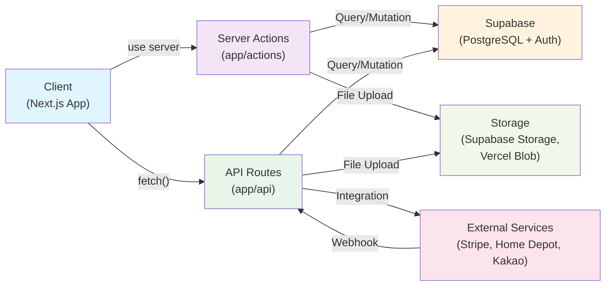

### Estimate Extraction Pipeline (Added Feb 2026)

```
Client → POST /api/estimates/upload (PDF/images)
       → POST /api/estimates/parse (triggers AI/OCR)
       → GET /api/estimates/parse-status (poll)
       → POST /api/estimates/extract (extract takeoff items)
       → GET /api/estimates/extraction-progress (SSE stream)
       → POST /api/estimates/takeoff-items/accept|reject|update (review)
       → Server Action: convertEstimateToBudget() (budget pipeline)
       → POST /api/estimates/export-pdf (final export)
```

**Key integrations:**
- AI parsing via `lib/ai/parse-prompt.ts` and `lib/ai/normalize-takeoff.ts`
- Background extraction jobs tracked in `extraction_jobs` table
- SSE streaming for real-time progress updates
- Estimate-to-budget conversion via `budget-conversion.ts`
- AI chat sidebar via `estimate-chat.ts` for contextual Q&A

---

### Task Creation Data Flow

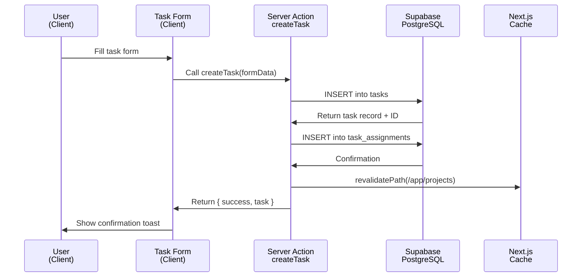

**Files Involved:**
- Client component: `components/task/TaskForm.tsx`
- Server action: `app/actions/tasks.ts` (assumed to follow patterns)
- Database: `schema.sql` (tasks, task_assignments tables)
- Cache invalidation: `revalidatePath()` call

### Expense Approval Data Flow

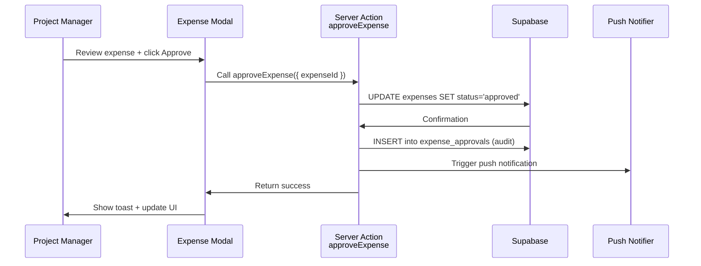

**Files Involved:**
- Client: `components/expense/ExpenseApprovalModal.tsx`
- Server action: `app/actions/expenses.ts`
- Database: `expenses`, `expense_approvals` tables
- Notifications: `supabase/functions/send-push-notification`

### File Upload Data Flow

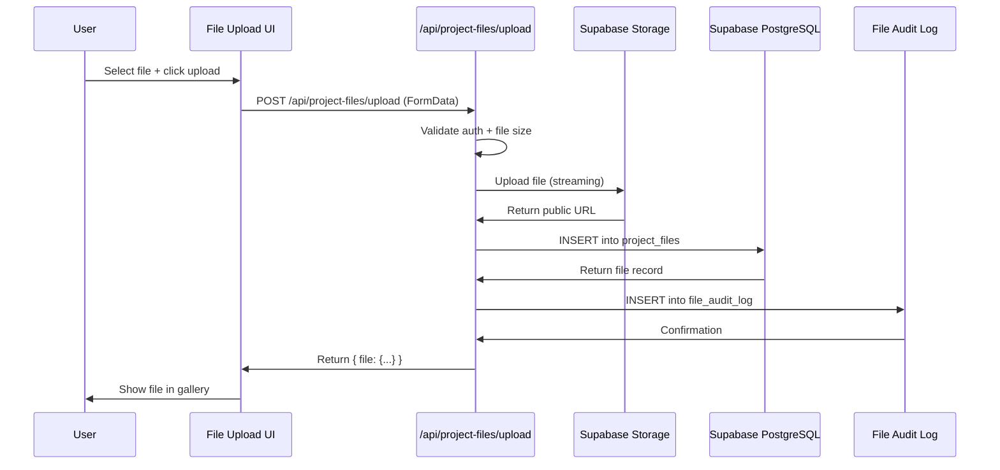

**Files Involved:**
- Client upload: `components/project/FileUpload.tsx` (assumed)
- API handler: `/Users/jonathanlee/Desktop/genhub/app/api/project-files/upload/route.ts`
- Storage bucket: `project-files` (Supabase Storage)
- Database tables: `project_files`, `file_audit_log`

---

## Stripe Payment Integration

**Status:** Active
**Primary Files:**
- Server action: `/Users/jonathanlee/Desktop/genhub/app/actions/stripe.ts`
- Webhook handler: `/Users/jonathanlee/Desktop/genhub/app/api/webhook/stripe/route.ts`

### Payment Flow Overview

Stripe integration handles subscription management and billing portal access. The system uses a subscription-based model with webhook-driven state updates.

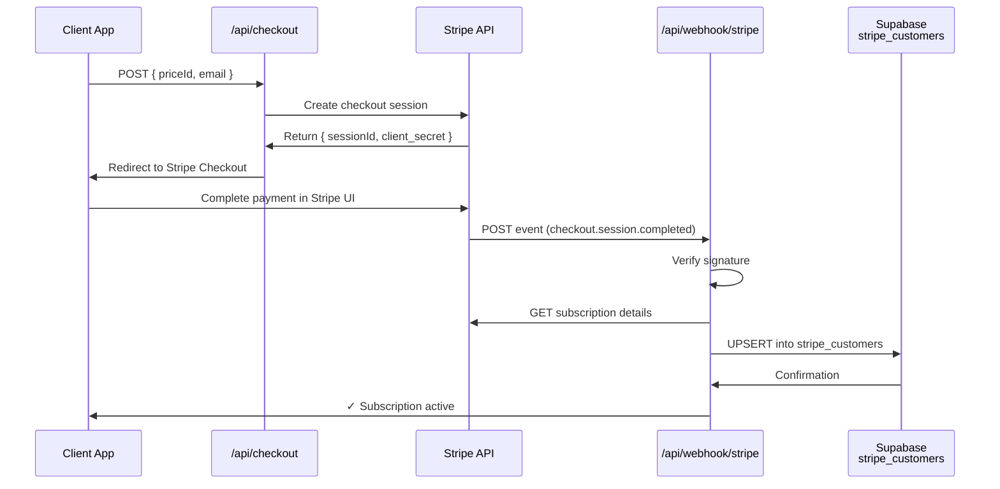

### Webhook Events Handled

| Event Type | Action | Database Impact |
|------------|--------|-----------------|
| `checkout.session.completed` | New subscription created | UPSERT `stripe_customers` (active) |
| `customer.subscription.updated` | Plan change or status update | Log subscription state change |
| `customer.subscription.deleted` | Subscription cancelled | UPDATE `stripe_customers.plan_active = false` |
| `invoice.payment_succeeded` | Payment received | Log payment (future: grant access) |
| `invoice.payment_failed` | Payment failed | Log failure (Stripe auto-retries) |
| `charge.refunded` | Refund processed | Log refund amount & reason |

### Server Actions

#### `getStripeCustomerId()`
```typescript
// File: app/actions/stripe.ts
// Get user's Stripe customer ID from database
// Used to: Identify user for billing portal access
// Returns: stripe_customer_id or null
// Error handling: Throws if authentication fails
```

**Flow:**
1. Verify user is authenticated via `auth()`
2. Query `stripe_customers` table for user_id
3. Return `stripe_customer_id`

**Used by:** Billing portal settings page

#### `createPortalSession(customerId)`
```typescript
// File: app/actions/stripe.ts
// Create a Stripe Billing Portal session for customer
// Used to: Redirect user to manage subscription/payment methods
// Returns: Portal session URL
```

**Flow:**
1. Validate `customerId` input with Zod schema
2. Check if payments enabled (`NEXT_PUBLIC_PAYMENTS_ENABLED`)
3. Get current domain from request headers
4. Call `stripe.billingPortal.sessions.create()`
5. Return portal URL for redirect

#### `refund(subscriptionId)`
```typescript
// File: app/actions/stripe.ts
// Refund active subscription and cancel immediately
// Used to: Handle cancellation with refund
// Returns: { success: true }
```

**Flow:**
1. Validate input with Zod schema
2. Retrieve subscription from Stripe
3. Get latest invoice from subscription
4. Create refund against payment intent
5. Cancel subscription immediately
6. Return success (or throw error)

**Note:** TODO in code indicates `stripe_customers` deletion is planned but commented out due to schema issues.

### Database Schema

#### `stripe_customers` Table
```sql
CREATE TABLE stripe_customers (
  user_id UUID PRIMARY KEY REFERENCES auth.users(id),
  stripe_customer_id TEXT NOT NULL,
  subscription_id TEXT,
  plan_active BOOLEAN DEFAULT false,
  plan_expires BIGINT,  -- Unix timestamp in milliseconds
  created_at TIMESTAMPTZ DEFAULT NOW(),
  updated_at TIMESTAMPTZ DEFAULT NOW()
);
```

### Error Handling

| Scenario | Handler | Recovery |
|----------|---------|----------|
| User not authenticated | Throw error in `getStripeCustomerId()` | UI shows login prompt |
| Database query fails | Log error, throw with message | User sees error toast |
| Stripe API unavailable | Timeout after 30s, throw | Retry or fallback to contact support |
| Webhook signature invalid | Return 400 Unauthorized | Stripe retries webhook |
| Token exchange fails | Log & throw "Invalid auth code" | User sees connection error |

### Configuration

**Environment Variables:**
```bash
STRIPE_API_KEY              # Secret key for server-side operations
STRIPE_WEBHOOK_SECRET       # For webhook signature verification
NEXT_PUBLIC_STRIPE_KEY      # Public key for client-side (if needed)
NEXT_PUBLIC_PAYMENTS_ENABLED=true  # Feature flag
```

**Webhook Endpoint:** `/api/webhook/stripe`
**Signature Method:** HMAC SHA-256
**Retry Policy:** Stripe auto-retries failed webhooks with exponential backoff

---

## Home Depot Material Pricing

**Status:** Active
**Primary Files:**
- Service: `/Users/jonathanlee/Desktop/genhub/lib/services/home-depot-api.ts`
- Cron jobs:
  - `/Users/jonathanlee/Desktop/genhub/app/api/cron/update-material-prices/route.ts`
  - `/Users/jonathanlee/Desktop/genhub/app/api/cron/cleanup-price-history/route.ts`

### Architecture Overview

GenHub integrates with Home Depot's product database via **SerpAPI** (a scraping/search API). The system:

1. **Searches** Home Depot products by query, category, price range
2. **Caches** search results for 30 minutes in memory
3. **Syncs** material prices daily via cron job
4. **Tracks** price history for cost analysis
5. **Cleans up** old history records (>90 days) to optimize storage

### Product Search Flow

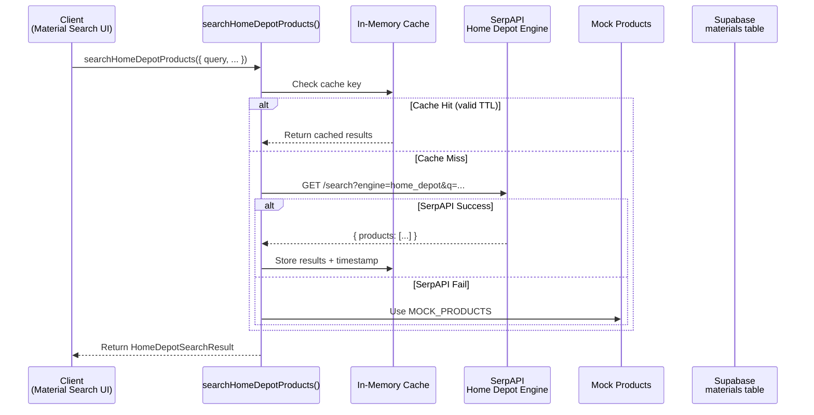

**Cache Configuration:**
- **TTL:** 30 minutes (`CACHE_TTL = 30 * 60 * 1000` ms)
- **Storage:** In-memory Map (server process)
- **Key:** JSON stringify of search params (query, category, minPrice, maxPrice, inStockOnly, page, limit)
- **Issue:** Cache is per-process; lost on server restart (consider Redis for production)

### Product Mapping

SerpAPI returns raw Home Depot JSON. The system maps to internal schema:

```typescript
interface HomeDepotProduct {
  id: string;                    // Home Depot product ID
  sku: string;                   // Stock keeping unit
  name: string;                  // Product name
  description: string;           // Full description
  category: string;              // Enum: lumber, concrete, electrical, etc.
  manufacturer: string;
  price: number;                 // Unit price in USD
  unitOfMeasure: string;         // each, gallon, pound, bundle, etc.
  imageUrl: string;              // 600px preferred size
  productUrl: string;            // Link to Home Depot listing
  stockStatus: 'in_stock' | 'low_stock' | 'out_of_stock' | 'special_order';
  stockQuantity?: number;
  leadTimeDays: number;          // 0 for in-stock, 7 for out, 14 for special order
  specifications: { [key: string]: string };
  rating?: number;
  reviewCount?: number;
}
```

### API Endpoints

#### SerpAPI Search
```
GET https://serpapi.com/search?
  engine=home_depot&
  q=<searchQuery>&
  ps=<itemsPerPage>&          # Max 48
  nao=<offset>&               # Pagination: 0, 24, 48...
  hd_sort=best_match&
  lowerbound=<minPrice>&
  upperbound=<maxPrice>&
  api_key=<SERPAPI_API_KEY>
```

**Rate Limiting:** Depends on SerpAPI plan; add 100ms delay between requests in cron job.

### Price Sync Cron Job

**Endpoint:** `/api/cron/update-material-prices`
**Schedule:** Daily at 2 AM UTC (Vercel Cron)
**Protection:** `Authorization: Bearer ${CRON_SECRET}`

#### Flow

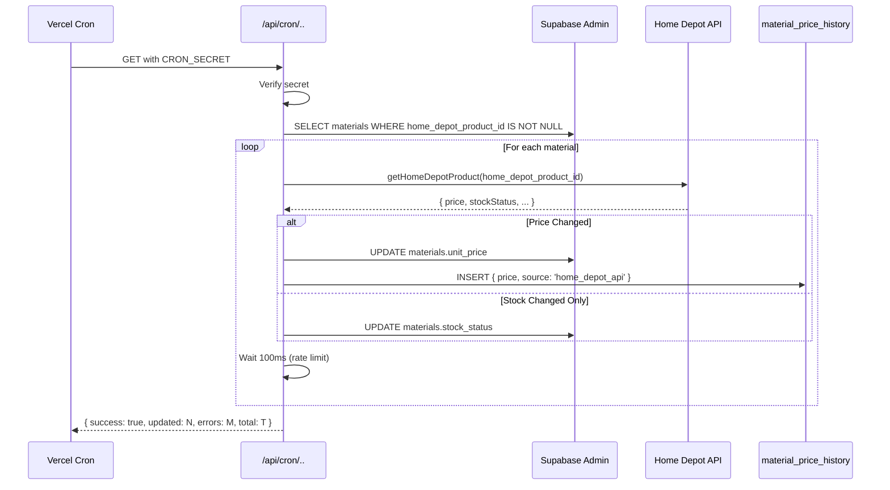

**Error Handling:**
- Graceful failure per material (continues processing others)
- Logs error details to response (`errorDetails[]` array)
- Max 10 errors returned (to keep response reasonable)
- Failed updates don't block price history insertion

**Return Format:**
```typescript
{
  success: boolean,
  updated: number,      // Count of materials with price changes
  errors: number,       // Count of fetch/update errors
  total: number,        // Total materials with Home Depot IDs
  errorDetails?: [      // First 10 errors (if any)
    { materialId: string, error: string }
  ]
}
```

### Price History Cleanup Cron Job

**Endpoint:** `/api/cron/cleanup-price-history`
**Schedule:** Daily at 3 AM UTC
**Protection:** `Authorization: Bearer ${CRON_SECRET}`

#### Flow

```mermaid
graph LR
    Cron["Vercel Cron<br/>3 AM UTC"]
    Endpoint["/api/cron/<br/>cleanup-price-history"]
    DB["Supabase<br/>material_price_history"]

    Cron -->|GET + CRON_SECRET| Endpoint
    Endpoint -->|Verify secret| Endpoint
    Endpoint -->|DELETE WHERE<br/>recorded_at < NOW() - 90 days| DB
    DB -->|deleted count| Endpoint
    Endpoint -->|{ deleted: N }| Cron
```

**Query:**
```sql
DELETE FROM material_price_history
WHERE recorded_at < NOW() - INTERVAL '90 days'
RETURNING COUNT(*);
```

**Return Format:**
```typescript
{
  success: boolean,
  deleted: number,   // Records removed
  error?: string
}
```

### Database Schema

#### `materials` Table (Relevant Columns)
```sql
CREATE TABLE materials (
  id UUID PRIMARY KEY,
  company_id UUID NOT NULL REFERENCES companies(id),
  name TEXT NOT NULL,
  category VARCHAR(50),
  home_depot_product_id VARCHAR(20),  -- Maps to SerpAPI product.product_id
  unit_price DECIMAL(12, 2),
  stock_status VARCHAR(20),  -- 'in_stock', 'low_stock', 'out_of_stock', 'special_order'
  created_at TIMESTAMPTZ DEFAULT NOW(),
  updated_at TIMESTAMPTZ DEFAULT NOW()
);

CREATE INDEX ON materials(home_depot_product_id) WHERE home_depot_product_id IS NOT NULL;
```

#### `material_price_history` Table
```sql
CREATE TABLE material_price_history (
  id UUID PRIMARY KEY DEFAULT gen_random_uuid(),
  company_id UUID NOT NULL REFERENCES companies(id),
  material_id UUID NOT NULL REFERENCES materials(id),
  price DECIMAL(12, 2) NOT NULL,
  source VARCHAR(50) NOT NULL,  -- 'home_depot_api', 'manual_entry'
  recorded_at TIMESTAMPTZ DEFAULT NOW()
);

CREATE INDEX ON material_price_history(material_id, recorded_at);
CREATE INDEX ON material_price_history(recorded_at);  -- For cleanup query
```

### Mock Data Fallback

If SerpAPI is unavailable or not configured, the system returns hardcoded mock products covering:
- Lumber (2 × 2x4, 2x6)
- Concrete (QUIKRETE)
- Electrical (Romex wire, boxes)
- Plumbing (PVC pipe)
- Drywall (panels, joint compound)
- Roofing (shingles)
- Paint (interior, exterior)
- Hardware (fasteners, screws)
- HVAC (duct)
- Flooring (vinyl plank)

**Location:** `lib/services/home-depot-api.ts` lines 119–429

### Configuration

**Environment Variables:**
```bash
SERPAPI_API_KEY          # From https://serpapi.com/
CRON_SECRET              # For authorized cron endpoints
NEXT_PUBLIC_SUPABASE_URL # Supabase project URL
SUPABASE_SECRET_KEY      # Service role key (for admin client)
```

### Error Handling

| Scenario | Handler | Recovery |
|----------|---------|----------|
| API key missing | Log warning, use mock data | Fallback works seamlessly |
| SerpAPI timeout | Catch, log, use mock products | Cache returns mock on retry |
| No products found | Return mock products filtered by query | User sees default material list |
| Price fetch fails (cron) | Log error, continue to next material | Partial update is acceptable |
| Stock status parse fail | Default to 'unknown' | Continue processing |
| Database insert error (history) | Log but don't fail entire cron | Material updated, history missing (minor) |

---

## KakaoTalk Messaging Integration

**Status:** Active
**Primary Files:**
- Service: `/Users/jonathanlee/Desktop/genhub/lib/services/kakao.ts`
- Server actions: `/Users/jonathanlee/Desktop/genhub/app/actions/kakao.ts`
- OAuth callback: `/Users/jonathanlee/Desktop/genhub/app/api/kakao/callback/route.ts`
- Connect endpoint: `/Users/jonathanlee/Desktop/genhub/app/api/kakao/connect/route.ts`
- Webhook handler: `/Users/jonathanlee/Desktop/genhub/app/api/kakao/webhook/route.ts`
- Templates: `/Users/jonathanlee/Desktop/genhub/config/kakao-templates.ts`

### Architecture Overview

GenHub integrates with KakaoTalk through **Sendbird**, a third-party messaging platform that bridges to KakaoTalk. The system supports:

1. **OAuth Connection:** Link KakaoTalk account to GenHub profile
2. **AlimTalk Notifications:** Send business notifications (one-way)
3. **Two-Way Message Sync:** Optionally sync messages between GenHub and KakaoTalk
4. **Token Encryption:** AES-256-GCM for secure token storage
5. **Webhook Handling:** Receive messages from KakaoTalk via Sendbird webhooks

### OAuth Connection Flow

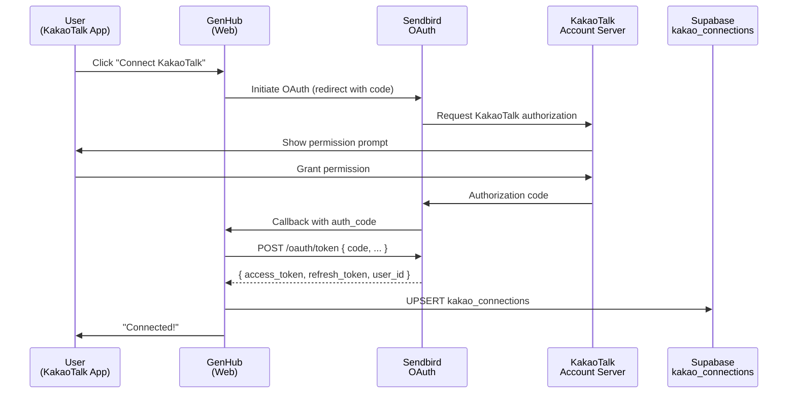

**Implementation:** `app/api/kakao/connect/route.ts` + `lib/services/kakao.ts`

### AlimTalk (Business Notification) Flow

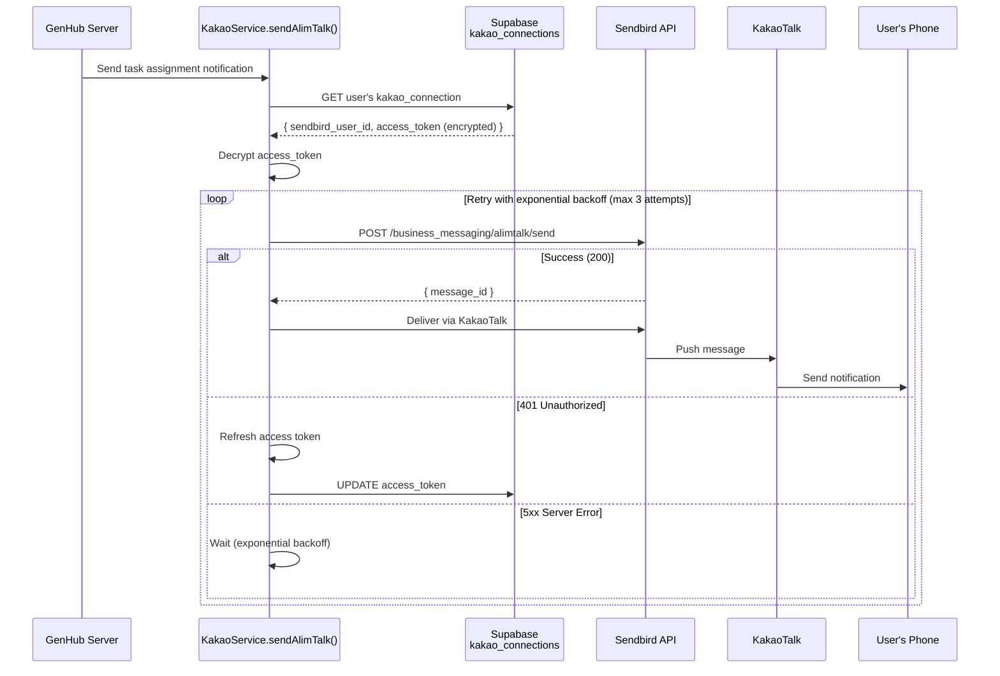

**Key Features:**
- **Automatic token refresh** on 401 Unauthorized
- **Exponential backoff:** 500ms → 1000ms → 2000ms (configurable)
- **Template validation:** Ensures params match template schema
- **Retry count tracking:** Returns `retry_count` in response

### Two-Way Message Sync

When enabled, messages sent in GenHub chat are forwarded to KakaoTalk (and vice versa).

#### GenHub → KakaoTalk (Send)

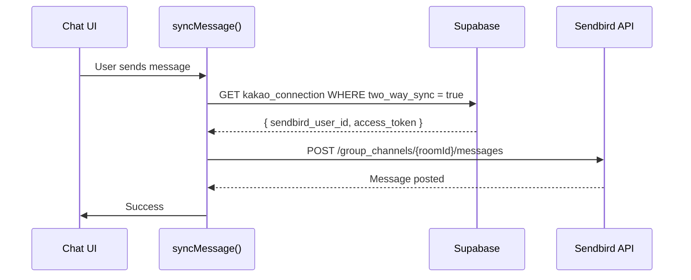

#### KakaoTalk → GenHub (Receive)

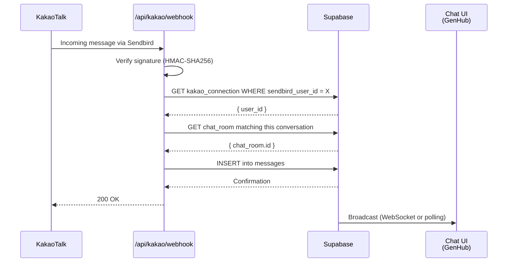

### Token Encryption/Decryption

**Algorithm:** AES-256-GCM (Authenticated Encryption with Associated Data)

#### Encrypt

```typescript
encryptToken(token: string): string
// Returns: "${iv}:${authTag}:${encrypted}"
// Where: iv (random 16 bytes), authTag (GCM authentication), encrypted (ciphertext)
```

#### Decrypt

```typescript
decryptToken(encryptedToken: string): string
// Input: "${iv}:${authTag}:${encrypted}"
// Returns: Original token (verified with authTag)
// Throws: Error if authTag doesn't match (tampering detected)
```

**Security Notes:**
- Key must be ≥32 bytes (for AES-256)
- IV is random for each encryption (prevents replay)
- AuthTag prevents tampering
- Timing-safe comparison prevents timing attacks (critical for webhook signatures)

**Configuration:**
```bash
KAKAO_ENCRYPTION_KEY        # Min 32 characters (first 32 bytes used)
SENDBIRD_WEBHOOK_SECRET     # For signature verification
```

### Database Schema

#### `kakao_connections` Table
```sql
CREATE TABLE kakao_connections (
  id UUID PRIMARY KEY DEFAULT gen_random_uuid(),
  user_id UUID NOT NULL UNIQUE REFERENCES auth.users(id),
  kakao_user_id VARCHAR(255),         -- KakaoTalk account ID
  sendbird_user_id VARCHAR(255) NOT NULL,  -- Sendbird mapping
  access_token TEXT NOT NULL,         -- AES-256-GCM encrypted
  refresh_token TEXT NOT NULL,        -- AES-256-GCM encrypted
  two_way_sync BOOLEAN DEFAULT false, -- Enable message sync
  connected_at TIMESTAMPTZ NOT NULL,
  disconnected_at TIMESTAMPTZ,        -- Null = connected, set = disconnected
  created_at TIMESTAMPTZ DEFAULT NOW(),
  updated_at TIMESTAMPTZ DEFAULT NOW()
);
```

### Webhook Signature Verification

**Method:** HMAC-SHA256 (timing-safe comparison)

```typescript
verifyWebhookSignature(signature: string, body: string): boolean
{
  const expectedSignature = HMAC-SHA256(SENDBIRD_WEBHOOK_SECRET, body);
  return timingSafeEqual(expectedSignature, signature);
}
```

**Security:** Uses `crypto.timingSafeEqual()` to prevent timing attacks (all comparison paths take same time).

### AlimTalk Templates

Templates are pre-registered with Sendbird and include:

```typescript
// Example from config/kakao-templates.ts
{
  'TASK_ASSIGNED': {
    code: 'T001',
    name: 'Task Assignment',
    params: ['task_id', 'task_name', 'assignee_name', 'project_name'],
    description: 'Notify user when task is assigned'
  },
  'EXPENSE_APPROVED': {
    code: 'E001',
    name: 'Expense Approved',
    params: ['expense_id', 'amount', 'vendor_name'],
    description: 'Notify user when expense is approved'
  }
}
```

**Validation:**
```typescript
validateTemplateParams(template: string, params: Record<string, any>): boolean
// Checks if all required params for template are provided
// Returns: true if valid, false if missing/extra params
```

### Error Handling & Retry Logic

| Scenario | Handler | Recovery |
|----------|---------|----------|
| Connection not found | Log & return error | User sees "No KakaoTalk connection" |
| Token expired (401) | Call `refreshToken()` | Auto-refresh, retry send |
| Refresh fails | Return error | User must reconnect |
| Sendbird API 5xx | Retry with backoff | Exponential backoff up to 8s |
| Webhook signature invalid | Return 401 Unauthorized | Sendbird retries webhook |
| Message sync disabled | Return silently | Webhook still received but ignored |

**Retry Configuration:**
```typescript
ALIMTALK_RETRY_CONFIG = {
  maxAttempts: 3,
  initialDelayMs: 500,
  backoffMultiplier: 2,
  maxDelayMs: 8000  // Cap at 8 seconds
}
```

### Configuration

**Environment Variables:**
```bash
SENDBIRD_APP_ID              # From Sendbird dashboard
SENDBIRD_API_TOKEN           # API token for server-to-server auth
SENDBIRD_WEBHOOK_SECRET      # For webhook signature verification
KAKAO_ENCRYPTION_KEY         # Min 32 chars for AES-256 encryption
```

**Webhook Endpoint:**
- URL: `/api/kakao/webhook`
- Method: `POST`
- Signature Header: `x-sendbird-signature`
- Supported Events: `group_channel:message_send`

---

## Supabase Storage

**Status:** Active
**Primary Files:**
- Project files: `/Users/jonathanlee/Desktop/genhub/app/api/project-files/upload/route.ts`
- Project photos: `/Users/jonathanlee/Desktop/genhub/app/api/project-photos/upload/route.ts`

### Bucket Organization

#### `project-files` Bucket
**Public:** Yes (files accessible via public URL)
**Max Size:** 50 MB per file

**Directory Structure:**
```
project-files/
├── {company_id}/
│   └── projects/
│       └── {project_id}/
│           ├── files/
│           │   └── {timestamp}_{sanitized_filename}
│           ├── photos/
│           │   ├── {timestamp}_{filename}
│           │   └── thumbnails/
│           │       └── {timestamp}_{filename}
│           └── spatial/
│               ├── 3d-models/
│               └── converted-files/
```

### File Upload Patterns

#### Generic File Upload (Documents, Specs, etc.)

**Endpoint:** `POST /api/project-files/upload`
**Method:** Multipart form data
**Max Size:** 50 MB

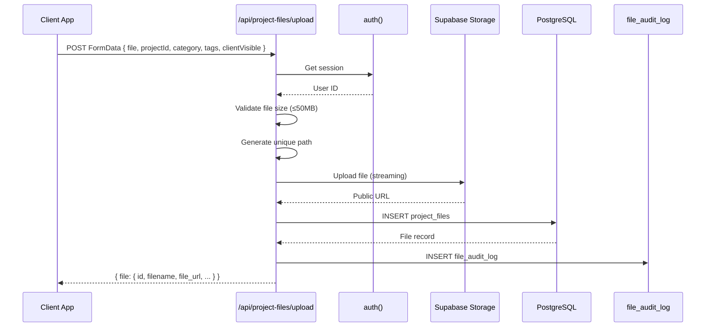

**Request Body:**
```json
{
  "file": File,
  "projectId": "uuid",
  "category": "specification|drawing|contract|general",
  "tags": "[\"tag1\", \"tag2\"]",
  "clientVisible": true
}
```

**Response:**
```json
{
  "success": true,
  "file": {
    "id": "uuid",
    "filename": "document.pdf",
    "file_url": "https://...",
    "file_size": 1024000,
    "category": "specification"
  }
}
```

**Database Entry:**
```sql
INSERT INTO project_files (
  company_id,
  project_id,
  uploaded_by,
  filename,
  original_filename,
  file_url,
  file_size,
  file_type,
  category,
  tags,
  client_visible
) VALUES (...);
```

#### Photo Upload with Thumbnail Generation

**Endpoint:** `POST /api/project-photos/upload`
**Method:** Multipart form data
**Max Size:** 10 MB

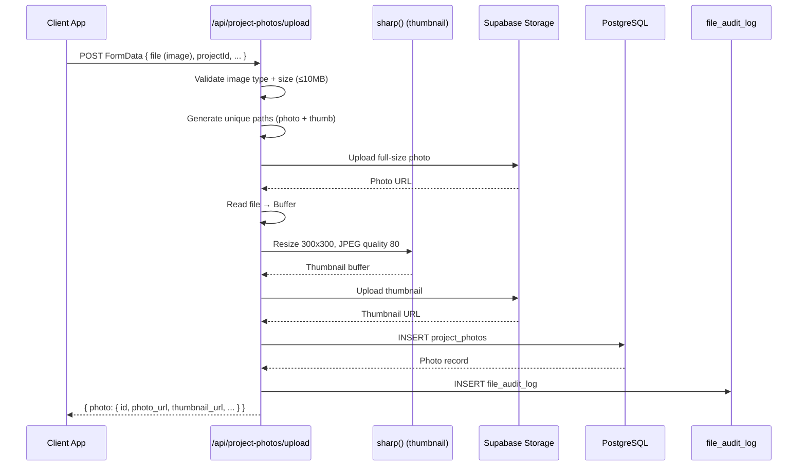

**Request Body:**
```json
{
  "file": File (image/jpeg, image/png, etc.),
  "projectId": "uuid",
  "category": "before|after|inspection|general",
  "tags": "[\"tag1\"]",
  "clientVisible": true
}
```

**Response:**
```json
{
  "success": true,
  "photo": {
    "id": "uuid",
    "filename": "photo.jpg",
    "photo_url": "https://.../photo.jpg",
    "thumbnail_url": "https://.../thumbnails/photo.jpg",
    "category": "after"
  }
}
```

**Performance Notes:**
- Full photo is streamed to S3 (memory-efficient)
- Thumbnail requires buffer for image processing (unavoidable)
- Sharp generates optimized 300x300 JPEG @ 80% quality
- Both uploads happen in parallel where possible

---

#### Subcontractor Document Upload (COI, License, Insurance)

**Server Action:** `uploadSubcontractorDocument` in `app/actions/subcontractors.ts`
**Storage:** Supabase Storage (`project-files` bucket)
**Max Size:** 5 MB
**Allowed Types:** PDF, JPEG, PNG

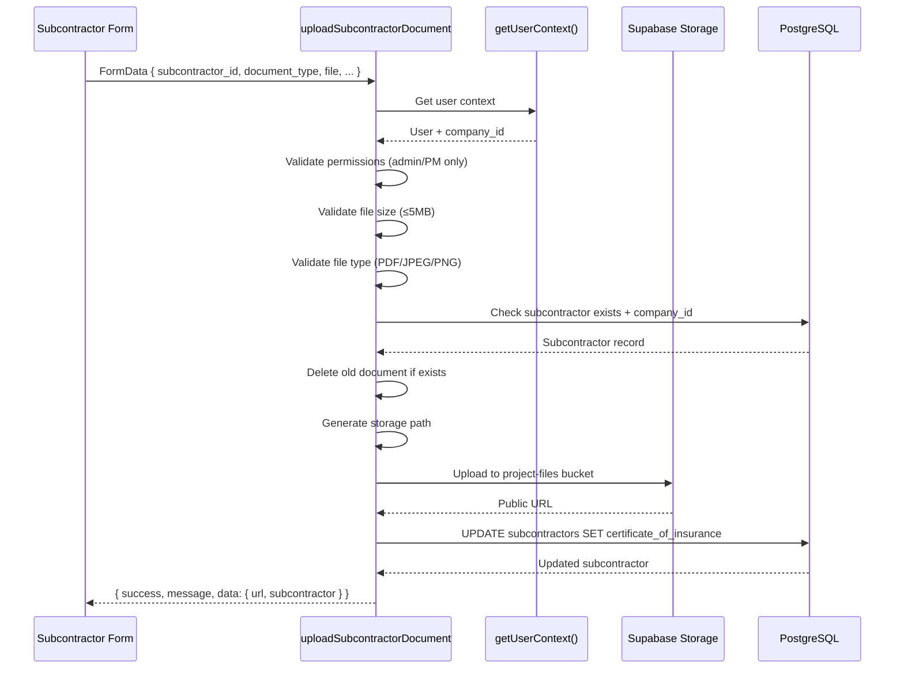

**Storage Path:**
```
project-files/
└── {company_id}/
    └── subcontractors/
        └── {subcontractor_id}/
            ├── coi_{timestamp}_{sanitized_filename}
            ├── license_{timestamp}_{sanitized_filename}
            └── insurance_{timestamp}_{sanitized_filename}
```

**Document Types:**
| Type | Database Column | Additional Fields Updated |
|------|----------------|---------------------------|
| `coi` | `certificate_of_insurance` | None |
| `license` | (URL not stored) | `license_number`, `license_expiry` |
| `insurance` | (URL not stored) | `insurance_provider`, `insurance_expiry` |

**Request Body:**
```json
{
  "subcontractor_id": "uuid",
  "document_type": "coi|license|insurance",
  "file": File,
  "license_number": "optional, for license type",
  "license_expiry": "optional, for license type",
  "insurance_provider": "optional, for insurance type",
  "insurance_expiry": "optional, for insurance type"
}
```

**Response:**
```json
{
  "success": true,
  "message": "Certificate of Insurance uploaded successfully",
  "data": {
    "url": "https://.../project-files/{company_id}/subcontractors/{id}/coi_{timestamp}_{filename}",
    "subcontractor": {
      "id": "uuid",
      "certificate_of_insurance": "https://...",
      "updated_at": "2026-02-07T10:30:00Z"
    }
  }
}
```

**Delete Document:**

Server action `deleteSubcontractorDocument(subcontractorId, 'coi')` removes the file from storage and clears the database reference.

```typescript
// Usage
const result = await deleteSubcontractorDocument(subcontractorId, 'coi');
// Deletes file from storage + sets certificate_of_insurance = null
```

**Security:**
- Admin and Project Manager roles only
- Company isolation enforced (subcontractor must belong to user's company)
- File type and size validation
- Old documents automatically replaced on upload

---

### File Audit Logging

All file operations are logged to `file_audit_log` for compliance and debugging.

**Schema:**
```sql
CREATE TABLE file_audit_log (
  id UUID PRIMARY KEY DEFAULT gen_random_uuid(),
  company_id UUID NOT NULL REFERENCES companies(id),
  file_id UUID,  -- References either project_files or project_photos
  file_type VARCHAR(50) NOT NULL,  -- 'document', 'photo', '3d-model'
  action VARCHAR(50) NOT NULL,     -- 'upload', 'delete', 'share', 'download'
  performed_by UUID NOT NULL REFERENCES auth.users(id),
  new_state JSONB,  -- Full file record after action
  old_state JSONB,  -- Full file record before action (for updates)
  created_at TIMESTAMPTZ DEFAULT NOW()
);

CREATE INDEX ON file_audit_log(company_id, created_at DESC);
CREATE INDEX ON file_audit_log(file_id);
```

**Logged Event (Upload):**
```json
{
  "company_id": "uuid",
  "file_id": "uuid",
  "file_type": "photo",
  "action": "upload",
  "performed_by": "user-uuid",
  "new_state": {
    "id": "uuid",
    "filename": "photo.jpg",
    "file_url": "https://...",
    "category": "after",
    "tags": ["renovation", "bathroom"],
    "client_visible": true
  },
  "created_at": "2026-02-07T10:30:00Z"
}
```

### Error Handling

| Scenario | Status | Message | Handler |
|----------|--------|---------|---------|
| User not authenticated | 401 | "Unauthorized" | Return early |
| No active company | 403 | "No active company" | Check company_users |
| File missing | 400 | "Missing file or projectId" | Validate FormData |
| File too large | 400 | "File too large (max 50MB)" | Check file.size |
| Invalid image type | 400 | "Invalid file type (must be image)" | Check file.type prefix |
| Storage upload fails | 500 | `error.message` from Supabase | Log & return error |
| Database insert fails | 500 | `error.message` from Supabase | Log & return error |
| Thumbnail generation fails | 200 | Photo still uploaded | Continue (non-critical) |

### Caching & Performance

**Streaming Upload:**
- File object is streamed directly to Supabase (not buffered in memory)
- Reduces memory usage: 50MB file uses ~20MB RAM instead of ~150MB
- Issue reference: `PERF-006`

**Public URLs:**
- Supabase generates signed URLs that don't expire (buckets are public)
- URLs can be cached by clients (content is immutable)
- Format: `https://{project-ref}.supabase.co/storage/v1/object/public/project-files/{path}`

---

## Vercel Blob Storage

**Status:** Active
**Primary Files:**
- Spatial file upload: `/Users/jonathanlee/Desktop/genhub/app/api/spatial/upload-file/route.ts`

### Architecture

Vercel Blob is used specifically for **spatial/3D model files** in the marker-based site analysis system. Unlike Supabase Storage (which is bucket-based), Vercel Blob offers:

- Direct API with `put()` function
- Automatic CDN distribution
- Streaming uploads
- Cost-effective for large binary files

### Upload Flow

**Endpoint:** `POST /api/spatial/upload-file`
**Purpose:** Upload 3D models, point clouds, or other spatial files to markers

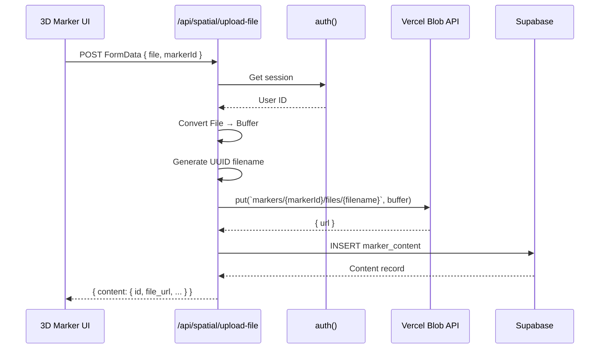

### Request/Response

**Request:**
```json
{
  "file": File (any type),
  "markerId": "uuid"
}
```

**Response:**
```json
{
  "success": true,
  "content": {
    "id": "uuid",
    "marker_id": "uuid",
    "type": "file",
    "file_url": "https://vercel-blob.com/...",
    "file_name": "model.glb",
    "file_size_bytes": 2048000,
    "file_mime_type": "model/gltf-binary",
    "created_by": "user-uuid"
  }
}
```

### Blob Naming Convention

```
markers/{markerId}/files/{uuid}.{ext}
```

Example:
```
markers/proj-123/files/a1b2c3d4-e5f6-47g8-h9i0-j1k2l3m4n5o6.glb
```

**Benefits:**
- UUID prevents collisions (no overwrite risk)
- Extension preserved for MIME type detection
- Flat structure (no nested directories needed)
- Automatic CDN caching by file hash

### Performance

**No streaming needed:** File is converted to Buffer before upload (acceptable since spatial files are usually < 100MB).

**Configuration:**
```bash
BLOB_READ_WRITE_TOKEN   # From Vercel dashboard
```

### Error Handling

| Scenario | Handler | Recovery |
|----------|---------|----------|
| User not authenticated | Return 401 | Show login prompt |
| Missing file or markerId | Return 400 | Validate form |
| File conversion fails | Return 500 | Log error, user retries |
| Blob API fails | Return 500 | User retries (Blob is reliable) |
| Database insert fails | Return 500 | File uploaded but record lost (edge case) |

---

## Push Notifications

**Status:** Active
**Primary Files:**
- Edge function: `/Users/jonathanlee/Desktop/genhub/supabase/functions/send-push-notification/index.ts`

### Architecture

Push notifications use **Firebase Cloud Messaging (FCM)** delivered via a **Supabase Edge Function** (serverless Deno runtime). This allows:

- Server-to-client notifications for real-time events
- No polling required
- Works on mobile (iOS/Android) and web
- Decoupled from main Next.js app

### Notification Flow

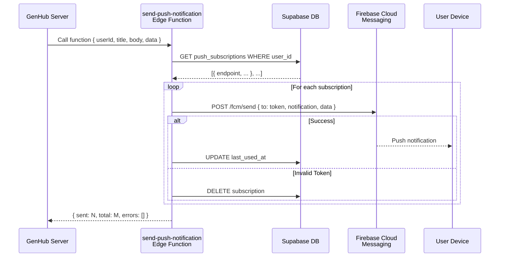

### Function Input

**Called from:** Server actions or API routes

```typescript
// Example call
const response = await supabase.functions.invoke('send-push-notification', {
  body: {
    userId: 'user-uuid',
    title: 'Task Assigned',
    body: 'You have been assigned to "Install drywall"',
    data: {
      roomId: 'chat-room-uuid',
      messageId: 'msg-uuid',
      url: '/app/tasks/task-uuid'
    }
  }
});

// Response
{
  sent: 1,
  total: 2,
  errors: [
    "Subscription xyz: {\"error\": \"InvalidRegistration\"}"
  ]
}
```

### Database Schema

#### `push_subscriptions` Table
```sql
CREATE TABLE push_subscriptions (
  id UUID PRIMARY KEY DEFAULT gen_random_uuid(),
  user_id UUID NOT NULL REFERENCES auth.users(id),
  endpoint TEXT NOT NULL UNIQUE,  -- FCM registration token
  auth TEXT,                       -- Base64-encoded auth secret
  p256dh TEXT,                     -- Base64-encoded public key
  last_used_at TIMESTAMPTZ,
  created_at TIMESTAMPTZ DEFAULT NOW(),
  updated_at TIMESTAMPTZ DEFAULT NOW()
);

CREATE INDEX ON push_subscriptions(user_id);
```

### Error Handling

**FCM Error Types:**
| Error | Meaning | Action |
|-------|---------|--------|
| `InvalidRegistration` | Token format invalid | DELETE subscription |
| `NotRegistered` | Token no longer valid | DELETE subscription |
| `InvalidReg` | Malformed token | DELETE subscription |
| `Unavailable` | FCM service temporarily down | Retry later |
| `InternalServerError` | FCM internal error | Retry later |

**Edge Function Response:**
```typescript
{
  sent: number,           // Successfully sent notifications
  total: number,          // Total subscriptions
  errors?: string[]       // Up to 10 error messages
}
```

### Configuration

**Environment Variables (Supabase):**
```bash
FCM_SERVER_KEY          # From Firebase Console > Project Settings > Cloud Messaging
```

### Deployment

Edge functions are stored in `/supabase/functions/` and deployed via:

```bash
supabase functions deploy send-push-notification
```

**Runtime:** Deno (TypeScript support out-of-box)
**Timeout:** Default 60 seconds (sufficient for 100+ subscriptions)

---

## Cron Jobs

GenHub uses **Vercel Cron** for scheduled background tasks. All cron endpoints require `CRON_SECRET` for authorization.

### Overview

| Endpoint | Schedule | Purpose | Duration |
|----------|----------|---------|----------|
| `/api/cron/update-material-prices` | Daily 2 AM UTC | Sync Home Depot prices | ~1–5 min |
| `/api/cron/cleanup-price-history` | Daily 3 AM UTC | Delete >90-day records | <1 min |

### Cron Secret Protection

All cron endpoints verify the `Authorization` header:

```typescript
const authHeader = request.headers.get('authorization');
const cronSecret = process.env.CRON_SECRET;

if (authHeader !== `Bearer ${cronSecret}`) {
  return NextResponse.json(
    { error: 'Unauthorized' },
    { status: 401 }
  );
}
```

**Configuration:**
```bash
# .env.production (Vercel environment)
CRON_SECRET=your-very-secure-random-string-min-32-chars
```

**Vercel Setup:**

In `vercel.json` or via Vercel dashboard:
```json
{
  "crons": [
    {
      "path": "/api/cron/update-material-prices",
      "schedule": "0 2 * * *"
    },
    {
      "path": "/api/cron/cleanup-price-history",
      "schedule": "0 3 * * *"
    }
  ]
}
```

### Monitoring

**Vercel Dashboard:**
- View cron execution logs
- See last run status (success/failure)
- Check execution duration

**Application Logging:**
- All cron jobs log to console (visible in Vercel logs)
- Use `console.log('[Cron] ...')` prefix for easy filtering

**Example Log Output:**
```
[Cron] Starting material price update job
[Cron] Found 42 materials to update
[Cron] Price changed for material abc123: 19.99 -> 21.99
[Cron] Price update job complete: 12 updated, 2 errors, 42 total
```

### Error Recovery

**If cron fails:**
1. Vercel automatically retries (up to 2 retries)
2. Response includes error details (logged in Vercel dashboard)
3. Monitor response payload to diagnose issues

**Common Issues:**
- `CRON_SECRET` not set → Returns 401
- Database connection timeout → Returns 500, will retry
- Rate limit exceeded on SerpAPI → Partial update, logs errors
- Missing environment variables → Function fails to start

---

## Error Handling & Retry Patterns

### Server Action Error Handling

**Pattern:**

```typescript
export async function myAction(input: unknown): Promise<{ success: boolean; error?: string }> {
  try {
    // Validation
    const validation = mySchema.safeParse(input);
    if (!validation.success) {
      console.error('[myAction] Validation failed:', validation.error);
      return { success: false, error: 'Invalid input' };
    }

    // Business logic
    const result = await someOperation();

    // Success
    return { success: true };
  } catch (error) {
    console.error('[myAction] Unexpected error:', error);
    return { success: false, error: 'Operation failed' };
  }
}
```

**Key Principles:**
- Always catch errors (never throw)
- Log errors for debugging
- Return structured response `{ success, error }`
- Validate input early
- Provide user-friendly error messages

### API Route Error Handling

**Pattern:**

```typescript
export async function POST(request: Request): Promise<Response> {
  try {
    // Authentication
    if (!session?.user?.id) {
      return NextResponse.json({ error: 'Unauthorized' }, { status: 401 });
    }

    // Authorization
    const { data: company } = await db.query(...);
    if (!company) {
      return NextResponse.json({ error: 'Forbidden' }, { status: 403 });
    }

    // Validation
    if (!file || !projectId) {
      return NextResponse.json({ error: 'Missing required fields' }, { status: 400 });
    }

    // Business logic
    const result = await operation();

    // Success
    return NextResponse.json({ success: true, data: result });
  } catch (error) {
    console.error('[route] Error:', error);
    return NextResponse.json(
      { error: error instanceof Error ? error.message : 'Internal server error' },
      { status: 500 }
    );
  }
}
```

**HTTP Status Codes:**
- `200` — Success
- `400` — Bad request (validation failed)
- `401` — Unauthorized (not authenticated)
- `403` — Forbidden (lacks permission)
- `500` — Server error (unexpected exception)

### Stripe Webhook Retry Logic

Stripe automatically retries failed webhooks with exponential backoff over 3 days. GenHub just needs to:

1. Verify signature (prevents replay attacks)
2. Idempotently update database (safe to process same event twice)
3. Return `200 OK` on success

**Idempotency Pattern:**
```typescript
// Using subscription_id as idempotency key
const { error } = await supabase
  .from('stripe_customers')
  .upsert(
    { subscription_id, user_id, plan_active: true },
    { onConflict: 'subscription_id' }  // UPSERT, not INSERT
  );
```

### AlimTalk Retry Logic

**Exponential Backoff:**
```
Attempt 1: Immediate
Attempt 2: Wait 500ms
Attempt 3: Wait 1000ms (if backoff multiplier = 2)
Max attempts: 3
Max delay: 8000ms
```

**Token Refresh:**
If 401 Unauthorized received, attempt to refresh access token before next retry.

### Cron Job Error Handling

**Graceful Degradation:**
- Process materials one by one
- Failed materials don't block others
- Return partial success: `{ updated: 10, errors: 2, total: 12 }`
- Log error details for debugging

---

## Optimization Signals

### Performance Issues & Solutions

| Issue | Root Cause | Solution | Status |
|-------|-----------|----------|--------|
| **PERF-006** | Large file uploads buffer entire file in memory | Stream File object directly to storage | ✅ Implemented |
| Memory spike on photo upload | Sharp requires buffer for image processing | Minimize thumbnail size; keep original full-size | ✅ Acceptable |
| Slow search on Home Depot | 30-min cache misses cause API lag | Consider Redis for distributed cache | ⏳ Future |
| Price sync takes >5min | Rate limiting (100ms/material) + slow API | Parallelize with Promise.allSettled() | ⏳ Future |
| Webhook processing lag | Sequential material processing | Batch updates or use Supabase edge functions | ⏳ Future |

### Database Optimization

**Indexes Created:**
```sql
-- Material price sync
CREATE INDEX ON materials(home_depot_product_id)
WHERE home_depot_product_id IS NOT NULL;

-- Price history cleanup
CREATE INDEX ON material_price_history(recorded_at);
CREATE INDEX ON material_price_history(material_id, recorded_at);

-- File audit trail
CREATE INDEX ON file_audit_log(company_id, created_at DESC);
CREATE INDEX ON file_audit_log(file_id);

-- Push subscriptions
CREATE INDEX ON push_subscriptions(user_id);
```

**Query Optimization:**
- Cleanup uses simple WHERE clause on `recorded_at` (indexed)
- Price sync batches materials to prevent N+1 queries
- Webhook verification uses timing-safe comparison (constant time)

### Caching Strategy

| Layer | Implementation | TTL | Notes |
|-------|-----------------|-----|-------|
| Home Depot search | In-memory Map | 30 min | Lost on restart; consider Redis |
| Public file URLs | Browser cache | Infinite | Content is immutable |
| API responses | Next.js `revalidatePath()` | Variable | Per route configuration |
| Database connections | Supabase client pools | Automatic | Managed by Supabase |

### Network Optimization

- **Streaming uploads:** File → Supabase S3 (avoid memory buffer)
- **Thumbnail generation:** Local (on server); parallelizes with upload
- **Webhook batching:** Process materials sequentially (prevents rate limit spike)
- **CDN caching:** Vercel Blob auto-caches spatial files; Supabase uses S3 CDN

### Future Improvements

1. **Distributed cache** (Redis) for Home Depot search results
2. **Bulk price updates** via batch API (reduce sequential processing)
3. **Async notifications** (queue → process in background)
4. **Database materialized views** for KPI dashboards
5. **Edge function rate limiting** to prevent DDoS

---

## Security Considerations

### Authentication & Authorization

- **Server Actions:** Always verify `auth()` before database access
- **API Routes:** Check both authentication (session) and authorization (company role)
- **Webhooks:** Verify signature (HMAC-SHA256) before processing

### Data Encryption

- **Kakao tokens:** AES-256-GCM (authenticated)
- **Stripe webhook:** Signature verification via HMAC-SHA256
- **File storage:** Public URLs (no sensitive data should be public)

### Secrets Management

- **Never commit secrets** (use `.env.local`, `.env.production`)
- **Rotate keys periodically** (especially STRIPE_WEBHOOK_SECRET, CRON_SECRET)
- **Use service role key** only in server actions/API routes (never client-side)

### File Upload Security

- **Size limits:** 50 MB for documents, 10 MB for photos
- **Type validation:** Check MIME type + file extension
- **Sanitize filenames:** Replace special characters to prevent injection
- **Unique paths:** Timestamp + UUID prevent overwrites and enumeration

---

## Quick Reference

### Environment Variables

```bash
# Stripe
STRIPE_API_KEY
STRIPE_WEBHOOK_SECRET
NEXT_PUBLIC_PAYMENTS_ENABLED=true

# Home Depot (SerpAPI)
SERPAPI_API_KEY

# Kakao
SENDBIRD_APP_ID
SENDBIRD_API_TOKEN
SENDBIRD_WEBHOOK_SECRET
KAKAO_ENCRYPTION_KEY

# Cron
CRON_SECRET

# Firebase (Push Notifications)
FCM_SERVER_KEY

# Vercel Blob
BLOB_READ_WRITE_TOKEN

# Supabase
NEXT_PUBLIC_SUPABASE_URL
SUPABASE_SECRET_KEY
```

### API Endpoints Summary

| Method | Path | Auth | Purpose |
|--------|------|------|---------|
| GET | `/api/webhook/stripe` | Webhook signature | Receive Stripe events |
| POST | `/api/project-files/upload` | Session | Upload document |
| POST | `/api/project-photos/upload` | Session | Upload + thumbnail |
| POST | `/api/spatial/upload-file` | Session | Upload 3D model to Vercel Blob |
| GET | `/api/cron/update-material-prices` | CRON_SECRET | Sync prices daily |
| GET | `/api/cron/cleanup-price-history` | CRON_SECRET | Delete old records |
| POST | `/api/kakao/webhook` | Signature | Receive KakaoTalk messages |
| POST | `/api/kakao/connect` | Session | OAuth callback |

### Common Operations

**Send Push Notification:**
```typescript
await supabase.functions.invoke('send-push-notification', {
  body: {
    userId: 'user-uuid',
    title: 'New Task',
    body: 'Task description',
    data: { url: '/app/tasks/...' }
  }
});
```

**Sync Message to KakaoTalk:**
```typescript
await KakaoService.syncMessage(userId, {
  content: 'Message text',
  chatRoomId: 'room-uuid'
});
```

**Search Home Depot:**
```typescript
const results = await searchHomeDepotProducts({
  query: '2x4 lumber',
  category: 'lumber',
  minPrice: 5,
  maxPrice: 20,
  inStockOnly: true,
  page: 1,
  limit: 20
});
```

---

## Document Metadata

- **Author:** Technical Documentation System
- **Last Updated:** March 21, 2026
- **Version:** 1.0
- **Coverage:**
  - ✅ Stripe integration (complete)
  - ✅ Home Depot API (complete)
  - ✅ KakaoTalk integration (complete)
  - ✅ File storage (complete)
  - ✅ Push notifications (complete)
  - ✅ Cron jobs (complete)
- **Known Gaps:**
  - OAuth connect/callback routes (basic documentation)
  - Email notification system (if any)
  - Analytics/tracking (if any)

---

## Appendices

### A. Mermaid Diagram Legend

```
Solid line (→)     = Synchronous call / immediate response
Dashed line (⇢)    = Asynchronous / background process
Parallel lines     = Concurrent operations
Diamond (decision) = Conditional logic
Box               = System/service component
```

### B. File Size Reference

| Type | Max | Rationale |
|------|-----|-----------|
| Document | 50 MB | PDF specs, blueprints |
| Photo | 10 MB | Mobile photos (optimized) |
| 3D Model | 500 MB | Spatial/point clouds |
| Database record | 100 KB | JSONB columns |

### C. Rate Limits

| Service | Limit | Implemented |
|---------|-------|-------------|
| SerpAPI | Plan-dependent | 100ms delay/request |
| Stripe API | 100 req/sec | Implicit |
| Kakao AlimTalk | Plan-dependent | Exponential backoff |
| Supabase | Plan-dependent | Connection pooling |
| Firebase FCM | 10K msg/sec | Burst-safe |

---

**End of Document**
