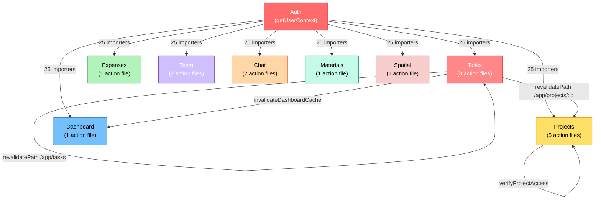

# GenHub Dependency and Impact Analysis

> Deep-dive dependency analysis extending dependency-graph.md with function consumer registry, cross-domain coupling heat maps, isolation scores, and breaking change impact calculators.

**Last Updated**: March 21, 2026
**Codebase**: Next.js 16 + Supabase + React 19
**Scope**: 47 action files, 100+ component files importing actions, 35+ critical functions

---

## 1. Function Consumer Registry

### Tier 1: CRITICAL — Maximum Impact (20+ consumers)

#### `getUserContext()` — `lib/auth-context.ts`

**Purpose**: Cached user context helper wrapping React.cache to prevent redundant auth queries.
**Total Consumers**: 35 files across app/actions

**Consumer List**:
1. `app/actions/chat-search.ts` — Chat search scoped to company
2. `app/actions/chat.ts` — Chat messages and rooms
3. `app/actions/dashboard.ts` — Dashboard data aggregation
4. `app/actions/default-models.ts` — AI model configuration
5. `app/actions/expenses.ts` — Expense tracking and approval
6. `app/actions/kakao.ts` — Map integration
7. `app/actions/phase-templates.ts` — Phase template management
8. `app/actions/phases.ts` — Project phase operations
9. `app/actions/project-files.ts` — Project file uploads
10. `app/actions/project-photos.ts` — Project photo management
11. `app/actions/project-types.ts` — Project type configuration
12. `app/actions/projects.ts` — Core project CRUD
13. `app/actions/push.ts` — Push notification sending
14. `app/actions/spatial.ts` — 3D marker management
15. `app/actions/subcontractors.ts` — Subcontractor management
16. `app/actions/task-templates.ts` — Task template operations
17. `app/actions/task-types.ts` — Task type configuration
18. `app/actions/tasks-activity.ts` — Task activity logging
19. `app/actions/tasks-assignments.ts` — Task assignment operations
20. `app/actions/tasks-deferred.ts` — Deferred task operations
21. `app/actions/tasks-dependencies.ts` — Task dependency management
22. `app/actions/tasks-spatial.ts` — Task-marker linking
23. `app/actions/tasks-status.ts` — Task status updates
24. `app/actions/tasks.ts` — Core task CRUD
25. `app/actions/team.ts` — Team member management
26. `app/actions/ai-budget.ts` — AI budget analysis
27. `app/actions/assemblies.ts` — Assembly management
28. `app/actions/budget-conversion.ts` — Estimate-to-budget conversion
29. `app/actions/chat-queries.ts` — Chat data fetching
30. `app/actions/estimate-chat.ts` — Estimate AI chat
31. `app/actions/estimates.ts` — Core estimate CRUD
32. `app/actions/material-suggestions.ts` — AI material suggestions
33. `app/actions/pricing-templates.ts` — Pricing template management
34. `app/actions/revisions.ts` — Estimate revision tracking
35. `app/actions/templates.ts` — Generic template management

**Change Impact if Modified**:
- **Breaking Change**: ANY signature change breaks 35 action files
- **Cascading Effect**: All authenticated operations fail across entire app
- **Risk Level**: **CRITICAL** — impacts every user-facing feature
- **Recovery Time**: Application-wide outage until fixed

**Cached Variants**:
- `getUserContext()` — Standard client (used by 22 files)
- `getUserContextWithUserClient()` — User-scoped client (used by 2 files: team.ts, subcontractors.ts)
- `getUserContextWithUserData()` — Includes user name/email (used by 3 files: chat.ts, push.ts)

**Optimization Notes**:
- React.cache prevents redundant queries: ~50-150ms saved per page load
- Prevents 2-5 redundant auth queries per server action call
- Cache is request-scoped; expires after request completes

---

#### `createClient()` — `utils/supabase/server.ts`

**Purpose**: Factory for creating Supabase server client with auth context.
**Total Consumers**: 19 files across app/actions
**Also imported in**: 8+ lib utilities

**Action File Consumers**:
1. `app/actions/chat-queries.ts`
2. `app/actions/chat.ts`
3. `app/actions/client.ts`
4. `app/actions/dashboard.ts`
5. `app/actions/default-models.ts`
6. `app/actions/expenses.ts`
7. `app/actions/invite-auth.ts`
8. `app/actions/materials.ts`
9. `app/actions/phases.ts`
10. `app/actions/project-deferred.ts`
11. `app/actions/projects.ts`
12. `app/actions/seed-demo-data.ts`
13. `app/actions/spatial.ts`
14. `app/actions/tasks-activity.ts`
15. `app/actions/tasks-analytics.ts`
16. `app/actions/tasks-assignments.ts`
17. `app/actions/tasks.ts`
18. Plus: lib/auth-context.ts (3 variants use this)
19. Plus: 5+ lib utilities

**Dependency Chain**:
```
createClient() [utils/supabase/server.ts]
  └── depends on: @/auth (NextAuth session)
      └── depends on: Supabase admin client credentials
```

**Change Impact if Modified**:
- **Type Signature Change**: Breaks return type contract used in 27+ files
- **Async Behavior Change**: All 27 consumers must update error handling
- **Supabase Client Change**: All RLS policies, auth context changes cascade
- **Risk Level**: **CRITICAL** — entire app tier depends on this factory

---

### Tier 2: HIGH Impact (8-20 consumers)

#### `verifyTaskAccess()` — `lib/tasks-utils.ts`

**Purpose**: Authorization check ensuring user's company owns task.
**Total Consumers**: 8 action files (task domain only)

**Consumer List**:
1. `app/actions/tasks.ts` (main CRUD)
2. `app/actions/tasks-status.ts` (status updates)
3. `app/actions/tasks-assignments.ts` (assignment operations)
4. `app/actions/tasks-dependencies.ts` (dependency management)
5. `app/actions/tasks-spatial.ts` (marker linking)
6. `app/actions/tasks-deferred.ts` (deferred operations)
7. Plus: 2 internal calls within tasks.ts

**Function Signature**:
```typescript
async function verifyTaskAccess(
  supabase: Awaited<ReturnType<typeof createClient>>,
  taskId: string,
  companyId: string,
) → { task, projectId } | { error }
```

**Change Impact**:
- **Return Type Change**: Breaks type contracts in 8 files
- **Authorization Logic Change**: Security risk if permissions weakened
- **Risk Level**: **HIGH** — task domain critical path

---

#### `verifyProjectAccess()` — `lib/tasks-utils.ts`

**Purpose**: Authorization check ensuring user's company owns project.
**Total Consumers**: 8 action files

**Consumer List**:
1. `app/actions/projects.ts`
2. `app/actions/phases.ts`
3. `app/actions/project-files.ts`
4. `app/actions/project-photos.ts`
5. `app/actions/spatial.ts`
6. `app/actions/tasks-deferred.ts`
7. Plus: 2 internal calls within projects.ts

**Change Impact**: Same as verifyTaskAccess (8 files affected)

---

#### `invalidateDashboardCache()` — `app/actions/dashboard.ts`

**Purpose**: Clears dashboard data tagged with company ID.
**Total Consumers**: 2 known callers

**Consumer List**:
1. `app/actions/tasks.ts` (after task mutations: create, update, delete)
2. `app/actions/dashboard.ts` (manual invalidation endpoint)

**Function Signature**:
```typescript
export async function invalidateDashboardCache(input?: { companyId?: string })
  → void (triggers revalidateTag)
```

**Change Impact**:
- **If Removed**: Dashboard becomes stale after task operations
- **If Signature Changes**: Task mutations must update call sites
- **Risk Level**: **HIGH** — impacts dashboard real-time updates

---

#### `logTaskActivity()` — `app/actions/tasks-activity.ts`

**Purpose**: Logs task mutations (created, updated, deleted, etc.) for audit trail.
**Total Consumers**: 6 action files in task domain

**Consumer List**:
1. `app/actions/tasks.ts` (create, update, delete)
2. `app/actions/tasks-status.ts` (status updates)
3. `app/actions/tasks-dependencies.ts` (dependency changes)
4. `app/actions/tasks-spatial.ts` (marker linking)
5. `app/actions/tasks-assignments.ts` (assignment changes)
6. Plus: 1 call within tasks.ts

**Function Signature**:
```typescript
export async function logTaskActivity(
  supabase: Awaited<ReturnType<typeof createClient>>,
  taskId: string,
  action: ActivityAction, // Enum: created | updated | deleted | etc.
  details?: Record<string, any>,
) → { data, error }
```

**Change Impact**:
- **If Signature Changes**: All 6 task operations must update
- **If Removed**: Audit trail breaks; compliance risk
- **Risk Level**: **MEDIUM-HIGH** — task mutation chain critical

---

#### `logTaskCompletionToMarker()` — `app/actions/tasks-spatial.ts`

**Purpose**: Updates spatial marker completion status when task marked complete.
**Total Consumers**: 2 action files

**Consumer List**:
1. `app/actions/tasks-status.ts` (only called when status → completed)
2. `app/actions/tasks.ts` (internal update logic)

**Change Impact**:
- **If Removed**: 3D markers stay incomplete even when tasks done
- **Risk Level**: **MEDIUM** — spatial feature specific

---

### Tier 3: MEDIUM Impact (3-7 consumers)

#### Configuration & Type Accessors

| Function | File | Consumers | Risk |
|----------|------|-----------|------|
| `getTaskTypeConfig()` | `lib/config/task-type-fields.ts` | 5 components | MEDIUM |
| `getProjectTypeConfig()` | `lib/config/project-type-fields.ts` | 3 components | MEDIUM |
| `cn()` | `lib/utils.ts` | 200+ (utility function) | **LOW** (stable) |

---

## 2. Cross-Domain Coupling Heat Map

### Domain Import Analysis



### Coupling Strength Analysis

#### Cross-Domain Imports in app/actions (Non-Utility)

**Zero Cross-Domain Action Imports** (by design):
- Task actions do NOT import from project actions
- Project actions do NOT import from expense actions
- Chat actions do NOT import from task actions
- **Pattern**: No direct action-to-action calls
- **Coordination**: Only through cache invalidation and shared utilities

**Shared Utility Dependencies** (all domains converge here):
```
All 38 action files
  ├── → createClient() [utils/supabase/server.ts]
  ├── → getUserContext() [lib/auth-context.ts]
  ├── → verifyTaskAccess() [lib/tasks-utils.ts] (task domain only)
  ├── → verifyProjectAccess() [lib/tasks-utils.ts] (task domain only)
  └── → revalidatePath/revalidateTag [next/cache]
```

---

## 3. Domain Isolation Scores

Scoring: 0-10 scale where 10 = fully isolated, 0 = tightly coupled to everything.

### Domain Scores

| Domain | Score | Reasoning | Coupling Points | Risk |
|--------|-------|-----------|-----------------|------|
| **Materials** | 9/10 | Self-contained, minimal cross-imports | None | VERY LOW |
| **Expenses** | 8/10 | Standalone, only imports auth/supabase | Auth, createClient | LOW |
| **Chat** | 7/10 | Mostly independent, some entity previews | Auth, entities | MEDIUM |
| **Spatial** | 7/10 | Linked to tasks, but operations isolated | Auth, tasks via logging | MEDIUM |
| **Settings/Config** | 8/10 | Config-driven, self-contained | Auth only | LOW |
| **Projects** | 5/10 | Depends on phases, files, team; linked to tasks | Auth, phases, files, team, tasks | MEDIUM-HIGH |
| **Tasks** | 3/10 | **HIGHLY COUPLED** — activity, spatial, dependencies, status, assignments | Auth, dashboard, other task modules | **HIGH** |
| **Auth** | 2/10 | **CRITICAL DEPENDENCY** — every operation depends on this | Every other domain | **CRITICAL** |
| **Dashboard** | 4/10 | Depends on tasks, projects, team, materials | Tasks, projects, team, materials | MEDIUM-HIGH |

**Key Insight**: Auth and Tasks form the coupling core. 38/38 action files depend on Auth. 6 task action files have 4+ cross-file imports.

---

## 4. Shared Utility Dependency Chains

### Chain 1: `getUserContext() → createClient() → @/auth`

**Full Call Stack**:
```
app/actions/*.ts (25 action files)
  ↓
getUserContext() [lib/auth-context.ts]
  ├── await auth() [lib/auth.ts]
  │   └── nextauth session lookup
  └── await createClient()
      └── Supabase admin client with auth token
          ├── reads: NextAuth session user.id
          └── queries: company_users table
              └── RLS policy: (auth.uid() = user_id)
```

**Mutation Chain**:
```
Change createClient() return type
  ↓
Break getUserContext() type contract
  ↓
Break 25 action files using getUserContext()
  ↓
App-wide outage
```

**Estimated Cascading Files**: 52 files (25 action files + 8 lib utilities + 19 component files via server actions)

---

### Chain 2: `verifyTaskAccess() → createClient() → Supabase RLS`

**Full Call Stack**:
```
app/actions/tasks-*.ts (8 task action files)
  ↓
verifyTaskAccess(supabase, taskId, companyId)
  ├── supabase.from("tasks").select(...)
  │   └── RLS policy: WHERE company_id = auth.company_id()
  └── Validate: project.company_id === companyId
```

**Authorization Query Chain**:
```
Task operation (create, update, delete)
  ↓
verifyTaskAccess() / verifyProjectAccess()
  ↓
Supabase RLS policy evaluation
  ↓
SELECT projects WHERE id = project_id AND company_id = user_company
  ↓
Permission check: project.company_id === context.companyId
```

**Risk**: If RLS policy changes or verification logic removed = authorization bypass

---

### Chain 3: `Tasks → invalidateDashboardCache() → Dashboard Refresh`

**Cache Invalidation Chain**:
```
Task mutation (create, update, delete)
  ├── await updateTask()
  ├── await logTaskActivity()
  ├── await logTaskCompletionToMarker()
  ├── revalidatePath("/app/tasks")
  ├── revalidatePath("/app/projects/{projectId}")
  └── await invalidateDashboardCache({ companyId })
      └── revalidateTag(`dashboard-${companyId}`)
          └── Browser: refetch dashboard data
```

**Missing Invalidation Risk**: If `invalidateDashboardCache()` call removed, dashboard shows stale KPIs.

---

## 5. Type Propagation Map

### Core Type Hub: `types/db/tables/index.ts`

```
types/db/tables/index.ts (Central re-export hub)
├── tasks.ts
│   ├── TasksRow (imported by: 5 components, 17 actions)
│   ├── TasksInsert
│   ├── TasksUpdate
│   ├── TaskActivityRow (imported by: 3 files)
│   ├── TaskAssigneesRow
│   ├── TaskDependenciesRow
│   └── TaskTemplatesRow
│
├── projects.ts
│   ├── ProjectsRow (imported by: 2 components, 8 actions)
│   ├── ProjectsInsert
│   ├── ProjectsUpdate
│   ├── ProjectPhasesRow (imported by: 1 action)
│   └── ProjectFilesRow (imported by: 1 action)
│
├── expenses.ts
│   ├── ExpensesRow
│   ├── ExpensesInsert
│   └── ExpensesUpdate
│
├── users.ts
│   ├── UsersRow
│   └── UserRolesRow
│
└── [7+ other type files]
```

### Type Consumer Analysis

| Type | Imported By | Impact of Change |
|------|------------|-----------------|
| `TasksRow` | 5 components, 17 actions | High — breaks task display, mutations |
| `ProjectsRow` | 2 components, 8 actions | High — breaks project display, mutations |
| `TaskActivityRow` | 3 files | Medium — audit trail rendering |
| `ProjectPhasesRow` | 1 action | Low — phase operations only |
| `TaskTemplatesRow` | 1 action | Low — template copying only |

### Enum Type Changes

**Scope of Change for Enum Type Modifications**:

| Enum | Definition | Consumers | Change Risk |
|------|-----------|-----------|------------|
| `TaskStatus` | `todo \| in_progress \| blocked \| completed` | 26 files | **HIGH** — UI must handle new status |
| `TaskPriority` | `low \| medium \| high \| urgent` | 12 files | MEDIUM — selector must add option |
| `TaskType` | `general \| material_purchase \| inspection \| ...` | 14 files | MEDIUM — form fields, handlers |
| `ApprovalStatus` | `pending \| approved \| rejected` | 5 files | MEDIUM — approval flow |
| `UserRole` | `owner \| manager \| worker \| viewer` | 18 files | **HIGH** — authorization everywhere |

**Type Regeneration Requirement**:
```bash
# After schema change:
npm run db:gen-types

# Required because:
├── types/db/tables/ auto-generated from Supabase schema
├── types/db/enums.ts manually maintained (but must match schema)
└── All 96+ consumers must use latest types
```

---

## 6. Cache Dependency Chains

### Invalidation Topology

```
Task Mutations (tasks.ts)
├── createTask()
│   ├── revalidatePath("/app/tasks") → force rerender
│   ├── revalidatePath("/app/projects/{projectId}") → project detail
│   └── invalidateDashboardCache({ companyId }) → refresh KPIs
│
├── updateTask()
│   ├── revalidatePath("/app/tasks")
│   ├── revalidatePath("/app/projects/{projectId}")
│   ├── revalidatePath("/app/tasks/{id}") (optional detail refresh)
│   └── invalidateDashboardCache({ companyId })
│
└── deleteTask()
    ├── revalidatePath("/app/tasks")
    ├── revalidatePath("/app/tasks/{id}") (remove deleted item)
    ├── revalidatePath("/app/projects/{projectId}")
    └── invalidateDashboardCache({ companyId })

Status Updates (tasks-status.ts)
└── updateTaskStatus()
    ├── revalidatePath("/app/tasks")
    ├── revalidatePath("/app/tasks/{taskId}")
    └── revalidatePath("/app/projects/{projectId}")
    ⚠️ NO dashboard cache invalidation (missing!)

Project Mutations (projects.ts)
├── createProject() / updateProject()
│   ├── revalidatePath("/app/projects")
│   └── revalidatePath("/app/projects/{id}")
│
└── deleteProject()
    └── revalidatePath("/app/projects")

Team Mutations (team.ts, subcontractors.ts)
├── createTeamMember() / updateTeamMember()
│   ├── revalidatePath("/app/team")
│   └── revalidateTag(`team-members-${companyId}`, "max")
│
└── deleteTeamMember()
    ├── revalidatePath("/app/team")
    └── revalidateTag(`team-members-${companyId}`, "max")
```

### UI Pages That Depend on Cache Invalidation

| Page | Depends On | Cache Keys |
|------|-----------|-----------|
| `/app/tasks` | Task mutations | `/app/tasks`, `revalidateTag()` |
| `/app/tasks/:id` | Task detail mutations | `/app/tasks/:id`, task data |
| `/app/projects/:id` | Task + project mutations | `/app/projects/:id` |
| `/app/dashboard` | Task mutations, team changes | `dashboard-${companyId}` tag |
| `/app/team` | Team member changes | `team-members-${companyId}` tag |
| `/app/projects/:id/spatial` | Spatial marker updates | `/app/projects/:id/spatial` |

### Cache Invalidation Gaps (Potential Bugs)

| Issue | Severity | Impact |
|-------|----------|--------|
| `updateTaskStatus()` missing dashboard invalidation | **MEDIUM** | Dashboard KPIs stale after status update |
| No cache invalidation for task analytics | LOW | Analytics page shows stale data |
| Spatial marker completion not invalidating dashboard | **MEDIUM** | Dashboard completion % inaccurate |

---

## 7. Safe Refactoring Zones

### Low-Risk Refactoring Candidates (Isolated Domains)

#### Materials Domain ⭐⭐⭐ (HIGHEST SAFETY)

**Files**: `app/actions/materials.ts` (1 file)
**Coupling Score**: 9/10
**Why Safe**:
- No other actions import from it
- Only imports: createClient, getUserContext
- Limited component usage (materials page only)
- No cache dependencies from other domains

**Safe Refactoring Examples**:
- Reorganize internal functions
- Add new material operations
- Change database query patterns
- Add caching at action level

**Impact Radius**: Materials UI only (~3 components)

---

#### Expenses Domain ⭐⭐⭐

**Files**: `app/actions/expenses.ts` (1 file)
**Coupling Score**: 8/10
**Why Safe**:
- Imports only: createClient, getUserContext, types
- No cross-domain action imports
- Expenses UI isolated to `/app/expenses`

**Safe Refactoring Examples**:
- Refactor expense validation logic
- Add approval workflow
- Optimize database queries
- Split into multiple functions

**Impact Radius**: Expenses UI + expense modals in tasks

---

#### Configuration Domain ⭐⭐⭐

**Files**:
- `app/actions/task-types.ts`
- `app/actions/project-types.ts`
- `lib/config/task-type-fields.ts`
- `lib/config/project-type-fields.ts`

**Coupling Score**: 8/10
**Why Safe**:
- Config-driven, minimal mutation
- Changes affect only form renderers
- No RLS or authorization logic

**Safe Refactoring Examples**:
- Reorganize field definitions
- Add new configuration options
- Change storage format

**Impact Radius**: Settings pages + form components

---

### Medium-Risk Refactoring Zones

#### Projects Domain ⭐⭐

**Files**: 5 action files (projects.ts, phases.ts, project-files.ts, project-photos.ts, project-deferred.ts)
**Coupling Score**: 5/10
**Risk Factors**:
- Imports from phases, files, team, spatial
- Cross-file dependencies within domain
- Changes cascade to project detail page

**Acceptable Refactoring**:
- Reorganize internal functions
- Optimize queries
- Add new endpoints

**Dangerous Refactoring**:
- Change verifyProjectAccess() signature
- Rename cached paths (breaks revalidatePath)
- Remove phase dependencies

---

#### Spatial Domain ⭐⭐

**Files**: `app/actions/spatial.ts` (1 file)
**Coupling Score**: 7/10
**Risk Factors**:
- Linked to tasks via logTaskCompletionToMarker()
- Affects project 3D view

**Safe Changes**:
- Optimize marker queries
- Add new marker operations

**Dangerous Changes**:
- Change marker completion logic
- Alter RLS policies for markers

---

## 8. High-Risk Change Zones

### CRITICAL ZONES — High Coupling, High Impact

#### Task Domain ⭐ (HIGHEST RISK)

**Files**: 8 action files (tasks.ts, tasks-status.ts, tasks-activity.ts, tasks-assignments.ts, tasks-dependencies.ts, tasks-spatial.ts, tasks-analytics.ts, tasks-deferred.ts)

**Coupling Score**: 3/10 (VERY TIGHTLY COUPLED)

**Cross-File Dependencies**:
```
tasks.ts
├── imports logTaskActivity [tasks-activity.ts]
├── imports logTaskCompletionToMarker [tasks-spatial.ts]
├── imports invalidateDashboardCache [dashboard.ts]
└── calls revalidatePath 15+ times

tasks-status.ts
├── imports logTaskActivity [tasks-activity.ts]
├── imports logTaskCompletionToMarker [tasks-spatial.ts]
└── calls revalidatePath 3 times

tasks-dependencies.ts
└── imports logTaskActivity [tasks-activity.ts]

tasks-spatial.ts
└── imports logTaskActivity [tasks-activity.ts]
```

**Why Risky**:
1. Changing `logTaskActivity()` signature breaks 4 files simultaneously
2. Task status changes affect 3 separate systems (activity, spatial, dashboard)
3. Mutation chain: 6 steps before completion
4. Cache invalidation touches 15+ page paths

**Breaking Changes to Avoid**:
- Changing `logTaskActivity()` parameter order
- Removing `logTaskCompletionToMarker()` call
- Removing dashboard cache invalidation
- Changing revalidatePath() strings

**Safe Changes**:
- Adding optional logging fields
- Optimizing internal queries
- Adding new task operations

**Testing Requirement**: **FULL TASK DOMAIN E2E TEST**
```bash
npm test  # Runs task create → status update → completion flow
```

---

#### Authentication Domain ⭐ (CRITICAL)

**Functions**: `getUserContext()`, `getUserContextWithUserClient()`, `getUserContextWithUserData()`

**Coupling Score**: 2/10 (MAXIMUM COUPLING)

**Why Risky**:
1. 25 action files depend on `getUserContext()`
2. Every user operation cascades through this function
3. Cache optimization = 50-150ms per request
4. Return type contract enforced across codebase

**Breaking Changes to Avoid**:
- Removing cached wrapper
- Changing return type (userId, companyId, role, supabase)
- Adding required parameters
- Changing error handling (e.g., throwing vs returning error object)

**Safe Changes**:
- Adding new cached variants (e.g., `getUserContextWithOrgData()`)
- Optimizing internal queries
- Adding logging

**Impact of Breaking Change**: **APPLICATION-WIDE OUTAGE**

---

#### Dashboard Cache Invalidation ⭐

**Functions**: `invalidateDashboardCache()`

**Coupling Score**: 4/10

**Why Risky**:
1. Called only from tasks.ts (2 places)
2. Missing call = stale KPI dashboard
3. Signature change = task mutations must update

**Breaking Changes to Avoid**:
- Changing parameter shape (currently accepts optional { companyId })
- Removing revalidateTag() call
- Adding required parameters

**Impact of Breaking Change**: Dashboard becomes stale after task operations

---

## 9. Breaking Change Impact Calculator

### Scenario 1: Change `getUserContext()` return type

**Return Type Change Example**:
```typescript
// BEFORE
export const getUserContext = cache(async function() {
  return {
    userId: string,
    companyId: string,
    role: string,
    supabase: SupabaseClient,
  };
});

// AFTER (add required field)
return {
  userId: string,
  companyId: string,
  role: string,
  supabase: SupabaseClient,
  permissions: Permission[],  // ← NEW REQUIRED FIELD
};
```

**Impact Analysis**:
```
Direct consumers: 25 action files
  ├── Each must update destructuring:
  │   const { userId, companyId, role, supabase, permissions } = await getUserContext()
  │
├── Tests must update: ~8 test files
├── Component mocks must update: ~5 component tests
└── TypeScript compilation fails: 52 files (auth context chain)

Total Files Affected: 52 files
Time to Fix: 2-4 hours (manual updates required)
Risk of Incomplete Fix: HIGH (breaking change ripples through app)
```

---

### Scenario 2: Remove `invalidateDashboardCache()` call from `tasks.ts`

**Code Change**:
```typescript
// tasks.ts updateTask()
// BEFORE
await invalidateDashboardCache({ companyId });

// AFTER
// await invalidateDashboardCache({ companyId });  ← REMOVED
```

**Impact Analysis**:
```
Direct Impact:
├── Dashboard data becomes stale
├── User sees old KPIs after task update
└── No TypeScript errors (silent failure)

Files Affected: 1 (tasks.ts)
Time to Detect: High (runtime detection only)
User Impact: HIGH (dashboard accuracy broken)
```

---

### Scenario 3: Change `logTaskActivity()` signature

**Signature Change Example**:
```typescript
// BEFORE
export async function logTaskActivity(
  supabase: Awaited<ReturnType<typeof createClient>>,
  taskId: string,
  action: ActivityAction,
  details?: Record<string, any>,
)

// AFTER (reorder required params)
export async function logTaskActivity(
  taskId: string,           // ← MOVED (was 2nd)
  action: ActivityAction,   // ← MOVED (was 3rd)
  supabase: Awaited<ReturnType<typeof createClient>>,  // ← MOVED (was 1st)
  details?: Record<string, any>,
)
```

**Impact Analysis**:
```
Direct consumers: 6 action files in task domain
  ├── tasks.ts (3 calls must update)
  ├── tasks-status.ts (1 call)
  ├── tasks-dependencies.ts (1 call)
  ├── tasks-spatial.ts (1 call)
  ├── tasks-assignments.ts (1 call)
  └── tasks-activity.ts (internal)

Affected Call Sites: 8 call sites
TypeScript Errors: 8 immediate compilation failures
Time to Fix: 30 minutes
Risk: LOW (caught by TypeScript)
```

---

### Impact Score Matrix

| Change Type | Scope | Impact | Risk | Recovery Time |
|------------|-------|--------|------|---------------|
| Add optional param to getUserContext | Utility | NONE | NONE | 0 min |
| Change getUserContext return type | 25 actions | **52 files** | **CRITICAL** | 2-4 hrs |
| Remove invalidateDashboardCache call | 1 action | **Silent failure** | **HIGH** | 1-2 hrs (detect) |
| Change logTaskActivity signature | 8 task actions | **8 failures** | **HIGH** | 30 min |
| Change verifyTaskAccess signature | 8 task actions | **8 failures** | **HIGH** | 30 min |
| Rename cache invalidation path | 1-3 actions | **Dashboard stale** | **MEDIUM** | 1-2 hrs |
| Remove task activity logging | 1-5 actions | **Audit trail broken** | **LOW** | 1 hr |

---

## 10. Optimization Signals & Decoupling Opportunities

### Decoupling Opportunity 1: Extract Task Mutation Pipeline

**Current Coupling**:
```
tasks.ts
├── calls logTaskActivity()
├── calls logTaskCompletionToMarker()
├── calls invalidateDashboardCache()
└── calls revalidatePath() 15+ times
```

**Proposed Refactor**:
```
// Create: lib/task-mutation-pipeline.ts

export const taskMutationPipeline = {
  async afterCreate(task: TasksRow, context: TaskMutationContext) {
    await logTaskActivity(...)
    await invalidateDashboardCache(...)
    revalidatePath(...)
  },

  async afterUpdate(task: TasksRow, context: TaskMutationContext) {
    // Same pattern
  },
}

// In tasks.ts, replace 4 separate calls with:
await taskMutationPipeline.afterCreate(task, context)
```

**Benefits**:
- Centralize mutation side effects
- Single point to manage logging, invalidation, revalidation
- Easier to add/remove side effects
- Reduces coupling between tasks.ts and activity/spatial/dashboard

**Effort**: 4-6 hours
**Risk Reduction**: Decouples 3 modules from core tasks.ts

---

### Decoupling Opportunity 2: Auth Context Factory Pattern

**Current Coupling**:
```
25 action files
  ├── import getUserContext
  ├── import getUserContextWithUserClient
  └── import getUserContextWithUserData
```

**Observation**: 3 variants of same function creates confusion.

**Proposed Refactor**:
```typescript
// lib/auth-context-factory.ts
export const authContextFactory = {
  default: () => getUserContext(),
  withUserClient: () => getUserContextWithUserClient(),
  withUserData: () => getUserContextWithUserData(),
}

// In team.ts:
const context = await authContextFactory.withUserClient()

// In chat.ts:
const context = await authContextFactory.withUserData()
```

**Benefits**:
- Clearer intent (factory pattern vs magic variant names)
- Easier to add new variants
- Reduced cognitive load on developers

**Effort**: 2-3 hours
**Risk**: LOW (refactoring only, no behavior change)

---

### Optimization 1: Batch Dashboard Cache Invalidation

**Current Pattern**:
```typescript
// tasks.ts
await updateTask()
await invalidateDashboardCache({ companyId })

// tasks-status.ts
await updateTaskStatus()
// ← NO dashboard invalidation (BUG!)
```

**Proposed Fix**:
```typescript
// lib/cache-scheduler.ts
export const cacheScheduler = {
  scheduleDashboardInvalidation(companyId: string, delay = 100) {
    // Batch multiple invalidations into single revalidateTag call
  }
}

// In all task mutations:
await cacheScheduler.scheduleDashboardInvalidation(companyId)
```

**Benefits**:
- Deduplicates cache invalidation calls
- Fixes missing invalidation in tasks-status.ts
- Prevents dashboard refresh storms on bulk operations

**Effort**: 3-4 hours
**Impact**: Fixes cache consistency issue + performance gain

---

### Optimization 2: Typed Cache Tag System

**Current Pattern** (error-prone):
```typescript
revalidateTag(`dashboard-${companyId}`)  // String literal = fragile
revalidateTag(`team-members-${companyId}`, "max")
revalidateTag(`subcontractors-${companyId}`, "max")
```

**Proposed System**:
```typescript
// lib/cache-tags.ts
export const cacheTags = {
  dashboard: (companyId: string) => `dashboard-${companyId}`,
  teamMembers: (companyId: string) => `team-members-${companyId}`,
  subcontractors: (companyId: string) => `subcontractors-${companyId}`,
} as const

// Usage:
revalidateTag(cacheTags.dashboard(companyId))  // ← Type-safe
revalidateTag(cacheTags.teamMembers(companyId))
```

**Benefits**:
- Prevents typo-based cache misses
- Single source of truth for cache keys
- Easy to find all usages of specific cache tag

**Effort**: 2-3 hours
**Impact**: Eliminates cache key bugs

---

### Optimization 3: Leverage React Query or SWR for Client-Side Caching

**Current Gap**:
- Server-side cache invalidation via revalidatePath/revalidateTag
- Client-side relies on browser refetch after revalidation

**Proposed**:
```typescript
// components/tasks/TaskList.tsx
import { useQuery } from '@tanstack/react-query'

export function TaskList() {
  const { data } = useQuery({
    queryKey: ['tasks', projectId],
    queryFn: () => getTasks(projectId),
  })
}

// In action:
await updateTask(...)
// Automatically invalidates React Query cache for affected keys
queryClient.invalidateQueries({ queryKey: ['tasks'] })
```

**Benefits**:
- Optimistic updates in UI
- Deduplication of requests
- Smart cache expiration
- Better mobile performance (less refetching)

**Effort**: 1-2 weeks (opt-in, gradual adoption)
**ROI**: Significant performance improvement for mobile

---

## Summary & Action Items

### Critical Dependencies Requiring Monitoring

1. **getUserContext()** — 25 consumers, any signature change = app-wide outage
2. **createClient()** — 19+ consumers, type contract enforced everywhere
3. **Task mutation pipeline** — 8 action files tightly coupled (3/10 isolation)
4. **Cache invalidation** — Missing invalidations cause stale UI

### Safe Refactoring Zones (Green Light)

- **Materials domain** (9/10 isolated) — Reorganize freely
- **Expenses domain** (8/10 isolated) — Add features without risk
- **Configuration domain** (8/10 isolated) — Refactor form logic

### High-Risk Zones (Red Light)

- **Task domain** (3/10 isolated) — Require full test suite + peer review
- **Auth domain** (2/10 isolated) — CRITICAL — changes require architectural review
- **Dashboard cache** (4/10 isolated) — Missing invalidations = silent failures

### Recommended Next Steps

1. **Implement cache tag system** (2-3 hrs) → Prevents cache key typos
2. **Extract task mutation pipeline** (4-6 hrs) → Reduces 3-way coupling in tasks.ts
3. **Audit missing cache invalidations** (1 hr) → Fix tasks-status.ts dashboard bug
4. **Add breaking change detection tests** (2-3 hrs) → Catch getUserContext changes early
5. **Document cache invalidation paths** (1 hr) → This analysis serves as foundation

---

## Appendix: File Statistics

### Total Action Files: 38

**By Domain**:
- Tasks: 8 files
- Projects: 5 files
- Chat: 2 files
- Team: 2 files
- Spatial: 1 file
- Expenses: 1 file
- Materials: 1 file
- Plus: 18 specialized actions (payments, auth, models, etc.)

### Total Component Files Importing Actions: 50

**Top Importing Components**:
- `components/tasks/**`: 26 files
- `components/projects/**`: 18 files
- `components/team/**`: 8 files
- `components/settings/**`: 12 files

### Type Import Statistics

| Type Category | Files | Total Consumers |
|---------------|-------|-----------------|
| TasksRow | 5 components, 17 actions | 22 |
| ProjectsRow | 2 components, 8 actions | 10 |
| Enums (TaskStatus, etc.) | 14+ files | 26 |
| Helper types | 96+ files | 96 |

---

**Document Version**: 1.0
**Last Review**: March 21, 2026
**Maintained By**: Backend Architecture Team
**Review Frequency**: Quarterly or after major refactors
