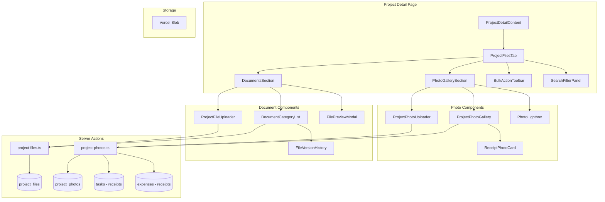

# Project Files & Image Upload - Technical Design

## Status
- Requirements: DRAFT (link: `.claude/docs/requirements/project-files-upload.md`)
- Design: DRAFT
- Author: kiro-design
- Date: 2026-01-06

---

## Overview

### Purpose
Enable comprehensive file and image management for GenHub construction projects, allowing users to upload, organize, and access project documentation and site photos with construction-specific categorization and workflow support.

### Business Value
- Reduce time searching for project documents by 82%
- Enable field teams to achieve 93% faster photo retrieval through standardized organization
- Create bulletproof audit trails with time-stamped documentation
- Protect against liability claims with comprehensive site condition documentation
- Unified view of all project media including receipt aggregation from tasks/expenses

### Scope
**In scope:**
- Photo upload with camera capture (mobile)
- Document upload with batch processing
- Category-based organization
- Photo gallery with lightbox
- Document list with folder view
- Search and filtering
- Bulk actions (download, delete, move)
- Receipt aggregation from tasks/expenses (read-only integration)
- File versioning and audit trail
- Role-based permissions

**Out of scope:**
- Video upload
- AI-powered auto-categorization
- OCR text extraction from documents
- External DMS integration (Procore, Autodesk)
- Collaborative annotations on PDFs

---

## Architecture

### System Context

```
Project Detail Page (/app/projects/[id])
    |
    v
ProjectDetailContent (Client Component)
    |
    +-- [Files & Photos Tab] <-- NEW
    |       |
    |       +-- ProjectFilesTab (Client Component)
    |               |
    |               +-- PhotoGallerySection
    |               |       |-- CategoryFilter
    |               |       |-- PhotoGrid (reuse PhotoGallery pattern)
    |               |       |-- PhotoLightbox
    |               |       +-- ReceiptBadges (task/expense source)
    |               |
    |               +-- DocumentsSection
    |               |       |-- CategoryAccordion
    |               |       |-- DocumentList (reuse FileList pattern)
    |               |       +-- FilePreviewModal
    |               |
    |               +-- BulkActionToolbar
    |               +-- SearchFilterPanel
    |
    +-- [Overview Tab]
    +-- [Team Tab]
    +-- [Tasks Tab]
    +-- [Settings Tab]
```

### Component Diagram



### Data Flow

#### Upload Flow
```
1. User selects file(s) via uploader component
2. Client-side validation (size, type)
3. FormData sent to API route (/api/project-files/upload)
4. API route:
   a. Validates auth + permissions
   b. Uploads to Vercel Blob
   c. Generates thumbnail (photos only)
   d. Inserts record to database
   e. Returns success with file metadata
5. Client receives response, updates UI
6. revalidatePath triggers data refresh
```

#### Receipt Aggregation Flow
```
1. Server Action: getProjectPhotosWithReceipts(projectId)
2. Query project_photos table (direct uploads)
3. Query tasks table WHERE receipt_photo_url IS NOT NULL
4. Query expenses table WHERE receipt_url IS NOT NULL
5. Combine + normalize into unified PhotoItem[] array
6. Return to client with source metadata
7. Client displays with appropriate badges/permissions
```

---

## Data Model

### New Tables

#### project_files

| Column | Type | Constraints | Purpose |
|--------|------|-------------|---------|
| id | uuid | PK, default gen_random_uuid() | Primary key |
| company_id | uuid | FK companies, NOT NULL | RLS isolation |
| project_id | uuid | FK projects, NOT NULL, ON DELETE CASCADE | Parent project |
| uploaded_by | uuid | FK next_auth.users, NOT NULL | Uploader reference |
| filename | text | NOT NULL | Display filename |
| original_filename | text | NOT NULL | Original upload name |
| file_url | text | NOT NULL | Vercel Blob URL |
| file_size | bigint | NOT NULL | Size in bytes |
| file_type | text | NOT NULL | MIME type |
| category | document_category | NOT NULL, default 'general' | Document category |
| tags | text[] | | Custom tags array |
| client_visible | boolean | default false | Client portal visibility |
| version_number | integer | default 1 | Version tracking |
| parent_file_id | uuid | FK project_files | For versioning chain |
| metadata | jsonb | | SHA-256 hash, custom data |
| deleted_at | timestamptz | | Soft delete timestamp |
| created_at | timestamptz | default now() | |
| updated_at | timestamptz | default now() | |

#### project_photos

| Column | Type | Constraints | Purpose |
|--------|------|-------------|---------|
| id | uuid | PK, default gen_random_uuid() | Primary key |
| company_id | uuid | FK companies, NOT NULL | RLS isolation |
| project_id | uuid | FK projects, NOT NULL, ON DELETE CASCADE | Parent project |
| uploaded_by | uuid | FK next_auth.users, NOT NULL | Uploader reference |
| filename | text | NOT NULL | Display filename |
| photo_url | text | NOT NULL | Full-size Vercel Blob URL |
| thumbnail_url | text | | 300x300 thumbnail URL |
| file_size | bigint | NOT NULL | Size in bytes |
| category | photo_category | NOT NULL, default 'general' | Photo category |
| tags | text[] | | Custom tags array |
| exif_data | jsonb | | GPS, camera, timestamp, exposure |
| client_visible | boolean | default false | Client portal visibility |
| deleted_at | timestamptz | | Soft delete timestamp |
| created_at | timestamptz | default now() | |

#### file_audit_log

| Column | Type | Constraints | Purpose |
|--------|------|-------------|---------|
| id | uuid | PK, default gen_random_uuid() | Primary key |
| company_id | uuid | FK companies, NOT NULL | RLS isolation |
| file_id | uuid | | Reference to file/photo |
| file_type | text | NOT NULL | 'document' or 'photo' |
| action | text | NOT NULL | 'upload', 'delete', 'version_update', 'category_change' |
| performed_by | uuid | FK next_auth.users, NOT NULL | User who performed action |
| previous_state | jsonb | | State before action |
| new_state | jsonb | | State after action |
| created_at | timestamptz | default now() | Immutable timestamp |

### Enums

```sql
-- Document categories
CREATE TYPE document_category AS ENUM (
  'contracts',      -- Contracts & Agreements
  'permits',        -- Permits & Approvals
  'drawings',       -- Drawings & Blueprints
  'reports',        -- Reports
  'financial',      -- Financial documents
  'safety',         -- Safety & Compliance
  'meeting_notes',  -- Meeting Notes
  'specifications', -- Specifications
  'general'         -- General
);

-- Photo categories
CREATE TYPE photo_category AS ENUM (
  'site_progress',        -- Site Progress
  'safety_documentation', -- Safety Documentation
  'permits_approvals',    -- Permits & Approvals
  'inspection_reports',   -- Inspection Reports
  'material_receipts',    -- Material Receipts
  'change_orders',        -- Change Orders
  'defects_issues',       -- Defects/Issues
  'before_after',         -- Before/After
  'task_receipts',        -- Read-only: from tasks module
  'expense_receipts',     -- Read-only: from expenses module
  'general'               -- General
);
```

### RLS Policies

```sql
-- project_files: Company isolation + role-based access
CREATE POLICY "project_files_select" ON project_files FOR SELECT
USING (company_id = get_user_company_id(next_auth.uid()));

CREATE POLICY "project_files_insert" ON project_files FOR INSERT
WITH CHECK (
  company_id = get_user_company_id(next_auth.uid())
  AND EXISTS (
    SELECT 1 FROM project_team
    WHERE project_id = project_files.project_id
    AND user_id = next_auth.uid()
  )
);

CREATE POLICY "project_files_update" ON project_files FOR UPDATE
USING (
  company_id = get_user_company_id(next_auth.uid())
  AND (
    uploaded_by = next_auth.uid()  -- Own files
    OR is_user_gc_admin(next_auth.uid())  -- GC/PM can edit all
  )
);

CREATE POLICY "project_files_delete" ON project_files FOR DELETE
USING (
  company_id = get_user_company_id(next_auth.uid())
  AND (
    uploaded_by = next_auth.uid()  -- Own files
    OR is_user_gc_admin(next_auth.uid())  -- GC/PM can delete all
  )
);

-- Similar policies for project_photos
-- file_audit_log: Append-only, SELECT by company members
```

### Indexes

```sql
-- project_files
CREATE INDEX idx_project_files_project ON project_files(project_id) WHERE deleted_at IS NULL;
CREATE INDEX idx_project_files_category ON project_files(project_id, category) WHERE deleted_at IS NULL;
CREATE INDEX idx_project_files_uploaded_by ON project_files(uploaded_by);

-- project_photos
CREATE INDEX idx_project_photos_project ON project_photos(project_id) WHERE deleted_at IS NULL;
CREATE INDEX idx_project_photos_category ON project_photos(project_id, category) WHERE deleted_at IS NULL;

-- file_audit_log
CREATE INDEX idx_file_audit_log_file ON file_audit_log(file_id);
CREATE INDEX idx_file_audit_log_created ON file_audit_log(created_at DESC);
```

---

## API Specification

### Server Actions

#### getProjectFiles

| Property | Value |
|----------|-------|
| Location | `app/actions/project-files.ts` |
| Auth | Required |
| Input | `{ projectId: string, filters?: FileFilters }` |
| Output | `{ data?: ProjectFile[], error?: string }` |
| Revalidates | N/A (read-only) |

```typescript
interface FileFilters {
  category?: string[];
  search?: string;
  dateFrom?: string;
  dateTo?: string;
  uploadedBy?: string[];
  fileType?: ('document' | 'image' | 'cad' | 'archive')[];
}
```

#### getProjectPhotosWithReceipts

| Property | Value |
|----------|-------|
| Location | `app/actions/project-photos.ts` |
| Auth | Required |
| Input | `{ projectId: string, filters?: PhotoFilters }` |
| Output | `{ data?: UnifiedPhoto[], error?: string }` |
| Revalidates | N/A (read-only) |

```typescript
interface UnifiedPhoto {
  id: string;
  url: string;
  thumbnail_url?: string;
  filename: string;
  category: string;
  source: 'upload' | 'task_receipt' | 'expense_receipt';
  source_id?: string;
  source_title?: string;
  uploaded_by: { id: string; name: string; avatar_url?: string };
  created_at: string;
  exif_data?: {
    timestamp?: string;
    camera?: { make: string; model: string };
    gps?: { latitude: number; longitude: number };
    exposure?: { focalLength?: number; fNumber?: number; iso?: number };
  };
  is_deletable: boolean;
  is_editable: boolean;
  client_visible?: boolean;
}

interface PhotoFilters {
  category?: string[];
  search?: string;
  dateFrom?: string;
  dateTo?: string;
  source?: ('upload' | 'task_receipt' | 'expense_receipt')[];
  showReceipts?: boolean;
}
```

#### uploadProjectFile

| Property | Value |
|----------|-------|
| Location | `app/actions/project-files.ts` |
| Auth | Required |
| Input | `FormData` with file, projectId, category, tags[], clientVisible |
| Output | `{ data?: ProjectFile, error?: string }` |
| Revalidates | `/app/projects/[id]` |

#### uploadProjectPhoto

| Property | Value |
|----------|-------|
| Location | `app/actions/project-photos.ts` |
| Auth | Required |
| Input | `FormData` with file, projectId, category, tags[], clientVisible |
| Output | `{ data?: ProjectPhoto, error?: string }` |
| Revalidates | `/app/projects/[id]` |

#### deleteProjectFile

| Property | Value |
|----------|-------|
| Location | `app/actions/project-files.ts` |
| Auth | Required |
| Input | `{ fileId: string }` |
| Output | `{ success: boolean, error?: string }` |
| Revalidates | `/app/projects/[id]` |

#### deleteProjectPhoto

| Property | Value |
|----------|-------|
| Location | `app/actions/project-photos.ts` |
| Auth | Required |
| Input | `{ photoId: string }` |
| Output | `{ success: boolean, error?: string }` |
| Revalidates | `/app/projects/[id]` |

#### updateFileCategory

| Property | Value |
|----------|-------|
| Location | `app/actions/project-files.ts` |
| Auth | Required |
| Input | `{ fileId: string, category: DocumentCategory }` |
| Output | `{ success: boolean, error?: string }` |
| Revalidates | `/app/projects/[id]` |

#### bulkDownloadFiles

| Property | Value |
|----------|-------|
| Location | `app/actions/project-files.ts` |
| Auth | Required |
| Input | `{ fileIds: string[], projectId: string }` |
| Output | `{ data?: { downloadUrl: string }, error?: string }` |
| Revalidates | N/A |

#### bulkDeleteFiles

| Property | Value |
|----------|-------|
| Location | `app/actions/project-files.ts` |
| Auth | Required |
| Input | `{ fileIds: string[], projectId: string }` |
| Output | `{ success: boolean, deletedCount: number, errors?: string[] }` |
| Revalidates | `/app/projects/[id]` |

#### getFileVersionHistory

| Property | Value |
|----------|-------|
| Location | `app/actions/project-files.ts` |
| Auth | Required |
| Input | `{ fileId: string }` |
| Output | `{ data?: FileVersion[], error?: string }` |
| Revalidates | N/A |

### API Routes

#### POST /api/project-files/upload

Used for file uploads with progress tracking (alternative to Server Action for better UX).

```typescript
// Request: FormData
// - file: File
// - projectId: string
// - category: string
// - tags: string (JSON array)
// - clientVisible: 'true' | 'false'

// Response
{
  success: boolean;
  file?: {
    id: string;
    filename: string;
    file_url: string;
    file_size: number;
    category: string;
  };
  error?: string;
}
```

#### POST /api/project-photos/upload

Same pattern as files, plus thumbnail generation.

#### POST /api/project-files/bulk-download

Generates ZIP archive of selected files.

```typescript
// Request
{
  fileIds: string[];
  projectId: string;
}

// Response
{
  downloadUrl: string;  // Signed URL to ZIP file
  expiresAt: string;    // URL expiration timestamp
}
```

---

## UI Specification

### Pages

| Route | Type | Purpose |
|-------|------|---------|
| /app/projects/[id] | Server Component | Project detail with Files & Photos tab |

### Components

#### New Components

| Component | Type | Location | Props | Purpose |
|-----------|------|----------|-------|---------|
| ProjectFilesTab | Client | `components/projects/files/ProjectFilesTab.tsx` | `{ projectId, initialFiles, initialPhotos }` | Main tab container with sub-navigation |
| PhotoGallerySection | Client | `components/projects/files/PhotoGallerySection.tsx` | `{ photos, onUpload, onDelete }` | Photo gallery with filters and lightbox |
| DocumentsSection | Client | `components/projects/files/DocumentsSection.tsx` | `{ files, onUpload, onDelete, onMove }` | Category-based document list |
| ProjectPhotoUploader | Client | `components/projects/files/ProjectPhotoUploader.tsx` | `{ projectId, onComplete, onCancel }` | Photo upload with category selection |
| ProjectFileUploader | Client | `components/projects/files/ProjectFileUploader.tsx` | `{ projectId, category?, onComplete, onCancel }` | Batch file upload |
| PhotoLightbox | Client | `components/projects/files/PhotoLightbox.tsx` | `{ photo, photos, onClose, onDelete, onNavigate }` | Full-screen photo viewer with EXIF |
| FilePreviewModal | Client | `components/projects/files/FilePreviewModal.tsx` | `{ file, onClose, onDelete, onDownload }` | File preview/download modal |
| DocumentCategoryList | Client | `components/projects/files/DocumentCategoryList.tsx` | `{ files, category, onExpand }` | Collapsible category section |
| FileVersionHistory | Client | `components/projects/files/FileVersionHistory.tsx` | `{ fileId, onClose }` | Version history modal |
| BulkActionToolbar | Client | `components/projects/files/BulkActionToolbar.tsx` | `{ selectedIds, onDownload, onDelete, onMove, onClear }` | Bulk operations bar |
| SearchFilterPanel | Client | `components/projects/files/SearchFilterPanel.tsx` | `{ filters, onFilterChange, onClear }` | Search and filter controls |
| ReceiptPhotoBadge | Client | `components/projects/files/ReceiptPhotoBadge.tsx` | `{ source, sourceTitle, sourceId }` | Badge for receipt photos |
| CategorySelector | Client | `components/projects/files/CategorySelector.tsx` | `{ type, value, onChange }` | Category dropdown for uploads |

#### Reused Components (from spatial viewer)

| Component | Reuse Strategy |
|-----------|----------------|
| PhotoUploader | Extract validation logic; create ProjectPhotoUploader wrapper |
| PhotoGallery | Extract grid/lightbox pattern; adapt for project context |
| FileUploader | Extract batch upload logic; create ProjectFileUploader wrapper |

### UI Patterns Applied

- [x] Blueprint grid background (inherited from project page)
- [x] Industrial header (section headers with icons)
- [x] Section headers with SectionHeader pattern
- [x] Card styling with `border-2 border-gray-200 shadow-construction`
- [x] Responsive grid (2 cols mobile, 3 cols desktop for photos)
- [x] BaseModal for all modals (lightbox, preview, version history)
- [x] Lucide icons only (Image, FileText, Upload, Trash2, Download, Filter, Search)

### Tab Integration

Modify `ProjectDetailContent.tsx`:

```typescript
// Add to activeTab type
const [activeTab, setActiveTab] = useState<
  'overview' | 'team' | 'tasks' | 'files' | 'settings'
>('overview');

// Add new tab button (after Tasks, before Settings)
<button onClick={() => setActiveTab('files')}>
  <FolderOpen className="h-4 w-4" />
  Files & Photos
  {(fileCount + photoCount) > 0 && (
    <Badge>{fileCount + photoCount}</Badge>
  )}
</button>

// Add tab content
{activeTab === 'files' && (
  <ProjectFilesTab
    projectId={project.id}
    initialFiles={projectFiles}
    initialPhotos={projectPhotos}
  />
)}
```

### Sub-Navigation (within Files Tab)

```
[Photos]  [Documents]  [All Files]
   ^
   |-- Active state with underline
```

### Photo Gallery Layout

```
+------------------------------------------+
| [Category Dropdown] [Search...] [Filter] |
+------------------------------------------+
| Showing 23 photos | [Upload Photo]       |
+------------------------------------------+
|  +--------+  +--------+  +--------+      |
|  | Photo  |  | Photo  |  | Photo  |      |
|  |  [Rcpt]|  |        |  |  [Rcpt]|      |
|  +--------+  +--------+  +--------+      |
|  +--------+  +--------+  +--------+      |
|  | Photo  |  | Photo  |  | Photo  |      |
|  |        |  |        |  |        |      |
|  +--------+  +--------+  +--------+      |
|           [Load More...]                 |
+------------------------------------------+
```

### Document List Layout

```
+------------------------------------------+
| [Search...] [Filter] | [Upload Document] |
+------------------------------------------+
| v Contracts & Agreements (3 files)       |
|   +--------------------------------------+
|   | [PDF] Contract_v2.pdf    2.4 MB     |
|   |       Jan 5, 2026 by John | [v] [DL]|
|   +--------------------------------------+
|   | [PDF] Amendment_01.pdf   1.1 MB     |
|   |       Jan 4, 2026 by Sarah | [DL]   |
|   +--------------------------------------+
| > Permits & Approvals (5 files)          |
| > Drawings & Blueprints (12 files)       |
| > Reports (8 files)                      |
| > Financial (empty)                      |
+------------------------------------------+
```

### Bulk Action Toolbar

```
+------------------------------------------+
| [x] 5 files selected                     |
|        [Download] [Delete] [Move to...] [Clear] |
+------------------------------------------+
```

### Mobile Considerations

- Photo upload: Bottom sheet modal with Camera + Choose File buttons
- Gallery: 2-column grid on mobile, 1-column on narrow screens (<480px)
- Document list: Full-width cards, swipe actions for download/delete
- Filters: Collapsible filter panel (hidden by default on mobile)
- Lightbox: Full-screen with swipe navigation, pinch-to-zoom

---

## Implementation Phases

### Phase 1: Database (Backend)
**Estimated effort: 3-4 hours**

- [x] Create migration for `project_files` table
- [x] Create migration for `project_photos` table
- [x] Create migration for `file_audit_log` table
- [x] Create enum types (document_category, photo_category)
- [x] Create RLS policies
- [x] Create indexes
- [x] Regenerate TypeScript types

### Phase 2: Server Actions & API (Backend)
**Estimated effort: 4-6 hours**

- [ ] Create `app/actions/project-files.ts`
  - [ ] getProjectFiles
  - [ ] uploadProjectFile (or use API route)
  - [ ] deleteProjectFile
  - [ ] updateFileCategory
  - [ ] bulkDeleteFiles
  - [ ] getFileVersionHistory
- [ ] Create `app/actions/project-photos.ts`
  - [ ] getProjectPhotosWithReceipts (aggregation query)
  - [ ] uploadProjectPhoto
  - [ ] deleteProjectPhoto
- [ ] Create API routes (if needed for progress tracking)
  - [ ] POST /api/project-files/upload
  - [ ] POST /api/project-photos/upload
  - [ ] POST /api/project-files/bulk-download

### Phase 3: Core Components (Frontend)
**Estimated effort: 6-8 hours**

- [ ] ProjectFilesTab (main container)
- [ ] SearchFilterPanel
- [ ] CategorySelector
- [ ] BulkActionToolbar

### Phase 4: Photo Components (Frontend)
**Estimated effort: 4-5 hours**

- [ ] PhotoGallerySection
- [ ] ProjectPhotoUploader (adapt from PhotoUploader)
- [ ] PhotoLightbox (adapt from PhotoGallery lightbox)
- [ ] ReceiptPhotoBadge

### Phase 5: Document Components (Frontend)
**Estimated effort: 4-5 hours**

- [ ] DocumentsSection
- [ ] DocumentCategoryList
- [ ] ProjectFileUploader (adapt from FileUploader)
- [ ] FilePreviewModal
- [ ] FileVersionHistory

### Phase 6: Tab Integration (Frontend)
**Estimated effort: 2-3 hours**

- [ ] Modify ProjectDetailContent.tsx to add Files tab
- [ ] Update project page to fetch files/photos data
- [ ] Add tab badge count
- [ ] Test tab navigation

### Phase 7: Polish & Testing
**Estimated effort: 3-4 hours**

- [ ] Mobile-specific styles and interactions
- [ ] Accessibility improvements (keyboard nav, screen readers)
- [ ] Error handling and edge cases
- [ ] Performance optimization (lazy loading, virtualization)
- [ ] Integration tests

---

## Error Handling

| Error Case | Handling |
|------------|----------|
| Auth failure | Redirect to login via middleware |
| Permission denied | Return 403 with "You don't have permission to perform this action" |
| File too large | Client-side validation + server validation, toast error |
| Invalid file type | Client-side validation + server validation, toast error |
| Upload failure | Display retry button, log error, toast notification |
| Storage quota exceeded | Show modal "Storage limit reached. Contact support to upgrade." |
| File not found | Return 404, display "File not found" in UI |
| Bulk operation partial failure | Complete successful ops, return error summary |
| Receipt delete attempt | Display error "Cannot delete from here. Edit the source task/expense to remove." |

---

## Testing Strategy

### Unit Tests
- Server Action input validation (Zod schemas)
- File type/size validation functions
- Category filtering logic
- Receipt aggregation query builder

### Integration Tests
- Full upload flow: UI -> API -> Blob -> DB -> Response
- Bulk download ZIP generation
- Receipt aggregation with mock task/expense data
- RLS policy enforcement
- Permission checks for different user roles

### E2E Tests
- Photo upload from desktop file picker
- Photo capture from mobile camera
- Document batch upload
- Category filtering
- Bulk delete operation
- Lightbox navigation
- Search functionality

---

## Security Considerations

- [x] RLS enabled on all new tables
- [x] Company isolation via `company_id` column
- [x] File upload validation (size, type) on client AND server
- [x] Soft delete for file recovery (30-day retention)
- [x] Audit trail for critical document actions
- [x] Signed URLs with expiration for file access
- [x] Permission checks in Server Actions (role-based)
- [x] Input validation with Zod schemas
- [x] No sensitive data in client state
- [x] Receipt photos are read-only (cannot delete from gallery)

### Permission Matrix

| Role | Upload | View All | View Own | Edit Own | Edit All | Delete Own | Delete All |
|------|--------|----------|----------|----------|----------|------------|------------|
| GC Admin | Yes | Yes | Yes | Yes | Yes | Yes | Yes |
| PM | Yes | Yes | Yes | Yes | Yes | Yes | Yes |
| Foreman | Yes | Yes | Yes | Yes | No | Yes | No |
| Field Worker | Yes | Yes | Yes | Yes | No | Yes | No |
| Subcontractor | Task-only | Task-only | Yes | No | No | No | No |
| Client | No | Visible-only | N/A | No | No | No | No |

---

## Design Decisions

### Decision: Unified vs Separate Tables for Files and Photos

- **Context**: Requirements specify both document and photo management with different attributes (photos have EXIF, documents have versioning)
- **Options**:
  - A: Single `project_media` table with discriminator column
  - B: Separate `project_files` and `project_photos` tables
  - C: Combined with polymorphic associations
- **Decision**: B - Separate tables
- **Rationale**:
  - Photos have EXIF data, thumbnails; documents have versioning, parent chains
  - Simpler queries for each use case
  - RLS policies can be tailored
  - Cleaner TypeScript types

### Decision: Storage Backend

- **Context**: Need to store uploaded files with access control
- **Options**:
  - A: Supabase Storage (S3-compatible, RLS integration)
  - B: Vercel Blob (simpler API, no RLS)
  - C: AWS S3 directly
- **Decision**: B - Vercel Blob (for documents/photos)
- **Rationale**:
  - Existing pattern in spatial viewer uses Vercel Blob
  - Supabase Storage reserved for 3D models (large binary files)
  - Simpler setup, integrated with Next.js
  - Signed URLs handled at application layer

### Decision: Receipt Integration Approach

- **Context**: Need to show task/expense receipts in unified gallery
- **Options**:
  - A: Copy receipt URLs to project_photos on upload (data duplication)
  - B: Join/union queries at read time (no duplication)
  - C: Database views for unified access
- **Decision**: B - Join/union queries at read time
- **Rationale**:
  - No data duplication
  - Single source of truth (task/expense is owner)
  - Automatic updates when receipts change
  - Receipts marked read-only in UI (correct behavior)

### Decision: Category Storage

- **Context**: Files need construction-specific categorization
- **Options**:
  - A: Enum type in database (fixed categories)
  - B: Separate `file_categories` table (dynamic)
  - C: JSON array of tags (flexible)
- **Decision**: A - Enum types
- **Rationale**:
  - Categories are well-defined by industry standards
  - Type safety in TypeScript
  - Efficient filtering/indexing
  - Tags array for custom organization on top

---

## Open Questions

- [x] **Q1**: Should we auto-extract EXIF GPS coordinates and plot photos on project map?
  - **Answer**: Out of scope for initial release. EXIF data stored for future use.

- [ ] **Q2**: What's the file retention policy after project completion?
  - **Recommendation**: 7 years per construction industry standard. Flag for cleanup via scheduled job.

- [ ] **Q3**: Should "critical documents" require multi-user approval before deletion?
  - **Recommendation**: Out of scope for initial release. Audit trail sufficient for now.

- [ ] **Q7**: Should receipt images support inline editing (rotate, crop) in gallery?
  - **Recommendation**: No - only in source module. Gallery is read-only for receipts.

- [ ] **Q8**: When filtering "All Receipts", show combined or grouped?
  - **Recommendation**: Combined, sorted chronologically. Source type shown via badge.

---

## References

- Requirements: `.claude/docs/requirements/project-files-upload.md`
- Related features:
  - Spatial viewer photo/file upload (`components/projects/spatial/`)
  - Task receipts (`tasks.receipt_photo_url`)
  - Expense receipts (`expenses.receipt_url`)
- External docs:
  - [Vercel Blob Documentation](https://vercel.com/docs/storage/vercel-blob)
  - [Supabase RLS Documentation](https://supabase.com/docs/guides/auth/row-level-security)

---

## Appendix: Type Definitions

```typescript
// types/project-files.ts

export interface ProjectFile {
  id: string;
  project_id: string;
  uploaded_by: string;
  filename: string;
  original_filename: string;
  file_url: string;
  file_size: number;
  file_type: string;
  category: DocumentCategory;
  tags: string[];
  client_visible: boolean;
  version_number: number;
  parent_file_id: string | null;
  metadata: {
    hash?: string;
    [key: string]: unknown;
  } | null;
  created_at: string;
  updated_at: string;
  // Joined data
  uploader?: {
    id: string;
    name: string;
    avatar_url: string | null;
  };
}

export interface ProjectPhoto {
  id: string;
  project_id: string;
  uploaded_by: string;
  filename: string;
  photo_url: string;
  thumbnail_url: string | null;
  file_size: number;
  category: PhotoCategory;
  tags: string[];
  exif_data: ExifData | null;
  client_visible: boolean;
  created_at: string;
  // Joined data
  uploader?: {
    id: string;
    name: string;
    avatar_url: string | null;
  };
}

export interface ExifData {
  timestamp?: string;
  camera?: {
    make: string;
    model: string;
  };
  gps?: {
    latitude: number;
    longitude: number;
  };
  exposure?: {
    focalLength?: number;
    fNumber?: number;
    exposureTime?: number;
    iso?: number;
  };
}

export type DocumentCategory =
  | 'contracts'
  | 'permits'
  | 'drawings'
  | 'reports'
  | 'financial'
  | 'safety'
  | 'meeting_notes'
  | 'specifications'
  | 'general';

export type PhotoCategory =
  | 'site_progress'
  | 'safety_documentation'
  | 'permits_approvals'
  | 'inspection_reports'
  | 'material_receipts'
  | 'change_orders'
  | 'defects_issues'
  | 'before_after'
  | 'task_receipts'
  | 'expense_receipts'
  | 'general';

export interface FileFilters {
  category?: DocumentCategory[];
  search?: string;
  dateFrom?: string;
  dateTo?: string;
  uploadedBy?: string[];
  fileType?: ('document' | 'image' | 'cad' | 'archive')[];
}

export interface PhotoFilters {
  category?: PhotoCategory[];
  search?: string;
  dateFrom?: string;
  dateTo?: string;
  source?: ('upload' | 'task_receipt' | 'expense_receipt')[];
  showReceipts?: boolean;
}
```

---

**END OF DESIGN DOCUMENT**
