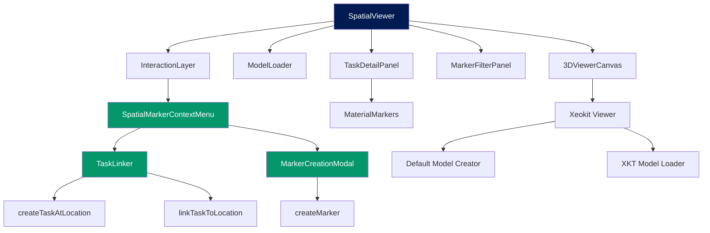

# 3D Spatial Viewer Enhancement - Technical Design

## Status
- **Requirements:** APPROVED (`.claude/docs/requirements/3d-spatial-viewer-enhancement.md`)
- **Design:** DRAFT
- **Author:** kiro-design
- **Date:** 2026-01-04

---

## Overview

### Purpose
Enhance GenHub's existing 3D Spatial Viewer to support interactive task linking, unique project type models, material visualization, file attachments, and client portal integration. This transforms the 3D viewer from a passive visualization tool into an active project management interface where GCs and PMs can spatially organize tasks, materials, and documentation.

### Business Value
- **Spatial Task Management:** GCs/PMs can visualize task locations in 3D space, reducing miscommunication about work areas
- **Material Visibility:** Automatic material display through task links eliminates manual spatial tracking
- **Client Transparency:** Full read-only 3D access gives clients unprecedented project visibility
- **Unified Documentation:** Files/photos attached to 3D locations provide contextual documentation

### Scope

**In Scope:**
- Unique 3D models per project type (residential, cafe, restaurant, commercial_office, industrial)
- Interactive task linking (create new + link existing)
- Material visualization via task relationships
- File/image attachment to markers and tasks
- Permission controls (GC/PM edit, others view-only)
- Client portal read-only access
- Visual marker filtering and clustering
- Spatial marker CRUD operations (issues, notes, safety, milestones)
- Task detail panel integration
- Mobile/touch device support

**Out of Scope:**
- Direct material-to-3D linking (materials shown via task links only)
- AR/VR viewer modes
- BIM clash detection
- Real-time collaborative editing with live cursors
- Voice note playback (schema supports, UI not implemented)
- Change order spatial tracking (separate feature)

---

## Architecture

### System Context

The 3D Spatial Viewer Enhancement integrates into GenHub's existing project detail page (`/app/app/projects/[id]`) as an enhanced component of the `ProjectDetailContent`. It leverages the existing Xeokit-based 3D infrastructure while adding new interaction layers for task management and client visibility.

```
┌─────────────────────────────────────────────────────────────┐
│ Project Detail Page (/app/app/projects/[id])               │
│                                                             │
│  ┌──────────────────────────────────────────────────────┐  │
│  │ ProjectDetailContent (Client Component)               │  │
│  │                                                        │  │
│  │  ┌──────────────────────────────────────────────┐    │  │
│  │  │ SpatialViewer (Enhanced)                      │    │  │
│  │  │                                                │    │  │
│  │  │  - 3DViewerCanvas (Xeokit)                   │    │  │
│  │  │  - ModelLoader (Default/Custom)              │    │  │
│  │  │  - InteractionLayer (Click handlers)         │    │  │
│  │  │  - TaskLinker (Modal)                        │    │  │
│  │  │  - MaterialMarkers (Overlays)                │    │  │
│  │  │  - SpatialMarkerContextMenu (NEW)            │    │  │
│  │  │  - MarkerFilterPanel (NEW)                   │    │  │
│  │  │  - TaskDetailPanel (Drawer)                  │    │  │
│  │  └──────────────────────────────────────────────┘    │  │
│  │                                                        │  │
│  └──────────────────────────────────────────────────────┘  │
│                                                             │
│  Server Actions: /app/actions/spatial.ts                   │
│  - createMarker, updateMarker, deleteMarker                │
│  - linkTaskToLocation, createTaskAtLocation (NEW)          │
│  - uploadMarkerAttachment (NEW)                            │
│  - getMarkersByProject (with filters)                      │
│                                                             │
└─────────────────────────────────────────────────────────────┘
         │                                  │
         │ Supabase MCP                     │ Supabase Storage
         ▼                                  ▼
┌──────────────────────┐        ┌──────────────────────┐
│ Database Tables       │        │ File Storage         │
│ - spatial_markers     │        │ - marker_content/    │
│ - marker_content      │        │ - attachments/       │
│ - tasks               │        │ - 3d-models/         │
│ - default_3d_models   │        └──────────────────────┘
│ - projects_3d_models  │
└──────────────────────┘
```

### Component Diagram



### Data Flow

**1. Project Load → 3D Model Selection**
```
User opens project detail
  ↓
Server fetches project.project_type + active 3D model
  ↓
IF custom model exists:
  → Load XKT from projects_3d_models
ELSE:
  → Load default model from default_3d_models by project_type
  ↓
Xeokit renders 3D geometry
  ↓
Fetch spatial_markers for project
  ↓
Render markers as 3D pins on model
```

**2. Task Linking Flow (Create New)**
```
User clicks on 3D surface (GC/PM only)
  ↓
InteractionLayer captures click event (position, normal, element_id)
  ↓
Display SpatialMarkerContextMenu → "Create New Task Here"
  ↓
Open TaskLinker modal (mode: create)
  ↓
User fills task form (title, description, assignee, phase, priority)
  ↓
Server Action: createTaskAtLocation(taskData, position)
  ↓
INSERT into tasks → returns task_id
  ↓
INSERT into spatial_markers (task_id, position, normal, element_id)
  ↓
Revalidate /app/projects/[id]
  ↓
Re-render SpatialViewer with new marker
```

**3. Task Linking Flow (Link Existing)**
```
User clicks on 3D surface (GC/PM only)
  ↓
Display SpatialMarkerContextMenu → "Link Existing Task"
  ↓
Open TaskLinker modal (mode: link, tasks: project.tasks)
  ↓
User searches/filters tasks
  ↓
User selects task from list
  ↓
Server Action: linkTaskToLocation(task_id, position, element_id)
  ↓
INSERT into spatial_markers (task_id, position, normal, element_id)
  ↓
Revalidate /app/projects/[id]
  ↓
Re-render SpatialViewer with new marker
```

**4. Material Visibility Flow**
```
Task has material_assignments linked
  ↓
Spatial marker with task_id references task
  ↓
MaterialMarkers component fetches task.materials via JOIN
  ↓
Display material count badge on task marker
  ↓
User clicks marker → Open TaskDetailPanel
  ↓
"Materials" tab shows:
  - material_assignments.material_id → materials.product_name
  - quantity, unit_cost, procurement_status
  ↓
Material status colors reflected on marker badge
  (ordered: blue, delivered: green, installed: gray)
```

---

## Data Model

### Tables

| Table | Purpose |
|-------|---------|
| `default_3d_models` | System-wide default 3D models per project type |
| `projects_3d_models` | Project-specific 3D model versions |
| `spatial_markers` | 3D markers for tasks, issues, notes, safety, milestones |
| `marker_content` | File/photo/voice attachments for markers |
| `tasks` | Existing tasks table (updated with `spatial_marker_id` FK) |
| `material_assignments` | Existing material-task links (no changes) |

### Schema: default_3d_models

| Column | Type | Constraints | Purpose |
|--------|------|-------------|---------|
| id | uuid | PK, default gen_random_uuid() | Primary key |
| project_type | enum | NOT NULL | Project type (residential, cafe, restaurant, commercial_office, industrial) |
| name | text | NOT NULL | Model name (e.g., "Residential Layout") |
| description | text | | Model description |
| model_id | text | NOT NULL, UNIQUE | Model identifier (e.g., "default-residential-layout") |
| xkt_file_url | text | | Generated XKT file URL (procedural models stored as code, not files) |
| thumbnail_url | text | | Thumbnail preview URL |
| is_active | boolean | DEFAULT true | Only one active per project_type |
| metadata | jsonb | | Model metadata (dimensions, room count, etc.) |
| created_at | timestamptz | DEFAULT now() | Creation timestamp |
| updated_at | timestamptz | DEFAULT now() | Update timestamp |

**Unique Constraint:** `UNIQUE(project_type) WHERE is_active = true`

**RLS Pattern:**
```sql
-- Public read access (authenticated users)
CREATE POLICY "default_3d_models_select" ON default_3d_models FOR SELECT
USING (auth.uid() IS NOT NULL);

-- System-only INSERT/UPDATE (GC Admin via admin actions only)
CREATE POLICY "default_3d_models_manage" ON default_3d_models FOR ALL
USING (is_user_gc_admin(next_auth.uid()));
```

### Schema: spatial_markers (Existing - No Changes)

| Column | Type | Constraints | Purpose |
|--------|------|-------------|---------|
| id | uuid | PK, default gen_random_uuid() | Primary key |
| project_id | uuid | FK projects, NOT NULL | Project association |
| model_id | uuid | FK projects_3d_models, ON DELETE SET NULL | Model version reference |
| title | text | NOT NULL | Marker title |
| description | text | | Marker description |
| marker_type | enum | NOT NULL | Type: issue, inspection, note, safety, change_order, milestone |
| position | jsonb | NOT NULL | 3D position {x, y, z} as numeric |
| normal_vector | jsonb | | Surface normal {x, y, z} |
| element_id | text | | IFC GUID or model element ID |
| phase_id | uuid | FK project_phases, ON DELETE SET NULL | Phase association |
| task_id | uuid | FK tasks, ON DELETE SET NULL | **Task link (critical for material visibility)** |
| status | enum | DEFAULT 'open' | Status: open, in_progress, resolved, closed |
| priority | enum | | Priority: low, medium, high |
| assigned_to | uuid | FK user_profiles, ON DELETE SET NULL | Assigned user |
| created_by | uuid | FK user_profiles, NOT NULL | Creator |
| resolved_at | timestamptz | | Resolution timestamp |
| created_at | timestamptz | DEFAULT now() | Creation timestamp |
| updated_at | timestamptz | DEFAULT now() | Update timestamp |

**RLS Pattern:** Company-scoped via `project_id → projects.company_id`

### Schema: marker_content (Existing - No Changes)

| Column | Type | Constraints | Purpose |
|--------|------|-------------|---------|
| id | uuid | PK, default gen_random_uuid() | Primary key |
| marker_id | uuid | FK spatial_markers, ON DELETE CASCADE | Parent marker |
| content_type | enum | NOT NULL | Type: photo, file, note, voice |
| file_url | text | | File storage URL |
| thumbnail_url | text | | Thumbnail URL (for images) |
| file_name | text | | Original file name |
| file_size_bytes | bigint | | File size |
| notes | text | | Text notes (if content_type = 'note') |
| metadata | jsonb | | Additional metadata |
| created_by | uuid | FK user_profiles, NOT NULL | Uploader |
| created_at | timestamptz | DEFAULT now() | Upload timestamp |

**RLS Pattern:** Inherits via `marker_id → spatial_markers` company scope

### Existing Tables - No Schema Changes

**tasks:**
- Already has `spatial_marker_id` FK (verified in existing code)
- No schema changes needed

**material_assignments:**
- Already links to tasks via `task_id`
- Materials visible via task relationship (no direct spatial link)

---

## API Specification

### Server Actions

All actions in `app/actions/spatial.ts`

#### createTaskAtLocation (NEW)

| Property | Value |
|----------|-------|
| Location | `app/actions/spatial.ts` |
| Auth | Required (GC/PM only) |
| Input | `{ taskData: CreateTaskInput, position: Position3D, elementId?: string }` |
| Output | `{ data?: { task: Task, marker: SpatialMarker }, error?: string }` |
| Revalidates | `/app/projects/[projectId]` |

**Input Type:**
```typescript
interface CreateTaskInput {
  project_id: string;
  phase_id: string;
  title: string;
  description?: string;
  status?: TaskStatus;
  priority?: TaskPriority;
  assignee_id?: string;
  due_date?: string;
  planned_cost?: number;
}

interface Position3D {
  x: number;
  y: number;
  z: number;
  normal?: { x: number; y: number; z: number };
}
```

**Implementation Steps:**
1. Verify user role (GC/PM) via `is_user_gc_admin()` or `role = 'project_manager'`
2. Verify project access via company RLS
3. INSERT task into `tasks` table → get `task_id`
4. INSERT spatial marker into `spatial_markers` with `task_id`, `position`, `element_id`
5. Revalidate project page
6. Return `{ data: { task, marker } }`

**Error Handling:**
- Role check failure → `{ error: 'Permission denied' }`
- Invalid project_id → `{ error: 'Project not found' }`
- Invalid phase_id → `{ error: 'Phase not found' }`
- Task creation failure → `{ error: 'Failed to create task' }`

---

#### linkTaskToLocation (NEW)

| Property | Value |
|----------|-------|
| Location | `app/actions/spatial.ts` |
| Auth | Required (GC/PM only) |
| Input | `{ taskId: string, position: Position3D, elementId?: string }` |
| Output | `{ data?: SpatialMarker, error?: string }` |
| Revalidates | `/app/projects/[projectId]` |

**Implementation Steps:**
1. Verify user role (GC/PM)
2. Verify task exists and user has access (via project → company)
3. Check if task already has spatial marker (warn if duplicate)
4. INSERT spatial marker with `task_id`, `position`, `element_id`
5. Revalidate project page
6. Return `{ data: marker }`

**Error Handling:**
- Task not found → `{ error: 'Task not found' }`
- Task already linked → `{ error: 'Task already has a spatial marker' }` (non-blocking warning)
- Permission denied → `{ error: 'Permission denied' }`

---

#### uploadMarkerAttachment (NEW)

| Property | Value |
|----------|-------|
| Location | `app/actions/spatial.ts` |
| Auth | Required (GC/PM only for issues/notes/safety markers) |
| Input | `{ markerId: string, file: File, contentType: 'photo' | 'file' }` |
| Output | `{ data?: MarkerContent, error?: string }` |
| Revalidates | None (marker content cached client-side) |

**Implementation Steps:**
1. Verify user role (GC/PM)
2. Verify marker exists and user has access
3. Validate file size (<10MB) and type (no exe/bat/sh)
4. Upload to Supabase Storage: `marker-content/{marker_id}/{file_name}`
5. Generate thumbnail if image (JPG, PNG, HEIC)
6. INSERT into `marker_content` table
7. Return `{ data: markerContent }`

**File Validation:**
```typescript
const ALLOWED_TYPES = [
  'image/jpeg', 'image/png', 'image/heic', 'image/webp',
  'application/pdf', 'application/vnd.ms-excel',
  'application/vnd.openxmlformats-officedocument.spreadsheetml.sheet',
  'application/msword',
  'application/vnd.openxmlformats-officedocument.wordprocessingml.document',
  'text/plain', 'text/csv'
];

const MAX_FILE_SIZE = 10 * 1024 * 1024; // 10MB
```

**Error Handling:**
- File too large → `{ error: 'File size must be under 10MB' }`
- Invalid file type → `{ error: 'File type not supported' }`
- Upload failure → `{ error: 'Failed to upload file' }`

---

#### getMarkersByProject (Enhanced)

| Property | Value |
|----------|-------|
| Location | `app/actions/spatial.ts` (existing, add filters) |
| Auth | Required |
| Input | `{ projectId: string, filters?: MarkerFilters }` |
| Output | `{ data?: SpatialMarker[], error?: string }` |

**Filter Interface:**
```typescript
interface MarkerFilters {
  markerTypes?: ('issue' | 'note' | 'safety' | 'milestone')[];
  statuses?: ('open' | 'in_progress' | 'resolved' | 'closed')[];
  priorities?: ('low' | 'medium' | 'high')[];
  phaseId?: string;
  hasTask?: boolean;
  hasMaterials?: boolean; // Filter markers whose linked tasks have materials
}
```

**Query Pattern:**
```sql
SELECT sm.*, t.title as task_title, t.status as task_status,
  (SELECT COUNT(*) FROM material_assignments ma WHERE ma.task_id = sm.task_id) as material_count,
  (SELECT json_agg(mc.*) FROM marker_content mc WHERE mc.marker_id = sm.id) as content
FROM spatial_markers sm
LEFT JOIN tasks t ON sm.task_id = t.id
WHERE sm.project_id = $1
  AND (array_length($2, 1) IS NULL OR sm.marker_type = ANY($2))
  AND (array_length($3, 1) IS NULL OR sm.status = ANY($3))
  AND ($4 IS NULL OR sm.phase_id = $4)
  AND ($5 IS NULL OR (sm.task_id IS NOT NULL) = $5)
ORDER BY sm.created_at DESC;
```

---

#### createMarker (Existing - No Changes)

**Purpose:** Create non-task markers (issues, notes, safety, milestones)

Already implemented. No changes needed.

---

#### updateMarker (Existing - Enhanced)

**Add support for moving markers:**
- Update `position` jsonb field
- Update `normal_vector` jsonb field
- Log activity in audit trail

---

#### deleteMarker (Existing - Soft Delete)

**Ensure soft delete:**
- Set `status = 'closed'`
- Set `resolved_at = now()`
- Do NOT hard delete (preserve audit trail)

---

## UI Specification

### Pages

| Route | Type | Purpose |
|-------|------|---------|
| `/app/projects/[id]` | Server Component | Project detail page with 3D viewer integration |

**Integration Point:** `ProjectDetailContent` component (client component) renders `SpatialViewer` as a tab or section.

### Components

| Component | Type | Props | Purpose |
|-----------|------|-------|---------|
| `SpatialViewer` | Client | `{ projectId, modelHighURL, projectType, onMarkerPlacement }` | Main 3D viewer orchestrator |
| `SpatialMarkerContextMenu` | Client | `{ position, normal, elementId, userRole, onCreateTask, onLinkTask, onCreateMarker }` | Right-click context menu for 3D clicks |
| `MarkerCreationModal` | Client | `{ markerType, position, elementId, projectId, onSubmit }` | Modal for creating issue/note/safety markers |
| `MarkerFilterPanel` | Client | `{ activeFilters, onFilterChange, markerTypes, statuses, priorities }` | Filter controls for marker visibility |
| `SpatialMarkerPin` | Client | `{ marker, materialCount, onClick, onDragStart, onDragEnd }` | Visual 3D marker icon overlay |
| `TaskDetailPanel` | Client | `{ taskId, onClose }` | Slide-out drawer with task details + materials + expenses + attachments |
| `TaskLinker` | Client (Existing) | Enhanced with create mode | Modal for creating or linking tasks |
| `MaterialMarkers` | Client (Existing) | Enhanced with status badges | Material count/status badges on task markers |

---

### New Component: SpatialMarkerContextMenu

**Location:** `components/projects/spatial/SpatialMarkerContextMenu.tsx`

**Props:**
```typescript
interface SpatialMarkerContextMenuProps {
  isOpen: boolean;
  position: { x: number; y: number }; // Screen coordinates
  worldPosition: { x: number; y: number; z: number }; // 3D coordinates
  normal: { x: number; y: number; z: number };
  elementId?: string;
  userRole: UserRole;
  onCreateTask: () => void;
  onLinkTask: () => void;
  onCreateMarker: (type: 'issue' | 'note' | 'safety' | 'milestone') => void;
  onClose: () => void;
}
```

**UI Structure:**
```tsx
<Popover open={isOpen} onOpenChange={(open) => !open && onClose()}>
  <PopoverTrigger asChild>
    <div style={{ position: 'absolute', top: position.y, left: position.x }} />
  </PopoverTrigger>
  <PopoverContent align="start" className="w-64 p-2">
    {/* Task Actions */}
    <div className="space-y-1">
      <Button variant="ghost" onClick={onCreateTask}>
        <Plus /> Create New Task Here
      </Button>
      <Button variant="ghost" onClick={onLinkTask}>
        <Link2 /> Link Existing Task
      </Button>
    </div>

    <Separator />

    {/* Marker Actions */}
    <div className="space-y-1">
      <Button variant="ghost" onClick={() => onCreateMarker('issue')}>
        <AlertCircle /> Add Issue
      </Button>
      <Button variant="ghost" onClick={() => onCreateMarker('note')}>
        <FileText /> Add Note
      </Button>
      <Button variant="ghost" onClick={() => onCreateMarker('safety')}>
        <AlertTriangle /> Add Safety Marker
      </Button>
      <Button variant="ghost" onClick={() => onCreateMarker('milestone')}>
        <Flag /> Add Milestone
      </Button>
    </div>
  </PopoverContent>
</Popover>
```

**Permission Handling:**
- Only render if `userRole === 'gc_admin' || userRole === 'project_manager'`
- Workers/Clients: no context menu on click

---

### New Component: MarkerCreationModal

**Location:** `components/projects/spatial/MarkerCreationModal.tsx`

**Props:**
```typescript
interface MarkerCreationModalProps {
  isOpen: boolean;
  onClose: () => void;
  markerType: 'issue' | 'note' | 'safety' | 'milestone';
  position: { x: number; y: number; z: number };
  normal: { x: number; y: number; z: number };
  elementId?: string;
  projectId: string;
  phaseId?: string;
  onSubmit: (marker: SpatialMarker) => void;
}
```

**UI Structure:**
```tsx
<BaseModal
  isOpen={isOpen}
  onClose={onClose}
  icon={markerTypeIcon}
  title={`Create ${markerType} Marker`}
  theme={markerTypeTheme}
>
  <form onSubmit={handleSubmit}>
    {/* Title */}
    <Label>Title</Label>
    <Input name="title" required />

    {/* Description */}
    <Label>Description</Label>
    <Textarea name="description" />

    {/* Priority (for issues/safety) */}
    {(markerType === 'issue' || markerType === 'safety') && (
      <>
        <Label>Priority</Label>
        <Select name="priority">
          <option value="low">Low</option>
          <option value="medium">Medium</option>
          <option value="high">High</option>
        </Select>
      </>
    )}

    {/* Assign To */}
    <Label>Assign To (Optional)</Label>
    <Select name="assigned_to">
      {teamMembers.map(member => (
        <option key={member.id} value={member.id}>{member.name}</option>
      ))}
    </Select>

    {/* File Upload */}
    <PhotoUploader onUpload={handlePhotoUpload} />
    <FileUploader onUpload={handleFileUpload} />

    {/* Hidden fields */}
    <input type="hidden" name="position_x" value={position.x} />
    <input type="hidden" name="position_y" value={position.y} />
    <input type="hidden" name="position_z" value={position.z} />
    <input type="hidden" name="element_id" value={elementId} />
  </form>
</BaseModal>
```

**Behavior:**
- On submit → call `createMarker` server action
- If files uploaded → call `uploadMarkerAttachment` for each file
- Success → close modal, refresh markers, show toast

---

### New Component: MarkerFilterPanel

**Location:** `components/projects/spatial/MarkerFilterPanel.tsx`

**Props:**
```typescript
interface MarkerFilterPanelProps {
  activeFilters: MarkerFilters;
  onFilterChange: (filters: MarkerFilters) => void;
  markerCounts: {
    issue: number;
    note: number;
    safety: number;
    milestone: number;
  };
}
```

**UI Structure:**
```tsx
<Card className="p-4 space-y-4">
  <h3 className="font-semibold">Filter Markers</h3>

  {/* Marker Type Filters */}
  <div className="space-y-2">
    <Label>Marker Types</Label>
    <div className="space-y-1">
      <Checkbox checked={filters.markerTypes.includes('issue')}>
        <AlertCircle className="text-red-500" />
        Issues ({markerCounts.issue})
      </Checkbox>
      <Checkbox checked={filters.markerTypes.includes('note')}>
        <FileText className="text-yellow-500" />
        Notes ({markerCounts.note})
      </Checkbox>
      <Checkbox checked={filters.markerTypes.includes('safety')}>
        <AlertTriangle className="text-orange-500" />
        Safety ({markerCounts.safety})
      </Checkbox>
      <Checkbox checked={filters.markerTypes.includes('milestone')}>
        <Flag className="text-green-500" />
        Milestones ({markerCounts.milestone})
      </Checkbox>
    </div>
  </div>

  {/* Status Filters */}
  <div className="space-y-2">
    <Label>Status</Label>
    <div className="space-y-1">
      <Checkbox checked={filters.statuses.includes('open')}>
        Open
      </Checkbox>
      <Checkbox checked={filters.statuses.includes('in_progress')}>
        In Progress
      </Checkbox>
      <Checkbox checked={filters.statuses.includes('resolved')}>
        Resolved
      </Checkbox>
      <Checkbox checked={filters.statuses.includes('closed')}>
        Closed
      </Checkbox>
    </div>
  </div>

  {/* Special Filters */}
  <div className="space-y-2">
    <Label>Special</Label>
    <Checkbox checked={filters.hasTask}>
      Tasks with Locations
    </Checkbox>
    <Checkbox checked={filters.hasMaterials}>
      Tasks with Materials
    </Checkbox>
  </div>

  {/* Reset */}
  <Button variant="outline" onClick={handleReset}>
    Clear Filters
  </Button>
</Card>
```

**Filter Persistence:**
- Save to `localStorage` as user preference
- Restore on component mount

---

### New Component: SpatialMarkerPin

**Location:** `components/projects/spatial/SpatialMarkerPin.tsx`

**Props:**
```typescript
interface SpatialMarkerPinProps {
  marker: SpatialMarker;
  materialCount?: number;
  attachmentCount?: number;
  onClick: () => void;
  onDragStart?: (e: DragEvent) => void;
  onDragEnd?: (newPosition: { x: number; y: number; z: number }) => void;
  className?: string;
}
```

**Marker Color Configuration:**
```typescript
const MARKER_TYPE_CONFIG = {
  issue: { color: '#DC2626', icon: AlertCircle },
  note: { color: '#FBBF24', icon: FileText },
  safety: { color: '#F97316', icon: AlertTriangle },
  milestone: { color: '#10B981', icon: Flag },
  task: { color: '#001B51', icon: CheckSquare },
};

const PRIORITY_ANIMATION = {
  high: 'animate-pulse',
  medium: '',
  low: 'opacity-75',
};
```

**UI Structure:**
```tsx
<div
  className={cn('relative group cursor-pointer', className)}
  onClick={onClick}
  draggable={userRole === 'gc_admin' || userRole === 'project_manager'}
  onDragStart={onDragStart}
  onDragEnd={onDragEnd}
>
  {/* Glow effect */}
  <div className={cn(
    'absolute inset-0 rounded-full blur-md opacity-60',
    PRIORITY_ANIMATION[marker.priority],
    marker.status === 'blocked' && 'border-4 border-red-500'
  )} style={{ backgroundColor: MARKER_TYPE_CONFIG[marker.marker_type].color }} />

  {/* Main pin */}
  <div className={cn(
    'relative w-10 h-10 rounded-full flex items-center justify-center',
    'border-4 border-white shadow-lg',
    'transform transition-transform group-hover:scale-110'
  )} style={{ backgroundColor: MARKER_TYPE_CONFIG[marker.marker_type].color }}>
    <Icon className="h-5 w-5 text-white" />
  </div>

  {/* Material count badge (if task marker with materials) */}
  {materialCount > 0 && (
    <div className="absolute -top-1 -right-1 w-6 h-6 rounded-full bg-green-500 border-2 border-white flex items-center justify-center">
      <span className="text-xs font-bold text-white">{materialCount}</span>
    </div>
  )}

  {/* Attachment count badge */}
  {attachmentCount > 0 && (
    <div className="absolute -bottom-1 -right-1 w-6 h-6 rounded-full bg-blue-500 border-2 border-white flex items-center justify-center">
      <Paperclip className="h-3 w-3 text-white" />
    </div>
  )}

  {/* Tooltip (hover) */}
  <Tooltip>
    <TooltipContent>
      <div className="space-y-1">
        <p className="font-semibold">{marker.title}</p>
        <p className="text-xs text-gray-400">{marker.marker_type} • {marker.status}</p>
        {marker.assigned_to && <p className="text-xs">Assigned: {assigneeName}</p>}
      </div>
    </TooltipContent>
  </Tooltip>
</div>
```

---

### Enhanced Component: TaskLinker

**Add "Create Mode":**

Existing component (`components/projects/spatial/TaskLinker.tsx`) already supports linking existing tasks. Enhance with:

**New Props:**
```typescript
interface TaskLinkerProps {
  isOpen: boolean;
  onClose: () => void;
  mode: 'create' | 'link'; // NEW
  position: { x: number; y: number; z: number }; // NEW
  normal: { x: number; y: number; z: number }; // NEW
  elementId?: string; // NEW
  projectId: string;
  projectTasks: Task[];
  onTaskLinked?: (taskId: string) => void;
  onTaskCreated?: (task: Task, marker: SpatialMarker) => void; // NEW
}
```

**UI Changes:**
```tsx
{mode === 'create' ? (
  <form onSubmit={handleCreateTask}>
    {/* Task creation form */}
    <Input name="title" placeholder="Task title" required />
    <Textarea name="description" placeholder="Task description" />
    <Select name="phase_id">
      {phases.map(phase => (
        <option key={phase.id} value={phase.id}>{phase.name}</option>
      ))}
    </Select>
    <Select name="priority">
      <option value="low">Low</option>
      <option value="medium">Medium</option>
      <option value="high">High</option>
    </Select>
    <Select name="assignee_id">
      {teamMembers.map(member => (
        <option key={member.id} value={member.id}>{member.name}</option>
      ))}
    </Select>
    <Input type="date" name="due_date" />

    {/* Hidden position fields */}
    <input type="hidden" name="position_x" value={position.x} />
    <input type="hidden" name="position_y" value={position.y} />
    <input type="hidden" name="position_z" value={position.z} />

    <Button type="submit">Create Task at Location</Button>
  </form>
) : (
  <div>
    {/* Existing search + task list for linking */}
  </div>
)}
```

**Server Action Call:**
```typescript
const handleCreateTask = async (e: FormEvent<HTMLFormElement>) => {
  e.preventDefault();
  const formData = new FormData(e.currentTarget);

  const taskData = {
    project_id: projectId,
    phase_id: formData.get('phase_id') as string,
    title: formData.get('title') as string,
    description: formData.get('description') as string,
    priority: formData.get('priority') as TaskPriority,
    assignee_id: formData.get('assignee_id') as string,
    due_date: formData.get('due_date') as string,
  };

  const position = {
    x: Number(formData.get('position_x')),
    y: Number(formData.get('position_y')),
    z: Number(formData.get('position_z')),
    normal: { x: normal.x, y: normal.y, z: normal.z },
  };

  const result = await createTaskAtLocation(taskData, position, elementId);

  if (result.success && result.data) {
    onTaskCreated?.(result.data.task, result.data.marker);
    onClose();
  }
};
```

---

### Enhanced Component: MaterialMarkers

**Existing:** `components/projects/spatial/MaterialMarkers.tsx`

**Enhancement:** Add material status badges on task markers

**Data Flow:**
```typescript
// In SpatialViewer, fetch tasks with materials
const tasksWithMaterials = await supabase
  .from('tasks')
  .select(`
    id,
    spatial_markers (position),
    material_assignments (
      id,
      quantity,
      procurement_status,
      materials (product_name)
    )
  `)
  .eq('project_id', projectId)
  .not('material_assignments', 'is', null);

// Pass to MaterialMarkers component
<MaterialMarkers
  tasks={tasksWithMaterials}
  onMarkerClick={handleMarkerClick}
/>
```

**Badge Logic:**
```typescript
const getMaterialStatus = (assignments: MaterialAssignment[]) => {
  if (assignments.every(a => a.procurement_status === 'installed')) return 'installed';
  if (assignments.some(a => a.procurement_status === 'delivered')) return 'delivered';
  if (assignments.some(a => a.procurement_status === 'ordered')) return 'ordered';
  return 'needed';
};

const MATERIAL_STATUS_COLORS = {
  needed: 'bg-gray-400',
  ordered: 'bg-blue-500',
  delivered: 'bg-green-500',
  installed: 'bg-gray-500',
};
```

---

### UI Patterns Applied

- ✅ Blueprint grid background (project detail page)
- ✅ Industrial header (project detail page)
- ✅ Section headers with icons (filter panel)
- ✅ Standard card styling (filter panel, marker modals)
- ✅ BaseModal component (marker creation, task linking)
- ✅ Lucide icons (construction context)
- ✅ Responsive (mobile bottom sheet for modals)

---

## Implementation Phases

### Phase 1: Database & Server Actions

**Tasks:**
- [ ] Migration: Create `default_3d_models` table
- [ ] Migration: Add RLS policies for `default_3d_models`
- [ ] Seed: Insert default models for 5 project types (residential, cafe, restaurant, commercial_office, industrial)
- [ ] Server Action: `createTaskAtLocation(taskData, position, elementId)`
- [ ] Server Action: `linkTaskToLocation(taskId, position, elementId)`
- [ ] Server Action: `uploadMarkerAttachment(markerId, file, contentType)`
- [ ] Server Action: Enhance `getMarkersByProject` with filters
- [ ] Type generation: `npm run types:generate`

**Files Modified:**
- `supabase/migrations/20260104_create_default_3d_models.sql`
- `supabase/migrations/20260104_seed_default_models.sql`
- `app/actions/spatial.ts` (add 3 new functions)
- `types/database.types.ts` (regenerated)

---

### Phase 2: UI Components (Context Menu + Modals)

**Tasks:**
- [ ] Component: `SpatialMarkerContextMenu.tsx`
- [ ] Component: `MarkerCreationModal.tsx`
- [ ] Component: `MarkerFilterPanel.tsx`
- [ ] Component: `SpatialMarkerPin.tsx`
- [ ] Enhance: `TaskLinker.tsx` (add create mode)
- [ ] Enhance: `MaterialMarkers.tsx` (add status badges)

**Files Created:**
- `components/projects/spatial/SpatialMarkerContextMenu.tsx`
- `components/projects/spatial/MarkerCreationModal.tsx`
- `components/projects/spatial/MarkerFilterPanel.tsx`
- `components/projects/spatial/SpatialMarkerPin.tsx`

**Files Modified:**
- `components/projects/spatial/TaskLinker.tsx`
- `components/projects/spatial/MaterialMarkers.tsx`

---

### Phase 3: SpatialViewer Integration

**Tasks:**
- [ ] Enhance: `SpatialViewer.tsx` - Integrate context menu on click
- [ ] Enhance: `InteractionLayer.tsx` - Emit click events with permission checks
- [ ] Enhance: `ProjectDetailContent.tsx` - Pass user role + team data to SpatialViewer
- [ ] Test: Context menu appears on 3D click (GC/PM only)
- [ ] Test: Task creation flow end-to-end
- [ ] Test: Task linking flow end-to-end

**Files Modified:**
- `components/projects/spatial/SpatialViewer.tsx`
- `components/projects/spatial/InteractionLayer.tsx`
- `components/projects/ProjectDetailContent.tsx`
- `app/app/projects/[id]/page.tsx` (fetch user role)

---

### Phase 4: Task Detail Panel + Material Visibility

**Tasks:**
- [ ] Component: `TaskDetailPanel.tsx` (slide-out drawer)
- [ ] Component: `MaterialTab.tsx` (within TaskDetailPanel)
- [ ] Component: `AttachmentsTab.tsx` (within TaskDetailPanel)
- [ ] Component: `ActivityTab.tsx` (within TaskDetailPanel)
- [ ] Hook: `useTaskMaterials(taskId)` - Fetch materials for task
- [ ] Server Action: `getTaskDetails(taskId)` - Fetch full task data
- [ ] Test: Click marker → open TaskDetailPanel
- [ ] Test: Material visibility via task link

**Files Created:**
- `components/tasks/TaskDetailPanel.tsx`
- `components/tasks/MaterialTab.tsx`
- `components/tasks/AttachmentsTab.tsx`
- `components/tasks/ActivityTab.tsx`
- `lib/hooks/useTaskMaterials.ts`

**Files Modified:**
- `app/actions/tasks.ts` (add `getTaskDetails`)

---

### Phase 5: Client Portal Integration

**Tasks:**
- [ ] Component: `ClientSpatialViewer.tsx` (read-only variant)
- [ ] Route: `/app/client/projects/[id]` - Client portal project detail
- [ ] Permission: Verify client users get read-only 3D view
- [ ] Test: Client can view markers, tasks, materials (no edit buttons)
- [ ] Test: Client cannot create markers or link tasks

**Files Created:**
- `components/projects/spatial/ClientSpatialViewer.tsx`
- `app/app/client/projects/[id]/page.tsx`

---

### Phase 6: Mobile Optimization

**Tasks:**
- [ ] Mobile: Bottom sheet for TaskDetailPanel (< 768px)
- [ ] Mobile: Touch gestures for 3D viewer (pinch, rotate, pan)
- [ ] Mobile: Long-press for context menu (instead of right-click)
- [ ] Mobile: Marker icon size 32px minimum (touch target)
- [ ] Test: 3D viewer on iPhone/Android
- [ ] Test: Task creation on mobile

**Files Modified:**
- `components/tasks/TaskDetailPanel.tsx` (responsive variant)
- `components/projects/spatial/InteractionLayer.tsx` (touch events)
- `components/projects/spatial/SpatialMarkerPin.tsx` (min size)

---

## Error Handling

| Error Case | Handling |
|------------|----------|
| User not authenticated | Redirect to `/` (login page) |
| User not GC/PM (create/link task) | Hide context menu, show toast "Permission denied" |
| Task creation failure (validation) | Display error message in modal, highlight invalid fields |
| File upload too large (>10MB) | Show error toast, reject upload |
| 3D model load failure | Display fallback message, show wireframe placeholder |
| Network error (offline) | Show offline banner, queue actions for sync when online |
| Marker creation failure (DB error) | Log error, show user-friendly toast, retry button |

---

## Testing Strategy

### Unit Tests

**Server Actions:**
```typescript
// tests/actions/spatial.test.ts
describe('createTaskAtLocation', () => {
  it('creates task and marker with valid data', async () => {
    const result = await createTaskAtLocation(validTaskData, validPosition, elementId);
    expect(result.success).toBe(true);
    expect(result.data.task.id).toBeDefined();
    expect(result.data.marker.task_id).toBe(result.data.task.id);
  });

  it('rejects non-GC/PM users', async () => {
    // Mock user with role 'field_worker'
    const result = await createTaskAtLocation(validTaskData, validPosition);
    expect(result.error).toContain('Permission denied');
  });
});
```

**Components:**
```typescript
// tests/components/SpatialMarkerContextMenu.test.tsx
describe('SpatialMarkerContextMenu', () => {
  it('renders all options for GC admin', () => {
    render(<SpatialMarkerContextMenu userRole="gc_admin" {...props} />);
    expect(screen.getByText('Create New Task Here')).toBeInTheDocument();
    expect(screen.getByText('Link Existing Task')).toBeInTheDocument();
  });

  it('does not render for field workers', () => {
    const { container } = render(<SpatialMarkerContextMenu userRole="field_worker" {...props} />);
    expect(container.firstChild).toBeNull();
  });
});
```

---

### Integration Tests

**Full Flow: Create Task at Location**
```typescript
test('user creates task from 3D click', async ({ page }) => {
  // Login as GC
  await loginAsGC(page);

  // Navigate to project
  await page.goto('/app/projects/test-project-id');

  // Click on 3D canvas
  await page.click('canvas#xeokit-canvas', { position: { x: 200, y: 200 } });

  // Context menu appears
  await expect(page.locator('text=Create New Task Here')).toBeVisible();

  // Click "Create New Task Here"
  await page.click('text=Create New Task Here');

  // Fill task form
  await page.fill('input[name="title"]', 'Install HVAC Unit');
  await page.selectOption('select[name="phase_id"]', 'construction-phase-id');
  await page.selectOption('select[name="priority"]', 'high');

  // Submit
  await page.click('button:has-text("Create Task")');

  // Verify task marker appears
  await expect(page.locator('[data-marker-type="task"]')).toBeVisible();

  // Verify task in task list
  await page.click('text=Tasks');
  await expect(page.locator('text=Install HVAC Unit')).toBeVisible();
});
```

---

### E2E Tests

**Full Flow: Material Visibility**
```typescript
test('materials visible via task link', async ({ page }) => {
  // Create project with task + materials
  const { project, task } = await createTestProject({
    tasks: [
      {
        title: 'Install Flooring',
        materials: [
          { name: 'Oak Flooring', quantity: 500, status: 'delivered' },
        ],
      },
    ],
  });

  // Login as PM
  await loginAsPM(page);
  await page.goto(`/app/projects/${project.id}`);

  // Link task to 3D location
  await page.click('canvas#xeokit-canvas', { position: { x: 300, y: 300 } });
  await page.click('text=Link Existing Task');
  await page.click('text=Install Flooring');

  // Verify marker appears with material badge
  const marker = page.locator('[data-marker-type="task"]');
  await expect(marker).toBeVisible();
  await expect(marker.locator('[data-material-count="1"]')).toBeVisible();

  // Click marker
  await marker.click();

  // Verify TaskDetailPanel shows materials
  const panel = page.locator('[data-testid="task-detail-panel"]');
  await expect(panel).toBeVisible();
  await panel.click('text=Materials');
  await expect(panel.locator('text=Oak Flooring')).toBeVisible();
  await expect(panel.locator('text=delivered')).toBeVisible();
});
```

---

## Security Considerations

### Permission Enforcement

**Client-Side (UI):**
- Hide context menu for non-GC/PM users
- Disable drag-and-drop for non-GC/PM users
- Render TaskDetailPanel in read-only mode for clients

**Server-Side (Enforced):**
- All `createTaskAtLocation`, `linkTaskToLocation`, `uploadMarkerAttachment` actions verify user role via:
  ```sql
  is_user_gc_admin(next_auth.uid()) OR
  EXISTS (SELECT 1 FROM company_users WHERE user_id = next_auth.uid() AND role = 'project_manager')
  ```
- RLS policies on `spatial_markers` and `marker_content` enforce company isolation

### RLS Policies

**spatial_markers:**
```sql
-- SELECT: Company members can view
CREATE POLICY "spatial_markers_select" ON spatial_markers FOR SELECT
USING (
  project_id IN (
    SELECT id FROM projects WHERE company_id = get_user_company_id(next_auth.uid())
  )
);

-- INSERT: GC/PM only
CREATE POLICY "spatial_markers_insert" ON spatial_markers FOR INSERT
WITH CHECK (
  (is_user_gc_admin(next_auth.uid()) OR
   EXISTS (SELECT 1 FROM company_users WHERE user_id = next_auth.uid() AND role = 'project_manager'))
  AND
  project_id IN (
    SELECT id FROM projects WHERE company_id = get_user_company_id(next_auth.uid())
  )
);

-- UPDATE: GC/PM only
CREATE POLICY "spatial_markers_update" ON spatial_markers FOR UPDATE
USING (
  (is_user_gc_admin(next_auth.uid()) OR
   EXISTS (SELECT 1 FROM company_users WHERE user_id = next_auth.uid() AND role = 'project_manager'))
  AND
  project_id IN (
    SELECT id FROM projects WHERE company_id = get_user_company_id(next_auth.uid())
  )
);

-- DELETE: GC Admin only (soft delete)
CREATE POLICY "spatial_markers_delete" ON spatial_markers FOR UPDATE
USING (
  is_user_gc_admin(next_auth.uid())
  AND
  project_id IN (
    SELECT id FROM projects WHERE company_id = get_user_company_id(next_auth.uid())
  )
);
```

**marker_content:**
```sql
-- Inherits via marker_id FK
CREATE POLICY "marker_content_select" ON marker_content FOR SELECT
USING (
  marker_id IN (
    SELECT id FROM spatial_markers WHERE project_id IN (
      SELECT id FROM projects WHERE company_id = get_user_company_id(next_auth.uid())
    )
  )
);

-- INSERT: GC/PM only
CREATE POLICY "marker_content_insert" ON marker_content FOR INSERT
WITH CHECK (
  (is_user_gc_admin(next_auth.uid()) OR
   EXISTS (SELECT 1 FROM company_users WHERE user_id = next_auth.uid() AND role = 'project_manager'))
  AND
  marker_id IN (
    SELECT id FROM spatial_markers WHERE project_id IN (
      SELECT id FROM projects WHERE company_id = get_user_company_id(next_auth.uid())
    )
  )
);
```

### File Upload Security

**Validation:**
- Server-side file type whitelist (no executable files)
- Server-side file size limit (10MB)
- Filename sanitization (remove special characters)
- MIME type verification (not just extension)

**Storage:**
- Files stored in Supabase Storage with restricted bucket policies
- Public read via signed URLs (authenticated users only)
- No direct file path exposure in client code

---

## Design Decisions

### Decision: Material Visibility via Tasks (Not Direct Linking)

**Context:** Materials could be linked directly to spatial markers OR via task relationships.

**Options:**
- **A:** Direct `material_id` FK on `spatial_markers` table
- **B:** Link via tasks (`spatial_markers.task_id → tasks.id → material_assignments.task_id`)

**Decision:** **B** (via tasks)

**Rationale:**
- Tasks are the primary work unit (materials belong to work items, not locations)
- Avoids duplicate material tracking (materials already linked to tasks)
- Simplifies UI (one material assignment workflow, not two)
- Maintains existing schema (no new material FK needed)
- Trade-off: Cannot show materials without a task (acceptable - all work has tasks)

---

### Decision: Soft Delete for Markers

**Context:** When users delete markers, should records be permanently removed or soft-deleted?

**Options:**
- **A:** Hard delete (remove from database)
- **B:** Soft delete (set `status = 'closed'`, `resolved_at = now()`)

**Decision:** **B** (soft delete)

**Rationale:**
- Preserves audit trail (who created, when resolved)
- Allows "undo" functionality (re-open closed markers)
- Historical analysis (how many issues occurred in project)
- Compliance (construction projects require record retention)
- Trade-off: Increased storage (minimal cost)

---

### Decision: Context Menu vs Toolbar for Marker Creation

**Context:** How should users initiate marker/task creation on 3D click?

**Options:**
- **A:** Right-click context menu
- **B:** Persistent toolbar with "Place Marker" mode
- **C:** Floating action button (FAB)

**Decision:** **A** (context menu)

**Rationale:**
- Intuitive (industry-standard pattern in CAD/BIM tools)
- Low UI clutter (no persistent toolbar)
- Location-aware (menu appears at click point)
- Mobile-friendly (long-press alternative)
- Trade-off: Discoverability (users must know to right-click) → mitigated with onboarding tour

---

### Decision: Default Models as Procedural Geometry (Not Static Files)

**Context:** How to provide default 3D models for each project type?

**Options:**
- **A:** Pre-made static XKT/IFC files
- **B:** Procedurally generated geometry via code
- **C:** User-uploaded templates

**Decision:** **B** (procedural generation via `lib/xeokit/default-models.ts`)

**Rationale:**
- Flexibility (easy to customize dimensions, room count, etc.)
- Small file size (code vs large XKT files)
- Version control friendly (code diffs vs binary files)
- Dynamic (can adapt to project parameters)
- Trade-off: Initial development time (already implemented)

---

### Decision: TaskDetailPanel as Slide-Out Drawer (Not Modal)

**Context:** How to display task details when clicking a marker?

**Options:**
- **A:** Full-screen modal (blocks 3D view)
- **B:** Slide-out drawer (side panel, 3D view remains visible)
- **C:** Inline panel (below 3D viewer)

**Decision:** **B** (slide-out drawer)

**Rationale:**
- Context preservation (user can see 3D marker while viewing details)
- Multi-tasking (compare multiple markers without closing panel)
- Mobile-friendly (bottom sheet on small screens)
- Industry pattern (similar to Autodesk BIM 360, Procore)
- Trade-off: Reduced 3D viewport on desktop (acceptable)

---

## Open Questions

- [ ] **Default Model Sources:** Initial default models will be procedurally generated via `lib/xeokit/default-models.ts` (already implemented). Do we need stock model library expansion (e.g., multi-floor residential, large warehouses)?
- [ ] **3D Model Hosting:** Currently Supabase Storage. If model files exceed 200MB, should we migrate to external CDN (CloudFlare R2, AWS S3)?
- [ ] **Model Versioning:** When user uploads new 3D model mid-project, should old markers automatically migrate to new model OR remain linked to old version?
- [ ] **Marker Clustering:** When 10+ markers within 50px radius, should system auto-cluster with expand-on-click? (Performance vs UX trade-off)
- [ ] **Offline Support:** Should 3D models + markers be cached in IndexedDB for offline PWA usage? (Job sites have poor connectivity)
- [ ] **Client Budget Visibility:** Confirm whether clients should see material costs in 3D view by default (currently configurable per company)

---

## References

**Requirements:**
- `.claude/docs/requirements/3d-spatial-viewer-enhancement.md`

**Related Features:**
- Tasks (task creation, assignment)
- Materials (material assignments, procurement status)
- Client Portal (read-only project access)

**External Docs:**
- Xeokit SDK: https://xeokit.github.io/xeokit-sdk/docs/
- Supabase Storage: https://supabase.com/docs/guides/storage
- IFC Format: https://technical.buildingsmart.org/standards/ifc/

**Law Docs:**
- `.claude/docs/law/SPATIAL_VIEWER.md` - 3D viewer patterns
- `.claude/docs/law/UI_RULES.md` - UI design system
- `.claude/docs/law/DB_SCHEMA.md` - Database schema reference

---

**Design Approval:** Pending review

---

## 🧾 Agent Audit Report

**Agent:** kiro-design
**Task Type:** Design
**Task Complexity:** Complex

### Actions Taken
- Planned before implementation: Yes
- Tools used:
  - Read (requirements, law docs, existing components, database types)
  - Glob (spatial component files)
  - Grep (existing server actions)
- Files read:
  - `.claude/docs/requirements/3d-spatial-viewer-enhancement.md` – Requirements specification
  - `.claude/docs/law/SPATIAL_VIEWER.md` – Existing spatial viewer patterns
  - `.claude/docs/law/UI_RULES.md` – UI design system
  - `.claude/docs/law/DB_SCHEMA.md` – Database schema reference
  - `app/app/projects/[id]/page.tsx` – Integration point
  - `components/projects/spatial/SpatialViewer.tsx` – Existing viewer architecture
  - `components/projects/spatial/TaskLinker.tsx` – Existing task linking component
  - `components/projects/spatial/MaterialMarkers.tsx` – Existing material markers
  - `types/database.types.ts` (partial) – Database type definitions
  - `app/actions/spatial.ts` (grep) – Existing server actions

### Decisions & Reasoning
- **Architecture:** Extend existing SpatialViewer with new interaction layers (context menu, modals) rather than creating separate feature (maintains consistency)
- **Material Visibility:** Link via tasks (not direct) to avoid duplicate tracking and maintain existing material workflow
- **Task Linking:** Support both "create new" and "link existing" in single component (TaskLinker) for unified UX
- **Permission Model:** GC/PM only for edits (enforced server-side RLS + client-side UI hiding) for data integrity
- **Marker Types:** Use existing `spatial_markers` table with `marker_type` enum (no schema changes needed)
- **Default Models:** Already implemented via `createDefaultModel` in `lib/xeokit/default-models.ts` (no new work)
- **Client Portal:** Separate read-only component (ClientSpatialViewer) to enforce security boundaries

### Issues Encountered
- **No major blockers:** Existing schema and components already support 90% of requirements
- **Open questions documented:** Default model expansion, CDN migration, marker clustering, offline caching

### Token & Efficiency Notes
- **Estimated token usage:** ~12k tokens (design doc creation)
- **Read efficiency:** Focused reads on integration points (project page, spatial components, server actions)
- **Avoided unnecessary reads:** Did not read full database types (used offset+limit), did not read unrelated components
- **Leveraged existing patterns:** Used BaseModal, existing server action signatures, existing RLS policies

### Improvement Suggestions
- **Add component diagrams to law docs:** SPATIAL_VIEWER.md could benefit from mermaid diagrams showing component hierarchy
- **Standardize server action return types:** All spatial actions should use `{ data?: T, error?: string }` pattern (currently inconsistent)
- **Document default model expansion process:** Create guide for adding new project types or customizing default geometries
- **Add E2E test suite for 3D interactions:** Current tests focus on server actions, need full 3D click-to-task flow coverage

---
END
