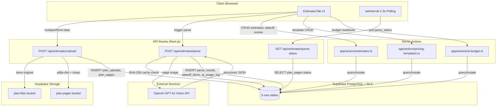

# AI-Assisted Plan Estimating - Technical Design

## References

- Requirements: `.claude/tasks/features/ai-plan-estimator/requirement.md`
- Codebase patterns: `app/api/project-files/upload/route.ts`, `app/actions/expenses.ts`

---

## DELIVERABLE 1: System Architecture

### Architecture Diagram



### Prose Explanation

The architecture splits operations into two categories based on their nature: **API Routes** handle file uploads and async AI parsing (which require multipart/form-data, long-running operations, and direct OpenAI API calls), while **Server Actions** handle all synchronous CRUD operations (estimates, takeoff items, pricing templates, budget management). This mirrors the existing GenHub split where `app/api/project-files/upload/route.ts` handles file uploads and `app/actions/expenses.ts` handles data operations.

The upload flow works as follows: the client sends a multipart/form-data POST to `/api/estimates/upload`. The API Route authenticates via `auth()` from `@/lib/auth`, creates an admin Supabase client via `createAdminClient()`, validates the file (50MB max, MIME type check), stores the original file in the `plan-files` bucket, then -- if the file is a PDF -- uses `pdfjs-dist` to render each page to a canvas and `sharp` to convert to PNG at ~300 DPI. Each page image is stored in the `plan-pages` bucket. Database records are created in `plan_uploads` and `plan_pages` tables. The response returns immediately with the plan_upload ID and initial status.

AI parsing is triggered separately via `POST /api/estimates/parse`. This route computes the SHA-256 hash of each page image, checks the `plan_parse_results` table for a cache hit, and only calls OpenAI GPT-4o if no cached result exists. The GPT-4o vision API receives the page image with a structured extraction prompt and returns JSON conforming to the schema defined in requirements. The raw response is stored in `plan_parse_results`, then a normalization step creates `takeoff_items` with standardized units, waste factors, and confidence flags. The client polls `GET /api/estimates/parse-status` every 2-3 seconds via `setInterval` to update the UI with per-page progress. All AI calls are logged to `ai_usage_log` for cost tracking and budget enforcement.

---

## DELIVERABLE 2: Database Schema

### Enum Types

```sql
-- New enum types for the estimating feature
CREATE TYPE public.plan_upload_status AS ENUM ('uploading', 'processing', 'ready', 'failed');
CREATE TYPE public.plan_page_parse_status AS ENUM ('pending', 'parsing', 'parsed', 'parse_failed');
CREATE TYPE public.estimate_status AS ENUM ('draft', 'reviewed', 'approved', 'superseded');
CREATE TYPE public.takeoff_category AS ENUM ('structural', 'architectural', 'mechanical', 'electrical', 'plumbing', 'painting', 'site', 'general');
CREATE TYPE public.extraction_method AS ENUM ('labeled', 'calculated', 'inferred', 'manual');
CREATE TYPE public.review_status AS ENUM ('pending', 'accepted', 'rejected', 'edited');
```

### Table 1: plan_uploads

```sql
CREATE TABLE public.plan_uploads (
  id uuid PRIMARY KEY DEFAULT gen_random_uuid(),
  company_id uuid NOT NULL REFERENCES public.companies(id) ON DELETE CASCADE,
  project_id uuid NOT NULL REFERENCES public.projects(id) ON DELETE CASCADE,
  phase_id uuid REFERENCES public.project_phases(id) ON DELETE SET NULL,
  filename text NOT NULL,
  original_filename text NOT NULL,
  file_url text NOT NULL,
  storage_path text NOT NULL,
  file_size bigint NOT NULL,
  file_type text NOT NULL,
  mime_type text NOT NULL,
  status public.plan_upload_status NOT NULL DEFAULT 'uploading',
  total_pages integer NOT NULL DEFAULT 0,
  uploaded_by uuid NOT NULL REFERENCES next_auth.users(id),
  created_at timestamptz NOT NULL DEFAULT now(),
  updated_at timestamptz NOT NULL DEFAULT now()
);

COMMENT ON TABLE public.plan_uploads IS 'Uploaded construction plan files for AI-assisted estimating';

CREATE INDEX idx_plan_uploads_company ON public.plan_uploads(company_id);
CREATE INDEX idx_plan_uploads_project ON public.plan_uploads(project_id);
CREATE INDEX idx_plan_uploads_status ON public.plan_uploads(status);
CREATE INDEX idx_plan_uploads_uploaded_by ON public.plan_uploads(uploaded_by);

ALTER TABLE public.plan_uploads ENABLE ROW LEVEL SECURITY;

CREATE POLICY "plan_uploads_select" ON public.plan_uploads
FOR SELECT USING (company_id = public.get_user_company_id(next_auth.uid()));

CREATE POLICY "plan_uploads_insert" ON public.plan_uploads
FOR INSERT WITH CHECK (company_id = public.get_user_company_id(next_auth.uid()));

CREATE POLICY "plan_uploads_update" ON public.plan_uploads
FOR UPDATE USING (company_id = public.get_user_company_id(next_auth.uid()));

CREATE POLICY "plan_uploads_delete" ON public.plan_uploads
FOR DELETE USING (
  company_id = public.get_user_company_id(next_auth.uid())
  AND (uploaded_by = next_auth.uid() OR public.is_user_admin(next_auth.uid()))
);

CREATE TRIGGER update_plan_uploads_updated_at
BEFORE UPDATE ON public.plan_uploads
FOR EACH ROW EXECUTE FUNCTION public.update_updated_at_column();
```

### Table 2: plan_pages

```sql
CREATE TABLE public.plan_pages (
  id uuid PRIMARY KEY DEFAULT gen_random_uuid(),
  company_id uuid NOT NULL REFERENCES public.companies(id) ON DELETE CASCADE,
  plan_upload_id uuid NOT NULL REFERENCES public.plan_uploads(id) ON DELETE CASCADE,
  page_number integer NOT NULL,
  image_url text NOT NULL,
  storage_path text NOT NULL,
  image_hash_sha256 text,
  width_px integer,
  height_px integer,
  file_size bigint,
  parse_status public.plan_page_parse_status NOT NULL DEFAULT 'pending',
  created_at timestamptz NOT NULL DEFAULT now()
);

COMMENT ON TABLE public.plan_pages IS 'Individual page images extracted from plan uploads';

CREATE INDEX idx_plan_pages_company ON public.plan_pages(company_id);
CREATE INDEX idx_plan_pages_upload ON public.plan_pages(plan_upload_id);
CREATE INDEX idx_plan_pages_hash ON public.plan_pages(image_hash_sha256) WHERE image_hash_sha256 IS NOT NULL;
CREATE INDEX idx_plan_pages_status ON public.plan_pages(parse_status);

ALTER TABLE public.plan_pages ENABLE ROW LEVEL SECURITY;

CREATE POLICY "plan_pages_select" ON public.plan_pages
FOR SELECT USING (company_id = public.get_user_company_id(next_auth.uid()));

CREATE POLICY "plan_pages_insert" ON public.plan_pages
FOR INSERT WITH CHECK (company_id = public.get_user_company_id(next_auth.uid()));

CREATE POLICY "plan_pages_update" ON public.plan_pages
FOR UPDATE USING (company_id = public.get_user_company_id(next_auth.uid()));
```

### Table 3: plan_parse_results

```sql
CREATE TABLE public.plan_parse_results (
  id uuid PRIMARY KEY DEFAULT gen_random_uuid(),
  company_id uuid NOT NULL REFERENCES public.companies(id) ON DELETE CASCADE,
  plan_page_id uuid NOT NULL REFERENCES public.plan_pages(id) ON DELETE CASCADE,
  raw_response jsonb NOT NULL,
  page_type text,
  model_used text NOT NULL DEFAULT 'gpt-4o',
  token_count_in integer NOT NULL DEFAULT 0,
  token_count_out integer NOT NULL DEFAULT 0,
  estimated_cost numeric(10,6) NOT NULL DEFAULT 0,
  parse_duration_ms integer,
  cached boolean NOT NULL DEFAULT false,
  created_at timestamptz NOT NULL DEFAULT now()
);

COMMENT ON TABLE public.plan_parse_results IS 'Raw AI parsing output per plan page (immutable after creation)';

CREATE INDEX idx_plan_parse_results_company ON public.plan_parse_results(company_id);
CREATE INDEX idx_plan_parse_results_page ON public.plan_parse_results(plan_page_id);

ALTER TABLE public.plan_parse_results ENABLE ROW LEVEL SECURITY;

CREATE POLICY "plan_parse_results_select" ON public.plan_parse_results
FOR SELECT USING (company_id = public.get_user_company_id(next_auth.uid()));

CREATE POLICY "plan_parse_results_insert" ON public.plan_parse_results
FOR INSERT WITH CHECK (company_id = public.get_user_company_id(next_auth.uid()));
```

### Table 4: takeoff_items

```sql
CREATE TABLE public.takeoff_items (
  id uuid PRIMARY KEY DEFAULT gen_random_uuid(),
  company_id uuid NOT NULL REFERENCES public.companies(id) ON DELETE CASCADE,
  plan_upload_id uuid NOT NULL REFERENCES public.plan_uploads(id) ON DELETE CASCADE,
  plan_page_id uuid REFERENCES public.plan_pages(id) ON DELETE SET NULL,
  ai_item_id text,
  category public.takeoff_category NOT NULL DEFAULT 'general',
  sub_type text NOT NULL,
  label text NOT NULL,
  trade public.trade_type NOT NULL DEFAULT 'general',
  dimensions jsonb,
  quantity numeric(12,4) NOT NULL DEFAULT 0,
  unit_of_measure text NOT NULL DEFAULT 'sqft',
  waste_factor_pct numeric(5,2) NOT NULL DEFAULT 0,
  adjusted_quantity numeric(12,4) NOT NULL DEFAULT 0,
  confidence numeric(3,2) NOT NULL DEFAULT 0,
  source_region jsonb,
  extraction_method public.extraction_method NOT NULL DEFAULT 'manual',
  needs_review boolean NOT NULL DEFAULT true,
  review_status public.review_status NOT NULL DEFAULT 'pending',
  reviewed_by uuid REFERENCES next_auth.users(id),
  reviewed_at timestamptz,
  edit_history jsonb DEFAULT '[]'::jsonb,
  notes text,
  created_at timestamptz NOT NULL DEFAULT now(),
  updated_at timestamptz NOT NULL DEFAULT now()
);

COMMENT ON TABLE public.takeoff_items IS 'Normalized user-editable takeoff line items from AI parsing';

CREATE INDEX idx_takeoff_items_company ON public.takeoff_items(company_id);
CREATE INDEX idx_takeoff_items_upload ON public.takeoff_items(plan_upload_id);
CREATE INDEX idx_takeoff_items_page ON public.takeoff_items(plan_page_id);
CREATE INDEX idx_takeoff_items_review ON public.takeoff_items(review_status);
CREATE INDEX idx_takeoff_items_trade ON public.takeoff_items(trade);

ALTER TABLE public.takeoff_items ENABLE ROW LEVEL SECURITY;

CREATE POLICY "takeoff_items_select" ON public.takeoff_items
FOR SELECT USING (company_id = public.get_user_company_id(next_auth.uid()));

CREATE POLICY "takeoff_items_insert" ON public.takeoff_items
FOR INSERT WITH CHECK (company_id = public.get_user_company_id(next_auth.uid()));

CREATE POLICY "takeoff_items_update" ON public.takeoff_items
FOR UPDATE USING (company_id = public.get_user_company_id(next_auth.uid()));

CREATE POLICY "takeoff_items_delete" ON public.takeoff_items
FOR DELETE USING (company_id = public.get_user_company_id(next_auth.uid()));

CREATE TRIGGER update_takeoff_items_updated_at
BEFORE UPDATE ON public.takeoff_items
FOR EACH ROW EXECUTE FUNCTION public.update_updated_at_column();
```

### Table 5: estimates

```sql
CREATE TABLE public.estimates (
  id uuid PRIMARY KEY DEFAULT gen_random_uuid(),
  company_id uuid NOT NULL REFERENCES public.companies(id) ON DELETE CASCADE,
  project_id uuid NOT NULL REFERENCES public.projects(id) ON DELETE CASCADE,
  phase_id uuid REFERENCES public.project_phases(id) ON DELETE SET NULL,
  plan_upload_id uuid REFERENCES public.plan_uploads(id) ON DELETE SET NULL,
  name text NOT NULL,
  status public.estimate_status NOT NULL DEFAULT 'draft',
  subtotal numeric(14,2) NOT NULL DEFAULT 0,
  overhead_pct numeric(5,2) NOT NULL DEFAULT 10.00,
  overhead_amount numeric(14,2) NOT NULL DEFAULT 0,
  markup_pct numeric(5,2) NOT NULL DEFAULT 15.00,
  markup_amount numeric(14,2) NOT NULL DEFAULT 0,
  grand_total numeric(14,2) NOT NULL DEFAULT 0,
  created_by uuid NOT NULL REFERENCES next_auth.users(id),
  approved_by uuid REFERENCES next_auth.users(id),
  approved_at timestamptz,
  superseded_by uuid REFERENCES public.estimates(id),
  version integer NOT NULL DEFAULT 1,
  created_at timestamptz NOT NULL DEFAULT now(),
  updated_at timestamptz NOT NULL DEFAULT now()
);

COMMENT ON TABLE public.estimates IS 'Estimate headers with totals, overhead, and markup';

CREATE INDEX idx_estimates_company ON public.estimates(company_id);
CREATE INDEX idx_estimates_project ON public.estimates(project_id);
CREATE INDEX idx_estimates_status ON public.estimates(status);
CREATE INDEX idx_estimates_plan ON public.estimates(plan_upload_id);

ALTER TABLE public.estimates ENABLE ROW LEVEL SECURITY;

CREATE POLICY "estimates_select" ON public.estimates
FOR SELECT USING (company_id = public.get_user_company_id(next_auth.uid()));

CREATE POLICY "estimates_insert" ON public.estimates
FOR INSERT WITH CHECK (company_id = public.get_user_company_id(next_auth.uid()));

CREATE POLICY "estimates_update" ON public.estimates
FOR UPDATE USING (company_id = public.get_user_company_id(next_auth.uid()));

CREATE TRIGGER update_estimates_updated_at
BEFORE UPDATE ON public.estimates
FOR EACH ROW EXECUTE FUNCTION public.update_updated_at_column();
```

### Table 6: estimate_line_items

```sql
CREATE TABLE public.estimate_line_items (
  id uuid PRIMARY KEY DEFAULT gen_random_uuid(),
  company_id uuid NOT NULL REFERENCES public.companies(id) ON DELETE CASCADE,
  estimate_id uuid NOT NULL REFERENCES public.estimates(id) ON DELETE CASCADE,
  takeoff_item_id uuid REFERENCES public.takeoff_items(id) ON DELETE SET NULL,
  description text NOT NULL,
  trade public.trade_type NOT NULL DEFAULT 'general',
  quantity numeric(12,4) NOT NULL DEFAULT 0,
  unit_of_measure text NOT NULL DEFAULT 'sqft',
  material_cost numeric(10,2) NOT NULL DEFAULT 0,
  labor_cost numeric(10,2) NOT NULL DEFAULT 0,
  equipment_cost numeric(10,2) NOT NULL DEFAULT 0,
  unit_cost numeric(10,2) NOT NULL DEFAULT 0,
  subtotal numeric(14,2) NOT NULL DEFAULT 0,
  material_id uuid REFERENCES public.materials(id) ON DELETE SET NULL,
  notes text,
  sort_order integer NOT NULL DEFAULT 0,
  created_at timestamptz NOT NULL DEFAULT now(),
  updated_at timestamptz NOT NULL DEFAULT now()
);

COMMENT ON TABLE public.estimate_line_items IS 'Costed line items within an estimate';

CREATE INDEX idx_estimate_line_items_company ON public.estimate_line_items(company_id);
CREATE INDEX idx_estimate_line_items_estimate ON public.estimate_line_items(estimate_id);
CREATE INDEX idx_estimate_line_items_trade ON public.estimate_line_items(trade);

ALTER TABLE public.estimate_line_items ENABLE ROW LEVEL SECURITY;

CREATE POLICY "estimate_line_items_select" ON public.estimate_line_items
FOR SELECT USING (company_id = public.get_user_company_id(next_auth.uid()));

CREATE POLICY "estimate_line_items_insert" ON public.estimate_line_items
FOR INSERT WITH CHECK (company_id = public.get_user_company_id(next_auth.uid()));

CREATE POLICY "estimate_line_items_update" ON public.estimate_line_items
FOR UPDATE USING (company_id = public.get_user_company_id(next_auth.uid()));

CREATE POLICY "estimate_line_items_delete" ON public.estimate_line_items
FOR DELETE USING (company_id = public.get_user_company_id(next_auth.uid()));

CREATE TRIGGER update_estimate_line_items_updated_at
BEFORE UPDATE ON public.estimate_line_items
FOR EACH ROW EXECUTE FUNCTION public.update_updated_at_column();
```

### Table 7: pricing_templates

```sql
CREATE TABLE public.pricing_templates (
  id uuid PRIMARY KEY DEFAULT gen_random_uuid(),
  company_id uuid NOT NULL REFERENCES public.companies(id) ON DELETE CASCADE,
  name text NOT NULL,
  description text,
  is_default boolean NOT NULL DEFAULT false,
  created_by uuid NOT NULL REFERENCES next_auth.users(id),
  created_at timestamptz NOT NULL DEFAULT now(),
  updated_at timestamptz NOT NULL DEFAULT now()
);

COMMENT ON TABLE public.pricing_templates IS 'Reusable named pricing presets for estimate costing';

CREATE INDEX idx_pricing_templates_company ON public.pricing_templates(company_id);

ALTER TABLE public.pricing_templates ENABLE ROW LEVEL SECURITY;

CREATE POLICY "pricing_templates_select" ON public.pricing_templates
FOR SELECT USING (company_id = public.get_user_company_id(next_auth.uid()));

CREATE POLICY "pricing_templates_insert" ON public.pricing_templates
FOR INSERT WITH CHECK (company_id = public.get_user_company_id(next_auth.uid()));

CREATE POLICY "pricing_templates_update" ON public.pricing_templates
FOR UPDATE USING (company_id = public.get_user_company_id(next_auth.uid()));

CREATE POLICY "pricing_templates_delete" ON public.pricing_templates
FOR DELETE USING (company_id = public.get_user_company_id(next_auth.uid()));

CREATE TRIGGER update_pricing_templates_updated_at
BEFORE UPDATE ON public.pricing_templates
FOR EACH ROW EXECUTE FUNCTION public.update_updated_at_column();
```

### Table 8: pricing_template_items

```sql
CREATE TABLE public.pricing_template_items (
  id uuid PRIMARY KEY DEFAULT gen_random_uuid(),
  company_id uuid NOT NULL REFERENCES public.companies(id) ON DELETE CASCADE,
  template_id uuid NOT NULL REFERENCES public.pricing_templates(id) ON DELETE CASCADE,
  trade public.trade_type NOT NULL DEFAULT 'general',
  category public.takeoff_category NOT NULL DEFAULT 'general',
  sub_type text NOT NULL DEFAULT 'room',
  description text NOT NULL,
  unit_of_measure text NOT NULL DEFAULT 'sqft',
  material_cost numeric(10,2) NOT NULL DEFAULT 0,
  labor_cost numeric(10,2) NOT NULL DEFAULT 0,
  equipment_cost numeric(10,2) NOT NULL DEFAULT 0,
  unit_cost numeric(10,2) NOT NULL DEFAULT 0,
  created_at timestamptz NOT NULL DEFAULT now(),
  updated_at timestamptz NOT NULL DEFAULT now()
);

COMMENT ON TABLE public.pricing_template_items IS 'Unit cost rates within a pricing template';

CREATE INDEX idx_pricing_template_items_company ON public.pricing_template_items(company_id);
CREATE INDEX idx_pricing_template_items_template ON public.pricing_template_items(template_id);
CREATE INDEX idx_pricing_template_items_trade ON public.pricing_template_items(trade);

ALTER TABLE public.pricing_template_items ENABLE ROW LEVEL SECURITY;

CREATE POLICY "pricing_template_items_select" ON public.pricing_template_items
FOR SELECT USING (company_id = public.get_user_company_id(next_auth.uid()));

CREATE POLICY "pricing_template_items_insert" ON public.pricing_template_items
FOR INSERT WITH CHECK (company_id = public.get_user_company_id(next_auth.uid()));

CREATE POLICY "pricing_template_items_update" ON public.pricing_template_items
FOR UPDATE USING (company_id = public.get_user_company_id(next_auth.uid()));

CREATE POLICY "pricing_template_items_delete" ON public.pricing_template_items
FOR DELETE USING (company_id = public.get_user_company_id(next_auth.uid()));

CREATE TRIGGER update_pricing_template_items_updated_at
BEFORE UPDATE ON public.pricing_template_items
FOR EACH ROW EXECUTE FUNCTION public.update_updated_at_column();
```

### Table 9: ai_usage_log

```sql
CREATE TABLE public.ai_usage_log (
  id uuid PRIMARY KEY DEFAULT gen_random_uuid(),
  company_id uuid NOT NULL REFERENCES public.companies(id) ON DELETE CASCADE,
  plan_page_id uuid REFERENCES public.plan_pages(id) ON DELETE SET NULL,
  model text NOT NULL DEFAULT 'gpt-4o',
  token_count_in integer NOT NULL DEFAULT 0,
  token_count_out integer NOT NULL DEFAULT 0,
  estimated_cost numeric(10,6) NOT NULL DEFAULT 0,
  cached boolean NOT NULL DEFAULT false,
  created_at timestamptz NOT NULL DEFAULT now()
);

COMMENT ON TABLE public.ai_usage_log IS 'Per-call AI cost tracking for budget enforcement';

CREATE INDEX idx_ai_usage_log_company ON public.ai_usage_log(company_id);
CREATE INDEX idx_ai_usage_log_company_month ON public.ai_usage_log(company_id, created_at);
CREATE INDEX idx_ai_usage_log_page ON public.ai_usage_log(plan_page_id);

ALTER TABLE public.ai_usage_log ENABLE ROW LEVEL SECURITY;

CREATE POLICY "ai_usage_log_select" ON public.ai_usage_log
FOR SELECT USING (company_id = public.get_user_company_id(next_auth.uid()));

CREATE POLICY "ai_usage_log_insert" ON public.ai_usage_log
FOR INSERT WITH CHECK (company_id = public.get_user_company_id(next_auth.uid()));
```

### Entity Relationship Summary

```
projects 1--* plan_uploads
project_phases 1--* plan_uploads (optional)
plan_uploads 1--* plan_pages
plan_pages 1--1 plan_parse_results
plan_uploads 1--* takeoff_items
plan_pages 1--* takeoff_items
plan_uploads 1--* estimates
estimates 1--* estimate_line_items
takeoff_items 1--1 estimate_line_items
materials 1--* estimate_line_items (optional)
pricing_templates 1--* pricing_template_items
plan_pages 1--* ai_usage_log
companies 1--* (all tables via company_id)
```

---

## DELIVERABLE 3: API Endpoints & Server Actions

### API Routes (File Upload and Async AI Operations)

| Type | Path | Method | Purpose | Auth | Input | Output |
|------|------|--------|---------|------|-------|--------|
| API Route | `/api/estimates/upload` | POST | Upload plan file, convert PDF pages | `auth()` from `@/lib/auth` + `createAdminClient()` | multipart/form-data: `file`, `projectId`, `phaseId?` | `{ success, planUpload: { id, status, totalPages } }` |
| API Route | `/api/estimates/parse` | POST | Trigger AI parsing for plan pages | `auth()` from `@/lib/auth` + `createAdminClient()` | `{ planUploadId, pageIds?: string[] }` | `{ success, parsing: { totalPages, queued } }` |
| API Route | `/api/estimates/parse-status` | GET | Poll parse progress per plan | `auth()` from `@/lib/auth` + `createAdminClient()` | query: `planUploadId` | `{ pages: [{ id, pageNumber, parseStatus }], allComplete }` |

**Auth pattern for API Routes** (matching `app/api/project-files/upload/route.ts`):
```typescript
import { auth } from "@/lib/auth";
import { createAdminClient } from "@/utils/supabase/server";
// auth() -> session check -> createAdminClient() -> role check -> operation
```

### Server Actions: `app/actions/estimates.ts`

| Type | Function | Purpose | Auth | Input | Output |
|------|----------|---------|------|-------|--------|
| Server Action | `getEstimates(projectId)` | List estimates for project | `getUserContext()` | `{ projectId: string }` | `{ success, data: Estimate[] }` |
| Server Action | `getEstimate(estimateId)` | Get single estimate with line items | `getUserContext()` | `{ estimateId: string }` | `{ success, data: EstimateWithLineItems }` |
| Server Action | `createEstimate(input)` | Create estimate from reviewed takeoff | `getUserContext()` | `CreateEstimateInput` (see below) | `{ success, data: Estimate }` |
| Server Action | `updateEstimate(input)` | Update estimate name, overhead, markup | `getUserContext()` | `{ estimateId, name?, overheadPct?, markupPct? }` | `{ success, data: Estimate }` |
| Server Action | `approveEstimate(estimateId)` | Set status to approved (admin/PM only) | `getUserContext()` | `{ estimateId: string }` | `{ success }` |
| Server Action | `getPlanUploads(projectId)` | List plan uploads for project | `getUserContext()` | `{ projectId: string }` | `{ success, data: PlanUpload[] }` |
| Server Action | `getPlanPages(planUploadId)` | Get pages with parse status | `getUserContext()` | `{ planUploadId: string }` | `{ success, data: PlanPage[] }` |
| Server Action | `getParseResults(pageId)` | Get raw AI output for page | `getUserContext()` | `{ pageId: string }` | `{ success, data: ParseResult }` |
| Server Action | `getTakeoffItems(planUploadId)` | List takeoff items for plan | `getUserContext()` | `{ planUploadId: string, filters?: TakeoffFilters }` | `{ success, data: TakeoffItem[] }` |
| Server Action | `updateTakeoffItem(input)` | Edit takeoff item values | `getUserContext()` | `UpdateTakeoffItemInput` | `{ success, data: TakeoffItem }` |
| Server Action | `reviewTakeoffItem(input)` | Accept/reject/edit a takeoff item | `getUserContext()` | `{ itemId, reviewStatus, editedValues? }` | `{ success, data: TakeoffItem }` |
| Server Action | `addManualTakeoffItem(input)` | Create manual takeoff entry | `getUserContext()` | `ManualTakeoffInput` | `{ success, data: TakeoffItem }` |
| Server Action | `deleteTakeoffItem(itemId)` | Delete a takeoff item | `getUserContext()` | `{ itemId: string }` | `{ success }` |
| Server Action | `createMaterialsFromEstimate(estimateId)` | Bulk-create materials records | `getUserContext()` | `{ estimateId: string }` | `{ success, data: { created: number } }` |
| Server Action | `createExpenseFromEstimate(estimateId)` | Create expense + line items | `getUserContext()` | `{ estimateId: string }` | `{ success, data: { expenseId: string } }` |

**Auth pattern for Server Actions** (matching `app/actions/expenses.ts`):
```typescript
"use server";
import { z } from "zod";
import { getUserContext } from "@/lib/auth-context";
// getUserContext() -> "error" check -> validate with Zod -> query/mutate -> return { success, data/error }
```

### Server Actions: `app/actions/pricing-templates.ts`

| Type | Function | Purpose | Auth | Input | Output |
|------|----------|---------|------|-------|--------|
| Server Action | `getPricingTemplates()` | List company templates | `getUserContext()` | none | `{ success, data: PricingTemplate[] }` |
| Server Action | `getPricingTemplate(id)` | Get template with items | `getUserContext()` | `{ templateId: string }` | `{ success, data: TemplateWithItems }` |
| Server Action | `createPricingTemplate(input)` | Create new template | `getUserContext()` | `{ name, description?, items[] }` | `{ success, data: PricingTemplate }` |
| Server Action | `updatePricingTemplate(input)` | Update template and items | `getUserContext()` | `{ templateId, name?, items? }` | `{ success, data: PricingTemplate }` |
| Server Action | `deletePricingTemplate(id)` | Delete template | `getUserContext()` | `{ templateId: string }` | `{ success }` |
| Server Action | `applyPricingTemplate(input)` | Apply template costs to estimate | `getUserContext()` | `{ templateId, estimateId }` | `{ success, data: { matched: number } }` |

### Server Actions: `app/actions/ai-budget.ts`

| Type | Function | Purpose | Auth | Input | Output |
|------|----------|---------|------|-------|--------|
| Server Action | `getAiUsage()` | Get current month usage stats | `getUserContext()` | none | `{ success, data: AiUsageStats }` |
| Server Action | `getAiBudget()` | Get company budget settings | `getUserContext()` | none | `{ success, data: { monthlyBudget, currentSpend, pagesUsed } }` |
| Server Action | `updateAiBudget(input)` | Update budget limit (admin only) | `getUserContext()` | `{ monthlyBudget: number }` | `{ success }` |

### Key Zod Schemas

```typescript
// In app/actions/estimates.ts
const createEstimateSchema = z.object({
  projectId: z.string().uuid(),
  phaseId: z.string().uuid().optional().nullable(),
  planUploadId: z.string().uuid(),
  name: z.string().min(1, "Estimate name is required").max(200),
  overheadPct: z.number().min(0).max(100).default(10),
  markupPct: z.number().min(0).max(100).default(15),
  lineItems: z.array(z.object({
    takeoffItemId: z.string().uuid().optional().nullable(),
    description: z.string().min(1),
    trade: z.enum([/* TradeType values */]),
    quantity: z.number().min(0),
    unitOfMeasure: z.string().min(1),
    materialCost: z.number().min(0).default(0),
    laborCost: z.number().min(0).default(0),
    equipmentCost: z.number().min(0).default(0),
    materialId: z.string().uuid().optional().nullable(),
    notes: z.string().optional().nullable(),
    sortOrder: z.number().int().default(0),
  })),
});

const reviewTakeoffItemSchema = z.object({
  itemId: z.string().uuid(),
  reviewStatus: z.enum(["accepted", "rejected", "edited"]),
  editedValues: z.object({
    label: z.string().optional(),
    quantity: z.number().optional(),
    unitOfMeasure: z.string().optional(),
    wasteFactor: z.number().min(0).max(100).optional(),
    trade: z.enum([/* TradeType values */]).optional(),
    notes: z.string().optional().nullable(),
  }).optional(),
});

const manualTakeoffItemSchema = z.object({
  planUploadId: z.string().uuid(),
  planPageId: z.string().uuid().optional().nullable(),
  category: z.enum(["structural", "architectural", "mechanical", "electrical", "plumbing", "painting", "site", "general"]),
  subType: z.string().min(1),
  label: z.string().min(1),
  trade: z.enum([/* TradeType values */]),
  quantity: z.number().min(0),
  unitOfMeasure: z.string().min(1),
  wasteFactor: z.number().min(0).max(100).default(0),
  notes: z.string().optional().nullable(),
});
```

---

## DELIVERABLE 4: AI Parsing Pipeline

### Step-by-Step Flow

**Step 1: Upload triggers PDF-to-image conversion**

When the `/api/estimates/upload` route receives a PDF file, the API Route:
1. Stores the original PDF in `plan-files` bucket
2. Inserts a `plan_uploads` record with status `processing`
3. Loads the PDF using `pdfjs-dist` via `getDocument()`
4. Iterates each page, renders to canvas at ~300 DPI (scale factor = 300/72 = 4.17)
5. Converts canvas to PNG buffer via `sharp`
6. Uploads PNG to `plan-pages` bucket
7. Inserts a `plan_pages` record per page with status `pending`
8. Updates `plan_uploads.status` to `ready` and sets `total_pages`

**Step 2: Page image optimization for API**

Before sending to GPT-4o, the parse route:
1. Downloads the page image from `plan-pages` bucket
2. Uses `sharp` to resize if width exceeds 2048px (maintaining aspect ratio)
3. Converts to JPEG at quality 85 for the API call only (reduces token usage)
4. The stored PNG in `plan-pages` remains the high-quality original

**Step 3: SHA-256 hash computation and cache check**

```
1. Compute SHA-256 hash of the original PNG page image bytes
2. UPDATE plan_pages SET image_hash_sha256 = hash WHERE id = pageId
3. SELECT id FROM plan_parse_results
   INNER JOIN plan_pages pp ON pp.id = plan_page_id
   WHERE pp.image_hash_sha256 = hash
   LIMIT 1
4. If result found -> return cached parse result, skip OpenAI call
5. Log to ai_usage_log with cached = true
```

**Step 4: GPT-4o Vision API call**

If cache miss, send to OpenAI with the following prompt:

```
SYSTEM PROMPT:
You are a construction plan quantity takeoff specialist. You analyze construction
drawings and extract ONLY data that is explicitly visible and labeled on the plan.

ABSOLUTE RULES:
- NEVER fabricate or estimate dimensions that are not numerically labeled on the drawing
- NEVER assume room purposes from ambiguous labels
- ONLY extract items you can see with explicit labels, dimensions, or callouts
- If a dimension is partially obscured or unclear, set confidence below 0.5
- If no construction data is present (cover sheet, legend, etc.), return empty items array

For each extractable item, provide:
- category: one of "structural", "architectural", "mechanical", "electrical", "plumbing", "painting", "site", "general"
  - structural: foundations, footings, beams, columns, slabs, rebar, structural steel
  - architectural: rooms, walls, openings, doors, windows, finishes, millwork
  - mechanical: HVAC, ductwork, diffusers, units, piping, equipment
  - electrical: panels, conduits, receptacles, switches, lighting, wiring
  - plumbing: pipes, drains, fixtures (sinks, toilets), water heaters, valves
  - painting: interior/exterior paint, primer, coatings, stains, wall coverings, surface prep
  - site: excavation, grading, utilities, paving, landscaping
  - general: notes, dimensions, legends, or items that don't fit above categories
- sub_type: specific item type as identified on the plan (e.g. "footing", "ductwork", "receptacle", "room", "wall", "door"). Use the most descriptive term visible on the drawing.
- label: the text label as written on the plan
- dimensions: { length_ft, width_ft, height_ft, area_sqft, linear_ft } - ONLY
  include values explicitly shown or directly calculable from labeled dimensions.
  Use null for any dimension not visible on the plan.
- confidence: 0.0 to 1.0 based on label clarity and dimension legibility
  - 0.9-1.0: Clearly printed CAD text with explicit dimensions
  - 0.7-0.89: Readable but slightly ambiguous
  - 0.5-0.69: Partially legible, needs human review
  - Below 0.5: Barely readable, likely needs correction
- source_region: { x, y, width, height } as percentage (0.0-1.0) of page dimensions
  marking where this item appears on the plan
- extraction_method:
  - "labeled": dimension text explicitly printed on plan
  - "calculated": derived from other labeled dimensions (e.g., area from length x width)
  - "inferred": estimated from scale or relative positioning (lower confidence)
- notes: any relevant context from the drawing

Respond with ONLY valid JSON matching this schema:
{
  "page_number": <integer>,
  "page_type": "floor_plan" | "elevation" | "section" | "detail" | "schedule" | "cover" | "legend" | "unknown",
  "scale": { "ratio": "<string>", "pixels_per_foot": <number> } | null,
  "items": [ { <item objects as described above> } ],
  "raw_notes": ["<any general notes or text blocks found on the page>"],
  "warnings": ["<any issues with the drawing that affect extraction accuracy>"]
}

USER PROMPT:
Analyze this construction plan page. Extract all identifiable construction items --
rooms, dimensions, wall segments, openings, fixtures, equipment, structural elements,
MEP components, site features, and construction notes that are explicitly visible
and labeled. Classify each item by its broad category and specific sub_type.
Return structured JSON only.
```

**Step 5: Parse and validate the JSON response**

```typescript
// Validate response structure with Zod
const parseResponseSchema = z.object({
  page_number: z.number().int(),
  page_type: z.enum(["floor_plan", "elevation", "section", "detail", "schedule", "cover", "legend", "unknown"]),
  scale: z.object({
    ratio: z.string(),
    pixels_per_foot: z.number(),
  }).nullable(),
  items: z.array(z.object({
    id: z.string(),
    category: z.enum(["structural", "architectural", "mechanical", "electrical", "plumbing", "painting", "site", "general"]),
    sub_type: z.string(),
    label: z.string(),
    dimensions: z.object({
      length_ft: z.number().nullable(),
      width_ft: z.number().nullable(),
      height_ft: z.number().nullable(),
      area_sqft: z.number().nullable(),
      linear_ft: z.number().nullable(),
    }),
    confidence: z.number().min(0).max(1),
    source_region: z.object({
      x: z.number(), y: z.number(),
      width: z.number(), height: z.number(),
    }),
    extraction_method: z.enum(["labeled", "calculated", "inferred"]),
    needs_review: z.boolean().optional(),
    notes: z.string().optional(),
  })),
  raw_notes: z.array(z.string()),
  warnings: z.array(z.string()),
});
```

**Step 6: Store raw result in plan_parse_results**

Insert raw JSON into `plan_parse_results.raw_response` as JSONB. Store `page_type`, `model_used`, `token_count_in`, `token_count_out`, `estimated_cost`, `parse_duration_ms`. This record is immutable -- never updated after creation.

**Step 7: Normalization into takeoff_items**

For each item in the parse result:
1. Use AI-extracted `category` (maps to `takeoff_category` enum) and `sub_type` (free text, e.g. "ductwork", "footing", "receptacle") directly
2. Map closest trade from label context to `trade_type` enum
3. Normalize units: areas to `sqft`, lengths to `lf`
4. Look up waste factor by trade from defaults (Drywall +10%, Flooring +15%, etc.)
5. Compute `adjusted_quantity = quantity * (1 + waste_factor_pct / 100)`
6. Set `needs_review = true` if `confidence < 0.7`
7. Set `review_status = 'pending'`
8. Store `ai_item_id` linking back to the raw parse result item ID
9. INSERT into `takeoff_items`

**Step 8: Log usage to ai_usage_log**

```sql
INSERT INTO ai_usage_log (company_id, plan_page_id, model, token_count_in, token_count_out, estimated_cost, cached)
VALUES ($companyId, $pageId, 'gpt-4o', $tokensIn, $tokensOut, $cost, false);
```

Cost estimation formula: `(token_count_in * 0.0025 / 1000) + (token_count_out * 0.01 / 1000)` based on GPT-4o pricing.

---

## DELIVERABLE 5: Component Breakdown

### Component Tree

```
components/estimates/
  EstimatesTab.tsx              - Main tab rendered in ProjectDetailContent (server data fetch wrapper)
  EstimatesTabContent.tsx       - 'use client' - manages sub-views (uploads, review, costing, summary)
  PlanUploadPanel.tsx           - 'use client' - drag-drop upload UI with file picker
  PlanUploadProgress.tsx        - 'use client' - upload/processing progress per page
  PlanViewer.tsx                - 'use client' - pan/zoom plan image viewer with region highlights
  TakeoffReviewScreen.tsx       - 'use client' - review layout (stacked mobile, side-by-side desktop)
  TakeoffItemList.tsx           - 'use client' - scrollable takeoff item list with filter/sort
  TakeoffItemRow.tsx            - 'use client' - individual item with confidence badge and actions
  TakeoffItemEditModal.tsx      - 'use client' - edit item via ResponsiveModal
  AddManualItemModal.tsx        - 'use client' - add manual takeoff item via ResponsiveModal
  CostEditor.tsx                - 'use client' - apply costs to line items, template selector
  CostLineItemRow.tsx           - 'use client' - individual cost line item with material/labor/equipment
  EstimateSummary.tsx           - 'use client' - summary with totals grouped by trade
  PricingTemplateModal.tsx      - 'use client' - manage/select templates via ResponsiveModal
  SaveTemplateModal.tsx         - 'use client' - save current costs as template via ResponsiveModal
  AiBudgetBanner.tsx            - 'use client' - budget warning/exceeded banner
  EstimateStatusBadge.tsx       - server component - draft/reviewed/approved/superseded badge
  ConfidenceBadge.tsx           - server component - green/yellow/red confidence indicator
  EstimateHistoryList.tsx       - 'use client' - list of estimate versions with status
  ParseProgressOverlay.tsx      - 'use client' - polling overlay during AI parsing
  EmptyEstimatesState.tsx       - server component - empty state for no estimates
  EstimatesSkeleton.tsx         - server component - loading skeleton for estimates tab
```

### Component Hierarchy (Runtime)

```
ProjectDetailContent (existing, 'use client')
  activeTab === "estimates"
    EstimatesTab (server wrapper - fetches plan_uploads + estimates for project)
      EstimatesTabContent ('use client')
        AiBudgetBanner
        [Sub-view: Upload]
          PlanUploadPanel
            PlanUploadProgress (per file)
          ParseProgressOverlay (during AI parsing, polls /api/estimates/parse-status)
        [Sub-view: Review]
          TakeoffReviewScreen
            PlanViewer (left/top)
            TakeoffItemList (right/bottom)
              TakeoffItemRow (repeated)
                ConfidenceBadge
            TakeoffItemEditModal (on edit)
            AddManualItemModal (on add)
        [Sub-view: Costing]
          CostEditor
            CostLineItemRow (repeated)
            PricingTemplateModal (on apply template)
            SaveTemplateModal (on save template)
        [Sub-view: Summary]
          EstimateSummary
          EstimateStatusBadge
          EstimateHistoryList
        EmptyEstimatesState (when no uploads)
        EstimatesSkeleton (loading)
```

### Key Component Specifications

**EstimatesTab (Server Component)**
- File: `components/estimates/EstimatesTab.tsx`
- No `'use client'` directive
- Receives `projectId`, `userRole` as props
- Calls Server Actions: `getPlanUploads(projectId)`, `getEstimates(projectId)`, `getAiUsage()`
- Passes data down to `EstimatesTabContent`

**PlanUploadPanel**
- File: `components/estimates/PlanUploadPanel.tsx`
- `'use client'`
- Drag-drop zone with `onDragOver`/`onDrop` handlers
- File input with `accept=".pdf,.jpg,.jpeg,.png"`
- Client-side validation: 50MB max, MIME type check
- Calls `fetch('/api/estimates/upload', { method: 'POST', body: formData })`
- Shows upload progress via `XMLHttpRequest` with `onprogress`
- 44px touch targets on file picker button

**PlanViewer**
- File: `components/estimates/PlanViewer.tsx`
- `'use client'`
- CSS `transform: scale() translate()` for zoom/pan (GPU-accelerated)
- Touch events: `onTouchStart/Move/End` for pinch-to-zoom and pan
- Mouse events: wheel for zoom, drag for pan
- Renders highlighted rectangles for `source_region` overlay (absolute positioned divs)
- Props: `imageUrl`, `regions: SourceRegion[]`, `activeRegionId`, `onRegionClick`
- Page navigation with swipe or prev/next buttons

**TakeoffReviewScreen**
- File: `components/estimates/TakeoffReviewScreen.tsx`
- `'use client'`
- Responsive layout: `flex flex-col md:flex-row`
- Mobile (< 768px): plan viewer stacked above item list
- Desktop (>= 768px): plan viewer left (60% width), item list right (40% width)
- Review progress bar: `{reviewed} of {total} items reviewed`
- "Proceed to Estimate" button: disabled until all items reviewed

**TakeoffItemRow**
- File: `components/estimates/TakeoffItemRow.tsx`
- `'use client'`
- Displays: label, type icon (Lucide), quantity + unit, trade badge, confidence badge
- Three action buttons (44px min touch targets): Accept (check), Reject (x), Edit (pencil)
- On tap: highlights corresponding source_region in PlanViewer
- Visual states: pending (neutral), accepted (green border), rejected (red strikethrough), edited (blue border)

**TakeoffItemEditModal**
- File: `components/estimates/TakeoffItemEditModal.tsx`
- `'use client'`
- Uses `ResponsiveModal` wrapper (NEVER raw Dialog)
- Form fields: label, quantity, unit_of_measure, waste_factor, trade, notes
- Shows original AI value alongside editable field
- On save: calls `reviewTakeoffItem({ itemId, reviewStatus: 'edited', editedValues })`

**CostEditor**
- File: `components/estimates/CostEditor.tsx`
- `'use client'`
- List of estimate line items with material_cost, labor_cost, equipment_cost inputs
- Overhead % and markup % inputs at bottom with live recalculation
- "Apply Template" button opens PricingTemplateModal
- "Save as Template" button opens SaveTemplateModal
- Formula display per row: `"125 sqft x $3.50/sqft = $437.50"`
- Grand total computed client-side for instant feedback

**ConfidenceBadge (Server Component)**
- File: `components/estimates/ConfidenceBadge.tsx`
- No `'use client'`
- Props: `confidence: number`
- Green badge (`bg-green-100 text-green-800`): confidence >= 0.8
- Yellow badge (`bg-yellow-100 text-yellow-800`): confidence 0.5-0.79
- Red badge (`bg-red-100 text-red-800`): confidence < 0.5

### Integration with ProjectDetailContent

The existing `ProjectDetailContent.tsx` tab union type must be extended:

```typescript
// Current:
const [activeTab, setActiveTab] = useState<
  "overview" | "team" | "tasks" | "files" | "settings"
>("overview");

// After:
const [activeTab, setActiveTab] = useState<
  "overview" | "team" | "tasks" | "files" | "estimates" | "settings"
>("overview");
```

A new tab button with the `Calculator` Lucide icon is added to the tab bar, and the content area renders `<EstimatesTab>` when `activeTab === "estimates"`.

---

## DELIVERABLE 6: User Flow

### Flow 1: Navigate to Estimates Tab

1. **Screen**: Project Detail page (`/app/projects/[id]`)
2. **Action**: User taps "Estimates" tab in the tab bar (Calculator icon)
3. **Loading state**: `EstimatesSkeleton` renders (placeholder cards with pulse animation)
4. **Empty state**: If no plan uploads exist, `EmptyEstimatesState` renders with:
   - Illustration of a blueprint
   - Text: "No estimates yet. Upload a construction plan to get started."
   - "Upload Plan" button (visible only for admin/project_manager roles)
5. **Populated state**: List of existing plan uploads with status badges and linked estimates

### Flow 2: Upload Plan

1. **Screen**: Estimates tab, upload sub-view
2. **Action**: User taps "Upload Plan" or drags file onto drop zone
3. **Client validation**: File size check (< 50MB), MIME type check (PDF/JPG/PNG)
4. **Error state (client)**: If validation fails, red toast: "File exceeds 50MB limit" or "Only PDF, JPG, and PNG files are accepted"
5. **Upload progress**: Progress bar showing percentage (via XMLHttpRequest onprogress)
6. **Processing state**: After upload completes, if PDF:
   - Plan status badge shows "Processing..."
   - `PlanUploadProgress` shows per-page conversion: "Converting page 3 of 10..."
   - Each page row appears with a spinner as it converts
7. **Ready state**: All pages converted, plan status changes to "Ready"
   - "Parse with AI" button becomes enabled
   - Each page shows a thumbnail preview
8. **Error state (server)**: If PDF conversion fails:
   - Plan status shows "Failed" with red badge
   - Error message: "This PDF could not be processed. Please check the file and try again."
   - "Retry" button available
9. **Role gate**: If user is foreman or field_worker, the upload button is hidden entirely

### Flow 3: AI Parsing

1. **Screen**: Estimates tab, plan detail view with pages listed
2. **Action**: User taps "Parse with AI" (parses all pending pages) or per-page "Parse" button
3. **Budget check**: If monthly budget exceeded, show banner: "Monthly AI budget exceeded. Manual takeoff only until {next month}." Parse buttons disabled.
4. **Budget warning**: If at 80%+, show yellow banner: "AI budget is at 85%. $7.50 remaining this month."
5. **Parsing state**: `ParseProgressOverlay` appears:
   - Per-page status: spinner + "Parsing page 1..." / checkmark + "Page 1 complete" / X + "Page 3 failed"
   - Polling via `setInterval(2000)` calling `GET /api/estimates/parse-status?planUploadId=xxx`
   - Total progress bar: "3 of 10 pages parsed"
6. **Completion**: All pages reach `parsed` or `parse_failed` status
   - Overlay dismisses
   - Success toast: "AI parsing complete. 47 items extracted from 10 pages."
   - "Review Takeoff" button appears
7. **Partial failure**: Some pages failed
   - Warning: "2 pages could not be parsed. You can add items manually for those pages."
   - User can still proceed to review

### Flow 4: Takeoff Review

1. **Screen**: Review sub-view with split layout
2. **Desktop layout**: Plan viewer (60% left) + takeoff item list (40% right)
3. **Mobile layout**: Plan viewer (top half) + takeoff item list (bottom half, scrollable)
4. **Item list**: Grouped by page, sorted by page_number then position
   - Each item shows: label, type icon, quantity + unit, confidence badge, review status
   - Items with `needs_review = true` shown with yellow highlight
5. **Tap item**: Source region highlighted on plan viewer with colored overlay rectangle
6. **Accept item**: Tap green checkmark (44px target) - item border turns green, status = accepted
7. **Reject item**: Tap red X (44px target) - item gets strikethrough, status = rejected
8. **Edit item**: Tap pencil icon (44px target) - `TakeoffItemEditModal` opens via `ResponsiveModal`
   - Shows original AI value next to editable field
   - Save records edit_history and sets status = edited
9. **Add manual item**: Tap "+" FAB button - `AddManualItemModal` opens
   - User fills: label, type, trade, quantity, unit, notes
   - Sets extraction_method = "manual", confidence = 1.0
10. **Progress indicator**: Top bar shows "23 of 47 items reviewed"
11. **Gate**: "Proceed to Estimate" button disabled until all items are accepted/rejected/edited
    - Disabled state shows: "Review all items to continue"
12. **Empty page**: If a page had no extractable items (cover, legend), shows "No items on this page" with option to add manual items

### Flow 5: Cost Application

1. **Screen**: Costing sub-view
2. **Initial state**: All accepted/edited takeoff items listed as estimate line items
   - Each row: description, quantity, unit, material_cost input, labor_cost input, equipment_cost input, unit_cost (computed), subtotal (computed)
   - Material suggestion: if matching material exists, blue "Link: Concrete Mix @ $4.50/sqft" chip
3. **Apply template**: User taps "Apply Template" button
   - `PricingTemplateModal` opens listing saved templates
   - User selects template (e.g., "Residential Standard 2026")
   - Matching items auto-populated with costs (matched by trade + item_type)
   - Toast: "Applied 34 of 47 line item costs from template"
4. **Manual cost entry**: User taps any cost field (44px targets) and enters value
5. **Formula display**: Below each row: "125 sqft x $3.50/sqft = $437.50"
6. **Summary section**: At bottom:
   - Subtotal: $24,500.00
   - Overhead (10%): $2,450.00
   - Markup (15%): $4,042.50
   - Grand Total: $30,992.50
7. **Adjust overhead/markup**: Editable percentage inputs, totals recalculate within 100ms
8. **Save template**: User taps "Save as Template", enters name, saves current costs

### Flow 6: Save Estimate

1. **Action**: User taps "Save Estimate" button
2. **Name prompt**: If first save, prompt for estimate name (defaults to plan filename + date)
3. **Save**: Calls `createEstimate()` Server Action
4. **Success**: Toast "Estimate saved as draft", redirects to summary view
5. **Status**: Estimate created with status = "draft"

### Flow 7: View Saved Estimate

1. **Screen**: Estimate summary sub-view
2. **Header**: Estimate name, status badge (draft/reviewed/approved/superseded), created date, created by
3. **Source link**: "From: Floor_Plan_Rev3.pdf" - tappable, links back to review screen
4. **Trade breakdown**: Table grouped by trade with subtotals per trade
5. **Totals**: Subtotal, overhead, markup, grand total
6. **Actions** (admin/PM only):
   - "Edit Costs" - returns to cost editor
   - "Approve" - changes status to approved (with confirmation dialog)
   - "Create Materials" - bulk creates material records, toast: "Created 34 material records"
   - "Create Expense" - creates expense with line items, toast: "Expense created: $30,992.50"
7. **History**: Below summary, list of all versions with timestamp and status
8. **Read-only**: Foreman/field_worker see summary but no edit/approve actions

---

## DELIVERABLE 7: Cost Control & Caching

### Per-Page AI Cost Estimate

| Component | Tokens | Cost per 1K Tokens | Estimated Cost |
|-----------|--------|-------------------|----------------|
| Image input (avg plan page) | ~850 | $0.0025 | $0.002125 |
| System + user prompt text | ~600 | $0.0025 | $0.001500 |
| Output tokens (JSON response) | ~800 | $0.0100 | $0.008000 |
| **Total per page** | **~2,250** | | **~$0.012** |

Rounding up for variance: **~$0.01-0.015 per page**.

A 10-page plan set costs approximately $0.10-0.15 per parse.

### Monthly Budget Enforcement

**Where checked**: Server-side in the `POST /api/estimates/parse` API Route, BEFORE any OpenAI API call is made.

**How it works**:

```
1. Query current month spend:
   SELECT COALESCE(SUM(estimated_cost), 0) as monthly_spend
   FROM ai_usage_log
   WHERE company_id = $companyId
   AND created_at >= date_trunc('month', now())
   AND created_at < date_trunc('month', now()) + interval '1 month'

2. Query budget (from companies table or company_settings):
   Default: $50.00 per month
   Stored in: companies.ai_monthly_budget (new column, numeric(10,2), default 50.00)

3. Decision logic:
   IF monthly_spend >= ai_monthly_budget:
     Return 402 with body: {
       error: "Monthly AI budget exceeded",
       message: "Monthly AI budget exceeded. Manual takeoff only until {nextMonth}.",
       currentSpend: monthly_spend,
       budget: ai_monthly_budget
     }
   ELIF monthly_spend >= ai_monthly_budget * 0.8:
     Proceed with parse, but include warning in response:
     { warning: "AI budget is at {pct}%. ${remaining} remaining this month." }
   ELSE:
     Proceed normally
```

**Budget reset**: No cron job needed. The query uses `date_trunc('month', now())` to dynamically compute the current month's spend window. When a new month begins, the SUM query naturally returns 0 for the new period.

### Cache Strategy

**Cache key**: SHA-256 hash of the raw page image bytes (before any resizing for API).

**Cache lookup flow**:
```
1. Compute hash of page image
2. Store hash on plan_pages.image_hash_sha256
3. Check: SELECT id, raw_response FROM plan_parse_results ppr
          JOIN plan_pages pp ON pp.id = ppr.plan_page_id
          WHERE pp.image_hash_sha256 = $hash
          LIMIT 1
4. If hit: clone raw_response into new plan_parse_results row (with cached = true)
           Run normalization to create takeoff_items
           Log to ai_usage_log with cached = true, estimated_cost = 0
5. If miss: proceed with OpenAI API call
```

**Cache invalidation**: Cache entries never expire. The same image (identical bytes) always produces the same extraction. Invalidation only occurs on explicit user action: "Re-parse" button forces a new API call regardless of cache (deletes existing parse result for that page first).

### Storage Projections

| Item | Average Size | 10-Page Plan | 50-Page Plan |
|------|-------------|-------------|-------------|
| Original PDF | 5-20 MB | 5-20 MB | 25-100 MB |
| Page PNG (300 DPI) | 2-5 MB | 20-50 MB | 100-250 MB |
| Total per plan set | | 25-70 MB | 125-350 MB |
| 100 plan sets | | 2.5-7 GB | 12.5-35 GB |

Both `plan-files` and `plan-pages` buckets use Supabase Storage (same infrastructure as existing `project-files` bucket). Storage costs are governed by the Supabase plan tier.

### Budget Column Addition

```sql
-- Add budget column to existing companies table
ALTER TABLE public.companies
ADD COLUMN ai_monthly_budget numeric(10,2) NOT NULL DEFAULT 50.00;

COMMENT ON COLUMN public.companies.ai_monthly_budget IS 'Monthly AI parsing budget in USD, default $50';
```

---

## DELIVERABLE 8: Risks & Mitigations

| Risk | Likelihood | Impact | Mitigation |
|------|-----------|--------|------------|
| **AI accuracy variance across plan quality tiers** - Hand-drawn plans, low-res scans, and faded blueprints produce significantly lower confidence than CAD-generated plans | High | Medium | Confidence scoring flags low-quality extractions. Mandatory human review gate ensures no unverified data enters estimates. UI clearly communicates confidence via color-coded badges. Documentation sets expectations: "AI works best on CAD-generated plans with labeled dimensions." |
| **Cost overrun from large plan sets** - A 100-page commercial plan set could cost $1-1.50 in a single parse operation, quickly consuming budget | Medium | High | Monthly budget with hard stop at 100%. Per-page cost displayed before parsing. "Parse selected pages" option (not forced all-at-once). Budget warning at 80% threshold. Admin-configurable budget limit. |
| **User trust and contractor adoption** - Contractors may distrust AI-generated quantities and refuse to use the feature | Medium | High | AI positioned as "accelerator, not decision-maker." Mandatory review gate ensures human approval of every number. Full edit history and provenance tracking. Transparent formulas showing exactly how numbers were derived. Original plan image always visible alongside extracted data. |
| **Mobile performance with large images** - Plan images at 300 DPI can be 3000x4000px, causing scroll jank and memory pressure on mobile devices | Medium | Medium | CSS `transform` for GPU-accelerated pan/zoom instead of DOM manipulation. Lazy-load page images (only load visible page). Consider generating lower-res thumbnails for list view. `will-change: transform` hint for browser optimization. Test on iPhone SE (smallest target device). |
| **OpenAI rate limits or outages** - GPT-4o vision API may throttle requests or experience downtime | Low | High | Retry logic with 1 automatic retry per page. Graceful degradation: manual takeoff always available. Parse status clearly shows which pages failed. Queue-based parsing (sequential, not parallel) to stay within rate limits. No business logic depends on AI being available. |
| **Storage cost growth** - High-resolution plan images accumulate significant storage over time | Low | Medium | Monitor storage usage via Supabase dashboard. Future: implement retention policy for superseded plan uploads (archive after 90 days). PNG compression via sharp (lossless, but optimized). Consider WebP for stored images in v2. |
| **pdfjs-dist memory usage for large PDFs** - Server-side PDF rendering loads entire document into memory; a 50MB PDF could consume 200-500MB RAM during conversion | Medium | Medium | Process pages sequentially (not in parallel) to limit peak memory. Set Node.js `--max-old-space-size` appropriately. Implement page-by-page streaming: render one page, upload, dispose, then next. Monitor memory usage in production. Reject PDFs over 50MB at upload. |
| **Stale polling data** - 2-3 second polling interval may feel slow to users during parsing | Low | Low | Show optimistic UI updates (spinner immediately on parse trigger). Polling interval of 2s is acceptable for a process that takes 10-15s per page. Consider reducing to 1.5s if user feedback indicates impatience. Clear progress indicators reduce perceived wait time. |

---

## DELIVERABLE 9: Phased Rollout

### v1: Core Estimating (This Spec) - 2-4 Weeks

**Scope**: Everything defined in this design document.

| Week | Deliverables |
|------|-------------|
| Week 1 | Database migration (9 tables + enums + RLS). Storage buckets. API Route for upload with PDF-to-image pipeline. Basic plan_uploads/plan_pages CRUD Server Actions. |
| Week 2 | AI parsing API Route with GPT-4o integration. Cache layer. Budget enforcement. Takeoff normalization. Polling endpoint. ai_usage_log. |
| Week 3 | EstimatesTab + PlanUploadPanel + PlanViewer + TakeoffReviewScreen + TakeoffItemList/Row + Edit/Add modals. Review workflow (accept/reject/edit). |
| Week 4 | CostEditor + EstimateSummary + PricingTemplateModal. Estimate CRUD. createMaterialsFromEstimate + createExpenseFromEstimate. AiBudgetBanner. Integration testing. Mobile testing at 375px. |

**Exit criteria**: All 7 user stories pass acceptance criteria. Build passes. Mobile layout verified.

### v2: Enhanced Estimating - Future

| Feature | Description |
|---------|-------------|
| PDF export | Generate formatted PDF estimate reports with company branding |
| AI cost suggestions | Use historical estimate data to suggest unit costs for new line items |
| DWG/DXF support | Parse AutoCAD files directly (requires `dxf-parser` or similar library) |
| Multi-estimator | Multiple users editing the same estimate with conflict resolution |
| Scale auto-detection | ML model to detect drawing scale from graphical scale bars |
| Subcontractor access | Scoped read-only view for subs to see their trade's line items |
| Supplier API pricing | Integration with Home Depot API (already exists) for live material pricing |

### v3: Advanced Intelligence - Future

| Feature | Description |
|---------|-------------|
| Change order tracking | Diff engine comparing takeoff from old vs new plan revisions |
| BIM integration | Parse IFC/Revit files for 3D quantity extraction |
| Supplier bid management | Send estimate line items to multiple suppliers for competitive bidding |
| Offline estimate editing | Service worker caching + sync for editing estimates without connectivity |
| Historical analytics | Cross-project cost analytics and trend reporting |

---

## File Manifest

All new files created by this feature:

```
supabase/migrations/
  {timestamp}_create_estimate_tables.sql        - All 9 tables, enums, RLS, indexes

app/api/estimates/
  upload/route.ts                                - Plan file upload + PDF-to-image
  parse/route.ts                                 - AI parsing trigger + OpenAI integration
  parse-status/route.ts                          - Polling endpoint for parse progress

app/actions/
  estimates.ts                                   - Estimate + plan + takeoff Server Actions
  pricing-templates.ts                           - Pricing template CRUD Server Actions
  ai-budget.ts                                   - AI budget read/write Server Actions

components/estimates/
  EstimatesTab.tsx                               - Server component wrapper
  EstimatesTabContent.tsx                        - Client container managing sub-views
  PlanUploadPanel.tsx                            - Drag-drop upload UI
  PlanUploadProgress.tsx                         - Upload/processing progress
  PlanViewer.tsx                                 - Pan/zoom plan image viewer
  TakeoffReviewScreen.tsx                        - Review layout (responsive)
  TakeoffItemList.tsx                            - Scrollable takeoff list
  TakeoffItemRow.tsx                             - Individual takeoff item
  TakeoffItemEditModal.tsx                       - Edit modal (ResponsiveModal)
  AddManualItemModal.tsx                         - Manual add modal (ResponsiveModal)
  CostEditor.tsx                                 - Cost application UI
  CostLineItemRow.tsx                            - Individual cost line item
  EstimateSummary.tsx                            - Trade-grouped summary
  PricingTemplateModal.tsx                       - Template selector (ResponsiveModal)
  SaveTemplateModal.tsx                          - Save template (ResponsiveModal)
  AiBudgetBanner.tsx                             - Budget warning banner
  EstimateStatusBadge.tsx                        - Status badge (server)
  ConfidenceBadge.tsx                            - Confidence indicator (server)
  EstimateHistoryList.tsx                        - Version history list
  ParseProgressOverlay.tsx                       - Polling overlay during parse
  EmptyEstimatesState.tsx                        - Empty state (server)
  EstimatesSkeleton.tsx                          - Loading skeleton (server)

types/db/
  tables/estimates.ts                            - Generated types (via db:gen-types)

Modified files:
  components/projects/ProjectDetailContent.tsx   - Add "estimates" to tab union
  types/db/enums.ts                              - New enum types (auto-generated)
  package.json                                   - Add pdfjs-dist dependency
```

---

## Environment Variables

```env
# Required (new)
OPENAI_API_KEY=sk-...                           # OpenAI API key for GPT-4o vision

# Already exist (no changes needed)
NEXT_PUBLIC_SUPABASE_URL=...
SUPABASE_SERVICE_ROLE_KEY=...
```

---

**Status:** PENDING APPROVAL
**Approval Required:** [ ] Yes -- approve to proceed to task breakdown phase
