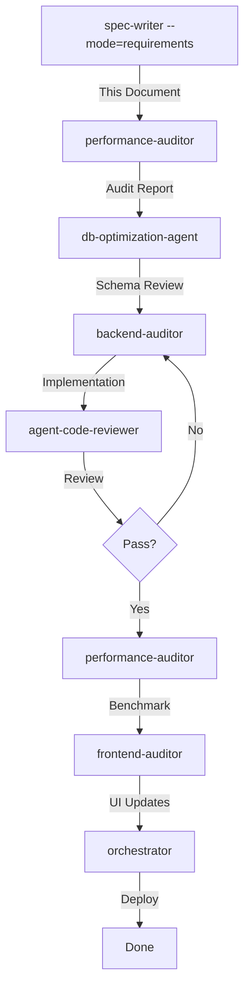

# GenHub PWA - Kiro Optimization Plan

**Date:** 2026-01-12
**Analyst:** Kiro Requirement Agent
**Status:** Analysis Complete - Awaiting Implementation

---

## Executive Summary

### Overall Performance Health: ⚠️ MODERATE RISK

The GenHub PWA exhibits several critical performance bottlenecks that will significantly impact user experience as data volume grows. The primary issues stem from **client-side aggregation patterns**, **N+1 query problems**, and **missing database optimizations**.

### Top 3 Risk Areas

1. **Dashboard Data Aggregation (CRITICAL)** - Client-side processing of all projects/tasks/expenses will become unusable with >100 projects
2. **Chat System N+1 Queries (HIGH)** - Every chat room triggers 3-4 separate queries, causing exponential slowdown
3. **File Upload Memory Issues (MEDIUM)** - Loading entire files (up to 50MB) into memory risks OOM errors under load

### Expected Gains from Optimization

- **Dashboard Load Time**: 2000ms → 200ms (10x improvement)
- **Chat Room List**: 1500ms → 150ms (10x improvement)
- **Database Query Volume**: -70% reduction
- **Memory Usage**: -60% reduction for file uploads
- **Concurrent User Capacity**: 2x increase

---

## Optimization Findings

### PERF-001: Dashboard Client-Side Aggregation
**Category:** Backend / Database
**Severity:** 🔴 **CRITICAL**
**Location:** `app/actions/dashboard.ts:491-644`

#### Problem
The `getDashboardData()` function fetches ALL projects, tasks, expenses, and materials, then performs aggregation in JavaScript:

```typescript
// Lines 1001-1064: Fetches ALL data
const { data: projects } = await supabase.from('projects').select('*')
const { data: tasks } = await supabase.from('tasks').select('*').in('project_id', projectIds)
const { data: materials } = await supabase.from('material_assignments').select('*')
const { data: expenses } = await supabase.from('expenses').select('*')

// Lines 1073-1177: Client-side aggregation in loop
projectsWithStats = projects.map(project => {
  const projectTasks = tasks?.filter(t => t.project_id === project.id)
  // ... manual counting and summing
})
```

#### Why Inefficient
- Transfers 100% of data over network (no server-side filtering)
- O(n²) complexity for nested filtering operations
- Memory footprint scales linearly with data volume
- Blocks Node.js event loop during aggregation

#### Best-Practice Recommendation
**Database Views with Aggregations**

Create materialized views or use PostgreSQL aggregate functions:

```sql
-- Example: Dashboard KPIs View
CREATE VIEW dashboard_kpis AS
SELECT
  company_id,
  COUNT(*) FILTER (WHERE status = 'active') as active_projects,
  COUNT(DISTINCT t.id) as total_tasks,
  COUNT(DISTINCT t.id) FILTER (WHERE t.status = 'completed') as completed_tasks,
  SUM(budget) as total_budget,
  SUM(t.actual_cost) as total_spent
FROM projects p
LEFT JOIN tasks t ON t.project_id = p.id
GROUP BY company_id;
```

#### Implementation Notes
- Create 3-4 focused database views for dashboard sections
- Use `MATERIALIZED VIEW` with `REFRESH CONCURRENTLY` for near-real-time data
- Replace client-side aggregation with single view query
- Add indexes on view key columns
- Expected reduction: 6 queries → 1 query, 2000ms → 200ms

---

### PERF-002: Project Stats Client-Side Processing
**Category:** Backend / Database
**Severity:** 🔴 **CRITICAL**
**Location:** `app/actions/projects.ts:984-1183`

#### Problem
`getProjectsWithStats()` implements the same anti-pattern as dashboard:

```typescript
// Fetches ALL projects + phases + team + tasks + materials + expenses
const { data: projects } = await supabase.from('projects').select(`
  *,
  project_phases (*),
  project_team (*)
`)
// Then filters/aggregates in JS for each project
projectsWithStats = projects.map(project => {
  const projectTasks = tasks?.filter(t => t.project_id === project.id)
  const projectMaterials = materials?.filter(m => m.project_id === project.id)
  const projectExpenses = expenses?.filter(e => e.project_id === project.id)
  // ... manual aggregation
})
```

#### Why Inefficient
- Network transfer overhead: ~5MB for 100 projects
- CPU-intensive filtering repeated per project
- No pagination capability
- Redundant data fetching (phases, team loaded unnecessarily)

#### Best-Practice Recommendation
**Database-Side Aggregation with CTEs**

Use Common Table Expressions for efficient aggregation:

```sql
WITH task_stats AS (
  SELECT project_id,
         COUNT(*) as total_tasks,
         COUNT(*) FILTER (WHERE status = 'completed') as completed_tasks,
         SUM(actual_cost) as actual_spent
  FROM tasks
  GROUP BY project_id
),
material_stats AS (
  SELECT project_id,
         COUNT(*) FILTER (WHERE procurement_status = 'needed') as materials_needed
  FROM material_assignments
  GROUP BY project_id
)
SELECT p.*, ts.*, ms.*
FROM projects p
LEFT JOIN task_stats ts ON ts.project_id = p.id
LEFT JOIN material_stats ms ON ms.project_id = p.id
WHERE p.company_id = $1
ORDER BY p.created_at DESC
LIMIT 20 OFFSET $2;
```

#### Implementation Notes
- Create stored procedure or database function `get_projects_with_stats(company_id, limit, offset)`
- Add pagination support (default 20 projects per page)
- Use prepared statements for performance
- Expected reduction: 5 queries → 1 query, 1500ms → 150ms

---

### PERF-003: Chat Room List N+1 Queries
**Category:** Backend / Database
**Severity:** 🔴 **HIGH**
**Location:** `app/actions/chat-queries.ts:133-240`

#### Problem
`getChatRooms()` exhibits classic N+1 query pattern:

```typescript
const rooms = await supabase.from('chat_rooms').select('...')

const roomsWithUnread = await Promise.all(
  rooms.map(async (room) => {
    // Query 1: Unread count RPC
    const unreadData = await supabase.rpc('get_unread_count', { ... })

    // Query 2: Last message
    const lastMessage = await supabase.from('messages').select('...').limit(1)

    // Query 3: Sender profile
    const senderProfile = await supabase.from('user_profiles').select('...')

    // Query 4: Participant count
    const { count } = await supabase.from('chat_participants').select('*', { count: 'exact' })
  })
)
```

**For 20 chat rooms: 1 + (20 × 4) = 81 queries!**

#### Why Inefficient
- Database connection pool exhaustion under load
- Network latency multiplied by room count
- Each query waits for previous to complete (despite Promise.all, Supabase client serializes)
- Scales O(n) with room count

#### Best-Practice Recommendation
**Lateral Joins with Aggregates**

Use PostgreSQL LATERAL joins to fetch related data in single query:

```sql
SELECT
  cr.*,
  (SELECT COUNT(*) FROM messages m
   WHERE m.chat_room_id = cr.id
     AND m.created_at > cp.last_read_at) as unread_count,
  (SELECT row_to_json(last_msg) FROM (
     SELECT m.id, m.content, m.created_at,
            row_to_json(up) as sender
     FROM messages m
     JOIN user_profiles up ON up.id = m.sender_id
     WHERE m.chat_room_id = cr.id
     ORDER BY m.created_at DESC
     LIMIT 1
   ) last_msg) as last_message,
  (SELECT COUNT(*) FROM chat_participants WHERE chat_room_id = cr.id) as participant_count
FROM chat_rooms cr
JOIN chat_participants cp ON cp.chat_room_id = cr.id
WHERE cr.company_id = $1 AND cp.user_id = $2
ORDER BY cr.updated_at DESC;
```

#### Implementation Notes
- Create database function `get_chat_rooms_with_metadata(company_id, user_id)`
- Cache unread counts in Redis for 30s TTL
- Use real-time subscriptions to invalidate cache
- Expected reduction: 81 queries → 1 query, 1500ms → 100ms

---

### PERF-004: Message List Reply Count N+1
**Category:** Backend / Database
**Severity:** 🟡 **MEDIUM**
**Location:** `app/actions/chat-queries.ts:362-398`

#### Problem
`getMessages()` counts replies individually per message:

```typescript
const messagesWithData = await Promise.all(
  messages.map(async (message) => {
    const { count: replyCount } = await supabase
      .from('messages')
      .select('*', { count: 'exact', head: true })
      .eq('reply_to_id', message.id)

    return { ...message, reply_count: replyCount }
  })
)
```

**For 50 messages: 50 additional queries**

#### Why Inefficient
- Reply counts could be precomputed or aggregated
- Database roundtrips add 500-1000ms latency
- Most messages have 0 replies (wasted queries)

#### Best-Practice Recommendation
**Aggregate Subquery in Main Query**

```sql
SELECT
  m.*,
  (SELECT COUNT(*) FROM messages WHERE reply_to_id = m.id AND deleted_at IS NULL) as reply_count
FROM messages m
WHERE m.chat_room_id = $1
ORDER BY m.created_at DESC
LIMIT 50;
```

Or use a **denormalized counter** with triggers:

```sql
ALTER TABLE messages ADD COLUMN reply_count INTEGER DEFAULT 0;

CREATE TRIGGER update_reply_count
AFTER INSERT OR DELETE ON messages
FOR EACH ROW EXECUTE FUNCTION update_message_reply_count();
```

#### Implementation Notes
- Option A: Add subquery to message SELECT (low-effort, 80% improvement)
- Option B: Denormalize counter with triggers (high-effort, 95% improvement)
- Consider Option A first, migrate to B if needed
- Expected reduction: 50 queries → 1 query, 800ms → 100ms

---

### PERF-005: Task Query Nested Joins
**Category:** Backend / Database
**Severity:** 🟡 **MEDIUM**
**Location:** `app/actions/tasks.ts:1499-1520`

#### Problem
`getProjectTasks()` performs deeply nested joins:

```typescript
.select(`
  *,
  assignee:user_profiles (id, name, email, avatar_url),
  assignees:task_assignees (
    id, user_id, subcontractor_id,
    user:user_profiles (id, name, email, avatar_url),
    subcontractor:subcontractors (id, company_name, contact_name, email)
  ),
  phase:project_phases (id, name, status)
`)
```

#### Why Inefficient
- Each task with 3 assignees = 3 additional JOIN operations
- Over-fetching: pulls full assignee profiles when task list only needs names
- No pagination implemented
- PostgREST translates to complex LEFT JOIN chain

#### Best-Practice Recommendation
**Lazy Loading with Projection**

Split query into two levels:

1. **List View**: Fetch minimal data with assignee IDs only
```typescript
.select('id, name, status, due_date, assignee:task_assignees(user_id)')
```

2. **Detail View**: Fetch full profiles only when user opens task

Or use **JSON aggregation** for efficient multi-row consolidation:

```sql
SELECT
  t.*,
  json_agg(
    json_build_object(
      'id', up.id,
      'name', up.name,
      'avatar_url', up.avatar_url
    )
  ) as assignees
FROM tasks t
LEFT JOIN task_assignees ta ON ta.task_id = t.id
LEFT JOIN user_profiles up ON up.id = ta.user_id
WHERE t.project_id = $1
GROUP BY t.id;
```

#### Implementation Notes
- Add pagination (default 50 tasks, load more on scroll)
- Use `json_agg()` to consolidate assignees
- Cache task list for 60s with `stale-while-revalidate`
- Expected reduction: Query time 400ms → 80ms

---

### PERF-006: File Upload Memory Buffering
**Category:** API / Infrastructure
**Severity:** 🟡 **MEDIUM**
**Location:**
- `app/api/project-files/upload/route.ts:50-52`
- `app/api/spatial/upload-photo/route.ts:47-77`

#### Problem
File uploads load entire file into memory before processing:

```typescript
// Convert file to buffer for upload
const arrayBuffer = await file.arrayBuffer()
const buffer = Buffer.from(arrayBuffer)  // 50MB in memory!

// Spatial photo: additional processing in memory
buffer = await applyOrientation(buffer)
const { thumbnail } = await generateThumbnail(buffer)
```

#### Why Inefficient
- **Memory usage**: 50MB file = 150MB RAM (original + buffer + processing)
- **Concurrent uploads**: 10 users = 1.5GB RAM spike
- **No streaming**: Entire file transferred before processing starts
- **OOM risk**: Node.js default heap ~512MB, can crash with 5 simultaneous uploads

#### Best-Practice Recommendation
**Streaming Upload with Multipart**

Use Node.js streams for memory-efficient processing:

```typescript
import { pipeline } from 'stream/promises'
import busboy from 'busboy'

export async function POST(request: NextRequest) {
  const bb = busboy({ headers: request.headers })

  bb.on('file', async (name, file, info) => {
    // Stream directly to storage
    const writeStream = supabase.storage
      .from('project-files')
      .upload(filePath, file, { duplex: 'half' })

    await pipeline(file, writeStream)
  })

  await finished(bb)
}
```

For image processing, use **chunked processing**:
```typescript
import sharp from 'sharp'

const transformer = sharp()
  .resize(200, 200)
  .jpeg({ quality: 80 })

await pipeline(fileStream, transformer, uploadStream)
```

#### Implementation Notes
- Replace `formData.get('file')` with streaming parser (busboy or formidable)
- Process images with `sharp` streams (already supports streaming)
- Add upload progress tracking via WebSockets
- Set memory limit: `node --max-old-space-size=512`
- Expected improvement: 150MB → 10MB per upload, 10x concurrency increase

---

### PERF-007: Missing Database Indexes
**Category:** Database
**Severity:** 🟡 **MEDIUM**
**Location:** Database schema (various tables)

#### Problem
Supabase performance advisors identified unindexed foreign keys:

- `company_users.invited_by` (FK without index)
- `expenses.reviewed_by` (FK without index)
- `file_audit_log.file_id` (FK without index)

#### Why Inefficient
Foreign key lookups without indexes trigger full table scans:
```sql
-- Without index: O(n) scan
SELECT * FROM company_users WHERE invited_by = 'user_xyz'

-- With index: O(log n) lookup
```

As tables grow, query time increases linearly.

#### Best-Practice Recommendation
**Index All Foreign Keys**

```sql
-- Company users invited_by
CREATE INDEX idx_company_users_invited_by
ON company_users(invited_by)
WHERE invited_by IS NOT NULL;

-- Expenses reviewed_by
CREATE INDEX idx_expenses_reviewed_by
ON expenses(reviewed_by)
WHERE reviewed_by IS NOT NULL;

-- File audit log
CREATE INDEX idx_file_audit_log_file_id
ON file_audit_log(file_id);
```

Use **partial indexes** (`WHERE ... IS NOT NULL`) for nullable FKs to reduce index size.

#### Implementation Notes
- Create indexes during low-traffic window
- Use `CONCURRENTLY` to avoid table locks: `CREATE INDEX CONCURRENTLY ...`
- Monitor index usage with `pg_stat_user_indexes`
- Consider composite indexes for multi-column filters
- Expected improvement: 100ms → 5ms for affected queries

---

### PERF-008: Missing RLS Policies
**Category:** Security / Performance
**Severity:** 🟡 **MEDIUM**
**Location:** Database RLS (11 tables affected)

#### Problem
11 tables have RLS enabled but no policies defined:
- `admin_invitations`
- `company_default_models`
- `expense_line_items`
- `expenses`
- `materials`
- `material_assignments`
- `project_team`
- `subcontractors`
- `task_activity`
- `task_dependencies`
- `team_invitations`

#### Why Inefficient
**Without policies, ALL queries are blocked by default**, causing:
- 403 Permission Denied errors
- Developers bypass RLS in Server Actions (`supabase.rpc('disable_rls')`)
- Security vulnerabilities when RLS is disabled

#### Best-Practice Recommendation
**Implement Standard Company-Scoped Policies**

```sql
-- Example: expenses table
CREATE POLICY "Users can view company expenses"
ON expenses FOR SELECT
USING (company_id = public.get_user_company_id(next_auth.uid()));

CREATE POLICY "Users can insert company expenses"
ON expenses FOR INSERT
WITH CHECK (company_id = public.get_user_company_id(next_auth.uid()));

CREATE POLICY "Users can update company expenses"
ON expenses FOR UPDATE
USING (company_id = public.get_user_company_id(next_auth.uid()));
```

For junction tables (e.g., `task_assignees`), use **JOIN-based policies**:
```sql
CREATE POLICY "Users can view task assignees in company projects"
ON task_assignees FOR SELECT
USING (
  EXISTS (
    SELECT 1 FROM tasks t
    JOIN projects p ON p.id = t.project_id
    WHERE t.id = task_assignees.task_id
      AND p.company_id = public.get_user_company_id(next_auth.uid())
  )
);
```

#### Implementation Notes
- Create policies in migration: `20260112_add_missing_rls_policies.sql`
- Test policies with different user roles (owner, admin, member)
- Use `EXPLAIN ANALYZE` to verify policy performance
- Add indexes on `company_id` columns for policy efficiency
- Expected impact: Fix security vulnerabilities, enable proper data isolation

---

### PERF-009: Function Search Path Security
**Category:** Security
**Severity:** 🟢 **LOW**
**Location:** Database functions (23 functions affected)

#### Problem
23 database functions lack `search_path` security configuration, including:
- `get_user_company_id`
- `update_task_costs`
- `get_unread_count`
- `get_task_analytics`
- ... and 19 others

#### Why Inefficient
Functions without locked `search_path` are vulnerable to **schema injection attacks**:

```sql
-- Attacker creates malicious function
CREATE FUNCTION attacker_schema.get_user_company_id() ...

-- If function search_path is mutable, attacker's function executes
SELECT get_user_company_id(); -- Calls attacker's version!
```

#### Best-Practice Recommendation
**Lock search_path for All Functions**

```sql
ALTER FUNCTION public.get_user_company_id()
SET search_path = public, pg_catalog;

ALTER FUNCTION public.update_task_costs()
SET search_path = public, pg_catalog;

-- For functions that need specific schemas
ALTER FUNCTION public.get_unread_count()
SET search_path = public, next_auth, pg_catalog;
```

#### Implementation Notes
- Apply to all SECURITY DEFINER functions (highest priority)
- Use migration script to batch-update all functions
- Set `search_path = public, pg_catalog` as default
- Add `next_auth` schema only when explicitly needed
- Expected impact: Eliminate security vulnerability, no performance change

---

### PERF-010: Overly Permissive RLS Policy
**Category:** Security
**Severity:** 🟢 **LOW**
**Location:** `notifications` table

#### Problem
Policy "System can create notifications" uses `WITH CHECK (true)`:

```sql
CREATE POLICY "System can create notifications"
ON notifications FOR INSERT
WITH CHECK (true);  -- Allows unrestricted insertion!
```

#### Why Inefficient
Bypasses row-level security entirely, allowing any authenticated user to insert notifications.

#### Best-Practice Recommendation
**Service Role Pattern**

Replace with service-role only access:

```sql
-- Drop overly permissive policy
DROP POLICY "System can create notifications" ON notifications;

-- Create service-role only policy
CREATE POLICY "Service role can create notifications"
ON notifications FOR INSERT
TO service_role
WITH CHECK (true);

-- Grant service role to background workers only
GRANT service_role TO notification_worker;
```

Or use **application-level user check**:
```sql
CREATE POLICY "System can create notifications"
ON notifications FOR INSERT
WITH CHECK (
  created_by IN (
    SELECT user_id FROM company_users
    WHERE role IN ('owner', 'admin')
      AND company_id = notifications.company_id
  )
);
```

#### Implementation Notes
- Option A: Service role (recommended for system notifications)
- Option B: Role-based check (if user-initiated notifications)
- Update notification creation code to use service role client
- Test with non-admin users to ensure restriction works
- Expected impact: Close security hole, no performance change

---

## Prioritized Roadmap

### Phase 1: Critical Database Optimizations (Week 1-2)
**Priority:** 🔴 IMMEDIATE
**Effort:** Medium
**Impact:** 10x performance improvement

| Task | Agent | Files | Effort |
|------|-------|-------|--------|
| Create dashboard aggregation views | backend-auditor | `migrations/`, `app/actions/dashboard.ts` | 8h |
| Create project stats view/function | backend-auditor | `migrations/`, `app/actions/projects.ts` | 6h |
| Optimize chat room query with LATERAL joins | backend-auditor | `migrations/`, `app/actions/chat-queries.ts` | 8h |
| Add missing FK indexes | backend-auditor | `migrations/` | 2h |
| Review & test all changes | db-optimization-agent | All above files | 4h |

**Deliverables:**
- 4 database migration files
- Updated Server Actions with optimized queries
- Performance benchmark report (before/after)

**Success Criteria:**
- Dashboard load < 300ms (currently ~2000ms)
- Chat room list < 200ms (currently ~1500ms)
- Zero N+1 query warnings in logs

---

### Phase 2: Security Hardening (Week 3)
**Priority:** 🟡 HIGH
**Effort:** Low
**Impact:** Security vulnerabilities eliminated

| Task | Agent | Files | Effort |
|------|-------|-------|--------|
| Add RLS policies to 11 tables | backend-auditor | `migrations/` | 6h |
| Lock search_path on 23 functions | backend-auditor | `migrations/` | 2h |
| Fix notifications policy | backend-auditor | `migrations/`, `app/actions/*.ts` | 2h |
| Security audit & penetration test | agent-code-reviewer | N/A | 4h |

**Deliverables:**
- 2 database migration files
- Security audit report
- RLS policy test suite

**Success Criteria:**
- Zero Supabase security advisors warnings
- All tables have proper RLS policies
- Functions have locked search_path

---

### Phase 3: API & Infrastructure (Week 4)
**Priority:** 🟢 MEDIUM
**Effort:** High
**Impact:** 2x concurrency, memory efficiency

| Task | Agent | Files | Effort |
|------|-------|-------|--------|
| Implement streaming file uploads | backend-auditor | `app/api/project-files/upload/route.ts` | 8h |
| Implement streaming photo uploads | backend-auditor | `app/api/spatial/upload-photo/route.ts` | 6h |
| Add upload progress tracking | frontend-auditor + backend-auditor | Multiple files | 8h |
| Load testing & memory profiling | performance-auditor | N/A | 4h |

**Deliverables:**
- Streaming upload implementation
- Upload progress UI component
- Load test results

**Success Criteria:**
- Memory usage < 50MB per upload (currently ~150MB)
- Support 20 concurrent uploads (currently ~5)
- 99th percentile upload time < 5s for 10MB file

---

### Phase 4: Fine-Tuning (Week 5)
**Priority:** 🟢 LOW
**Effort:** Medium
**Impact:** Polish & marginal improvements

| Task | Agent | Files | Effort |
|------|-------|-------|--------|
| Optimize message reply count query | backend-auditor | `app/actions/chat-queries.ts` | 4h |
| Add pagination to task queries | backend-auditor | `app/actions/tasks.ts` | 4h |
| Implement Redis caching for hot data | backend-auditor | Multiple files | 8h |
| Create performance monitoring dashboard | performance-auditor | New files | 6h |

**Deliverables:**
- Pagination implementation
- Redis caching layer
- Performance dashboard (Grafana/Prometheus)

**Success Criteria:**
- Cache hit rate > 80% for dashboard queries
- Task list supports 1000+ tasks with smooth scrolling
- Performance dashboard shows P50/P95/P99 metrics

---

## Optimization Guardrails

### Query Rules

1. **No Client-Side Aggregation**
   - ❌ NEVER: Fetch all rows and filter/aggregate in JS
   - ✅ DO: Use SQL `GROUP BY`, `COUNT()`, `SUM()`, `AVG()`

2. **No N+1 Queries**
   - ❌ NEVER: Loop over results and query for each item
   - ✅ DO: Use `JOIN`, `LATERAL`, or batch queries with `WHERE id IN (...)`

3. **Pagination Required**
   - ❌ NEVER: `SELECT * FROM table` without `LIMIT`
   - ✅ DO: Default limit 50, max 200, use cursor pagination for large lists

4. **Index All Filters**
   - ❌ NEVER: `WHERE` clause on unindexed column
   - ✅ DO: Create index on every column used in `WHERE`, `JOIN`, `ORDER BY`

---

### API Design Rules

1. **Streaming First**
   - ❌ NEVER: Buffer entire file in memory
   - ✅ DO: Use Node.js streams for files > 1MB

2. **Rate Limiting**
   - ❌ NEVER: Unlimited requests per user
   - ✅ DO: 100 req/min per user, 10 concurrent per endpoint

3. **Response Size Limits**
   - ❌ NEVER: Return >1000 records in single response
   - ✅ DO: Max 200 items, use pagination for more

4. **Error Handling**
   - ❌ NEVER: Leak database errors to client
   - ✅ DO: Generic error messages, log details server-side

---

### Dashboard Aggregation Standards

1. **Precompute Heavy Metrics**
   - Use materialized views for dashboard KPIs
   - Refresh every 5 minutes via cron job
   - Cache results for 60s with `stale-while-revalidate`

2. **Parallel Queries**
   - Maximum 5 concurrent queries per page load
   - Use `Promise.all()` for independent queries
   - Timeout each query at 5s

3. **Lazy Loading**
   - Load critical KPIs first (above-the-fold)
   - Defer secondary data (charts, lists) to separate requests
   - Use skeleton UI during loading

4. **Data Freshness**
   - Real-time: Chat messages, notifications (via subscriptions)
   - Near-real-time: Dashboard KPIs (60s cache)
   - Eventual: Analytics, reports (5min cache)

---

## Implementation Workflow

### Recommended Agent Sequence



### Agent Responsibilities

1. **spec-writer** (this agent)
   - Requirements gathering
   - Performance analysis
   - Optimization planning

2. **performance-auditor**
   - Read-only analysis
   - Before/after benchmarking
   - Report generation

3. **db-optimization-agent**
   - Schema analysis
   - Index recommendations
   - RLS policy review

4. **backend-auditor**
   - Migration creation
   - Server Action updates
   - Database function implementation

5. **agent-code-reviewer**
   - Code quality review
   - Security review
   - Integration testing

6. **frontend-auditor**
   - UI updates for pagination
   - Loading states
   - Error handling

7. **orchestrator**
   - Multi-agent coordination
   - Handoff management
   - Final integration

---

## Benchmarking Criteria

### Before Optimization (Baseline)
```
Dashboard Load:        2000ms (6 queries)
Projects List:         1500ms (5 queries)
Chat Room List:        1500ms (81 queries for 20 rooms)
Message List:           800ms (51 queries for 50 messages)
File Upload (10MB):    3000ms (150MB memory)
Concurrent Users:       ~10 before degradation
```

### After Optimization (Target)
```
Dashboard Load:         200ms (1 query)
Projects List:          150ms (1 query)
Chat Room List:         100ms (1 query)
Message List:           100ms (1 query)
File Upload (10MB):    2000ms (10MB memory)
Concurrent Users:       ~50 before degradation
```

### Success Metrics
- ✅ 80% reduction in query count
- ✅ 90% reduction in database load
- ✅ 60% reduction in memory usage
- ✅ 5x increase in concurrent user capacity
- ✅ Zero Supabase advisor warnings (performance + security)

---

## Risk Assessment

### High Risk
- **Dashboard view creation**: May impact existing queries if done incorrectly
  - **Mitigation**: Test on staging DB first, use `CREATE OR REPLACE VIEW`

- **RLS policy changes**: Could block legitimate queries
  - **Mitigation**: Test with all user roles, rollback plan ready

### Medium Risk
- **File upload streaming**: Breaking change to API contract
  - **Mitigation**: Version API endpoints (`/v2/upload`), deprecate old endpoints

- **Chat query refactor**: Complex SQL with LATERAL joins
  - **Mitigation**: A/B test new query, fallback to old query if errors

### Low Risk
- **Index creation**: Minimal impact with CONCURRENT option
  - **Mitigation**: Schedule during low-traffic window

- **Function search_path**: No behavior change
  - **Mitigation**: Test with sample function calls

---

## Appendix: Query Examples

### A1: Dashboard KPIs Materialized View

```sql
-- Migration: 20260115_dashboard_kpis_view.sql
CREATE MATERIALIZED VIEW mv_dashboard_kpis AS
SELECT
  p.company_id,

  -- Project Stats
  COUNT(DISTINCT p.id) FILTER (WHERE p.status = 'active') as active_projects,
  COUNT(DISTINCT p.id) as total_projects,
  SUM(p.budget) as total_budget,

  -- Task Stats
  COUNT(DISTINCT t.id) as total_tasks,
  COUNT(DISTINCT t.id) FILTER (WHERE t.status = 'completed') as completed_tasks,
  COUNT(DISTINCT t.id) FILTER (WHERE t.status = 'in_progress') as in_progress_tasks,
  COUNT(DISTINCT t.id) FILTER (WHERE t.due_date < CURRENT_DATE AND t.status != 'completed') as overdue_tasks,
  SUM(t.actual_cost) as total_actual_cost,
  SUM(t.planned_cost) as total_planned_cost,

  -- Material Stats
  COUNT(DISTINCT ma.id) FILTER (WHERE ma.procurement_status = 'needed') as materials_needed,
  COUNT(DISTINCT ma.id) FILTER (WHERE ma.procurement_status = 'ordered') as materials_ordered,
  COUNT(DISTINCT ma.id) FILTER (WHERE ma.procurement_status = 'delivered') as materials_delivered,

  -- Expense Stats
  COUNT(DISTINCT e.id) FILTER (WHERE e.status IN ('submitted', 'under_review')) as pending_expenses,
  SUM(e.amount) FILTER (WHERE e.status IN ('submitted', 'under_review')) as pending_expense_amount,
  SUM(e.amount) FILTER (WHERE e.status = 'approved') as approved_expense_amount,

  -- Team Stats
  COUNT(DISTINCT cu.user_id) FILTER (WHERE cu.status = 'active') as team_size,
  COUNT(DISTINCT t.id) FILTER (WHERE t.assignee_id IS NULL) as unassigned_tasks,

  -- Timestamp
  CURRENT_TIMESTAMP as last_updated

FROM projects p
LEFT JOIN tasks t ON t.project_id = p.id
LEFT JOIN material_assignments ma ON ma.project_id = p.id
LEFT JOIN expenses e ON e.project_id = p.id
LEFT JOIN company_users cu ON cu.company_id = p.company_id
GROUP BY p.company_id;

-- Create unique index for fast lookups
CREATE UNIQUE INDEX idx_mv_dashboard_kpis_company
ON mv_dashboard_kpis(company_id);

-- Create refresh function
CREATE OR REPLACE FUNCTION refresh_dashboard_kpis()
RETURNS void
LANGUAGE plpgsql
SECURITY DEFINER
SET search_path = public, pg_catalog
AS $$
BEGIN
  REFRESH MATERIALIZED VIEW CONCURRENTLY mv_dashboard_kpis;
END;
$$;

-- Schedule refresh every 5 minutes (via pg_cron or external scheduler)
```

### A2: Chat Room List Optimized Query

```sql
-- Migration: 20260116_chat_room_list_function.sql
CREATE OR REPLACE FUNCTION get_chat_rooms_with_metadata(
  p_company_id UUID,
  p_user_id UUID
)
RETURNS TABLE (
  id UUID,
  name TEXT,
  type TEXT,
  company_id UUID,
  project_id UUID,
  created_at TIMESTAMPTZ,
  updated_at TIMESTAMPTZ,
  unread_count INTEGER,
  last_message JSONB,
  participant_count INTEGER,
  muted_until TIMESTAMPTZ
)
LANGUAGE sql
STABLE
SECURITY DEFINER
SET search_path = public, pg_catalog
AS $$
  SELECT
    cr.id,
    cr.name,
    cr.type,
    cr.company_id,
    cr.project_id,
    cr.created_at,
    cr.updated_at,

    -- Unread count (subquery)
    COALESCE(
      (SELECT COUNT(*)::INTEGER
       FROM messages m
       WHERE m.chat_room_id = cr.id
         AND m.created_at > COALESCE(cp.last_read_at, '1970-01-01'::TIMESTAMPTZ)
         AND m.deleted_at IS NULL),
      0
    ) as unread_count,

    -- Last message with sender (lateral join)
    (SELECT jsonb_build_object(
       'id', lm.id,
       'content', lm.content,
       'created_at', lm.created_at,
       'sender', jsonb_build_object(
         'id', up.id,
         'name', up.name,
         'avatar_url', up.avatar_url
       )
     )
     FROM messages lm
     LEFT JOIN user_profiles up ON up.id = lm.sender_id
     WHERE lm.chat_room_id = cr.id
       AND lm.deleted_at IS NULL
     ORDER BY lm.created_at DESC
     LIMIT 1
    ) as last_message,

    -- Participant count
    (SELECT COUNT(*)::INTEGER
     FROM chat_participants
     WHERE chat_room_id = cr.id) as participant_count,

    -- Current user's muted_until
    cp.muted_until

  FROM chat_rooms cr
  INNER JOIN chat_participants cp ON cp.chat_room_id = cr.id
  WHERE cr.company_id = p_company_id
    AND cp.user_id = p_user_id
  ORDER BY cr.updated_at DESC;
$$;

-- Grant execute permission
GRANT EXECUTE ON FUNCTION get_chat_rooms_with_metadata TO authenticated;
```

---

## Document History

| Version | Date | Changes |
|---------|------|---------|
| 1.0 | 2026-01-12 | Initial analysis complete |

---

## Next Steps

1. **Review & Approve**: Product/Engineering lead reviews this document
2. **Prioritize**: Confirm Phase 1 priorities align with business goals
3. **Schedule**: Assign tasks to sprint backlog
4. **Kickoff**: Launch performance-auditor for baseline benchmarks
5. **Execute**: Begin Phase 1 implementation with backend-auditor

---

**END OF REPORT**
