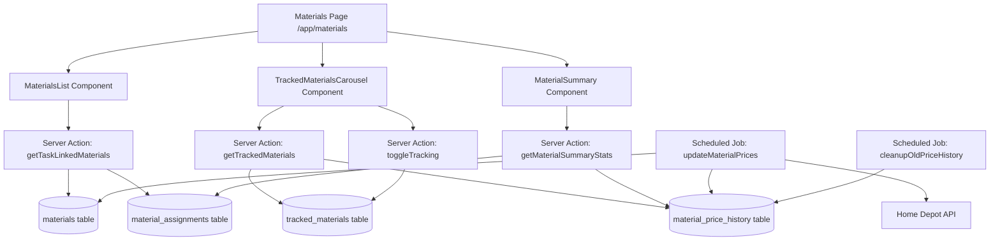

# Materials Page Enhancement - Technical Design

## Status
- Requirements: APPROVED
- Design: DRAFT
- Author: kiro-design
- Date: 2026-01-04

---

## Overview

### Purpose
Enhance the Materials Page (`/app/materials`) to provide comprehensive tracking of task-linked materials, price monitoring via Home Depot API, and actionable analytics for procurement decisions.

### Business Value
This enhancement enables general contractors and project managers to:
- Monitor material price fluctuations to optimize purchasing timing
- Track total project material costs in real-time
- Identify materials linked across multiple tasks efficiently
- Make data-driven procurement decisions based on price trends

### Scope
- **In scope:**
  - Task-linked materials list with pagination (12 per page)
  - Top 10 tracked materials carousel with price change tracking
  - Material summary metrics (5 cards)
  - Daily price sync via scheduled job
  - 90-day price history retention
  - User-specific material watchlist

- **Out of scope:**
  - Advanced analytics charts (bar/line graphs)
  - Email alerts for price changes
  - Multi-currency support
  - Low stock threshold tracking (Materials Needing Reorder metric removed)
  - Material inventory management

---

## Architecture

### System Context
This feature integrates with:
1. **Existing Materials Infrastructure:** `materials` table, `material_assignments` table, `app/actions/materials.ts`
2. **Home Depot API:** SerpAPI integration (`lib/services/home-depot-api.ts`)
3. **Supabase Database:** New tables for tracking and price history
4. **Server Actions:** New actions for tracking, price updates, and analytics

### Component Diagram


### Data Flow

#### User Tracks Material
```
1. User clicks "Track" on material → toggleTracking() Server Action
2. Insert into tracked_materials (company_id scoped)
3. Record baseline price in material_price_history
4. Revalidate /app/materials
5. Update carousel UI
```

#### Daily Price Sync
```
1. Scheduled job (daily at 2 AM UTC) → updateMaterialPrices()
2. For each tracked material with home_depot_product_id:
   a. Fetch current price from Home Depot API
   b. Compare with materials.unit_price
   c. If changed:
      - Insert into material_price_history
      - Update materials.unit_price
3. Cleanup price_history records older than 90 days
```

#### Materials List Pagination
```
1. User loads /app/materials → getTaskLinkedMaterials(page, limit)
2. Query material_assignments with JOIN to materials
3. Aggregate by material_id (SUM quantity, COUNT tasks)
4. Order by total_quantity DESC
5. Return paginated results + total count
```

---

## Data Model

### Tables

| Table | Purpose |
|-------|---------|
| `tracked_materials` | User watchlist for price monitoring (max 10 per user) |
| `material_price_history` | Historical price snapshots (90-day retention) |
| `materials` | Existing table (add index for home_depot_product_id) |
| `material_assignments` | Existing table (add index for material_id aggregation) |

### Schema: tracked_materials

| Column | Type | Constraints | Purpose |
|--------|------|-------------|---------|
| id | uuid | PK, default gen_random_uuid() | Primary key |
| company_id | uuid | FK companies, NOT NULL | RLS isolation |
| user_id | uuid | FK next_auth.users, NOT NULL | User who tracked |
| material_id | uuid | FK materials, NOT NULL | Tracked material |
| tracked_at | timestamptz | NOT NULL, default now() | When tracking started |
| created_at | timestamptz | NOT NULL, default now() | Record creation |
| updated_at | timestamptz | NOT NULL, default now() | Last update |

**Indexes:**
```sql
CREATE INDEX idx_tracked_materials_user ON tracked_materials(user_id, tracked_at DESC);
CREATE INDEX idx_tracked_materials_material ON tracked_materials(material_id);
CREATE UNIQUE INDEX idx_tracked_materials_user_material ON tracked_materials(user_id, material_id);
```

**Constraints:**
```sql
-- Max 10 tracked materials per user
CREATE OR REPLACE FUNCTION check_tracked_materials_limit()
RETURNS TRIGGER AS $$
BEGIN
  IF (SELECT COUNT(*) FROM tracked_materials WHERE user_id = NEW.user_id) >= 10 THEN
    RAISE EXCEPTION 'Maximum 10 tracked materials per user';
  END IF;
  RETURN NEW;
END;
$$ LANGUAGE plpgsql;

CREATE TRIGGER enforce_tracked_materials_limit
BEFORE INSERT ON tracked_materials
FOR EACH ROW EXECUTE FUNCTION check_tracked_materials_limit();
```

### Schema: material_price_history

| Column | Type | Constraints | Purpose |
|--------|------|-------------|---------|
| id | uuid | PK, default gen_random_uuid() | Primary key |
| company_id | uuid | FK companies, NOT NULL | RLS isolation |
| material_id | uuid | FK materials, NOT NULL | Material reference |
| price | numeric(10,2) | NOT NULL | Price snapshot |
| recorded_at | timestamptz | NOT NULL, default now() | When price was recorded |
| source | text | NOT NULL, default 'home_depot_api' | Price data source |
| created_at | timestamptz | NOT NULL, default now() | Record creation |

**Indexes:**
```sql
CREATE INDEX idx_price_history_material_date ON material_price_history(material_id, recorded_at DESC);
CREATE INDEX idx_price_history_recorded_at ON material_price_history(recorded_at DESC);
```

**Retention Policy:**
```sql
-- Cleanup job (runs daily)
DELETE FROM material_price_history
WHERE recorded_at < NOW() - INTERVAL '90 days';
```

### Schema: materials (Enhancements)

**New Indexes:**
```sql
-- For Home Depot price sync lookup
CREATE INDEX idx_materials_home_depot_product_id
ON materials(home_depot_product_id)
WHERE home_depot_product_id IS NOT NULL;

-- For company-wide material lookups
CREATE INDEX idx_materials_company_active
ON materials(company_id, is_active)
WHERE is_active = true;
```

**Editable Field:**
```sql
-- lead_time_days is now editable (both API source + manual entry)
-- No schema change needed, just Server Action support
```

### Schema: material_assignments (Enhancements)

**New Indexes:**
```sql
-- For aggregating materials by quantity
CREATE INDEX idx_material_assignments_material_id
ON material_assignments(material_id);

-- For counting tasks per material
CREATE INDEX idx_material_assignments_task_material
ON material_assignments(task_id, material_id);
```

### RLS Pattern
```sql
-- tracked_materials: Users can only track materials in their company
CREATE POLICY "tracked_materials_select" ON tracked_materials FOR SELECT
USING (company_id = get_user_company_id(next_auth.uid()));

CREATE POLICY "tracked_materials_insert" ON tracked_materials FOR INSERT
WITH CHECK (
  company_id = get_user_company_id(next_auth.uid())
  AND user_id = next_auth.uid()
);

CREATE POLICY "tracked_materials_delete" ON tracked_materials FOR DELETE
USING (user_id = next_auth.uid());

-- material_price_history: Read-only for company members
CREATE POLICY "material_price_history_select" ON material_price_history FOR SELECT
USING (company_id = get_user_company_id(next_auth.uid()));

-- Only scheduled job (service role) can insert/update price history
CREATE POLICY "material_price_history_insert" ON material_price_history FOR INSERT
WITH CHECK (auth.role() = 'service_role');
```

---

## API Specification

### Server Actions

#### getTaskLinkedMaterials

| Property | Value |
|----------|-------|
| Location | `app/actions/materials.ts` |
| Auth | Required |
| Input | `{ page: number, limit: number }` |
| Output | `{ data?: { materials: MaterialWithStats[], total: number }, error?: string }` |
| Revalidates | N/A (read-only) |

**Logic:**
```typescript
interface MaterialWithStats {
  material_id: string;
  product_name: string;
  sku: string;
  category: MaterialCategory;
  unit_price: number;
  stock_status: string;
  product_image_url: string;
  home_depot_product_id: string;
  total_quantity: number;
  task_count: number;
  is_tracked: boolean; // If current user tracks this material
}

// Aggregation query
SELECT
  m.id as material_id,
  m.product_name,
  m.sku,
  m.category,
  m.unit_price,
  m.stock_status,
  m.product_image_url,
  m.home_depot_product_id,
  SUM(ma.quantity) as total_quantity,
  COUNT(DISTINCT ma.task_id) as task_count,
  EXISTS(
    SELECT 1 FROM tracked_materials
    WHERE material_id = m.id
    AND user_id = $user_id
  ) as is_tracked
FROM materials m
INNER JOIN material_assignments ma ON ma.material_id = m.id
WHERE m.company_id = $company_id
GROUP BY m.id
ORDER BY total_quantity DESC
LIMIT $limit OFFSET $offset;
```

#### getTrackedMaterials

| Property | Value |
|----------|-------|
| Location | `app/actions/materials.ts` |
| Auth | Required |
| Input | None |
| Output | `{ data?: TrackedMaterial[], error?: string }` |
| Revalidates | N/A (read-only) |

**Logic:**
```typescript
interface TrackedMaterial {
  material_id: string;
  product_name: string;
  sku: string;
  current_price: number;
  previous_price: number | null; // Price from 7 days ago
  price_change_percent: number | null; // Calculated
  product_image_url: string;
  tracked_at: string;
}

// Query with price change calculation
SELECT
  m.id as material_id,
  m.product_name,
  m.sku,
  m.unit_price as current_price,
  (
    SELECT price
    FROM material_price_history
    WHERE material_id = m.id
    AND recorded_at <= NOW() - INTERVAL '7 days'
    ORDER BY recorded_at DESC
    LIMIT 1
  ) as previous_price,
  m.product_image_url,
  tm.tracked_at
FROM tracked_materials tm
INNER JOIN materials m ON m.id = tm.material_id
WHERE tm.user_id = $user_id
ORDER BY tm.tracked_at DESC
LIMIT 10;

// Price change calculation (in app logic)
price_change_percent = previous_price
  ? ((current_price - previous_price) / previous_price) * 100
  : null;
```

#### toggleTracking

| Property | Value |
|----------|-------|
| Location | `app/actions/materials.ts` |
| Auth | Required |
| Input | `{ material_id: string, track: boolean }` |
| Output | `{ success: boolean, error?: string }` |
| Revalidates | `/app/materials` |

**Logic:**
```typescript
if (track) {
  // Check limit (handled by trigger, but also check client-side)
  const count = await getTrackedCount(user_id);
  if (count >= 10) return { error: 'Maximum 10 materials' };

  // Insert
  await supabase.from('tracked_materials').insert({
    company_id,
    user_id,
    material_id,
  });

  // Record baseline price
  const material = await getMaterial(material_id);
  await supabase.from('material_price_history').insert({
    company_id,
    material_id,
    price: material.unit_price,
    source: 'baseline',
  });
} else {
  // Delete
  await supabase.from('tracked_materials')
    .delete()
    .eq('user_id', user_id)
    .eq('material_id', material_id);
}
```

#### getMaterialSummaryStats

| Property | Value |
|----------|-------|
| Location | `app/actions/materials.ts` |
| Auth | Required |
| Input | None |
| Output | `{ data?: MaterialSummaryStats, error?: string }` |
| Revalidates | N/A (read-only) |

**Logic:**
```typescript
interface MaterialSummaryStats {
  total_materials_linked: number;
  total_estimated_cost: number;
  price_increases_last_7_days: number;
  average_lead_time_days: number;
}

// Query
SELECT
  COUNT(DISTINCT m.id) as total_materials_linked,
  SUM(ma.total_cost) as total_estimated_cost,
  (
    SELECT COUNT(DISTINCT mph.material_id)
    FROM material_price_history mph
    WHERE mph.company_id = $company_id
    AND mph.recorded_at >= NOW() - INTERVAL '7 days'
    AND mph.price > (
      SELECT price
      FROM material_price_history
      WHERE material_id = mph.material_id
      AND recorded_at < mph.recorded_at
      ORDER BY recorded_at DESC
      LIMIT 1
    )
  ) as price_increases_last_7_days,
  AVG(m.lead_time_days) as average_lead_time_days
FROM materials m
INNER JOIN material_assignments ma ON ma.material_id = m.id
WHERE m.company_id = $company_id;
```

#### updateMaterialPrices (Scheduled Job)

| Property | Value |
|----------|-------|
| Location | `app/api/cron/update-material-prices/route.ts` |
| Auth | Cron secret or service role |
| Schedule | Daily at 2 AM UTC |
| Revalidates | `/app/materials` |

**Logic:**
```typescript
// Get all materials with Home Depot IDs
const materials = await supabase
  .from('materials')
  .select('id, company_id, home_depot_product_id, unit_price')
  .not('home_depot_product_id', 'is', null);

for (const material of materials) {
  try {
    // Fetch current price from Home Depot API
    const product = await getHomeDepotProduct(material.home_depot_product_id);

    if (product && product.price !== material.unit_price) {
      // Update material price
      await supabase
        .from('materials')
        .update({ unit_price: product.price })
        .eq('id', material.id);

      // Record price history
      await supabase
        .from('material_price_history')
        .insert({
          company_id: material.company_id,
          material_id: material.id,
          price: product.price,
          source: 'home_depot_api',
        });
    }
  } catch (error) {
    console.error(`Failed to update price for material ${material.id}`);
  }
}
```

#### cleanupOldPriceHistory (Scheduled Job)

| Property | Value |
|----------|-------|
| Location | `app/api/cron/cleanup-price-history/route.ts` |
| Auth | Cron secret or service role |
| Schedule | Daily at 3 AM UTC |
| Revalidates | N/A |

**Logic:**
```typescript
await supabase
  .from('material_price_history')
  .delete()
  .lt('recorded_at', new Date(Date.now() - 90 * 24 * 60 * 60 * 1000).toISOString());
```

---

## UI Specification

### Pages

| Route | Type | Purpose |
|-------|------|---------|
| `/app/materials` | Server Component | Enhanced materials page with all new components |

### Components

| Component | Type | Props | Purpose |
|-----------|------|-------|---------|
| MaterialsList | Client | `{ materials: MaterialWithStats[], total: number }` | Paginated list of task-linked materials (12 per page) |
| TrackedMaterialsCarousel | Client | `{ trackedMaterials: TrackedMaterial[] }` | Horizontal scrolling carousel of top 10 tracked materials |
| MaterialSummary | Server | `{ stats: MaterialSummaryStats }` | 5 metric cards (similar to ProjectTaskSummary pattern) |
| MaterialCard | Client | `{ material: MaterialWithStats }` | Individual material card in list |
| TrackedMaterialCard | Client | `{ material: TrackedMaterial }` | Individual material card in carousel |
| PriceChangeIndicator | Client | `{ percent: number }` | Visual indicator (red ↑, green ↓, gray —) |

### UI Patterns Applied
- [x] Blueprint grid background
- [x] Industrial header (MATERIALS title)
- [x] Section headers with Lucide icons
- [x] Standard card styling (`border-2 border-gray-200 shadow-construction`)
- [x] Responsive (mobile-first)

### Detailed Component Specs

#### MaterialSummary Component

**Layout:** Follow ProjectTaskSummary pattern exactly (5 cards in grid)

```tsx
<div className="grid grid-cols-1 sm:grid-cols-2 lg:grid-cols-5 gap-4">
  {/* Card 1: Total Materials Linked */}
  <div className="relative group cursor-pointer" onClick={() => /* filter to show all materials */}>
    <div className="absolute inset-0 bg-gradient-to-br from-construction-blue/5 to-construction-blue/10 rounded-lg transform group-hover:scale-105 transition-transform" />
    <div className="relative bg-white border-2 border-gray-200 rounded-lg p-5 shadow-construction hover:shadow-construction-lg transition-all h-full flex flex-col justify-between">
      <div className="flex items-center justify-between mb-3">
        <div className="p-2 bg-construction-blue/10 rounded-lg border-2 border-construction-blue/20">
          <Boxes className="h-5 w-5 text-construction-blue" />
        </div>
        <div className="text-xs font-mono uppercase text-construction-blue/60">Total</div>
      </div>
      <div>
        <div className="text-4xl font-black text-construction-blue leading-none mb-1">
          {stats.total_materials_linked}
        </div>
        <div className="text-sm font-bold text-gray-600">Materials Linked</div>
      </div>
    </div>
  </div>

  {/* Card 2: Total Estimated Cost */}
  <div className="relative group cursor-pointer">
    <div className="absolute inset-0 bg-gradient-to-br from-construction-green/5 to-construction-green/10 rounded-lg transform group-hover:scale-105 transition-transform" />
    <div className="relative bg-white border-2 border-gray-200 rounded-lg p-5 shadow-construction hover:shadow-construction-lg transition-all h-full flex flex-col justify-between">
      <div className="flex items-center justify-between mb-3">
        <div className="p-2 bg-construction-green/10 rounded-lg border-2 border-construction-green/20">
          <DollarSign className="h-5 w-5 text-construction-green" />
        </div>
        <div className="text-xs font-mono uppercase text-construction-green/60">Cost</div>
      </div>
      <div>
        <div className="text-4xl font-black text-construction-green leading-none mb-1">
          {formatCurrency(stats.total_estimated_cost)}
        </div>
        <div className="text-sm font-bold text-gray-600">Total Estimated Cost</div>
      </div>
    </div>
  </div>

  {/* Card 3: Price Increases (Last 7 Days) */}
  <div className="relative group cursor-pointer" onClick={() => /* filter to show materials with price increases */}>
    <div className="absolute inset-0 bg-gradient-to-br from-construction-red/5 to-construction-red/10 rounded-lg transform group-hover:scale-105 transition-transform" />
    <div className="relative bg-white border-2 border-gray-200 rounded-lg p-5 shadow-construction hover:shadow-construction-lg transition-all h-full flex flex-col justify-between">
      <div className="flex items-center justify-between mb-3">
        <div className="p-2 bg-construction-red/10 rounded-lg border-2 border-construction-red/20">
          <TrendingUp className="h-5 w-5 text-construction-red" />
        </div>
        <div className="text-xs font-mono uppercase text-construction-red/60">Increased</div>
      </div>
      <div>
        <div className="text-4xl font-black text-construction-red leading-none mb-1">
          {stats.price_increases_last_7_days}
        </div>
        <div className="text-sm font-bold text-gray-600">Price Increases (7d)</div>
      </div>
    </div>
  </div>

  {/* Card 4: Average Lead Time */}
  <div className="relative group">
    <div className="absolute inset-0 bg-gradient-to-br from-construction-accent/5 to-construction-accent/10 rounded-lg transform group-hover:scale-105 transition-transform" />
    <div className="relative bg-white border-2 border-gray-200 rounded-lg p-5 shadow-construction hover:shadow-construction-lg transition-all h-full flex flex-col justify-between">
      <div className="flex items-center justify-between mb-3">
        <div className="p-2 bg-construction-accent/10 rounded-lg border-2 border-construction-accent/20">
          <Clock className="h-5 w-5 text-construction-accent" />
        </div>
        <div className="text-xs font-mono uppercase text-construction-accent/60">Lead Time</div>
      </div>
      <div>
        <div className="text-4xl font-black text-construction-accent leading-none mb-1">
          {Math.round(stats.average_lead_time_days)}
        </div>
        <div className="text-sm font-bold text-gray-600">Avg Days</div>
      </div>
    </div>
  </div>

  {/* Card 5: Tracked Materials (Empty slot for future metric) */}
  <div className="relative group">
    <div className="absolute inset-0 bg-gradient-to-br from-construction-blue/5 to-construction-blue/10 rounded-lg transform group-hover:scale-105 transition-transform" />
    <div className="relative bg-white border-2 border-gray-200 rounded-lg p-5 shadow-construction hover:shadow-construction-lg transition-all h-full flex flex-col justify-between">
      <div className="flex items-center justify-between mb-3">
        <div className="p-2 bg-construction-blue/10 rounded-lg border-2 border-construction-blue/20">
          <Eye className="h-5 w-5 text-construction-blue" />
        </div>
        <div className="text-xs font-mono uppercase text-construction-blue/60">Tracking</div>
      </div>
      <div>
        <div className="text-4xl font-black text-construction-blue leading-none mb-1">
          {trackedMaterials.length}/10
        </div>
        <div className="text-sm font-bold text-gray-600">Tracked Materials</div>
      </div>
    </div>
  </div>
</div>
```

#### TrackedMaterialsCarousel Component

**Layout:** Horizontal scrolling carousel with navigation arrows

```tsx
'use client';

import { useState } from 'react';
import { ChevronLeft, ChevronRight, TrendingUp, TrendingDown, Minus } from 'lucide-react';

export function TrackedMaterialsCarousel({ trackedMaterials }) {
  const [scrollPosition, setScrollPosition] = useState(0);

  const scroll = (direction: 'left' | 'right') => {
    const container = document.getElementById('tracked-materials-carousel');
    const scrollAmount = 300;
    const newPosition = direction === 'left'
      ? scrollPosition - scrollAmount
      : scrollPosition + scrollAmount;
    container?.scrollTo({ left: newPosition, behavior: 'smooth' });
    setScrollPosition(newPosition);
  };

  if (trackedMaterials.length === 0) {
    return (
      <div className="flex flex-col items-center justify-center py-12 text-center border-2 border-dashed border-gray-300 rounded-lg">
        <Eye className="w-12 h-12 text-gray-400 mb-4" />
        <h3 className="text-lg font-medium text-gray-900 mb-1">No Tracked Materials</h3>
        <p className="text-sm text-gray-500 mb-4 max-w-sm">
          Track materials to monitor price changes and get notified of updates
        </p>
      </div>
    );
  }

  return (
    <div className="relative">
      {/* Section Header */}
      <div className="flex items-center gap-3 mb-4">
        <div className="p-2 bg-construction-blue rounded-lg">
          <Eye className="w-5 h-5 text-white" />
        </div>
        <div>
          <h2 className="text-lg font-bold">Price Tracking</h2>
          <p className="text-sm text-gray-600">
            Top {trackedMaterials.length} materials you're monitoring
          </p>
        </div>
      </div>

      {/* Carousel Container */}
      <div className="relative group">
        {/* Left Arrow */}
        {scrollPosition > 0 && (
          <button
            onClick={() => scroll('left')}
            className="absolute left-0 top-1/2 -translate-y-1/2 z-10 bg-white border-2 border-gray-200 rounded-full p-2 shadow-lg hover:bg-gray-50 transition-colors"
          >
            <ChevronLeft className="w-5 h-5 text-construction-blue" />
          </button>
        )}

        {/* Right Arrow */}
        <button
          onClick={() => scroll('right')}
          className="absolute right-0 top-1/2 -translate-y-1/2 z-10 bg-white border-2 border-gray-200 rounded-full p-2 shadow-lg hover:bg-gray-50 transition-colors"
        >
          <ChevronRight className="w-5 h-5 text-construction-blue" />
        </button>

        {/* Scrollable Container */}
        <div
          id="tracked-materials-carousel"
          className="flex gap-4 overflow-x-auto scrollbar-hide scroll-smooth pb-4"
          style={{ scrollbarWidth: 'none', msOverflowStyle: 'none' }}
        >
          {trackedMaterials.map((material) => (
            <TrackedMaterialCard key={material.material_id} material={material} />
          ))}
        </div>
      </div>
    </div>
  );
}

function TrackedMaterialCard({ material }) {
  const { price_change_percent } = material;

  // Determine indicator
  let indicator = { icon: Minus, color: 'gray', text: 'No change' };
  if (price_change_percent !== null) {
    if (price_change_percent > 0) {
      indicator = { icon: TrendingUp, color: 'red', text: `+${price_change_percent.toFixed(1)}%` };
    } else if (price_change_percent < 0) {
      indicator = { icon: TrendingDown, color: 'green', text: `${price_change_percent.toFixed(1)}%` };
    }
  }

  return (
    <div className="flex-shrink-0 w-64 border-2 border-gray-200 rounded-lg p-4 bg-white shadow-construction hover:shadow-construction-lg transition-shadow">
      {/* Image */}
      <div className="w-full h-32 bg-gray-100 rounded-lg mb-3 overflow-hidden">
        {material.product_image_url ? (
          
        ) : (
          <div className="w-full h-full flex items-center justify-center">
            <Package className="w-12 h-12 text-gray-400" />
          </div>
        )}
      </div>

      {/* Name */}
      <h3 className="font-semibold text-sm mb-2 line-clamp-2">
        {material.product_name}
      </h3>

      {/* SKU */}
      <p className="text-xs text-gray-500 mb-3">SKU: {material.sku}</p>

      {/* Price */}
      <div className="flex items-baseline gap-2 mb-2">
        <span className="text-xl font-bold text-construction-blue">
          ${material.current_price.toFixed(2)}
        </span>
      </div>

      {/* Price Change Indicator */}
      <div className={`flex items-center gap-1 text-construction-${indicator.color}`}>
        <indicator.icon className="w-4 h-4" />
        <span className="text-sm font-semibold">{indicator.text}</span>
      </div>

      {/* Untrack Button */}
      <button
        onClick={() => toggleTracking(material.material_id, false)}
        className="mt-3 w-full text-xs text-gray-600 hover:text-construction-red transition-colors"
      >
        Untrack
      </button>
    </div>
  );
}
```

#### MaterialsList Component

**Layout:** Paginated grid (mobile: 1 col, tablet: 2 cols, desktop: 3 cols)

```tsx
'use client';

import { useState } from 'react';
import { Boxes, Eye, EyeOff } from 'lucide-react';

export function MaterialsList({ materials, total }) {
  const [page, setPage] = useState(1);
  const limit = 12;
  const totalPages = Math.ceil(total / limit);

  return (
    <div className="space-y-4">
      {/* Section Header */}
      <div className="flex items-center gap-3 mb-4">
        <div className="p-2 bg-construction-blue rounded-lg">
          <Boxes className="w-5 h-5 text-white" />
        </div>
        <div>
          <h2 className="text-lg font-bold">Task-Linked Materials</h2>
          <p className="text-sm text-gray-600">
            {total} materials across {materials.reduce((sum, m) => sum + m.task_count, 0)} tasks
          </p>
        </div>
      </div>

      {/* Material Grid */}
      <div className="grid grid-cols-1 md:grid-cols-2 lg:grid-cols-3 gap-4">
        {materials.map((material) => (
          <MaterialCard key={material.material_id} material={material} />
        ))}
      </div>

      {/* Pagination */}
      {totalPages > 1 && (
        <div className="flex items-center justify-center gap-2 mt-6">
          <button
            onClick={() => setPage(p => Math.max(1, p - 1))}
            disabled={page === 1}
            className="px-4 py-2 border-2 border-gray-200 rounded-lg disabled:opacity-50"
          >
            Previous
          </button>
          <span className="px-4 py-2 font-semibold">
            Page {page} of {totalPages}
          </span>
          <button
            onClick={() => setPage(p => Math.min(totalPages, p + 1))}
            disabled={page === totalPages}
            className="px-4 py-2 border-2 border-gray-200 rounded-lg disabled:opacity-50"
          >
            Next
          </button>
        </div>
      )}
    </div>
  );
}

function MaterialCard({ material }) {
  const [isTracking, setIsTracking] = useState(material.is_tracked);

  const handleToggleTracking = async () => {
    const result = await toggleTracking(material.material_id, !isTracking);
    if (result.success) {
      setIsTracking(!isTracking);
    }
  };

  return (
    <div className="border-2 border-gray-200 rounded-lg p-4 bg-white shadow-construction hover:shadow-construction-lg transition-shadow">
      {/* Image */}
      <div className="w-full h-32 bg-gray-100 rounded-lg mb-3 overflow-hidden">
        {material.product_image_url ? (
          
        ) : (
          <div className="w-full h-full flex items-center justify-center">
            <Package className="w-12 h-12 text-gray-400" />
          </div>
        )}
      </div>

      {/* Name & Category */}
      <h3 className="font-semibold text-sm mb-1 line-clamp-2">
        {material.product_name}
      </h3>
      <p className="text-xs text-gray-500 mb-3">
        {material.category.replace('_', ' ').toUpperCase()}
      </p>

      {/* Stats */}
      <div className="flex items-center justify-between mb-3">
        <div>
          <p className="text-xs text-gray-500">Total Quantity</p>
          <p className="text-lg font-bold text-construction-blue">
            {material.total_quantity}
          </p>
        </div>
        <div>
          <p className="text-xs text-gray-500">Tasks</p>
          <p className="text-lg font-bold text-construction-accent">
            {material.task_count}
          </p>
        </div>
      </div>

      {/* Price & Stock */}
      <div className="flex items-center justify-between mb-3">
        <span className="text-xl font-bold text-construction-green">
          ${material.unit_price.toFixed(2)}
        </span>
        <span className={`text-xs px-2 py-1 rounded ${
          material.stock_status === 'in_stock'
            ? 'bg-green-100 text-green-800'
            : 'bg-red-100 text-red-800'
        }`}>
          {material.stock_status.replace('_', ' ')}
        </span>
      </div>

      {/* Track Button */}
      <button
        onClick={handleToggleTracking}
        className={`w-full flex items-center justify-center gap-2 px-4 py-2 rounded-lg transition-colors ${
          isTracking
            ? 'bg-construction-blue text-white hover:bg-construction-blue/90'
            : 'border-2 border-gray-200 hover:border-construction-blue'
        }`}
      >
        {isTracking ? <Eye className="w-4 h-4" /> : <EyeOff className="w-4 h-4" />}
        {isTracking ? 'Tracking' : 'Track Price'}
      </button>
    </div>
  );
}
```

---

## Integration with Home Depot API (Daily Sync Job)

### Deployment

| Platform | Service | Configuration |
|----------|---------|---------------|
| Vercel | Cron Jobs | `vercel.json` with cron schedule |
| Self-hosted | Cron Job | Linux cron or systemd timer |

### Vercel Cron Configuration

**File:** `vercel.json`
```json
{
  "crons": [
    {
      "path": "/api/cron/update-material-prices",
      "schedule": "0 2 * * *"
    },
    {
      "path": "/api/cron/cleanup-price-history",
      "schedule": "0 3 * * *"
    }
  ]
}
```

### API Route Implementation

**File:** `app/api/cron/update-material-prices/route.ts`
```typescript
import { NextResponse } from 'next/server';
import { createClient } from '@/utils/supabase/server';
import { getHomeDepotProduct } from '@/lib/services/home-depot-api';

export async function GET(request: Request) {
  // Verify cron secret
  const authHeader = request.headers.get('authorization');
  if (authHeader !== `Bearer ${process.env.CRON_SECRET}`) {
    return NextResponse.json({ error: 'Unauthorized' }, { status: 401 });
  }

  const supabase = await createClient();
  let updated = 0;
  let errors = 0;

  try {
    // Get all materials with Home Depot IDs
    const { data: materials } = await supabase
      .from('materials')
      .select('id, company_id, home_depot_product_id, unit_price')
      .not('home_depot_product_id', 'is', null);

    if (!materials || materials.length === 0) {
      return NextResponse.json({
        success: true,
        updated: 0,
        message: 'No materials to update'
      });
    }

    // Update each material
    for (const material of materials) {
      try {
        const product = await getHomeDepotProduct(material.home_depot_product_id);

        if (product && product.price !== material.unit_price) {
          // Update material price
          await supabase
            .from('materials')
            .update({
              unit_price: product.price,
              stock_status: product.stockStatus,
              updated_at: new Date().toISOString()
            })
            .eq('id', material.id);

          // Record price history
          await supabase
            .from('material_price_history')
            .insert({
              company_id: material.company_id,
              material_id: material.id,
              price: product.price,
              source: 'home_depot_api',
            });

          updated++;
        }
      } catch (error) {
        console.error(`Failed to update material ${material.id}:`, error);
        errors++;
      }
    }

    return NextResponse.json({
      success: true,
      updated,
      errors,
      total: materials.length
    });
  } catch (error) {
    console.error('Price update job failed:', error);
    return NextResponse.json({
      error: 'Internal server error'
    }, { status: 500 });
  }
}
```

### Price Calculation Logic

**Price Change Percentage:**
```typescript
function calculatePriceChange(current: number, previous: number | null): number | null {
  if (previous === null || previous === 0) return null;
  return ((current - previous) / previous) * 100;
}

// Example:
// Current: $10.00, Previous: $8.00 → +25%
// Current: $8.00, Previous: $10.00 → -20%
// Current: $10.00, Previous: null → null (no baseline)
```

**7-Day Lookback:**
```sql
-- Query to get price from 7 days ago
SELECT price
FROM material_price_history
WHERE material_id = $material_id
AND recorded_at <= NOW() - INTERVAL '7 days'
ORDER BY recorded_at DESC
LIMIT 1;
```

---

## Pagination Implementation

### Offset-Based Pagination

**Why not cursor-based?**
- Materials list is relatively small (hundreds, not thousands)
- User expects page numbers
- Sorting by quantity is stable

**Implementation:**
```typescript
const limit = 12;
const offset = (page - 1) * limit;

const { data: materials, count } = await supabase
  .from('materials')
  .select('*, material_assignments(*)', { count: 'exact' })
  .range(offset, offset + limit - 1);

const totalPages = Math.ceil(count / limit);
```

### Skeleton UI Loading States

```tsx
function MaterialsListSkeleton() {
  return (
    <div className="grid grid-cols-1 md:grid-cols-2 lg:grid-cols-3 gap-4">
      {Array.from({ length: 12 }).map((_, i) => (
        <div key={i} className="border-2 border-gray-200 rounded-lg p-4 animate-pulse">
          <div className="w-full h-32 bg-gray-200 rounded-lg mb-3" />
          <div className="h-4 bg-gray-200 rounded mb-2 w-3/4" />
          <div className="h-3 bg-gray-200 rounded mb-3 w-1/2" />
          <div className="flex gap-2 mb-3">
            <div className="h-8 bg-gray-200 rounded w-1/2" />
            <div className="h-8 bg-gray-200 rounded w-1/2" />
          </div>
          <div className="h-10 bg-gray-200 rounded" />
        </div>
      ))}
    </div>
  );
}
```

---

## Mobile Responsiveness Strategy

### Breakpoints (Tailwind)

| Breakpoint | Width | Carousel Cards | Materials Grid |
|------------|-------|----------------|----------------|
| Mobile | < 640px | 1-2 visible | 1 column |
| Tablet | 640px - 1024px | 2-3 visible | 2 columns |
| Desktop | > 1024px | 4-5 visible | 3 columns |

### Responsive Patterns

**Carousel:**
```tsx
<div className="flex gap-4 overflow-x-auto">
  {/* Cards auto-shrink on mobile, full width on desktop */}
  <div className="flex-shrink-0 w-64 md:w-72 lg:w-80">
    {/* Card content */}
  </div>
</div>
```

**Materials Grid:**
```tsx
<div className="grid grid-cols-1 md:grid-cols-2 lg:grid-cols-3 gap-4">
  {/* Auto-responsive grid */}
</div>
```

**Summary Stats:**
```tsx
<div className="grid grid-cols-1 sm:grid-cols-2 lg:grid-cols-5 gap-4">
  {/* 1 col mobile, 2 cols tablet, 5 cols desktop */}
</div>
```

---

## Error Handling and Edge Cases

### Error Scenarios

| Scenario | Handling |
|----------|----------|
| **Home Depot API failure** | Use cached prices, show stale indicator |
| **Max 10 tracked materials** | Show error toast, highlight limit in UI |
| **No materials linked** | Show empty state with "Search Materials" CTA |
| **Price history unavailable** | Show "—" indicator (no change) |
| **Material deleted** | Soft delete (is_active = false), maintain history |
| **Pagination out of bounds** | Redirect to last valid page |
| **Network error during tracking** | Optimistic UI update, rollback on error |

### Edge Cases

#### Empty States

**No tracked materials:**
```tsx
<div className="flex flex-col items-center justify-center py-12 text-center">
  <Eye className="w-12 h-12 text-gray-400 mb-4" />
  <h3 className="text-lg font-medium">No Tracked Materials</h3>
  <p className="text-sm text-gray-500">
    Track materials to monitor price changes
  </p>
</div>
```

**No materials linked:**
```tsx
<div className="flex flex-col items-center justify-center py-12 text-center">
  <Package className="w-12 h-12 text-gray-400 mb-4" />
  <h3 className="text-lg font-medium">No Materials Linked</h3>
  <p className="text-sm text-gray-500">
    Search and add materials to your tasks to see them here
  </p>
  <Button onClick={() => navigate('/app/materials/search')}>
    Search Materials
  </Button>
</div>
```

#### Max Tracking Limit

```tsx
if (trackedCount >= 10) {
  toast.error('Maximum 10 materials. Untrack a material to track a new one.');
  return;
}
```

#### Stale Price Indicator

```tsx
// If last price update > 2 days ago
{lastUpdate > 2 && (
  <span className="text-xs text-yellow-600">
    Price may be outdated (last updated {daysAgo}d ago)
  </span>
)}
```

---

## Implementation Plan

### Phase 1: Database Foundation (Day 1)

**Tasks:**
1. Create migration for `tracked_materials` table
2. Create migration for `material_price_history` table
3. Add indexes to `materials` and `material_assignments`
4. Create trigger for 10-material limit
5. Create RLS policies
6. Generate TypeScript types

**Verification:**
- Run migration on dev database
- Verify RLS policies work
- Test 10-material limit trigger

### Phase 2: Server Actions (Day 2)

**Tasks:**
1. Implement `getTaskLinkedMaterials()` with pagination
2. Implement `getTrackedMaterials()` with price change calculation
3. Implement `toggleTracking()` with baseline price recording
4. Implement `getMaterialSummaryStats()`
5. Add validation and error handling

**Verification:**
- Test each action with sample data
- Verify RLS enforcement
- Test edge cases (max tracking limit, invalid IDs)

### Phase 3: Scheduled Jobs (Day 3)

**Tasks:**
1. Create `/api/cron/update-material-prices/route.ts`
2. Create `/api/cron/cleanup-price-history/route.ts`
3. Add cron configuration to `vercel.json`
4. Implement error logging
5. Add rate limiting for Home Depot API

**Verification:**
- Test cron endpoints locally
- Verify price updates work
- Test cleanup job

### Phase 4: UI Components (Days 4-5)

**Tasks:**
1. Create `MaterialSummary` component (5 cards)
2. Create `TrackedMaterialsCarousel` component
3. Create `MaterialsList` component with pagination
4. Create `PriceChangeIndicator` component
5. Implement skeleton loading states
6. Add responsive styles

**Verification:**
- Test on mobile, tablet, desktop
- Verify carousel scrolling
- Test pagination navigation

### Phase 5: Integration & Testing (Day 6)

**Tasks:**
1. Update `/app/materials/page.tsx` with new components
2. Add server-side data fetching
3. Connect Server Actions to UI
4. Add optimistic UI updates for tracking
5. Add error handling and toasts
6. Test full user flow

**Verification:**
- End-to-end test: Track material → See carousel → Check price change
- Test pagination with 50+ materials
- Test max tracking limit
- Test empty states

### Phase 6: Polish & Deployment (Day 7)

**Tasks:**
1. Add loading states
2. Improve error messages
3. Add analytics events (optional)
4. Performance optimization (lazy loading, memoization)
5. Final UI polish
6. Deploy to production

**Verification:**
- Lighthouse audit (performance, accessibility)
- Cross-browser testing
- Mobile device testing
- Verify cron jobs run successfully

---

## Design Decisions

### Decision: Offset-Based Pagination (Not Cursor-Based)

**Context:**
- Materials list is relatively small (< 1000 materials per company)
- User expects page numbers (1, 2, 3...)
- Sorting by quantity is stable

**Options:**
1. Offset-based (`LIMIT/OFFSET`)
2. Cursor-based (`WHERE id > cursor`)
3. Infinite scroll

**Decision:** Offset-based pagination

**Rationale:**
- Simpler to implement
- User expects traditional pagination
- Performance is acceptable for expected data size
- Easier to cache

### Decision: 90-Day Price History Retention (Not 30 or 365)

**Context:**
- Need to track price trends without excessive storage
- Most construction projects are 3-12 months
- Home Depot prices fluctuate seasonally

**Options:**
1. 30 days (minimal storage)
2. 90 days (3 months)
3. 365 days (1 year)

**Decision:** 90 days

**Rationale:**
- Captures seasonal price changes
- Sufficient for most project timelines
- Balances storage cost vs. data usefulness
- Aligns with typical procurement planning horizon

### Decision: Max 10 Tracked Materials (Not 20 or Unlimited)

**Context:**
- Users need to focus on high-impact materials
- Too many tracked materials reduces actionability
- Carousel becomes unwieldy with 20+ cards

**Options:**
1. 5 materials (too restrictive)
2. 10 materials (balanced)
3. 20+ materials (too many)

**Decision:** 10 materials

**Rationale:**
- Forces prioritization of high-value materials
- Carousel remains usable (scrollable without being overwhelming)
- Reduces API load for price updates
- Aligns with typical material categories (10-12 major types)

### Decision: Daily Price Sync (Not Hourly or Weekly)

**Context:**
- Home Depot prices change daily, not hourly
- Need to balance API cost vs. data freshness
- Construction procurement decisions are not time-critical

**Options:**
1. Hourly (high API cost)
2. Daily (balanced)
3. Weekly (stale data)

**Decision:** Daily at 2 AM UTC

**Rationale:**
- Prices update once per day on Home Depot
- Low traffic time (minimal impact on users)
- Reduces API costs
- Sufficient freshness for construction industry

### Decision: Remove "Materials Needing Reorder" Metric

**Context:**
- Requirement specifies "Low stock threshold: NOT NEEDED"
- GenHub does not manage inventory (materials are procured per task)
- Confusion between procurement_status and stock_status

**Options:**
1. Keep metric with procurement_status = 'needed'
2. Remove metric entirely
3. Replace with different metric

**Decision:** Remove metric

**Rationale:**
- No low stock threshold defined
- GenHub is procurement-focused, not inventory-focused
- Avoids confusion with stock_status (Home Depot stock)
- Space used for "Tracked Materials" count instead

---

## Open Questions

- [ ] **BLOCKING:** Should price change indicators use absolute ($0.50) or percentage (5%) in carousel? → Approved: Percentage only
- [ ] **BLOCKING:** Do we send email notifications for price increases, or just in-app badges? → Approved: Out of scope (no email alerts)
- [ ] **NON-BLOCKING:** Should we add a "Compare Prices" feature to compare materials across projects?
- [ ] **NON-BLOCKING:** Should we allow filtering materials list by category, price range, or task count?

---

## References

- Requirements: `docs/specs/materials-page-enhancement/requirements.md` (APPROVED)
- Related features:
  - Materials Search: `components/materials/MaterialsSearch.tsx`
  - Home Depot API: `lib/services/home-depot-api.ts`
  - Project Overview: `components/projects/ProjectOverview.tsx` (Task Summary pattern)
- External docs:
  - SerpAPI Home Depot: https://serpapi.com/home-depot-search-api
  - Vercel Cron Jobs: https://vercel.com/docs/cron-jobs
  - Supabase RLS: https://supabase.com/docs/guides/auth/row-level-security

---

## Security Considerations

- [x] RLS enabled on `tracked_materials` table
- [x] RLS enabled on `material_price_history` table
- [x] Company isolation enforced via `company_id`
- [x] Input validation on Server Actions (material_id, page, limit)
- [x] No sensitive data in client state (prices are public)
- [x] Cron endpoints protected with `CRON_SECRET`
- [x] Rate limiting on Home Depot API calls (30 min cache)

---

## Performance Considerations

### Database Optimization
- Index on `material_assignments(material_id)` for aggregation queries
- Index on `material_price_history(material_id, recorded_at DESC)` for latest price lookup
- Compound index on `tracked_materials(user_id, tracked_at DESC)` for carousel query

### Caching Strategy
- Home Depot API responses cached for 30 minutes (in-memory)
- Materials page server component cached (Next.js ISR)
- Tracked materials carousel: client-side cache (SWR/React Query)

### Query Performance
- Paginated materials list: `LIMIT 12` with aggregation (< 100ms)
- Tracked materials carousel: Max 10 records (< 50ms)
- Summary stats: Single aggregation query (< 200ms)

### Expected Load
- Materials page: 100-500 views/day
- Price update job: 1x/day, processes 50-500 materials/company
- Carousel interactions: 10-50/day per user

---

## Testing Strategy

### Unit Tests
- Server Action input validation (invalid material_id, negative page)
- Price change percentage calculation
- Toggle tracking (10-material limit enforcement)

### Integration Tests
- Full flow: Track material → Record baseline → Daily sync → Show price change
- Pagination: Navigate pages, verify correct offset/limit
- Carousel: Track 10 materials, untrack, verify UI updates

### Manual Testing Checklist
- [ ] Track material (success)
- [ ] Track 11th material (error: max limit)
- [ ] Untrack material
- [ ] View tracked materials carousel (price change indicators)
- [ ] Paginate materials list (12 per page)
- [ ] View summary stats (5 cards)
- [ ] Verify daily price sync updates prices
- [ ] Verify 90-day cleanup removes old records
- [ ] Test empty states (no tracked, no linked)
- [ ] Test responsive layout (mobile, tablet, desktop)

### Performance Testing
- Load page with 100+ materials (should be < 2s)
- Carousel scroll performance (should be < 300ms)
- Pagination navigation (should be instant)

---

## Migration Scripts

### Migration 1: `tracked_materials` Table

**File:** `supabase/migrations/20260104000001_create_tracked_materials.sql`

```sql
-- Create tracked_materials table
CREATE TABLE public.tracked_materials (
  id uuid PRIMARY KEY DEFAULT gen_random_uuid(),
  company_id uuid NOT NULL REFERENCES public.companies(id) ON DELETE CASCADE,
  user_id uuid NOT NULL,
  material_id uuid NOT NULL REFERENCES public.materials(id) ON DELETE CASCADE,
  tracked_at timestamptz NOT NULL DEFAULT now(),
  created_at timestamptz NOT NULL DEFAULT now(),
  updated_at timestamptz NOT NULL DEFAULT now()
);

-- Indexes
CREATE INDEX idx_tracked_materials_user ON public.tracked_materials(user_id, tracked_at DESC);
CREATE INDEX idx_tracked_materials_material ON public.tracked_materials(material_id);
CREATE UNIQUE INDEX idx_tracked_materials_user_material ON public.tracked_materials(user_id, material_id);

-- Trigger for updated_at
CREATE TRIGGER update_tracked_materials_updated_at
BEFORE UPDATE ON public.tracked_materials
FOR EACH ROW
EXECUTE FUNCTION update_updated_at_column();

-- Constraint: Max 10 tracked materials per user
CREATE OR REPLACE FUNCTION check_tracked_materials_limit()
RETURNS TRIGGER AS $$
BEGIN
  IF (SELECT COUNT(*) FROM public.tracked_materials WHERE user_id = NEW.user_id) >= 10 THEN
    RAISE EXCEPTION 'Maximum 10 tracked materials per user';
  END IF;
  RETURN NEW;
END;
$$ LANGUAGE plpgsql;

CREATE TRIGGER enforce_tracked_materials_limit
BEFORE INSERT ON public.tracked_materials
FOR EACH ROW EXECUTE FUNCTION check_tracked_materials_limit();

-- RLS Policies
ALTER TABLE public.tracked_materials ENABLE ROW LEVEL SECURITY;

CREATE POLICY "tracked_materials_select" ON public.tracked_materials
FOR SELECT
USING (company_id = get_user_company_id(next_auth.uid()));

CREATE POLICY "tracked_materials_insert" ON public.tracked_materials
FOR INSERT
WITH CHECK (
  company_id = get_user_company_id(next_auth.uid())
  AND user_id = next_auth.uid()
);

CREATE POLICY "tracked_materials_delete" ON public.tracked_materials
FOR DELETE
USING (user_id = next_auth.uid());

-- Comment
COMMENT ON TABLE public.tracked_materials IS 'User watchlist for material price tracking (max 10 per user)';
```

### Migration 2: `material_price_history` Table

**File:** `supabase/migrations/20260104000002_create_material_price_history.sql`

```sql
-- Create material_price_history table
CREATE TABLE public.material_price_history (
  id uuid PRIMARY KEY DEFAULT gen_random_uuid(),
  company_id uuid NOT NULL REFERENCES public.companies(id) ON DELETE CASCADE,
  material_id uuid NOT NULL REFERENCES public.materials(id) ON DELETE CASCADE,
  price numeric(10,2) NOT NULL,
  recorded_at timestamptz NOT NULL DEFAULT now(),
  source text NOT NULL DEFAULT 'home_depot_api',
  created_at timestamptz NOT NULL DEFAULT now()
);

-- Indexes
CREATE INDEX idx_price_history_material_date ON public.material_price_history(material_id, recorded_at DESC);
CREATE INDEX idx_price_history_recorded_at ON public.material_price_history(recorded_at DESC);

-- RLS Policies
ALTER TABLE public.material_price_history ENABLE ROW LEVEL SECURITY;

CREATE POLICY "material_price_history_select" ON public.material_price_history
FOR SELECT
USING (company_id = get_user_company_id(next_auth.uid()));

-- Only service role can insert (scheduled job)
-- Users cannot insert/update/delete price history

-- Comment
COMMENT ON TABLE public.material_price_history IS 'Historical price snapshots for materials (90-day retention)';
```

### Migration 3: Add Indexes to Existing Tables

**File:** `supabase/migrations/20260104000003_add_material_indexes.sql`

```sql
-- Add indexes to materials table
CREATE INDEX IF NOT EXISTS idx_materials_home_depot_product_id
ON public.materials(home_depot_product_id)
WHERE home_depot_product_id IS NOT NULL;

CREATE INDEX IF NOT EXISTS idx_materials_company_active
ON public.materials(company_id, is_active)
WHERE is_active = true;

-- Add indexes to material_assignments table
CREATE INDEX IF NOT EXISTS idx_material_assignments_material_id
ON public.material_assignments(material_id);

CREATE INDEX IF NOT EXISTS idx_material_assignments_task_material
ON public.material_assignments(task_id, material_id);

-- Comment
COMMENT ON INDEX idx_materials_home_depot_product_id IS 'For Home Depot price sync lookup';
COMMENT ON INDEX idx_material_assignments_material_id IS 'For aggregating materials by quantity';
```

---

## Implementation Files

### Server Actions

**File:** `app/actions/materials.ts` (append to existing file)

```typescript
// Materials Page Enhancement - Task-Linked Materials & Price Tracking

// ============================================
// Task-Linked Materials List
// ============================================

export async function getTaskLinkedMaterials(page: number = 1, limit: number = 12) {
  // Implementation as specified in API Specification section
}

// ============================================
// Price Tracking
// ============================================

export async function getTrackedMaterials() {
  // Implementation as specified in API Specification section
}

export async function toggleTracking(material_id: string, track: boolean) {
  // Implementation as specified in API Specification section
}

// ============================================
// Summary Stats
// ============================================

export async function getMaterialSummaryStats() {
  // Implementation as specified in API Specification section
}
```

### Cron Jobs

**File:** `app/api/cron/update-material-prices/route.ts`

```typescript
// Daily price sync job
// Implementation as specified in Integration section
```

**File:** `app/api/cron/cleanup-price-history/route.ts`

```typescript
// Daily cleanup job (90-day retention)
// Implementation as specified in API Specification section
```

### UI Components

**File:** `components/materials/MaterialSummary.tsx`

```typescript
// 5-card summary (similar to ProjectTaskSummary pattern)
// Implementation as specified in UI Specification section
```

**File:** `components/materials/TrackedMaterialsCarousel.tsx`

```typescript
// Horizontal scrolling carousel with price change indicators
// Implementation as specified in UI Specification section
```

**File:** `components/materials/MaterialsList.tsx`

```typescript
// Paginated grid of task-linked materials (12 per page)
// Implementation as specified in UI Specification section
```

**File:** `components/materials/PriceChangeIndicator.tsx`

```typescript
// Visual indicator component (red ↑, green ↓, gray —)
export function PriceChangeIndicator({ percent }: { percent: number | null }) {
  // Implementation as specified in UI Specification section
}
```

### Updated Materials Page

**File:** `app/app/materials/page.tsx` (update existing file)

```typescript
// Enhanced materials page with new components
// Keep existing stats cards (Total Materials, Pending Orders, Total Cost, Active Projects)
// Add MaterialSummary (5 cards)
// Add TrackedMaterialsCarousel
// Add MaterialsList (replace or supplement MaterialsSearch)
```

---

**END OF DESIGN DOCUMENT**
