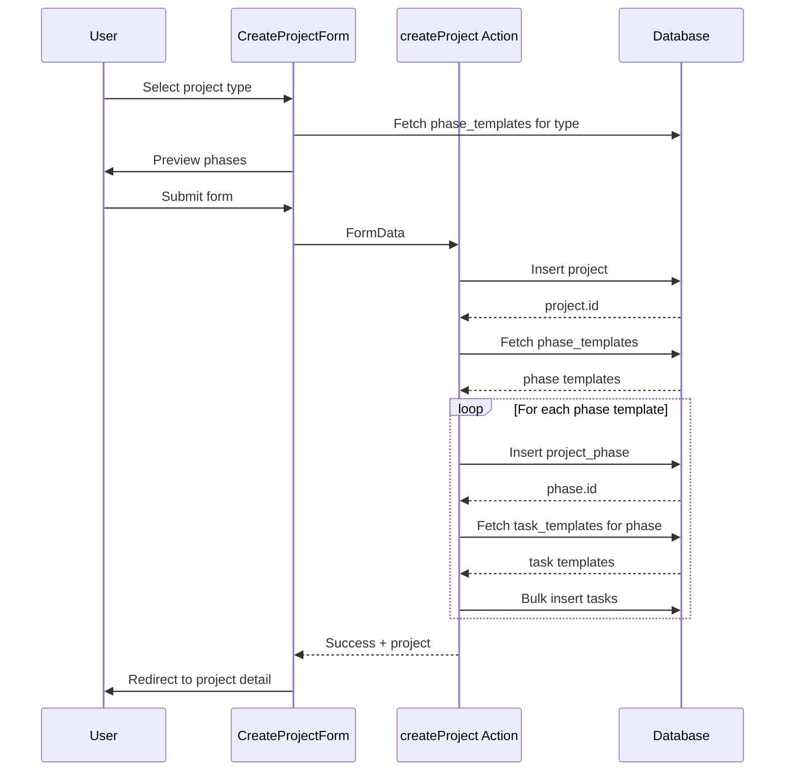

# Design Document: Project Configuration & Template Management

## Executive Summary

### Feature Overview
The Project Configuration & Template Management feature enables GC Admin users to customize project workflows by managing project types, task types, phase templates, and task templates through a centralized Settings page. This moves configurations from hardcoded values in `lib/default-project-templates.ts` to company-scoped database entries, allowing each construction company to define their own workflows.

### Business Value
- **Customization**: Each company can define project types, phases, and tasks that match their specific workflows
- **Consistency**: Templates ensure standardized project setup across all new projects
- **Efficiency**: Automatic population of phases and tasks reduces manual project setup time
- **Flexibility**: Admin users can modify templates without code changes

### Key Architectural Decisions

| Decision | Rationale |
|----------|-----------|
| Company-scoped templates | Each company needs independent configuration without affecting others |
| Soft reference (text) for project_type | Allows flexibility and prevents FK constraint issues when types are renamed |
| Separate templates from instances | Template changes should not affect existing projects |
| Database seeding on company creation | New companies get sensible defaults immediately |
| Server Actions for all mutations | Consistent with existing codebase patterns, built-in CSRF protection |

### Implementation Timeline

| Phase | Duration | Description |
|-------|----------|-------------|
| Phase 1: Database | 2-3 days | Create tables, migrations, seeding functions |
| Phase 2: Server Actions | 2-3 days | CRUD operations for all entities |
| Phase 3: Settings UI | 3-4 days | Project Configuration section with all managers |
| Phase 4: Integration | 2-3 days | Update project creation flow, template application |
| Phase 5: Testing & Polish | 2 days | End-to-end testing, edge cases, UI polish |

**Total Estimated Duration**: 11-15 days

---

## System Architecture

### High-Level System Design

```
┌─────────────────────────────────────────────────────────────────────────────┐
│                              Settings Page                                   │
│  ┌─────────────┐ ┌─────────────┐ ┌─────────────┐ ┌─────────────────────────┐│
│  │Project Types│ │ Task Types  │ │Phase Temps  │ │    Task Templates       ││
│  └──────┬──────┘ └──────┬──────┘ └──────┬──────┘ └───────────┬─────────────┘│
└─────────┼───────────────┼───────────────┼───────────────────┼───────────────┘
          │               │               │                   │
          ▼               ▼               ▼                   ▼
┌─────────────────────────────────────────────────────────────────────────────┐
│                           Server Actions Layer                               │
│  ┌─────────────────┐ ┌─────────────────┐ ┌──────────────────────────────────┐│
│  │project-types.ts │ │ task-types.ts   │ │ phase-templates.ts               ││
│  │                 │ │                 │ │ task-templates.ts                ││
│  └────────┬────────┘ └────────┬────────┘ └────────────┬─────────────────────┘│
└───────────┼───────────────────┼────────────────────────┼────────────────────┘
            │                   │                        │
            ▼                   ▼                        ▼
┌─────────────────────────────────────────────────────────────────────────────┐
│                              Supabase Database                               │
│  ┌─────────────────┐ ┌─────────────────┐ ┌─────────────────────────────────┐│
│  │project_type_    │ │ task_type_      │ │ phase_templates                 ││
│  │configs          │ │ configs         │ │ task_templates                  ││
│  └────────┬────────┘ └────────┬────────┘ └────────────────┬────────────────┘│
│           │                   │                           │                  │
│           └───────────────────┴───────────────────────────┘                  │
│                               │                                              │
│                               ▼                                              │
│  ┌─────────────────────────────────────────────────────────────────────────┐│
│  │                    Project Creation Flow                                 ││
│  │  1. User selects project_type (from project_type_configs)               ││
│  │  2. System fetches phase_templates for that project_type                ││
│  │  3. System creates project_phases from templates                        ││
│  │  4. System fetches task_templates for each phase                        ││
│  │  5. System creates tasks from task_templates                            ││
│  └─────────────────────────────────────────────────────────────────────────┘│
└─────────────────────────────────────────────────────────────────────────────┘
```

### Data Flow Diagram

```
┌──────────────┐     ┌──────────────┐     ┌──────────────┐
│   Settings   │────▶│   Server     │────▶│   Database   │
│   Page UI    │◀────│   Actions    │◀────│   (RLS)      │
└──────────────┘     └──────────────┘     └──────────────┘
       │                    │                    │
       │                    │                    │
       ▼                    ▼                    ▼
┌──────────────┐     ┌──────────────┐     ┌──────────────┐
│ React State  │     │ Zod Schema   │     │ Company-     │
│ (optimistic) │     │ Validation   │     │ Scoped Data  │
└──────────────┘     └──────────────┘     └──────────────┘
```

### Integration Points with Existing Systems

1. **Project Creation** (`app/actions/projects.ts`)
   - Currently uses `lib/default-project-templates.ts`
   - Will be modified to fetch templates from database
   - Falls back to defaults if no templates exist

2. **Task Modal** (`components/tasks/TaskModal.tsx`)
   - Currently uses hardcoded `TASK_TYPES` array
   - Will fetch task types from `task_type_configs` table
   - Maintains backward compatibility with existing task_type enum

3. **Settings Page** (`app/app/settings/page.tsx`)
   - New "Project Configuration" section for admin users
   - Follows existing section header pattern
   - Uses existing UI components (Card, Dialog, Table)

---

## Technical Specifications

### Database Schema Design

#### Entity Relationship Diagram

```
┌─────────────────────┐
│     companies       │
│  (existing table)   │
└──────────┬──────────┘
           │ 1
           │
           │ N
┌──────────┴──────────┐
│ project_type_configs │◀────────────────────────┐
├─────────────────────┤                          │
│ id (uuid, PK)       │                          │
│ company_id (FK)     │                          │
│ name (text)         │                          │
│ description (text)  │     ┌────────────────────┤
│ icon_name (text)    │     │                    │
│ color (text)        │     │ 1                  │
│ is_default (bool)   │     │                    │
│ order_index (int)   │     │ N                  │
│ is_active (bool)    │     ▼                    │
│ created_at          │  ┌─────────────────────┐ │
│ updated_at          │  │  phase_templates    │ │
└─────────────────────┘  ├─────────────────────┤ │
                         │ id (uuid, PK)       │ │
                         │ company_id (FK)     │─┘
                         │ project_type_config │
                         │   _id (FK)          │
                         │ name (text)         │
                         │ description (text)  │
                         │ order_index (int)   │
                         │ is_active (bool)    │     ┌─────────────────────┐
                         │ created_at          │     │  task_type_configs  │
                         │ updated_at          │     ├─────────────────────┤
                         └──────────┬──────────┘     │ id (uuid, PK)       │
                                    │ 1              │ company_id (FK)     │
                                    │                │ name (text)         │
                                    │ N              │ description (text)  │
                         ┌──────────┴──────────┐     │ color (text)        │
                         │   task_templates    │     │ icon_name (text)    │
                         ├─────────────────────┤     │ is_default (bool)   │
                         │ id (uuid, PK)       │     │ is_active (bool)    │
                         │ company_id (FK)     │     │ created_at          │
                         │ phase_template_id   │     │ updated_at          │
                         │   (FK)              │     └─────────────────────┘
                         │ title (text)        │
                         │ description (text)  │
                         │ default_task_type   │─ ─ ─ (soft ref to name)
                         │   (text)            │
                         │ default_priority    │
                         │   (enum)            │
                         │ order_index (int)   │
                         │ is_active (bool)    │
                         │ created_at          │
                         │ updated_at          │
                         └─────────────────────┘
```

#### SQL Migrations

**Migration 1: Create project_type_configs table**

```sql
-- supabase/migrations/035_project_type_configs.sql

-- Project Type Configurations table
-- Stores company-specific project types (Residential, Commercial, etc.)
CREATE TABLE public.project_type_configs (
  id uuid PRIMARY KEY DEFAULT gen_random_uuid(),
  company_id uuid NOT NULL REFERENCES public.companies(id) ON DELETE CASCADE,
  name text NOT NULL,
  description text,
  icon_name text DEFAULT 'Building2',  -- Lucide icon name
  color text DEFAULT '#001B51',         -- Hex color for UI display
  is_default boolean DEFAULT false,     -- True for seeded defaults
  order_index integer DEFAULT 0,
  is_active boolean DEFAULT true,
  created_at timestamptz DEFAULT now(),
  updated_at timestamptz DEFAULT now(),

  -- Ensure unique names per company
  CONSTRAINT project_type_configs_unique_name UNIQUE (company_id, name)
);

-- Add comment
COMMENT ON TABLE public.project_type_configs IS 'Company-specific project type definitions that replace the hardcoded project_type enum';

-- Enable RLS
ALTER TABLE public.project_type_configs ENABLE ROW LEVEL SECURITY;

-- RLS Policies
CREATE POLICY "Users can view their company project types"
  ON public.project_type_configs FOR SELECT
  USING (company_id = get_user_company_id(next_auth.uid()));

CREATE POLICY "GC Admin can insert project types"
  ON public.project_type_configs FOR INSERT
  WITH CHECK (
    company_id = get_user_company_id(next_auth.uid()) AND
    is_user_gc_admin(next_auth.uid())
  );

CREATE POLICY "GC Admin can update project types"
  ON public.project_type_configs FOR UPDATE
  USING (
    company_id = get_user_company_id(next_auth.uid()) AND
    is_user_gc_admin(next_auth.uid())
  );

CREATE POLICY "GC Admin can delete project types"
  ON public.project_type_configs FOR DELETE
  USING (
    company_id = get_user_company_id(next_auth.uid()) AND
    is_user_gc_admin(next_auth.uid())
  );

-- Index for efficient queries
CREATE INDEX project_type_configs_company_id_idx ON public.project_type_configs(company_id);
CREATE INDEX project_type_configs_order_idx ON public.project_type_configs(company_id, order_index);

-- Trigger for updated_at
CREATE TRIGGER update_project_type_configs_updated_at
  BEFORE UPDATE ON public.project_type_configs
  FOR EACH ROW
  EXECUTE FUNCTION update_updated_at_column();
```

**Migration 2: Create task_type_configs table**

```sql
-- supabase/migrations/036_task_type_configs.sql

-- Task Type Configurations table
-- Stores company-specific task types (Work, Purchase, Approval, Admin)
CREATE TABLE public.task_type_configs (
  id uuid PRIMARY KEY DEFAULT gen_random_uuid(),
  company_id uuid NOT NULL REFERENCES public.companies(id) ON DELETE CASCADE,
  name text NOT NULL,
  description text,
  color text DEFAULT '#3b82f6',         -- Hex color for badge/UI
  icon_name text DEFAULT 'Hammer',      -- Lucide icon name
  is_default boolean DEFAULT false,     -- True for seeded defaults
  is_active boolean DEFAULT true,
  created_at timestamptz DEFAULT now(),
  updated_at timestamptz DEFAULT now(),

  -- Ensure unique names per company
  CONSTRAINT task_type_configs_unique_name UNIQUE (company_id, name)
);

-- Add comment
COMMENT ON TABLE public.task_type_configs IS 'Company-specific task type definitions with colors and icons for categorization';

-- Enable RLS
ALTER TABLE public.task_type_configs ENABLE ROW LEVEL SECURITY;

-- RLS Policies
CREATE POLICY "Users can view their company task types"
  ON public.task_type_configs FOR SELECT
  USING (company_id = get_user_company_id(next_auth.uid()));

CREATE POLICY "GC Admin can insert task types"
  ON public.task_type_configs FOR INSERT
  WITH CHECK (
    company_id = get_user_company_id(next_auth.uid()) AND
    is_user_gc_admin(next_auth.uid())
  );

CREATE POLICY "GC Admin can update task types"
  ON public.task_type_configs FOR UPDATE
  USING (
    company_id = get_user_company_id(next_auth.uid()) AND
    is_user_gc_admin(next_auth.uid())
  );

CREATE POLICY "GC Admin can delete task types"
  ON public.task_type_configs FOR DELETE
  USING (
    company_id = get_user_company_id(next_auth.uid()) AND
    is_user_gc_admin(next_auth.uid())
  );

-- Index for efficient queries
CREATE INDEX task_type_configs_company_id_idx ON public.task_type_configs(company_id);

-- Trigger for updated_at
CREATE TRIGGER update_task_type_configs_updated_at
  BEFORE UPDATE ON public.task_type_configs
  FOR EACH ROW
  EXECUTE FUNCTION update_updated_at_column();
```

**Migration 3: Create phase_templates table**

```sql
-- supabase/migrations/037_phase_templates.sql

-- Phase Templates table
-- Stores phase templates linked to project types
CREATE TABLE public.phase_templates (
  id uuid PRIMARY KEY DEFAULT gen_random_uuid(),
  company_id uuid NOT NULL REFERENCES public.companies(id) ON DELETE CASCADE,
  project_type_config_id uuid NOT NULL REFERENCES public.project_type_configs(id) ON DELETE CASCADE,
  name text NOT NULL,
  description text,
  order_index integer DEFAULT 0,
  is_active boolean DEFAULT true,
  created_at timestamptz DEFAULT now(),
  updated_at timestamptz DEFAULT now(),

  -- Ensure unique phase names per project type
  CONSTRAINT phase_templates_unique_name UNIQUE (project_type_config_id, name)
);

-- Add comment
COMMENT ON TABLE public.phase_templates IS 'Phase templates that are automatically created when a project of a specific type is created';

-- Enable RLS
ALTER TABLE public.phase_templates ENABLE ROW LEVEL SECURITY;

-- RLS Policies
CREATE POLICY "Users can view their company phase templates"
  ON public.phase_templates FOR SELECT
  USING (company_id = get_user_company_id(next_auth.uid()));

CREATE POLICY "GC Admin can insert phase templates"
  ON public.phase_templates FOR INSERT
  WITH CHECK (
    company_id = get_user_company_id(next_auth.uid()) AND
    is_user_gc_admin(next_auth.uid())
  );

CREATE POLICY "GC Admin can update phase templates"
  ON public.phase_templates FOR UPDATE
  USING (
    company_id = get_user_company_id(next_auth.uid()) AND
    is_user_gc_admin(next_auth.uid())
  );

CREATE POLICY "GC Admin can delete phase templates"
  ON public.phase_templates FOR DELETE
  USING (
    company_id = get_user_company_id(next_auth.uid()) AND
    is_user_gc_admin(next_auth.uid())
  );

-- Indexes
CREATE INDEX phase_templates_company_id_idx ON public.phase_templates(company_id);
CREATE INDEX phase_templates_project_type_idx ON public.phase_templates(project_type_config_id);
CREATE INDEX phase_templates_order_idx ON public.phase_templates(project_type_config_id, order_index);

-- Trigger for updated_at
CREATE TRIGGER update_phase_templates_updated_at
  BEFORE UPDATE ON public.phase_templates
  FOR EACH ROW
  EXECUTE FUNCTION update_updated_at_column();
```

**Migration 4: Create task_templates table**

```sql
-- supabase/migrations/038_task_templates.sql

-- Task Templates table
-- Stores task templates linked to phase templates
CREATE TABLE public.task_templates (
  id uuid PRIMARY KEY DEFAULT gen_random_uuid(),
  company_id uuid NOT NULL REFERENCES public.companies(id) ON DELETE CASCADE,
  phase_template_id uuid NOT NULL REFERENCES public.phase_templates(id) ON DELETE CASCADE,
  title text NOT NULL,
  description text,
  default_task_type text DEFAULT 'work',  -- Soft reference to task_type_configs.name
  default_priority text DEFAULT 'medium', -- low, medium, high
  order_index integer DEFAULT 0,
  is_active boolean DEFAULT true,
  created_at timestamptz DEFAULT now(),
  updated_at timestamptz DEFAULT now()
);

-- Add comment
COMMENT ON TABLE public.task_templates IS 'Task templates that are automatically created along with phases when a project is created';

-- Enable RLS
ALTER TABLE public.task_templates ENABLE ROW LEVEL SECURITY;

-- RLS Policies
CREATE POLICY "Users can view their company task templates"
  ON public.task_templates FOR SELECT
  USING (company_id = get_user_company_id(next_auth.uid()));

CREATE POLICY "GC Admin can insert task templates"
  ON public.task_templates FOR INSERT
  WITH CHECK (
    company_id = get_user_company_id(next_auth.uid()) AND
    is_user_gc_admin(next_auth.uid())
  );

CREATE POLICY "GC Admin can update task templates"
  ON public.task_templates FOR UPDATE
  USING (
    company_id = get_user_company_id(next_auth.uid()) AND
    is_user_gc_admin(next_auth.uid())
  );

CREATE POLICY "GC Admin can delete task templates"
  ON public.task_templates FOR DELETE
  USING (
    company_id = get_user_company_id(next_auth.uid()) AND
    is_user_gc_admin(next_auth.uid())
  );

-- Indexes
CREATE INDEX task_templates_company_id_idx ON public.task_templates(company_id);
CREATE INDEX task_templates_phase_idx ON public.task_templates(phase_template_id);
CREATE INDEX task_templates_order_idx ON public.task_templates(phase_template_id, order_index);

-- Trigger for updated_at
CREATE TRIGGER update_task_templates_updated_at
  BEFORE UPDATE ON public.task_templates
  FOR EACH ROW
  EXECUTE FUNCTION update_updated_at_column();
```

**Migration 5: Seed default templates function**

```sql
-- supabase/migrations/039_seed_default_templates.sql

-- Function to seed default project types and templates for a company
CREATE OR REPLACE FUNCTION seed_company_templates(p_company_id uuid)
RETURNS void AS $$
DECLARE
  v_residential_id uuid;
  v_restaurant_id uuid;
  v_commercial_id uuid;
  v_industrial_id uuid;
  v_phase_id uuid;
BEGIN
  -- Insert default project types
  INSERT INTO public.project_type_configs (company_id, name, description, icon_name, color, is_default, order_index)
  VALUES
    (p_company_id, 'Residential', 'Single-family homes, apartments, condos', 'Home', '#3b82f6', true, 0),
    (p_company_id, 'Restaurant/Cafe', 'Restaurants, cafes, food service', 'UtensilsCrossed', '#f59e0b', true, 1),
    (p_company_id, 'Commercial Office', 'Office buildings, retail spaces', 'Building2', '#8b5cf6', true, 2),
    (p_company_id, 'Industrial', 'Warehouses, factories, manufacturing', 'Factory', '#64748b', true, 3)
  ON CONFLICT (company_id, name) DO NOTHING;

  -- Get the IDs of the inserted project types
  SELECT id INTO v_residential_id FROM public.project_type_configs
    WHERE company_id = p_company_id AND name = 'Residential';
  SELECT id INTO v_restaurant_id FROM public.project_type_configs
    WHERE company_id = p_company_id AND name = 'Restaurant/Cafe';
  SELECT id INTO v_commercial_id FROM public.project_type_configs
    WHERE company_id = p_company_id AND name = 'Commercial Office';
  SELECT id INTO v_industrial_id FROM public.project_type_configs
    WHERE company_id = p_company_id AND name = 'Industrial';

  -- Insert default task types
  INSERT INTO public.task_type_configs (company_id, name, description, color, icon_name, is_default)
  VALUES
    (p_company_id, 'work', 'Standard labor and construction tasks', '#3b82f6', 'Hammer', true),
    (p_company_id, 'purchase', 'Materials, equipment, and supplies', '#10b981', 'ShoppingCart', true),
    (p_company_id, 'approval', 'Permits, sign-offs, and inspections', '#f59e0b', 'ClipboardCheck', true),
    (p_company_id, 'admin', 'Administrative and overhead tasks', '#64748b', 'FileText', true)
  ON CONFLICT (company_id, name) DO NOTHING;

  -- Insert phase templates for Residential
  IF v_residential_id IS NOT NULL THEN
    -- Initiation Phase
    INSERT INTO public.phase_templates (company_id, project_type_config_id, name, description, order_index)
    VALUES (p_company_id, v_residential_id, 'Initiation', 'Project kickoff and initial planning', 0)
    RETURNING id INTO v_phase_id;

    INSERT INTO public.task_templates (company_id, phase_template_id, title, default_task_type, order_index)
    VALUES
      (p_company_id, v_phase_id, 'Site Assessment', 'work', 0),
      (p_company_id, v_phase_id, 'Preliminary Estimating', 'work', 1),
      (p_company_id, v_phase_id, 'Proposal Submission', 'admin', 2),
      (p_company_id, v_phase_id, 'Sign Prime Contract', 'approval', 3),
      (p_company_id, v_phase_id, 'Concept Design', 'work', 4);

    -- Pre-construction Phase
    INSERT INTO public.phase_templates (company_id, project_type_config_id, name, description, order_index)
    VALUES (p_company_id, v_residential_id, 'Pre-construction', 'Planning and preparation before construction begins', 1)
    RETURNING id INTO v_phase_id;

    INSERT INTO public.task_templates (company_id, phase_template_id, title, default_task_type, order_index)
    VALUES
      (p_company_id, v_phase_id, 'Permitting', 'approval', 0),
      (p_company_id, v_phase_id, 'Utility Setup', 'admin', 1),
      (p_company_id, v_phase_id, 'Site Logistics', 'work', 2),
      (p_company_id, v_phase_id, 'Create Construction Schedule', 'admin', 3);

    -- Procurement Phase
    INSERT INTO public.phase_templates (company_id, project_type_config_id, name, description, order_index)
    VALUES (p_company_id, v_residential_id, 'Procurement', 'Material and equipment procurement', 2)
    RETURNING id INTO v_phase_id;

    INSERT INTO public.task_templates (company_id, phase_template_id, title, default_task_type, order_index)
    VALUES
      (p_company_id, v_phase_id, 'Material Takeoffs', 'work', 0),
      (p_company_id, v_phase_id, 'Purchase Orders', 'purchase', 1);

    -- Construction Phase
    INSERT INTO public.phase_templates (company_id, project_type_config_id, name, description, order_index)
    VALUES (p_company_id, v_residential_id, 'Construction', 'Active construction phase', 3)
    RETURNING id INTO v_phase_id;

    INSERT INTO public.task_templates (company_id, phase_template_id, title, default_task_type, order_index)
    VALUES
      (p_company_id, v_phase_id, 'Foundation Inspection', 'approval', 0),
      (p_company_id, v_phase_id, 'Framing Walkthrough with Client', 'approval', 1),
      (p_company_id, v_phase_id, 'Insulation & Drywall Inspection', 'approval', 2),
      (p_company_id, v_phase_id, 'Quality Control Checks', 'work', 3),
      (p_company_id, v_phase_id, 'Inspection Coordination', 'admin', 4);

    -- Post-construction Phase
    INSERT INTO public.phase_templates (company_id, project_type_config_id, name, description, order_index)
    VALUES (p_company_id, v_residential_id, 'Post-construction', 'Final inspections and project closeout', 4)
    RETURNING id INTO v_phase_id;

    INSERT INTO public.task_templates (company_id, phase_template_id, title, default_task_type, order_index)
    VALUES
      (p_company_id, v_phase_id, '"Blue Tape" Walkthrough', 'approval', 0),
      (p_company_id, v_phase_id, 'Final Cleaning', 'work', 1),
      (p_company_id, v_phase_id, 'Demobilization', 'work', 2),
      (p_company_id, v_phase_id, 'Certificate of Occupancy', 'approval', 3);
  END IF;

  -- Similar structure for Restaurant/Cafe, Commercial Office, and Industrial...
  -- (Abbreviated for document length - full implementation would include all project types)

END;
$$ LANGUAGE plpgsql SECURITY DEFINER;

-- Trigger to seed templates when a new company is created
CREATE OR REPLACE FUNCTION on_company_created_seed_templates()
RETURNS TRIGGER AS $$
BEGIN
  PERFORM seed_company_templates(NEW.id);
  RETURN NEW;
END;
$$ LANGUAGE plpgsql SECURITY DEFINER;

CREATE TRIGGER seed_templates_on_company_create
  AFTER INSERT ON public.companies
  FOR EACH ROW
  EXECUTE FUNCTION on_company_created_seed_templates();

-- Seed existing companies
DO $$
DECLARE
  company_record RECORD;
BEGIN
  FOR company_record IN SELECT id FROM public.companies LOOP
    PERFORM seed_company_templates(company_record.id);
  END LOOP;
END $$;
```

---

## API Design (Server Actions)

### Project Type Actions (`app/actions/project-types.ts`)

```typescript
'use server';

import { revalidatePath } from 'next/cache';
import { z } from 'zod';
import { createClient } from '@/utils/supabase/server';
import { auth } from '@/lib/auth';

// ============================================
// Validation Schemas
// ============================================

const createProjectTypeSchema = z.object({
  name: z.string().min(1, 'Name is required').max(100),
  description: z.string().max(500).optional(),
  icon_name: z.string().default('Building2'),
  color: z.string().regex(/^#[0-9A-Fa-f]{6}$/, 'Invalid hex color').default('#001B51'),
});

const updateProjectTypeSchema = createProjectTypeSchema.partial().extend({
  id: z.string().uuid(),
  order_index: z.number().int().min(0).optional(),
  is_active: z.boolean().optional(),
});

// ============================================
// Types
// ============================================

export interface ProjectTypeConfig {
  id: string;
  company_id: string;
  name: string;
  description: string | null;
  icon_name: string;
  color: string;
  is_default: boolean;
  order_index: number;
  is_active: boolean;
  created_at: string;
  updated_at: string;
  // Computed: count of projects using this type
  project_count?: number;
}

// ============================================
// Helper Functions
// ============================================

async function getUserContext() {
  const session = await auth();
  if (!session?.user?.id) {
    return { error: 'Not authenticated' };
  }

  const supabase = await createClient();
  const { data: companyUser, error: companyError } = await supabase
    .from('company_users')
    .select('company_id, role, status')
    .eq('user_id', session.user.id)
    .eq('status', 'active')
    .maybeSingle();

  if (companyError || !companyUser) {
    return { error: 'No active company found for user' };
  }

  // Only GC Admin can manage project types
  if (companyUser.role !== 'admin') {
    return { error: 'Insufficient permissions. Only GC Admin can manage project types.' };
  }

  return {
    userId: session.user.id,
    companyId: companyUser.company_id,
    role: companyUser.role,
    supabase,
  };
}

// ============================================
// Server Actions
// ============================================

/**
 * Get all project types for the user's company
 */
export async function getProjectTypes(): Promise<{
  projectTypes?: ProjectTypeConfig[];
  error?: string;
}> {
  console.log('[getProjectTypes] Fetching project types...');

  const session = await auth();
  if (!session?.user?.id) {
    return { error: 'Not authenticated' };
  }

  const supabase = await createClient();

  // Get user's company
  const { data: companyUser } = await supabase
    .from('company_users')
    .select('company_id')
    .eq('user_id', session.user.id)
    .eq('status', 'active')
    .maybeSingle();

  if (!companyUser) {
    return { error: 'No active company found' };
  }

  // Fetch project types with project counts
  const { data: projectTypes, error } = await supabase
    .from('project_type_configs')
    .select('*')
    .eq('company_id', companyUser.company_id)
    .order('order_index', { ascending: true });

  if (error) {
    console.error('[getProjectTypes] Error:', error);
    return { error: 'Failed to fetch project types' };
  }

  // Get project counts for each type
  const { data: projects } = await supabase
    .from('projects')
    .select('project_type')
    .eq('company_id', companyUser.company_id);

  const projectCounts = (projects || []).reduce((acc, p) => {
    acc[p.project_type] = (acc[p.project_type] || 0) + 1;
    return acc;
  }, {} as Record<string, number>);

  const typesWithCounts = (projectTypes || []).map(pt => ({
    ...pt,
    project_count: projectCounts[pt.name] || 0,
  }));

  return { projectTypes: typesWithCounts };
}

/**
 * Create a new project type
 */
export async function createProjectType(formData: FormData): Promise<{
  success?: boolean;
  projectType?: ProjectTypeConfig;
  error?: string;
  fieldErrors?: Record<string, string[]>;
}> {
  console.log('[createProjectType] Creating new project type...');

  const userContext = await getUserContext();
  if ('error' in userContext) {
    return { error: userContext.error };
  }

  const { companyId, supabase } = userContext;

  // Parse and validate
  const rawData = {
    name: formData.get('name'),
    description: formData.get('description') || '',
    icon_name: formData.get('icon_name') || 'Building2',
    color: formData.get('color') || '#001B51',
  };

  const validation = createProjectTypeSchema.safeParse(rawData);
  if (!validation.success) {
    return { error: 'Validation failed', fieldErrors: validation.error.flatten().fieldErrors };
  }

  // Get max order_index
  const { data: maxOrder } = await supabase
    .from('project_type_configs')
    .select('order_index')
    .eq('company_id', companyId)
    .order('order_index', { ascending: false })
    .limit(1)
    .single();

  const newOrderIndex = (maxOrder?.order_index ?? -1) + 1;

  // Insert
  const { data: projectType, error } = await supabase
    .from('project_type_configs')
    .insert({
      company_id: companyId,
      ...validation.data,
      order_index: newOrderIndex,
    })
    .select()
    .single();

  if (error) {
    console.error('[createProjectType] Error:', error);
    if (error.code === '23505') {
      return { error: 'A project type with this name already exists' };
    }
    return { error: 'Failed to create project type' };
  }

  revalidatePath('/app/settings');
  return { success: true, projectType };
}

/**
 * Update an existing project type
 */
export async function updateProjectType(formData: FormData): Promise<{
  success?: boolean;
  projectType?: ProjectTypeConfig;
  error?: string;
  fieldErrors?: Record<string, string[]>;
}> {
  console.log('[updateProjectType] Updating project type...');

  const userContext = await getUserContext();
  if ('error' in userContext) {
    return { error: userContext.error };
  }

  const { companyId, supabase } = userContext;

  const rawData = {
    id: formData.get('id'),
    name: formData.get('name'),
    description: formData.get('description') || '',
    icon_name: formData.get('icon_name'),
    color: formData.get('color'),
    is_active: formData.get('is_active') === 'true',
  };

  const validation = updateProjectTypeSchema.safeParse(rawData);
  if (!validation.success) {
    return { error: 'Validation failed', fieldErrors: validation.error.flatten().fieldErrors };
  }

  const { id, ...updateData } = validation.data;

  // Verify ownership
  const { data: existing } = await supabase
    .from('project_type_configs')
    .select('company_id')
    .eq('id', id)
    .single();

  if (!existing || existing.company_id !== companyId) {
    return { error: 'Project type not found' };
  }

  // Update
  const { data: projectType, error } = await supabase
    .from('project_type_configs')
    .update(updateData)
    .eq('id', id)
    .select()
    .single();

  if (error) {
    console.error('[updateProjectType] Error:', error);
    return { error: 'Failed to update project type' };
  }

  revalidatePath('/app/settings');
  return { success: true, projectType };
}

/**
 * Delete a project type
 */
export async function deleteProjectType(id: string): Promise<{
  success?: boolean;
  error?: string;
}> {
  console.log('[deleteProjectType] Deleting project type:', id);

  const userContext = await getUserContext();
  if ('error' in userContext) {
    return { error: userContext.error };
  }

  const { companyId, supabase } = userContext;

  // Check if project type exists and belongs to company
  const { data: existing } = await supabase
    .from('project_type_configs')
    .select('company_id, name')
    .eq('id', id)
    .single();

  if (!existing || existing.company_id !== companyId) {
    return { error: 'Project type not found' };
  }

  // Check if any projects use this type
  const { data: projects } = await supabase
    .from('projects')
    .select('id')
    .eq('company_id', companyId)
    .eq('project_type', existing.name)
    .limit(1);

  if (projects && projects.length > 0) {
    return { error: 'Cannot delete: This project type is assigned to existing projects' };
  }

  // Delete (will cascade to phase_templates and task_templates)
  const { error } = await supabase
    .from('project_type_configs')
    .delete()
    .eq('id', id);

  if (error) {
    console.error('[deleteProjectType] Error:', error);
    return { error: 'Failed to delete project type' };
  }

  revalidatePath('/app/settings');
  return { success: true };
}
```

### Task Type Actions (`app/actions/task-types.ts`)

```typescript
'use server';

import { revalidatePath } from 'next/cache';
import { z } from 'zod';
import { createClient } from '@/utils/supabase/server';
import { auth } from '@/lib/auth';

// ============================================
// Validation Schemas
// ============================================

const createTaskTypeSchema = z.object({
  name: z.string().min(1, 'Name is required').max(50),
  description: z.string().max(200).optional(),
  color: z.string().regex(/^#[0-9A-Fa-f]{6}$/, 'Invalid hex color').default('#3b82f6'),
  icon_name: z.string().default('Hammer'),
});

const updateTaskTypeSchema = createTaskTypeSchema.partial().extend({
  id: z.string().uuid(),
  is_active: z.boolean().optional(),
});

// ============================================
// Types
// ============================================

export interface TaskTypeConfig {
  id: string;
  company_id: string;
  name: string;
  description: string | null;
  color: string;
  icon_name: string;
  is_default: boolean;
  is_active: boolean;
  created_at: string;
  updated_at: string;
}

// ============================================
// Server Actions
// ============================================

/**
 * Get all task types for the user's company
 */
export async function getTaskTypes(): Promise<{
  taskTypes?: TaskTypeConfig[];
  error?: string;
}> {
  console.log('[getTaskTypes] Fetching task types...');

  const session = await auth();
  if (!session?.user?.id) {
    return { error: 'Not authenticated' };
  }

  const supabase = await createClient();

  const { data: companyUser } = await supabase
    .from('company_users')
    .select('company_id')
    .eq('user_id', session.user.id)
    .eq('status', 'active')
    .maybeSingle();

  if (!companyUser) {
    return { error: 'No active company found' };
  }

  const { data: taskTypes, error } = await supabase
    .from('task_type_configs')
    .select('*')
    .eq('company_id', companyUser.company_id)
    .eq('is_active', true)
    .order('name');

  if (error) {
    console.error('[getTaskTypes] Error:', error);
    return { error: 'Failed to fetch task types' };
  }

  return { taskTypes: taskTypes || [] };
}

/**
 * Create a new task type
 */
export async function createTaskType(formData: FormData): Promise<{
  success?: boolean;
  taskType?: TaskTypeConfig;
  error?: string;
  fieldErrors?: Record<string, string[]>;
}> {
  // Implementation similar to createProjectType
  // ... (full implementation would follow same pattern)
}

/**
 * Update an existing task type
 */
export async function updateTaskType(formData: FormData): Promise<{
  success?: boolean;
  taskType?: TaskTypeConfig;
  error?: string;
}> {
  // Implementation similar to updateProjectType
  // ... (full implementation would follow same pattern)
}

/**
 * Delete a task type (soft delete - sets is_active = false)
 */
export async function deleteTaskType(id: string): Promise<{
  success?: boolean;
  error?: string;
}> {
  // Soft delete to preserve historical data
  // ... (full implementation would follow same pattern)
}
```

### Phase Template Actions (`app/actions/phase-templates.ts`)

```typescript
'use server';

import { revalidatePath } from 'next/cache';
import { z } from 'zod';
import { createClient } from '@/utils/supabase/server';
import { auth } from '@/lib/auth';

// ============================================
// Types
// ============================================

export interface PhaseTemplate {
  id: string;
  company_id: string;
  project_type_config_id: string;
  name: string;
  description: string | null;
  order_index: number;
  is_active: boolean;
  created_at: string;
  updated_at: string;
  // Nested task templates
  task_templates?: TaskTemplate[];
}

export interface TaskTemplate {
  id: string;
  company_id: string;
  phase_template_id: string;
  title: string;
  description: string | null;
  default_task_type: string;
  default_priority: string;
  order_index: number;
  is_active: boolean;
}

// ============================================
// Server Actions
// ============================================

/**
 * Get phase templates for a project type
 */
export async function getPhaseTemplates(projectTypeConfigId?: string): Promise<{
  phaseTemplates?: PhaseTemplate[];
  error?: string;
}> {
  console.log('[getPhaseTemplates] Fetching...');

  const session = await auth();
  if (!session?.user?.id) {
    return { error: 'Not authenticated' };
  }

  const supabase = await createClient();

  const { data: companyUser } = await supabase
    .from('company_users')
    .select('company_id')
    .eq('user_id', session.user.id)
    .eq('status', 'active')
    .maybeSingle();

  if (!companyUser) {
    return { error: 'No active company found' };
  }

  let query = supabase
    .from('phase_templates')
    .select(`
      *,
      task_templates (*)
    `)
    .eq('company_id', companyUser.company_id)
    .eq('is_active', true)
    .order('order_index');

  if (projectTypeConfigId) {
    query = query.eq('project_type_config_id', projectTypeConfigId);
  }

  const { data: phaseTemplates, error } = await query;

  if (error) {
    console.error('[getPhaseTemplates] Error:', error);
    return { error: 'Failed to fetch phase templates' };
  }

  return { phaseTemplates: phaseTemplates || [] };
}

/**
 * Reorder phase templates within a project type
 */
export async function reorderPhaseTemplates(
  projectTypeConfigId: string,
  orderedIds: string[]
): Promise<{ success?: boolean; error?: string }> {
  console.log('[reorderPhaseTemplates] Reordering phases...');

  // Get user context and verify permissions
  // ...

  const supabase = await createClient();

  // Update order_index for each phase
  const updates = orderedIds.map((id, index) => ({
    id,
    order_index: index,
  }));

  for (const update of updates) {
    const { error } = await supabase
      .from('phase_templates')
      .update({ order_index: update.order_index })
      .eq('id', update.id);

    if (error) {
      console.error('[reorderPhaseTemplates] Error:', error);
      return { error: 'Failed to reorder phases' };
    }
  }

  revalidatePath('/app/settings');
  return { success: true };
}

// Additional CRUD operations follow similar patterns...
```

---

## UI/UX Design

### Settings Page Layout

The Project Configuration section will be added to the existing Settings page, visible only to admin users.

```tsx
// app/app/settings/page.tsx (Updated)

import { auth } from '@/lib/auth';
import { createClient } from '@/utils/supabase/server';
import { SettingsSectionHeader } from '@/components/settings/SettingsSectionHeader';
import { ProjectConfigurationSection } from '@/components/settings/ProjectConfigurationSection';
import { Bell, MessageCircle, User, Building2, Wrench } from 'lucide-react';

export default async function SettingsPage() {
  const session = await auth();
  const supabase = await createClient();

  // Check if user is GC Admin
  const { data: companyUser } = await supabase
    .from('company_users')
    .select('role')
    .eq('user_id', session?.user?.id)
    .eq('status', 'active')
    .single();

  const isGcAdmin = companyUser?.role === 'admin';

  return (
    <div className="flex-1 space-y-4 md:space-y-6 p-4 md:p-8 pt-4 md:pt-6 relative overflow-hidden">
      {/* Blueprint Grid Background */}
      <div className="fixed inset-0 pointer-events-none opacity-[0.03]">
        {/* ... existing background ... */}
      </div>

      {/* Page Header */}
      <div className="relative">
        <div className="absolute top-0 left-0 right-0 h-1 bg-construction-blue" />
        <div className="pt-2 md:pt-4">
          <h1 className="text-3xl md:text-5xl font-black tracking-tighter text-construction-blue leading-none">
            SETTINGS
          </h1>
          <p className="mt-2 text-sm md:text-base text-gray-500">
            Configure your account preferences and integrations
          </p>
        </div>
      </div>

      {/* Settings Sections */}
      <div className="space-y-6 md:space-y-8 relative z-10">
        {/* Project Configuration - GC Admin Only */}
        {isGcAdmin && (
          <section className="space-y-4">
            <SettingsSectionHeader
              icon={Wrench}
              title="Project Configuration"
              description="Manage project types, task types, and templates for your company"
            />
            <ProjectConfigurationSection />
          </section>
        )}

        {/* Existing sections... */}
        <section className="space-y-4">
          <SettingsSectionHeader
            icon={Bell}
            title="Notifications"
            description="Manage how you receive job site alerts and updates"
          />
          <ChatNotificationPreferences />
        </section>

        {/* ... other sections ... */}
      </div>
    </div>
  );
}
```

### Component Hierarchy

```
ProjectConfigurationSection
├── ConfigurationTabs (Tabs component)
│   ├── Tab: Project Types
│   │   └── ProjectTypeManager
│   │       ├── ProjectTypeList (Table)
│   │       ├── CreateProjectTypeModal (Dialog)
│   │       └── EditProjectTypeModal (Dialog)
│   │
│   ├── Tab: Task Types
│   │   └── TaskTypeManager
│   │       ├── TaskTypeList (Grid of cards)
│   │       ├── CreateTaskTypeModal (Dialog)
│   │       └── EditTaskTypeModal (Dialog)
│   │
│   ├── Tab: Phase Templates
│   │   └── PhaseTemplateManager
│   │       ├── ProjectTypeSelector (Dropdown)
│   │       ├── PhaseTemplateList (Sortable list)
│   │       ├── CreatePhaseModal (Dialog)
│   │       └── EditPhaseModal (Dialog)
│   │
│   └── Tab: Task Templates
│       └── TaskTemplateManager
│           ├── ProjectTypeSelector (Dropdown)
│           ├── PhaseSelector (Dropdown)
│           ├── TaskTemplateList (Sortable list)
│           ├── CreateTaskTemplateModal (Dialog)
│           └── EditTaskTemplateModal (Dialog)
```

### ProjectTypeManager Component

```tsx
// components/settings/ProjectTypeManager.tsx
'use client';

import { useState, useEffect } from 'react';
import { motion, AnimatePresence } from 'framer-motion';
import { Plus, Edit, Trash2, Building2, Home, Factory, UtensilsCrossed } from 'lucide-react';
import { Button } from '@/components/ui/button';
import { Card, CardContent } from '@/components/ui/card';
import {
  Table,
  TableBody,
  TableCell,
  TableHead,
  TableHeader,
  TableRow,
} from '@/components/ui/table';
import {
  Dialog,
  DialogContent,
  DialogHeader,
  DialogTitle,
  DialogDescription,
  DialogFooter,
} from '@/components/ui/dialog';
import { Input } from '@/components/ui/input';
import { Label } from '@/components/ui/label';
import { Textarea } from '@/components/ui/textarea';
import { toast } from 'sonner';
import { cn } from '@/lib/utils';
import {
  getProjectTypes,
  createProjectType,
  updateProjectType,
  deleteProjectType,
  type ProjectTypeConfig,
} from '@/app/actions/project-types';

// Icon mapping for project types
const ICON_MAP: Record<string, React.ComponentType<{ className?: string }>> = {
  Home,
  Building2,
  Factory,
  UtensilsCrossed,
};

export function ProjectTypeManager() {
  const [projectTypes, setProjectTypes] = useState<ProjectTypeConfig[]>([]);
  const [isLoading, setIsLoading] = useState(true);
  const [showCreateModal, setShowCreateModal] = useState(false);
  const [editingType, setEditingType] = useState<ProjectTypeConfig | null>(null);
  const [deletingType, setDeletingType] = useState<ProjectTypeConfig | null>(null);

  // Fetch project types on mount
  useEffect(() => {
    loadProjectTypes();
  }, []);

  async function loadProjectTypes() {
    setIsLoading(true);
    const result = await getProjectTypes();
    if (result.projectTypes) {
      setProjectTypes(result.projectTypes);
    } else if (result.error) {
      toast.error(result.error);
    }
    setIsLoading(false);
  }

  async function handleCreate(formData: FormData) {
    const result = await createProjectType(formData);
    if (result.success) {
      toast.success('Project type created');
      setShowCreateModal(false);
      loadProjectTypes();
    } else {
      toast.error(result.error || 'Failed to create');
    }
  }

  async function handleUpdate(formData: FormData) {
    const result = await updateProjectType(formData);
    if (result.success) {
      toast.success('Project type updated');
      setEditingType(null);
      loadProjectTypes();
    } else {
      toast.error(result.error || 'Failed to update');
    }
  }

  async function handleDelete(id: string) {
    const result = await deleteProjectType(id);
    if (result.success) {
      toast.success('Project type deleted');
      setDeletingType(null);
      loadProjectTypes();
    } else {
      toast.error(result.error || 'Failed to delete');
    }
  }

  return (
    <Card className="border-2 border-gray-200 shadow-construction">
      <CardContent className="p-4 md:p-6">
        {/* Header */}
        <div className="flex items-center justify-between mb-4">
          <div>
            <h3 className="text-lg font-bold text-gray-900">Project Types</h3>
            <p className="text-sm text-gray-500">
              Define the types of construction projects your company handles
            </p>
          </div>
          <Button
            onClick={() => setShowCreateModal(true)}
            className="bg-construction-blue hover:bg-construction-blue/90"
          >
            <Plus className="h-4 w-4 mr-2" />
            Add Type
          </Button>
        </div>

        {/* Project Types Table */}
        <div className="border-2 border-gray-200 rounded-lg overflow-hidden">
          <Table>
            <TableHeader>
              <TableRow className="bg-gray-50">
                <TableHead className="font-bold">Type</TableHead>
                <TableHead className="font-bold">Description</TableHead>
                <TableHead className="font-bold text-center">Projects</TableHead>
                <TableHead className="font-bold text-center">Status</TableHead>
                <TableHead className="font-bold text-right">Actions</TableHead>
              </TableRow>
            </TableHeader>
            <TableBody>
              {isLoading ? (
                <TableRow>
                  <TableCell colSpan={5} className="text-center py-8">
                    Loading...
                  </TableCell>
                </TableRow>
              ) : projectTypes.length === 0 ? (
                <TableRow>
                  <TableCell colSpan={5} className="text-center py-8 text-gray-500">
                    No project types defined. Add your first project type to get started.
                  </TableCell>
                </TableRow>
              ) : (
                projectTypes.map((type) => {
                  const IconComponent = ICON_MAP[type.icon_name] || Building2;
                  return (
                    <TableRow key={type.id}>
                      <TableCell>
                        <div className="flex items-center gap-3">
                          <div
                            className="p-2 rounded-lg"
                            style={{ backgroundColor: `${type.color}20` }}
                          >
                            <IconComponent
                              className="h-5 w-5"
                              style={{ color: type.color }}
                            />
                          </div>
                          <span className="font-medium">{type.name}</span>
                        </div>
                      </TableCell>
                      <TableCell className="text-gray-600 max-w-xs truncate">
                        {type.description || '-'}
                      </TableCell>
                      <TableCell className="text-center">
                        <span className="px-2 py-1 bg-gray-100 rounded-full text-sm font-medium">
                          {type.project_count || 0}
                        </span>
                      </TableCell>
                      <TableCell className="text-center">
                        <span
                          className={cn(
                            'px-2 py-1 rounded-full text-xs font-medium',
                            type.is_active
                              ? 'bg-green-100 text-green-700'
                              : 'bg-gray-100 text-gray-600'
                          )}
                        >
                          {type.is_active ? 'Active' : 'Inactive'}
                        </span>
                      </TableCell>
                      <TableCell className="text-right">
                        <div className="flex items-center justify-end gap-2">
                          <Button
                            variant="ghost"
                            size="sm"
                            onClick={() => setEditingType(type)}
                          >
                            <Edit className="h-4 w-4" />
                          </Button>
                          <Button
                            variant="ghost"
                            size="sm"
                            onClick={() => setDeletingType(type)}
                            disabled={type.is_default || (type.project_count || 0) > 0}
                            className="text-red-600 hover:text-red-700 hover:bg-red-50"
                          >
                            <Trash2 className="h-4 w-4" />
                          </Button>
                        </div>
                      </TableCell>
                    </TableRow>
                  );
                })
              )}
            </TableBody>
          </Table>
        </div>

        {/* Create Modal */}
        <Dialog open={showCreateModal} onOpenChange={setShowCreateModal}>
          <DialogContent className="sm:max-w-md">
            <DialogHeader>
              <DialogTitle>Create Project Type</DialogTitle>
              <DialogDescription>
                Add a new project type for your company
              </DialogDescription>
            </DialogHeader>
            <form action={handleCreate} className="space-y-4">
              {/* Form fields... */}
              <div className="space-y-2">
                <Label htmlFor="name">Name *</Label>
                <Input id="name" name="name" placeholder="e.g., Retail Store" required />
              </div>
              <div className="space-y-2">
                <Label htmlFor="description">Description</Label>
                <Textarea
                  id="description"
                  name="description"
                  placeholder="Brief description of this project type"
                  rows={2}
                />
              </div>
              <div className="grid grid-cols-2 gap-4">
                <div className="space-y-2">
                  <Label htmlFor="icon_name">Icon</Label>
                  {/* Icon selector component */}
                  <Input id="icon_name" name="icon_name" defaultValue="Building2" />
                </div>
                <div className="space-y-2">
                  <Label htmlFor="color">Color</Label>
                  <Input id="color" name="color" type="color" defaultValue="#001B51" />
                </div>
              </div>
              <DialogFooter>
                <Button type="button" variant="outline" onClick={() => setShowCreateModal(false)}>
                  Cancel
                </Button>
                <Button type="submit" className="bg-construction-blue">
                  Create Type
                </Button>
              </DialogFooter>
            </form>
          </DialogContent>
        </Dialog>

        {/* Edit Modal - Similar structure */}
        {/* Delete Confirmation Modal */}
      </CardContent>
    </Card>
  );
}
```

### PhaseTemplateManager with Drag-and-Drop

```tsx
// components/settings/PhaseTemplateManager.tsx
'use client';

import { useState, useEffect } from 'react';
import {
  DndContext,
  closestCenter,
  KeyboardSensor,
  PointerSensor,
  useSensor,
  useSensors,
  DragEndEvent,
} from '@dnd-kit/core';
import {
  arrayMove,
  SortableContext,
  sortableKeyboardCoordinates,
  useSortable,
  verticalListSortingStrategy,
} from '@dnd-kit/sortable';
import { CSS } from '@dnd-kit/utilities';
import { GripVertical, Plus, Edit, Trash2, ChevronRight } from 'lucide-react';
import { Button } from '@/components/ui/button';
import { Card, CardContent } from '@/components/ui/card';
import {
  Select,
  SelectContent,
  SelectItem,
  SelectTrigger,
  SelectValue,
} from '@/components/ui/select';
import { toast } from 'sonner';
import { cn } from '@/lib/utils';
import {
  getPhaseTemplates,
  reorderPhaseTemplates,
  type PhaseTemplate,
} from '@/app/actions/phase-templates';
import { getProjectTypes, type ProjectTypeConfig } from '@/app/actions/project-types';

// Sortable Phase Item component
function SortablePhaseItem({
  phase,
  onEdit,
  onDelete,
  onExpandTasks,
}: {
  phase: PhaseTemplate;
  onEdit: () => void;
  onDelete: () => void;
  onExpandTasks: () => void;
}) {
  const {
    attributes,
    listeners,
    setNodeRef,
    transform,
    transition,
    isDragging,
  } = useSortable({ id: phase.id });

  const style = {
    transform: CSS.Transform.toString(transform),
    transition,
  };

  const taskCount = phase.task_templates?.length || 0;

  return (
    <div
      ref={setNodeRef}
      style={style}
      className={cn(
        'flex items-center gap-3 p-4 bg-white border-2 border-gray-200 rounded-lg',
        'hover:border-construction-blue/30 transition-colors',
        isDragging && 'opacity-50 shadow-lg'
      )}
    >
      {/* Drag Handle */}
      <div
        {...attributes}
        {...listeners}
        className="cursor-grab active:cursor-grabbing p-1 hover:bg-gray-100 rounded"
      >
        <GripVertical className="h-5 w-5 text-gray-400" />
      </div>

      {/* Phase Info */}
      <div className="flex-1 min-w-0">
        <div className="flex items-center gap-2">
          <span className="font-bold text-gray-900">{phase.name}</span>
          <span className="px-2 py-0.5 bg-gray-100 text-gray-600 text-xs rounded-full">
            {taskCount} tasks
          </span>
        </div>
        {phase.description && (
          <p className="text-sm text-gray-500 truncate">{phase.description}</p>
        )}
      </div>

      {/* Actions */}
      <div className="flex items-center gap-2">
        <Button variant="ghost" size="sm" onClick={onExpandTasks}>
          <ChevronRight className="h-4 w-4" />
        </Button>
        <Button variant="ghost" size="sm" onClick={onEdit}>
          <Edit className="h-4 w-4" />
        </Button>
        <Button
          variant="ghost"
          size="sm"
          onClick={onDelete}
          className="text-red-600 hover:text-red-700 hover:bg-red-50"
        >
          <Trash2 className="h-4 w-4" />
        </Button>
      </div>
    </div>
  );
}

export function PhaseTemplateManager() {
  const [projectTypes, setProjectTypes] = useState<ProjectTypeConfig[]>([]);
  const [selectedTypeId, setSelectedTypeId] = useState<string | null>(null);
  const [phases, setPhases] = useState<PhaseTemplate[]>([]);
  const [isLoading, setIsLoading] = useState(true);

  const sensors = useSensors(
    useSensor(PointerSensor),
    useSensor(KeyboardSensor, {
      coordinateGetter: sortableKeyboardCoordinates,
    })
  );

  // Fetch project types on mount
  useEffect(() => {
    async function loadProjectTypes() {
      const result = await getProjectTypes();
      if (result.projectTypes) {
        setProjectTypes(result.projectTypes);
        if (result.projectTypes.length > 0) {
          setSelectedTypeId(result.projectTypes[0].id);
        }
      }
    }
    loadProjectTypes();
  }, []);

  // Fetch phases when selected type changes
  useEffect(() => {
    async function loadPhases() {
      if (!selectedTypeId) return;
      setIsLoading(true);
      const result = await getPhaseTemplates(selectedTypeId);
      if (result.phaseTemplates) {
        setPhases(result.phaseTemplates);
      }
      setIsLoading(false);
    }
    loadPhases();
  }, [selectedTypeId]);

  // Handle drag end
  async function handleDragEnd(event: DragEndEvent) {
    const { active, over } = event;

    if (over && active.id !== over.id) {
      const oldIndex = phases.findIndex((p) => p.id === active.id);
      const newIndex = phases.findIndex((p) => p.id === over.id);

      const newPhases = arrayMove(phases, oldIndex, newIndex);
      setPhases(newPhases);

      // Persist to database
      const orderedIds = newPhases.map((p) => p.id);
      const result = await reorderPhaseTemplates(selectedTypeId!, orderedIds);

      if (result.error) {
        toast.error('Failed to reorder phases');
        // Revert on error
        const revertResult = await getPhaseTemplates(selectedTypeId!);
        if (revertResult.phaseTemplates) {
          setPhases(revertResult.phaseTemplates);
        }
      }
    }
  }

  return (
    <Card className="border-2 border-gray-200 shadow-construction">
      <CardContent className="p-4 md:p-6">
        {/* Header with Project Type Selector */}
        <div className="flex items-center justify-between mb-4">
          <div className="flex items-center gap-4">
            <div>
              <h3 className="text-lg font-bold text-gray-900">Phase Templates</h3>
              <p className="text-sm text-gray-500">
                Define phases that auto-populate when creating projects
              </p>
            </div>
            <Select value={selectedTypeId || ''} onValueChange={setSelectedTypeId}>
              <SelectTrigger className="w-[200px]">
                <SelectValue placeholder="Select project type" />
              </SelectTrigger>
              <SelectContent>
                {projectTypes.map((type) => (
                  <SelectItem key={type.id} value={type.id}>
                    {type.name}
                  </SelectItem>
                ))}
              </SelectContent>
            </Select>
          </div>
          <Button className="bg-construction-blue hover:bg-construction-blue/90">
            <Plus className="h-4 w-4 mr-2" />
            Add Phase
          </Button>
        </div>

        {/* Phases List with Drag and Drop */}
        {isLoading ? (
          <div className="text-center py-8 text-gray-500">Loading phases...</div>
        ) : phases.length === 0 ? (
          <div className="text-center py-8 text-gray-500">
            No phases defined for this project type. Add your first phase.
          </div>
        ) : (
          <DndContext
            sensors={sensors}
            collisionDetection={closestCenter}
            onDragEnd={handleDragEnd}
          >
            <SortableContext
              items={phases.map((p) => p.id)}
              strategy={verticalListSortingStrategy}
            >
              <div className="space-y-2">
                {phases.map((phase) => (
                  <SortablePhaseItem
                    key={phase.id}
                    phase={phase}
                    onEdit={() => {/* Open edit modal */}}
                    onDelete={() => {/* Confirm delete */}}
                    onExpandTasks={() => {/* Show task templates */}}
                  />
                ))}
              </div>
            </SortableContext>
          </DndContext>
        )}
      </CardContent>
    </Card>
  );
}
```

---

## Data Flow Architecture

### Template Application During Project Creation



### Modified Project Creation Flow

```typescript
// app/actions/projects.ts (Updated createProject function)

export async function createProject(formData: FormData) {
  // ... existing validation code ...

  // 1. Insert project
  const { data: project, error: insertError } = await supabase
    .from('projects')
    .insert(projectData)
    .select()
    .single();

  if (insertError) {
    return { error: 'Failed to create project' };
  }

  // 2. Get phase templates from database (NEW)
  const projectTypeName = data.project_type; // e.g., 'residential'

  // Find the project_type_config for this type name
  const { data: projectTypeConfig } = await supabase
    .from('project_type_configs')
    .select('id')
    .eq('company_id', companyId)
    .eq('name', projectTypeName)
    .eq('is_active', true)
    .single();

  if (!projectTypeConfig) {
    // Fallback to hardcoded templates if no config exists
    console.log('[createProject] No template config found, using defaults');
    const template = getProjectTemplate(data.project_type as ProjectType);
    // ... existing fallback code ...
    return { success: true, project };
  }

  // 3. Fetch phase templates with task templates
  const { data: phaseTemplates } = await supabase
    .from('phase_templates')
    .select(`
      *,
      task_templates (*)
    `)
    .eq('project_type_config_id', projectTypeConfig.id)
    .eq('is_active', true)
    .order('order_index');

  if (!phaseTemplates || phaseTemplates.length === 0) {
    console.log('[createProject] No phase templates found');
    return { success: true, project };
  }

  // 4. Create phases from templates
  const phasesToInsert = phaseTemplates.map(pt => ({
    project_id: project.id,
    name: pt.name,
    order_index: pt.order_index,
    status: 'not_started',
  }));

  const { data: createdPhases, error: phasesError } = await supabase
    .from('project_phases')
    .insert(phasesToInsert)
    .select();

  if (phasesError || !createdPhases) {
    console.error('[createProject] Failed to create phases:', phasesError);
    return { success: true, project }; // Project exists, phases failed
  }

  // 5. Create tasks from templates
  const tasksToInsert: any[] = [];

  for (let i = 0; i < phaseTemplates.length; i++) {
    const phaseTemplate = phaseTemplates[i];
    const createdPhase = createdPhases[i];

    if (phaseTemplate.task_templates && createdPhase) {
      for (const taskTemplate of phaseTemplate.task_templates) {
        tasksToInsert.push({
          project_id: project.id,
          phase_id: createdPhase.id,
          title: taskTemplate.title,
          description: taskTemplate.description,
          task_type: taskTemplate.default_task_type,
          priority: taskTemplate.default_priority,
          status: 'todo',
          created_by: userId,
        });
      }
    }
  }

  if (tasksToInsert.length > 0) {
    const { error: tasksError } = await supabase
      .from('tasks')
      .insert(tasksToInsert);

    if (tasksError) {
      console.error('[createProject] Failed to create tasks:', tasksError);
    } else {
      console.log(`[createProject] Created ${tasksToInsert.length} tasks`);
    }
  }

  revalidatePath('/app/projects');
  return { success: true, project };
}
```

---

## Error Handling

### Error Categories and Handling

| Error Type | Cause | User Message | Recovery Action |
|------------|-------|--------------|-----------------|
| Validation Error | Invalid input | "Please check the form fields" | Show field-specific errors |
| Duplicate Name | Unique constraint violated | "A [type] with this name already exists" | Suggest different name |
| In-Use Error | Trying to delete used item | "Cannot delete: This [type] is in use" | Suggest deactivating instead |
| Permission Error | Non-admin trying to modify | "Only admins can manage configurations" | Hide actions for non-admins |
| Network Error | API/DB failure | "Something went wrong. Please try again." | Show retry button |

### Error Handling Pattern

```typescript
// Standard error response structure
interface ActionResult<T = unknown> {
  success?: boolean;
  data?: T;
  error?: string;
  fieldErrors?: Record<string, string[]>;
}

// Usage in Server Actions
export async function createProjectType(formData: FormData): Promise<ActionResult<ProjectTypeConfig>> {
  try {
    // Validation
    const validation = schema.safeParse(rawData);
    if (!validation.success) {
      return {
        error: 'Validation failed',
        fieldErrors: validation.error.flatten().fieldErrors,
      };
    }

    // Business logic
    const { data, error } = await supabase.from('project_type_configs').insert(...);

    if (error) {
      // Handle specific Postgres errors
      if (error.code === '23505') {
        return { error: 'A project type with this name already exists' };
      }
      console.error('[createProjectType] Database error:', error);
      return { error: 'Failed to create project type. Please try again.' };
    }

    return { success: true, data };

  } catch (error) {
    console.error('[createProjectType] Unexpected error:', error);
    return { error: 'An unexpected error occurred' };
  }
}
```

---

## Testing Strategy

### Unit Tests

```typescript
// __tests__/actions/project-types.test.ts
import { createProjectType, deleteProjectType } from '@/app/actions/project-types';

describe('Project Type Actions', () => {
  describe('createProjectType', () => {
    it('should create a project type with valid data', async () => {
      const formData = new FormData();
      formData.set('name', 'Test Type');
      formData.set('description', 'Test description');
      formData.set('color', '#ff0000');

      const result = await createProjectType(formData);

      expect(result.success).toBe(true);
      expect(result.projectType?.name).toBe('Test Type');
    });

    it('should reject duplicate names', async () => {
      // Create first type
      const formData = new FormData();
      formData.set('name', 'Duplicate');
      await createProjectType(formData);

      // Try to create duplicate
      const result = await createProjectType(formData);

      expect(result.error).toContain('already exists');
    });

    it('should validate required fields', async () => {
      const formData = new FormData();
      // Missing name

      const result = await createProjectType(formData);

      expect(result.error).toBe('Validation failed');
      expect(result.fieldErrors?.name).toBeDefined();
    });
  });

  describe('deleteProjectType', () => {
    it('should prevent deletion when projects exist', async () => {
      // Setup: Create type and assign to project
      // ...

      const result = await deleteProjectType(typeId);

      expect(result.error).toContain('Cannot delete');
    });
  });
});
```

### Integration Tests

```typescript
// __tests__/integration/template-application.test.ts
describe('Template Application', () => {
  it('should create phases and tasks from templates on project creation', async () => {
    // 1. Create project type with templates
    // 2. Create phase templates
    // 3. Create task templates
    // 4. Create project with that type
    // 5. Verify phases were created
    // 6. Verify tasks were created with correct properties
  });

  it('should fall back to defaults when no templates exist', async () => {
    // Create project with type that has no templates
    // Verify fallback templates are used
  });
});
```

### E2E Tests (Playwright)

```typescript
// e2e/settings-project-config.spec.ts
import { test, expect } from '@playwright/test';

test.describe('Project Configuration Settings', () => {
  test.beforeEach(async ({ page }) => {
    // Login as GC Admin
    await page.goto('/app/settings');
  });

  test('should display Project Configuration section for GC Admin', async ({ page }) => {
    await expect(page.getByText('Project Configuration')).toBeVisible();
  });

  test('should create a new project type', async ({ page }) => {
    await page.click('text=Add Type');
    await page.fill('[name="name"]', 'E2E Test Type');
    await page.fill('[name="description"]', 'Test description');
    await page.click('text=Create Type');

    await expect(page.getByText('E2E Test Type')).toBeVisible();
  });

  test('should reorder phases via drag and drop', async ({ page }) => {
    // Select project type
    // Drag first phase to second position
    // Verify order changed
  });
});
```

---

## Risk Assessment

### Technical Risks

| Risk | Probability | Impact | Mitigation |
|------|-------------|--------|------------|
| Migration breaks existing projects | Low | High | Templates use soft references, not FK to existing project_type enum |
| Performance with large template sets | Low | Medium | Indexed queries, pagination for large lists |
| Concurrent template editing conflicts | Low | Low | Optimistic updates with conflict resolution |
| Seeding function timeout | Low | Medium | Batch inserts, async processing for large companies |

### Data Integrity Considerations

1. **Existing Projects Unaffected**: Template changes do not modify existing project phases/tasks
2. **Soft References**: `default_task_type` uses text name, not FK, allowing flexibility
3. **Cascade Deletes**: Phase templates cascade to task templates when deleted
4. **Idempotent Seeding**: Seed function uses `ON CONFLICT DO NOTHING`

### Security Considerations

1. **RLS Enforcement**: All tables have company-scoped RLS policies
2. **Role-Based Access**: Only `admin` can modify templates (enforced in Server Actions AND RLS)
3. **Input Validation**: Zod schemas validate all input before database operations
4. **SQL Injection Prevention**: Parameterized queries via Supabase client

---

## Appendix

### Lucide Icon Options for Project Types

| Icon Name | Use Case |
|-----------|----------|
| `Home` | Residential projects |
| `Building2` | Commercial/Office buildings |
| `Factory` | Industrial facilities |
| `UtensilsCrossed` | Restaurant/Food service |
| `Store` | Retail spaces |
| `Hospital` | Healthcare facilities |
| `GraduationCap` | Educational institutions |
| `Hotel` | Hospitality |
| `Warehouse` | Storage/Distribution |
| `Church` | Religious buildings |

### Color Palette Suggestions

| Type | Hex Color | Usage |
|------|-----------|-------|
| Residential | `#3b82f6` | Blue - homes, comfort |
| Commercial | `#8b5cf6` | Purple - professional |
| Industrial | `#64748b` | Slate - industrial |
| Restaurant | `#f59e0b` | Amber - warmth, food |
| Healthcare | `#10b981` | Emerald - health |
| Education | `#06b6d4` | Cyan - knowledge |

### Migration Checklist

- [ ] Create `project_type_configs` table and RLS
- [ ] Create `task_type_configs` table and RLS
- [ ] Create `phase_templates` table and RLS
- [ ] Create `task_templates` table and RLS
- [ ] Create seed function
- [ ] Create company creation trigger
- [ ] Seed existing companies
- [ ] Update TypeScript types
- [ ] Implement Server Actions
- [ ] Build UI components
- [ ] Update project creation flow
- [ ] Update TaskModal to use dynamic task types
- [ ] Add to Settings page
- [ ] Test with existing data
- [ ] Document API for future reference
