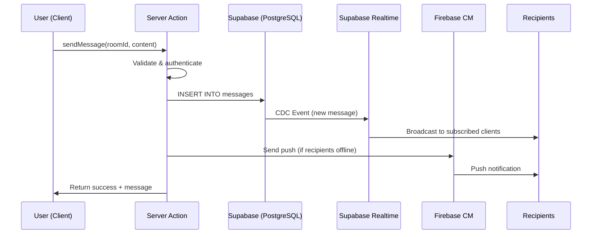
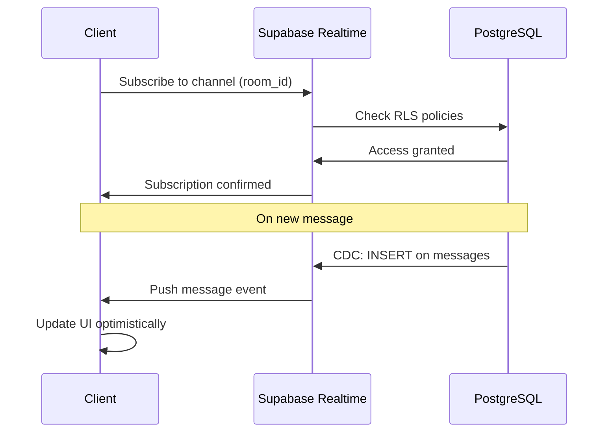

# Slack-like Chat System - Design Document

## Table of Contents

1. [Overview](#overview)
2. [Architecture](#architecture)
3. [Database Schema](#database-schema)
4. [Components and Interfaces](#components-and-interfaces)
5. [Data Models](#data-models)
6. [Real-time Integration](#real-time-integration)
7. [Push Notification System](#push-notification-system)
8. [KakaoTalk Integration](#kakaotalk-integration)
9. [API Design](#api-design)
10. [Error Handling](#error-handling)
11. [Security Considerations](#security-considerations)
12. [Testing Strategy](#testing-strategy)
13. [Implementation Phases](#implementation-phases)

---

## Overview

### Feature Summary

The Slack-like Chat System provides real-time communication capabilities for GenHub PWA, enabling construction teams to collaborate effectively with:

- **Project Chat Rooms**: Auto-created for each project, synced with `project_team` membership
- **Direct Messaging (DMs)**: Private 1:1 conversations between team members
- **Threaded Replies**: Organized conversations within message threads
- **Entity References**: @mentions for users, projects, tasks, materials, expenses with rich previews
- **File Sharing**: Image and document uploads with thumbnails
- **Real-time Features**: Typing indicators, online presence, instant message delivery
- **Push Notifications**: FCM-based notifications for web and mobile PWA
- **KakaoTalk Integration**: Optional two-way sync via Sendbird for Korean market

### Business Value

- Centralizes all project communication in one place
- Reduces context switching between tools
- Enables field workers to quickly share photos and updates
- Provides audit trail of project discussions
- Improves response times with push notifications

### Key Architectural Decisions

| Decision | Choice | Rationale |
|----------|--------|-----------|
| Real-time Transport | Supabase Realtime (CDC + Broadcast + Presence) | Already integrated, supports RLS, low latency |
| Message Storage | PostgreSQL via Supabase | Consistency with existing data, RLS policies |
| File Storage | Vercel Blob | Existing integration, CDN delivery |
| Push Notifications | Firebase Cloud Messaging (FCM) | Cross-platform, PWA support |
| KakaoTalk Integration | Sendbird Business Messaging | Official KakaoTalk partner, AlimTalk support |
| Message Virtualization | @tanstack/react-virtual | Performance for large chat histories |

---

## Architecture

### High-Level System Architecture

```
                                    +-------------------+
                                    |   GenHub PWA      |
                                    |   (Next.js 15)    |
                                    +--------+----------+
                                             |
                    +------------------------+------------------------+
                    |                        |                        |
            +-------v-------+       +--------v--------+      +--------v--------+
            |  Server       |       |  Supabase       |      |  Firebase       |
            |  Actions      |       |  Realtime       |      |  (FCM)          |
            +-------+-------+       +--------+--------+      +--------+--------+
                    |                        |                        |
                    |                +-------v--------+               |
                    |                |  PostgreSQL    |               |
                    +--------------->|  (Chat Tables) |<--------------+
                                     +-------+--------+
                                             |
                              +--------------+--------------+
                              |                             |
                      +-------v-------+             +-------v-------+
                      |  Vercel Blob  |             |  Sendbird     |
                      |  (Files)      |             |  (KakaoTalk)  |
                      +---------------+             +---------------+
```

### Data Flow Patterns

#### Message Send Flow



#### Real-time Subscription Flow



### Component Integration Points

| Component | Integrates With | Purpose |
|-----------|-----------------|---------|
| ChatPage | Sidebar, Header | App shell integration |
| ChatRoomList | projects, project_team | List accessible rooms |
| MessageList | Supabase Realtime | Live message updates |
| MessageInput | Server Actions | Send messages |
| EntityPreview | tasks, materials, expenses | Rich @mention previews |
| FileUpload | Vercel Blob | Attachment handling |
| NotificationBell | push_subscriptions | Badge counts |

---

## Database Schema

### New Tables

#### chat_rooms

```sql
-- Chat rooms for project channels and direct messages
CREATE TABLE public.chat_rooms (
  id                uuid PRIMARY KEY DEFAULT gen_random_uuid(),
  company_id        uuid NOT NULL REFERENCES companies(id) ON DELETE CASCADE,
  project_id        uuid REFERENCES projects(id) ON DELETE CASCADE, -- NULL for DMs
  type              text NOT NULL CHECK (type IN ('project', 'dm')),
  name              text, -- Custom name (default: project name or participant names)
  description       text,
  created_by        uuid REFERENCES next_auth.users(id),
  created_at        timestamptz DEFAULT now(),
  updated_at        timestamptz DEFAULT now(),

  -- Ensure project chat rooms are unique per project
  UNIQUE (project_id) WHERE type = 'project'
);

COMMENT ON TABLE public.chat_rooms IS 'Chat rooms for project channels and direct messages';

-- Indexes for performance
CREATE INDEX idx_chat_rooms_company_id ON public.chat_rooms(company_id);
CREATE INDEX idx_chat_rooms_project_id ON public.chat_rooms(project_id) WHERE project_id IS NOT NULL;
CREATE INDEX idx_chat_rooms_type ON public.chat_rooms(type);
```

#### chat_participants

```sql
-- Chat room participants with read tracking and mute settings
CREATE TABLE public.chat_participants (
  id                uuid PRIMARY KEY DEFAULT gen_random_uuid(),
  chat_room_id      uuid NOT NULL REFERENCES chat_rooms(id) ON DELETE CASCADE,
  user_id           uuid NOT NULL REFERENCES next_auth.users(id) ON DELETE CASCADE,
  role              text DEFAULT 'member' CHECK (role IN ('admin', 'member')),
  last_read_at      timestamptz DEFAULT now(),
  muted_until       timestamptz, -- NULL = not muted, timestamp = muted until
  joined_at         timestamptz DEFAULT now(),

  UNIQUE (chat_room_id, user_id)
);

COMMENT ON TABLE public.chat_participants IS 'Chat room participants with read tracking and notification preferences';

-- Indexes for performance
CREATE INDEX idx_chat_participants_user_id ON public.chat_participants(user_id);
CREATE INDEX idx_chat_participants_chat_room_id ON public.chat_participants(chat_room_id);
CREATE INDEX idx_chat_participants_last_read_at ON public.chat_participants(chat_room_id, last_read_at);
```

#### messages

```sql
-- Chat messages with threading and entity references
CREATE TABLE public.messages (
  id                  uuid PRIMARY KEY DEFAULT gen_random_uuid(),
  chat_room_id        uuid NOT NULL REFERENCES chat_rooms(id) ON DELETE CASCADE,
  sender_id           uuid NOT NULL REFERENCES next_auth.users(id),
  content             text NOT NULL,
  reply_to_id         uuid REFERENCES messages(id) ON DELETE SET NULL, -- Thread parent
  entity_references   jsonb DEFAULT '[]', -- Array of {type, id} for @mentions
  edited_at           timestamptz,
  deleted_at          timestamptz, -- Soft delete
  created_at          timestamptz DEFAULT now(),

  -- Constraints
  CHECK (char_length(content) <= 10000) -- Max message length
);

COMMENT ON TABLE public.messages IS 'Chat messages with threading support and entity references';
COMMENT ON COLUMN public.messages.entity_references IS 'JSONB array of referenced entities: [{type: "user"|"task"|"project"|"material"|"expense", id: uuid}]';

-- Indexes for performance
CREATE INDEX idx_messages_chat_room_id ON public.messages(chat_room_id);
CREATE INDEX idx_messages_sender_id ON public.messages(sender_id);
CREATE INDEX idx_messages_reply_to_id ON public.messages(reply_to_id) WHERE reply_to_id IS NOT NULL;
CREATE INDEX idx_messages_created_at ON public.messages(chat_room_id, created_at DESC);
CREATE INDEX idx_messages_deleted_at ON public.messages(deleted_at) WHERE deleted_at IS NULL;

-- Full text search index for message content
CREATE INDEX idx_messages_content_search ON public.messages
  USING gin(to_tsvector('english', content));

-- Enable Realtime for messages table
ALTER PUBLICATION supabase_realtime ADD TABLE messages;
```

#### message_reactions

```sql
-- Emoji reactions on messages
CREATE TABLE public.message_reactions (
  id            uuid PRIMARY KEY DEFAULT gen_random_uuid(),
  message_id    uuid NOT NULL REFERENCES messages(id) ON DELETE CASCADE,
  user_id       uuid NOT NULL REFERENCES next_auth.users(id) ON DELETE CASCADE,
  emoji         text NOT NULL CHECK (char_length(emoji) <= 10), -- Unicode emoji
  created_at    timestamptz DEFAULT now(),

  UNIQUE (message_id, user_id, emoji) -- One reaction per emoji per user
);

COMMENT ON TABLE public.message_reactions IS 'Emoji reactions on chat messages';

-- Indexes
CREATE INDEX idx_message_reactions_message_id ON public.message_reactions(message_id);
```

#### message_attachments

```sql
-- File attachments for messages
CREATE TABLE public.message_attachments (
  id              uuid PRIMARY KEY DEFAULT gen_random_uuid(),
  message_id      uuid NOT NULL REFERENCES messages(id) ON DELETE CASCADE,
  file_name       text NOT NULL,
  file_url        text NOT NULL,
  file_type       text, -- MIME type
  file_size       integer, -- bytes
  thumbnail_url   text, -- For images
  created_at      timestamptz DEFAULT now(),

  CHECK (file_size <= 10485760) -- 10MB max
);

COMMENT ON TABLE public.message_attachments IS 'File attachments for chat messages';

-- Index
CREATE INDEX idx_message_attachments_message_id ON public.message_attachments(message_id);
```

#### push_subscriptions

```sql
-- Push notification subscriptions (FCM tokens)
CREATE TABLE public.push_subscriptions (
  id                  uuid PRIMARY KEY DEFAULT gen_random_uuid(),
  user_id             uuid NOT NULL REFERENCES next_auth.users(id) ON DELETE CASCADE,
  endpoint            text NOT NULL, -- FCM token or web push endpoint
  platform            text NOT NULL CHECK (platform IN ('web', 'android', 'ios')),
  p256dh_key          text, -- Web push key
  auth_key            text, -- Web push auth
  user_agent          text,
  last_used_at        timestamptz DEFAULT now(),
  created_at          timestamptz DEFAULT now(),

  UNIQUE (user_id, endpoint)
);

COMMENT ON TABLE public.push_subscriptions IS 'Push notification subscription tokens for FCM';

-- Index
CREATE INDEX idx_push_subscriptions_user_id ON public.push_subscriptions(user_id);
```

#### kakao_connections

```sql
-- KakaoTalk integration connections
CREATE TABLE public.kakao_connections (
  id                  uuid PRIMARY KEY DEFAULT gen_random_uuid(),
  user_id             uuid NOT NULL REFERENCES next_auth.users(id) ON DELETE CASCADE UNIQUE,
  kakao_user_id       text NOT NULL,
  sendbird_user_id    text,
  two_way_sync        boolean DEFAULT false,
  connected_at        timestamptz DEFAULT now(),
  disconnected_at     timestamptz,
  access_token        text, -- Encrypted
  refresh_token       text, -- Encrypted

  CHECK (disconnected_at IS NULL OR disconnected_at > connected_at)
);

COMMENT ON TABLE public.kakao_connections IS 'KakaoTalk integration via Sendbird';

-- Index
CREATE INDEX idx_kakao_connections_user_id ON public.kakao_connections(user_id);
```

### Database Triggers

#### Auto-create project chat room

```sql
-- Trigger: Create chat room when project is created
CREATE OR REPLACE FUNCTION create_project_chat_room()
RETURNS TRIGGER AS $$
BEGIN
  INSERT INTO public.chat_rooms (company_id, project_id, type, name, created_by)
  VALUES (NEW.company_id, NEW.id, 'project', NEW.name, NEW.created_by);
  RETURN NEW;
END;
$$ LANGUAGE plpgsql SECURITY DEFINER;

CREATE TRIGGER on_project_created_create_chat_room
  AFTER INSERT ON public.projects
  FOR EACH ROW
  EXECUTE FUNCTION create_project_chat_room();
```

#### Auto-sync project team to chat participants

```sql
-- Trigger: Add participant when user joins project team
CREATE OR REPLACE FUNCTION sync_project_team_to_chat()
RETURNS TRIGGER AS $$
DECLARE
  room_id uuid;
BEGIN
  -- Get the chat room for this project
  SELECT id INTO room_id
  FROM public.chat_rooms
  WHERE project_id = NEW.project_id AND type = 'project';

  IF room_id IS NOT NULL AND NEW.user_id IS NOT NULL THEN
    INSERT INTO public.chat_participants (chat_room_id, user_id, role)
    VALUES (room_id, NEW.user_id, 'member')
    ON CONFLICT (chat_room_id, user_id) DO NOTHING;
  END IF;

  RETURN NEW;
END;
$$ LANGUAGE plpgsql SECURITY DEFINER;

CREATE TRIGGER on_project_team_member_added
  AFTER INSERT ON public.project_team
  FOR EACH ROW
  EXECUTE FUNCTION sync_project_team_to_chat();

-- Trigger: Remove participant when user leaves project team
CREATE OR REPLACE FUNCTION remove_project_team_from_chat()
RETURNS TRIGGER AS $$
DECLARE
  room_id uuid;
BEGIN
  SELECT id INTO room_id
  FROM public.chat_rooms
  WHERE project_id = OLD.project_id AND type = 'project';

  IF room_id IS NOT NULL AND OLD.user_id IS NOT NULL THEN
    DELETE FROM public.chat_participants
    WHERE chat_room_id = room_id AND user_id = OLD.user_id;
  END IF;

  RETURN OLD;
END;
$$ LANGUAGE plpgsql SECURITY DEFINER;

CREATE TRIGGER on_project_team_member_removed
  AFTER DELETE ON public.project_team
  FOR EACH ROW
  EXECUTE FUNCTION remove_project_team_from_chat();
```

#### Update unread counts

```sql
-- Function: Get unread message count for a user in a room
CREATE OR REPLACE FUNCTION get_unread_count(p_chat_room_id uuid, p_user_id uuid)
RETURNS integer AS $$
DECLARE
  last_read timestamptz;
  count integer;
BEGIN
  SELECT last_read_at INTO last_read
  FROM public.chat_participants
  WHERE chat_room_id = p_chat_room_id AND user_id = p_user_id;

  SELECT COUNT(*) INTO count
  FROM public.messages
  WHERE chat_room_id = p_chat_room_id
    AND created_at > COALESCE(last_read, '1970-01-01')
    AND sender_id != p_user_id
    AND deleted_at IS NULL;

  RETURN count;
END;
$$ LANGUAGE plpgsql STABLE;
```

### Row Level Security Policies

```sql
-- Enable RLS on all chat tables
ALTER TABLE public.chat_rooms ENABLE ROW LEVEL SECURITY;
ALTER TABLE public.chat_participants ENABLE ROW LEVEL SECURITY;
ALTER TABLE public.messages ENABLE ROW LEVEL SECURITY;
ALTER TABLE public.message_reactions ENABLE ROW LEVEL SECURITY;
ALTER TABLE public.message_attachments ENABLE ROW LEVEL SECURITY;
ALTER TABLE public.push_subscriptions ENABLE ROW LEVEL SECURITY;
ALTER TABLE public.kakao_connections ENABLE ROW LEVEL SECURITY;

-- chat_rooms policies
CREATE POLICY "Users can view chat rooms they participate in"
  ON public.chat_rooms FOR SELECT
  USING (
    id IN (
      SELECT chat_room_id FROM public.chat_participants
      WHERE user_id = next_auth.uid()
    )
  );

CREATE POLICY "Users can create DM rooms"
  ON public.chat_rooms FOR INSERT
  WITH CHECK (
    type = 'dm' AND
    company_id = get_user_company_id(next_auth.uid())
  );

-- chat_participants policies
CREATE POLICY "Users can view participants of their rooms"
  ON public.chat_participants FOR SELECT
  USING (
    chat_room_id IN (
      SELECT chat_room_id FROM public.chat_participants
      WHERE user_id = next_auth.uid()
    )
  );

CREATE POLICY "Users can update their own participation"
  ON public.chat_participants FOR UPDATE
  USING (user_id = next_auth.uid());

-- messages policies
CREATE POLICY "Users can view messages in their rooms"
  ON public.messages FOR SELECT
  USING (
    chat_room_id IN (
      SELECT chat_room_id FROM public.chat_participants
      WHERE user_id = next_auth.uid()
    )
  );

CREATE POLICY "Users can send messages to their rooms"
  ON public.messages FOR INSERT
  WITH CHECK (
    sender_id = next_auth.uid() AND
    chat_room_id IN (
      SELECT chat_room_id FROM public.chat_participants
      WHERE user_id = next_auth.uid()
    )
  );

CREATE POLICY "Users can edit/delete their own messages"
  ON public.messages FOR UPDATE
  USING (sender_id = next_auth.uid());

-- message_reactions policies
CREATE POLICY "Users can view reactions in their rooms"
  ON public.message_reactions FOR SELECT
  USING (
    message_id IN (
      SELECT m.id FROM public.messages m
      JOIN public.chat_participants cp ON m.chat_room_id = cp.chat_room_id
      WHERE cp.user_id = next_auth.uid()
    )
  );

CREATE POLICY "Users can add/remove their own reactions"
  ON public.message_reactions FOR ALL
  USING (user_id = next_auth.uid());

-- message_attachments policies
CREATE POLICY "Users can view attachments in their rooms"
  ON public.message_attachments FOR SELECT
  USING (
    message_id IN (
      SELECT m.id FROM public.messages m
      JOIN public.chat_participants cp ON m.chat_room_id = cp.chat_room_id
      WHERE cp.user_id = next_auth.uid()
    )
  );

-- push_subscriptions policies
CREATE POLICY "Users can manage their own subscriptions"
  ON public.push_subscriptions FOR ALL
  USING (user_id = next_auth.uid());

-- kakao_connections policies
CREATE POLICY "Users can manage their own KakaoTalk connection"
  ON public.kakao_connections FOR ALL
  USING (user_id = next_auth.uid());
```

---

## Components and Interfaces

### Component Hierarchy

```
app/app/chat/
├── page.tsx                    # Server Component - fetches initial data
├── layout.tsx                  # Chat-specific layout (optional sidebar)
└── [roomId]/
    └── page.tsx                # Individual chat room view

components/chat/
├── ChatLayout.tsx              # Main chat layout with room list + active room
├── ChatRoomList.tsx            # List of chat rooms (project + DM)
├── ChatRoomItem.tsx            # Individual room in list with unread badge
├── ChatRoom.tsx                # Active chat room container
├── MessageList.tsx             # Virtualized message list
├── MessageItem.tsx             # Individual message with actions
├── MessageInput.tsx            # Message composer with attachments
├── MessageThread.tsx           # Thread view panel
├── MessageReactions.tsx        # Reaction display and picker
├── TypingIndicator.tsx         # "[User] is typing..." display
├── OnlinePresence.tsx          # Online/offline status indicators
├── EntityReference.tsx         # @mention autocomplete
├── EntityPreview.tsx           # Rich preview cards for references
├── FileUploader.tsx            # Drag-drop file upload
├── FilePreview.tsx             # Image lightbox / file download
├── SearchMessages.tsx          # Message search interface
├── ChatSettings.tsx            # Room settings (mute, export)
├── NewDMModal.tsx              # Start new DM conversation
└── hooks/
    ├── useMessages.ts          # Message subscription hook
    ├── useTypingIndicator.ts   # Typing broadcast hook
    ├── usePresence.ts          # Online presence hook
    ├── useUnreadCounts.ts      # Unread message counts
    └── useChatRoom.ts          # Room state management
```

### Key Component Specifications

#### ChatLayout (Client Component)

```typescript
'use client';

interface ChatLayoutProps {
  initialRooms: ChatRoomWithUnread[];
  initialActiveRoomId?: string;
  currentUserId: string;
}

// Manages overall chat state:
// - Active room selection
// - Room list updates via Realtime
// - Responsive layout (mobile: full-screen room, desktop: sidebar + room)
```

#### MessageList (Client Component)

```typescript
'use client';

interface MessageListProps {
  roomId: string;
  initialMessages: MessageWithSender[];
  currentUserId: string;
  onThreadOpen: (messageId: string) => void;
}

// Features:
// - Virtual scrolling with @tanstack/react-virtual
// - Infinite scroll (load older on scroll up)
// - Real-time message subscription
// - Unread divider ("New Messages")
// - Scroll to bottom on new message (if at bottom)
// - Optimistic UI for sent messages
```

#### MessageInput (Client Component)

```typescript
'use client';

interface MessageInputProps {
  roomId: string;
  replyToId?: string; // For thread replies
  onSend: (content: string, attachments: File[]) => Promise<void>;
}

// Features:
// - Textarea with auto-resize
// - @mention autocomplete trigger
// - File attachment button
// - Send button + Enter to send
// - Typing indicator broadcast
// - Paste image support
```

#### EntityReference (Client Component)

```typescript
'use client';

interface EntityReferenceProps {
  onSelect: (reference: { type: EntityType; id: string; display: string }) => void;
  roomId: string;
}

type EntityType = 'user' | 'task' | 'project' | 'material' | 'expense';

// Features:
// - Triggered by @ in message input
// - Type filter (@task:, @material:, etc.)
// - Search within entity type
// - Keyboard navigation
// - Returns reference token for message content
```

### State Management Approach

The chat system uses a combination of:

1. **Server State (Supabase)**: Messages, rooms, participants
2. **Real-time State (Supabase Realtime)**: Live updates, presence, typing
3. **Client State (React useState/useReducer)**: UI state, active room, input drafts
4. **Optimistic Updates**: Immediate UI feedback for sent messages

```typescript
// Chat state managed via React Context
interface ChatContextValue {
  // Room state
  activeRoomId: string | null;
  setActiveRoom: (roomId: string) => void;
  rooms: ChatRoomWithUnread[];

  // Message state
  messages: Map<string, MessageWithSender[]>; // roomId -> messages
  sendMessage: (roomId: string, content: string, attachments?: File[]) => Promise<void>;

  // Presence state
  onlineUsers: Set<string>;
  typingUsers: Map<string, string[]>; // roomId -> userIds

  // Unread counts
  totalUnread: number;
  unreadByRoom: Map<string, number>;
}
```

---

## Data Models

### TypeScript Interfaces

```typescript
// types/chat.types.ts

export interface ChatRoom {
  id: string;
  company_id: string;
  project_id: string | null;
  type: 'project' | 'dm';
  name: string | null;
  description: string | null;
  created_by: string | null;
  created_at: string;
  updated_at: string;
}

export interface ChatParticipant {
  id: string;
  chat_room_id: string;
  user_id: string;
  role: 'admin' | 'member';
  last_read_at: string;
  muted_until: string | null;
  joined_at: string;
}

export interface Message {
  id: string;
  chat_room_id: string;
  sender_id: string;
  content: string;
  reply_to_id: string | null;
  entity_references: EntityReference[];
  edited_at: string | null;
  deleted_at: string | null;
  created_at: string;
}

export interface EntityReference {
  type: 'user' | 'task' | 'project' | 'material' | 'expense';
  id: string;
  display?: string; // Cached display name
}

export interface MessageReaction {
  id: string;
  message_id: string;
  user_id: string;
  emoji: string;
  created_at: string;
}

export interface MessageAttachment {
  id: string;
  message_id: string;
  file_name: string;
  file_url: string;
  file_type: string | null;
  file_size: number | null;
  thumbnail_url: string | null;
  created_at: string;
}

// Composed types for UI
export interface MessageWithSender extends Message {
  sender: {
    id: string;
    name: string;
    avatar_url: string | null;
  };
  reactions: ReactionSummary[];
  attachments: MessageAttachment[];
  reply_count: number; // For thread indicator
}

export interface ReactionSummary {
  emoji: string;
  count: number;
  users: { id: string; name: string }[];
  hasCurrentUser: boolean;
}

export interface ChatRoomWithUnread extends ChatRoom {
  unread_count: number;
  last_message?: {
    content: string;
    sender_name: string;
    created_at: string;
  };
  participants: {
    id: string;
    name: string;
    avatar_url: string | null;
  }[];
}
```

---

## Real-time Integration

### Supabase Realtime Configuration

#### Channel Setup

```typescript
// lib/hooks/useMessages.ts
import { useEffect, useState } from 'react';
import { createClient } from '@/utils/supabase/client';
import type { RealtimeChannel } from '@supabase/supabase-js';

export function useMessages(roomId: string, initialMessages: MessageWithSender[]) {
  const [messages, setMessages] = useState(initialMessages);
  const supabase = createClient();

  useEffect(() => {
    // Subscribe to new messages via CDC
    const channel = supabase
      .channel(`room:${roomId}`)
      .on(
        'postgres_changes',
        {
          event: 'INSERT',
          schema: 'public',
          table: 'messages',
          filter: `chat_room_id=eq.${roomId}`,
        },
        async (payload) => {
          // Fetch full message with sender info
          const newMessage = await fetchMessageWithSender(payload.new.id);
          setMessages((prev) => [...prev, newMessage]);
        }
      )
      .on(
        'postgres_changes',
        {
          event: 'UPDATE',
          schema: 'public',
          table: 'messages',
          filter: `chat_room_id=eq.${roomId}`,
        },
        (payload) => {
          // Handle edit/delete
          setMessages((prev) =>
            prev.map((m) => (m.id === payload.new.id ? { ...m, ...payload.new } : m))
          );
        }
      )
      .subscribe();

    return () => {
      supabase.removeChannel(channel);
    };
  }, [roomId, supabase]);

  return messages;
}
```

#### Typing Indicators (Broadcast)

```typescript
// lib/hooks/useTypingIndicator.ts
import { useEffect, useRef, useCallback } from 'react';
import { createClient } from '@/utils/supabase/client';

export function useTypingIndicator(roomId: string, currentUserId: string) {
  const supabase = createClient();
  const channelRef = useRef<RealtimeChannel | null>(null);
  const typingTimeoutRef = useRef<NodeJS.Timeout | null>(null);
  const [typingUsers, setTypingUsers] = useState<Map<string, string>>(new Map());

  useEffect(() => {
    const channel = supabase.channel(`typing:${roomId}`);

    channel
      .on('broadcast', { event: 'typing' }, (payload) => {
        const { userId, userName, isTyping } = payload.payload;
        if (userId === currentUserId) return;

        setTypingUsers((prev) => {
          const next = new Map(prev);
          if (isTyping) {
            next.set(userId, userName);
          } else {
            next.delete(userId);
          }
          return next;
        });

        // Auto-remove after 3 seconds
        setTimeout(() => {
          setTypingUsers((prev) => {
            const next = new Map(prev);
            next.delete(userId);
            return next;
          });
        }, 3000);
      })
      .subscribe();

    channelRef.current = channel;

    return () => {
      supabase.removeChannel(channel);
    };
  }, [roomId, currentUserId, supabase]);

  const broadcastTyping = useCallback((isTyping: boolean, userName: string) => {
    if (channelRef.current) {
      channelRef.current.send({
        type: 'broadcast',
        event: 'typing',
        payload: { userId: currentUserId, userName, isTyping },
      });
    }
  }, [currentUserId]);

  return { typingUsers, broadcastTyping };
}
```

#### Online Presence

```typescript
// lib/hooks/usePresence.ts
import { useEffect, useState } from 'react';
import { createClient } from '@/utils/supabase/client';

interface PresenceState {
  id: string;
  name: string;
  avatarUrl: string | null;
  lastSeen: string;
}

export function usePresence(roomId: string, currentUser: { id: string; name: string; avatarUrl: string | null }) {
  const supabase = createClient();
  const [onlineUsers, setOnlineUsers] = useState<PresenceState[]>([]);

  useEffect(() => {
    const channel = supabase.channel(`presence:${roomId}`);

    channel
      .on('presence', { event: 'sync' }, () => {
        const presenceState = channel.presenceState();
        const users = Object.values(presenceState).flat() as PresenceState[];
        setOnlineUsers(users);
      })
      .on('presence', { event: 'join' }, ({ newPresences }) => {
        // User joined
      })
      .on('presence', { event: 'leave' }, ({ leftPresences }) => {
        // User left
      })
      .subscribe(async (status) => {
        if (status === 'SUBSCRIBED') {
          await channel.track({
            id: currentUser.id,
            name: currentUser.name,
            avatarUrl: currentUser.avatarUrl,
            lastSeen: new Date().toISOString(),
          });
        }
      });

    return () => {
      supabase.removeChannel(channel);
    };
  }, [roomId, currentUser, supabase]);

  return onlineUsers;
}
```

---

## Push Notification System

### Architecture

```
+-------------------+     +-------------------+     +-------------------+
|   GenHub PWA      |     |   Edge Function   |     |   Firebase FCM    |
|   (Client)        |     |   (Supabase)      |     |                   |
+--------+----------+     +--------+----------+     +--------+----------+
         |                         |                         |
         |  1. Request permission  |                         |
         |<----------------------->|                         |
         |                         |                         |
         |  2. Get FCM token       |                         |
         |<------------------------|------------------------>|
         |                         |                         |
         |  3. Save subscription   |                         |
         |------------------------>|                         |
         |                         |                         |
         |  4. On new message      |                         |
         |                         |<------------------------|
         |                         |  5. Send push           |
         |                         |------------------------>|
         |                         |                         |
         |  6. Receive notification|                         |
         |<------------------------|-------------------------|
         |                         |                         |
```

### Service Worker Setup

```typescript
// public/firebase-messaging-sw.js
importScripts('https://www.gstatic.com/firebasejs/10.7.0/firebase-app-compat.js');
importScripts('https://www.gstatic.com/firebasejs/10.7.0/firebase-messaging-compat.js');

firebase.initializeApp({
  apiKey: 'FIREBASE_API_KEY',
  authDomain: 'genhub-pwa.firebaseapp.com',
  projectId: 'genhub-pwa',
  messagingSenderId: 'SENDER_ID',
  appId: 'APP_ID',
});

const messaging = firebase.messaging();

// Handle background messages
messaging.onBackgroundMessage((payload) => {
  console.log('[SW] Background message:', payload);

  const { title, body, data } = payload.notification || {};
  const notificationOptions = {
    body,
    icon: '/icons/icon-192x192.png',
    badge: '/icons/badge-72x72.png',
    tag: data?.roomId || 'chat',
    data: {
      url: data?.url || '/app/chat',
    },
  };

  self.registration.showNotification(title, notificationOptions);
});

// Handle notification click
self.addEventListener('notificationclick', (event) => {
  event.notification.close();
  const url = event.notification.data?.url || '/app/chat';

  event.waitUntil(
    clients.matchAll({ type: 'window' }).then((windowClients) => {
      // Focus existing window or open new
      for (const client of windowClients) {
        if (client.url.includes('/app') && 'focus' in client) {
          client.navigate(url);
          return client.focus();
        }
      }
      return clients.openWindow(url);
    })
  );
});
```

### Push Subscription Management

```typescript
// app/actions/push-notifications.ts
'use server';

import { createClient } from '@/utils/supabase/server';
import { auth } from '@/lib/auth';

export async function registerPushSubscription(subscription: {
  endpoint: string;
  platform: 'web' | 'android' | 'ios';
  p256dhKey?: string;
  authKey?: string;
  userAgent?: string;
}) {
  const session = await auth();
  if (!session?.user?.id) {
    return { error: 'Not authenticated' };
  }

  const supabase = await createClient();

  const { error } = await supabase
    .from('push_subscriptions')
    .upsert({
      user_id: session.user.id,
      endpoint: subscription.endpoint,
      platform: subscription.platform,
      p256dh_key: subscription.p256dhKey,
      auth_key: subscription.authKey,
      user_agent: subscription.userAgent,
      last_used_at: new Date().toISOString(),
    }, {
      onConflict: 'user_id,endpoint',
    });

  if (error) {
    console.error('Error registering push subscription:', error);
    return { error: 'Failed to register subscription' };
  }

  return { success: true };
}

export async function unregisterPushSubscription(endpoint: string) {
  const session = await auth();
  if (!session?.user?.id) {
    return { error: 'Not authenticated' };
  }

  const supabase = await createClient();

  const { error } = await supabase
    .from('push_subscriptions')
    .delete()
    .eq('user_id', session.user.id)
    .eq('endpoint', endpoint);

  if (error) {
    return { error: 'Failed to unregister subscription' };
  }

  return { success: true };
}
```

### Push Notification Trigger (Edge Function)

```typescript
// supabase/functions/send-push-notification/index.ts
import { serve } from 'https://deno.land/std@0.168.0/http/server.ts';
import { createClient } from 'https://esm.sh/@supabase/supabase-js@2';

const FCM_SERVER_KEY = Deno.env.get('FCM_SERVER_KEY')!;
const SUPABASE_URL = Deno.env.get('SUPABASE_URL')!;
const SUPABASE_SERVICE_ROLE_KEY = Deno.env.get('SUPABASE_SERVICE_ROLE_KEY')!;

serve(async (req) => {
  const { userId, title, body, data } = await req.json();

  const supabase = createClient(SUPABASE_URL, SUPABASE_SERVICE_ROLE_KEY);

  // Get user's push subscriptions
  const { data: subscriptions } = await supabase
    .from('push_subscriptions')
    .select('endpoint, platform')
    .eq('user_id', userId);

  if (!subscriptions?.length) {
    return new Response(JSON.stringify({ sent: 0 }), { status: 200 });
  }

  // Send to all user's devices
  const results = await Promise.all(
    subscriptions.map(async (sub) => {
      const response = await fetch('https://fcm.googleapis.com/fcm/send', {
        method: 'POST',
        headers: {
          'Authorization': `key=${FCM_SERVER_KEY}`,
          'Content-Type': 'application/json',
        },
        body: JSON.stringify({
          to: sub.endpoint,
          notification: { title, body },
          data,
        }),
      });
      return response.ok;
    })
  );

  return new Response(JSON.stringify({ sent: results.filter(Boolean).length }), {
    status: 200,
  });
});
```

---

## KakaoTalk Integration

### Integration Architecture

```
+-------------------+     +-------------------+     +-------------------+
|   GenHub Chat     |     |   Sendbird API    |     |   KakaoTalk       |
|                   |     |                   |     |                   |
+--------+----------+     +--------+----------+     +--------+----------+
         |                         |                         |
         |  1. Connect KakaoTalk   |                         |
         |------------------------>|  OAuth Flow             |
         |                         |------------------------>|
         |                         |<------------------------|
         |                         |                         |
         |  2. Send AlimTalk       |                         |
         |------------------------>|  Template Message       |
         |                         |------------------------>|
         |                         |                         |
         |  3. Two-way sync (opt)  |                         |
         |<----------------------->|<----------------------->|
         |                         |                         |
```

### Sendbird Integration Service

```typescript
// lib/services/kakao.ts
const SENDBIRD_APP_ID = process.env.SENDBIRD_APP_ID!;
const SENDBIRD_API_TOKEN = process.env.SENDBIRD_API_TOKEN!;

interface AlimTalkTemplate {
  templateCode: string;
  variables: Record<string, string>;
}

export class KakaoService {
  private apiBase = `https://api-${SENDBIRD_APP_ID}.sendbird.com/v3`;

  async connectKakaoAccount(userId: string, kakaoAuthCode: string) {
    // Exchange auth code for tokens via Sendbird
    const response = await fetch(`${this.apiBase}/kakao/connect`, {
      method: 'POST',
      headers: {
        'Api-Token': SENDBIRD_API_TOKEN,
        'Content-Type': 'application/json',
      },
      body: JSON.stringify({
        user_id: userId,
        auth_code: kakaoAuthCode,
      }),
    });

    return response.json();
  }

  async sendAlimTalk(userId: string, template: AlimTalkTemplate) {
    // Send template notification via KakaoTalk
    const response = await fetch(`${this.apiBase}/kakao/alimtalk`, {
      method: 'POST',
      headers: {
        'Api-Token': SENDBIRD_API_TOKEN,
        'Content-Type': 'application/json',
      },
      body: JSON.stringify({
        user_id: userId,
        template_code: template.templateCode,
        variables: template.variables,
      }),
    });

    return response.json();
  }

  async syncMessage(userId: string, message: { content: string; roomId: string }) {
    // Sync GenHub message to KakaoTalk (if two-way enabled)
    const response = await fetch(`${this.apiBase}/kakao/sync`, {
      method: 'POST',
      headers: {
        'Api-Token': SENDBIRD_API_TOKEN,
        'Content-Type': 'application/json',
      },
      body: JSON.stringify({
        user_id: userId,
        message: message.content,
        metadata: { room_id: message.roomId },
      }),
    });

    return response.json();
  }
}
```

### KakaoTalk Settings UI

```typescript
// components/settings/KakaoTalkSettings.tsx
'use client';

interface KakaoTalkSettingsProps {
  connection: KakaoConnection | null;
  onConnect: () => void;
  onDisconnect: () => void;
  onToggleSync: (enabled: boolean) => void;
}

export function KakaoTalkSettings({
  connection,
  onConnect,
  onDisconnect,
  onToggleSync,
}: KakaoTalkSettingsProps) {
  const isConnected = connection && !connection.disconnected_at;

  return (
    <Card>
      <CardHeader>
        <CardTitle className="flex items-center gap-2">
          <KakaoTalkIcon className="h-5 w-5" />
          KakaoTalk Integration
        </CardTitle>
        <CardDescription>
          Receive project notifications via KakaoTalk
        </CardDescription>
      </CardHeader>
      <CardContent>
        {isConnected ? (
          <div className="space-y-4">
            <div className="flex items-center justify-between">
              <span className="text-sm">Connected as {connection.kakao_user_id}</span>
              <Button variant="outline" size="sm" onClick={onDisconnect}>
                Disconnect
              </Button>
            </div>
            <div className="flex items-center justify-between">
              <Label htmlFor="two-way-sync">Enable two-way message sync</Label>
              <Switch
                id="two-way-sync"
                checked={connection.two_way_sync}
                onCheckedChange={onToggleSync}
              />
            </div>
          </div>
        ) : (
          <Button onClick={onConnect}>
            Connect KakaoTalk
          </Button>
        )}
      </CardContent>
    </Card>
  );
}
```

---

## API Design

### Server Actions

```typescript
// app/actions/chat.ts
'use server';

import { revalidatePath } from 'next/cache';
import { z } from 'zod';
import { createClient } from '@/utils/supabase/server';
import { auth } from '@/lib/auth';

// ============================================
// Validation Schemas
// ============================================

const sendMessageSchema = z.object({
  chatRoomId: z.string().uuid(),
  content: z.string().min(1).max(10000),
  replyToId: z.string().uuid().optional(),
  entityReferences: z.array(z.object({
    type: z.enum(['user', 'task', 'project', 'material', 'expense']),
    id: z.string().uuid(),
  })).optional(),
});

const createDMSchema = z.object({
  recipientUserId: z.string().uuid(),
});

// ============================================
// Server Actions
// ============================================

/**
 * Send a message to a chat room
 */
export async function sendMessage(formData: FormData) {
  const session = await auth();
  if (!session?.user?.id) {
    return { error: 'Not authenticated' };
  }

  const supabase = await createClient();

  const rawData = {
    chatRoomId: formData.get('chatRoomId'),
    content: formData.get('content'),
    replyToId: formData.get('replyToId') || undefined,
    entityReferences: formData.get('entityReferences')
      ? JSON.parse(formData.get('entityReferences') as string)
      : undefined,
  };

  const validation = sendMessageSchema.safeParse(rawData);
  if (!validation.success) {
    return { error: 'Validation failed', fieldErrors: validation.error.flatten().fieldErrors };
  }

  const { chatRoomId, content, replyToId, entityReferences } = validation.data;

  // Verify user is a participant
  const { data: participant } = await supabase
    .from('chat_participants')
    .select('id')
    .eq('chat_room_id', chatRoomId)
    .eq('user_id', session.user.id)
    .single();

  if (!participant) {
    return { error: 'Not a participant of this chat room' };
  }

  // Insert message
  const { data: message, error: insertError } = await supabase
    .from('messages')
    .insert({
      chat_room_id: chatRoomId,
      sender_id: session.user.id,
      content,
      reply_to_id: replyToId,
      entity_references: entityReferences || [],
    })
    .select()
    .single();

  if (insertError) {
    console.error('Error sending message:', insertError);
    return { error: 'Failed to send message' };
  }

  // Create notifications for @mentioned users
  if (entityReferences) {
    const userMentions = entityReferences.filter(ref => ref.type === 'user');
    for (const mention of userMentions) {
      await supabase.from('notifications').insert({
        user_id: mention.id,
        type: 'mention',
        title: 'You were mentioned',
        message: `${session.user.name} mentioned you in a message`,
        link: `/app/chat/${chatRoomId}?message=${message.id}`,
      });
    }
  }

  // Trigger push notifications for offline participants
  await triggerPushNotifications(chatRoomId, session.user.id, content);

  revalidatePath(`/app/chat/${chatRoomId}`);
  return { success: true, message };
}

/**
 * Create a new DM conversation
 */
export async function createDMRoom(recipientUserId: string) {
  const session = await auth();
  if (!session?.user?.id) {
    return { error: 'Not authenticated' };
  }

  const supabase = await createClient();

  // Get user's company
  const { data: companyUser } = await supabase
    .from('company_users')
    .select('company_id')
    .eq('user_id', session.user.id)
    .eq('status', 'active')
    .single();

  if (!companyUser) {
    return { error: 'No active company found' };
  }

  // Check if DM room already exists between these users
  const { data: existingRoom } = await supabase
    .rpc('find_dm_room', {
      user1: session.user.id,
      user2: recipientUserId,
    });

  if (existingRoom) {
    return { success: true, room: existingRoom };
  }

  // Create new DM room
  const { data: room, error: roomError } = await supabase
    .from('chat_rooms')
    .insert({
      company_id: companyUser.company_id,
      type: 'dm',
      created_by: session.user.id,
    })
    .select()
    .single();

  if (roomError) {
    return { error: 'Failed to create DM room' };
  }

  // Add both participants
  await supabase.from('chat_participants').insert([
    { chat_room_id: room.id, user_id: session.user.id },
    { chat_room_id: room.id, user_id: recipientUserId },
  ]);

  revalidatePath('/app/chat');
  return { success: true, room };
}

/**
 * Mark messages as read
 */
export async function markMessagesAsRead(chatRoomId: string) {
  const session = await auth();
  if (!session?.user?.id) {
    return { error: 'Not authenticated' };
  }

  const supabase = await createClient();

  const { error } = await supabase
    .from('chat_participants')
    .update({ last_read_at: new Date().toISOString() })
    .eq('chat_room_id', chatRoomId)
    .eq('user_id', session.user.id);

  if (error) {
    return { error: 'Failed to mark as read' };
  }

  revalidatePath('/app/chat');
  return { success: true };
}

/**
 * Toggle message reaction
 */
export async function toggleReaction(messageId: string, emoji: string) {
  const session = await auth();
  if (!session?.user?.id) {
    return { error: 'Not authenticated' };
  }

  const supabase = await createClient();

  // Check if reaction exists
  const { data: existing } = await supabase
    .from('message_reactions')
    .select('id')
    .eq('message_id', messageId)
    .eq('user_id', session.user.id)
    .eq('emoji', emoji)
    .single();

  if (existing) {
    // Remove reaction
    await supabase
      .from('message_reactions')
      .delete()
      .eq('id', existing.id);
  } else {
    // Add reaction
    await supabase
      .from('message_reactions')
      .insert({
        message_id: messageId,
        user_id: session.user.id,
        emoji,
      });
  }

  return { success: true };
}

/**
 * Edit a message
 */
export async function editMessage(messageId: string, newContent: string) {
  const session = await auth();
  if (!session?.user?.id) {
    return { error: 'Not authenticated' };
  }

  const supabase = await createClient();

  const { data: message, error } = await supabase
    .from('messages')
    .update({
      content: newContent,
      edited_at: new Date().toISOString(),
    })
    .eq('id', messageId)
    .eq('sender_id', session.user.id) // Only owner can edit
    .select()
    .single();

  if (error) {
    return { error: 'Failed to edit message' };
  }

  return { success: true, message };
}

/**
 * Delete a message (soft delete)
 */
export async function deleteMessage(messageId: string) {
  const session = await auth();
  if (!session?.user?.id) {
    return { error: 'Not authenticated' };
  }

  const supabase = await createClient();

  const { error } = await supabase
    .from('messages')
    .update({ deleted_at: new Date().toISOString() })
    .eq('id', messageId)
    .eq('sender_id', session.user.id); // Only owner can delete

  if (error) {
    return { error: 'Failed to delete message' };
  }

  return { success: true };
}

/**
 * Mute/unmute a chat room
 */
export async function muteChatRoom(chatRoomId: string, mutedUntil: string | null) {
  const session = await auth();
  if (!session?.user?.id) {
    return { error: 'Not authenticated' };
  }

  const supabase = await createClient();

  const { error } = await supabase
    .from('chat_participants')
    .update({ muted_until: mutedUntil })
    .eq('chat_room_id', chatRoomId)
    .eq('user_id', session.user.id);

  if (error) {
    return { error: 'Failed to update mute settings' };
  }

  return { success: true };
}

/**
 * Search messages
 */
export async function searchMessages(query: string, chatRoomId?: string) {
  const session = await auth();
  if (!session?.user?.id) {
    return { error: 'Not authenticated' };
  }

  const supabase = await createClient();

  let queryBuilder = supabase
    .from('messages')
    .select(`
      id,
      content,
      created_at,
      chat_room_id,
      sender:user_profiles!sender_id (
        id,
        name,
        avatar_url
      ),
      chat_room:chat_rooms (
        id,
        name,
        type
      )
    `)
    .textSearch('content', query)
    .is('deleted_at', null)
    .order('created_at', { ascending: false })
    .limit(50);

  if (chatRoomId) {
    queryBuilder = queryBuilder.eq('chat_room_id', chatRoomId);
  }

  const { data: messages, error } = await queryBuilder;

  if (error) {
    return { error: 'Search failed' };
  }

  return { success: true, messages };
}

/**
 * Upload file attachment
 */
export async function uploadAttachment(formData: FormData) {
  const session = await auth();
  if (!session?.user?.id) {
    return { error: 'Not authenticated' };
  }

  const file = formData.get('file') as File;
  const messageId = formData.get('messageId') as string;

  if (!file || file.size > 10 * 1024 * 1024) {
    return { error: 'File must be less than 10MB' };
  }

  // Upload to Vercel Blob
  const { put } = await import('@vercel/blob');
  const blob = await put(`chat/${messageId}/${file.name}`, file, {
    access: 'public',
  });

  const supabase = await createClient();

  // Create attachment record
  const { data: attachment, error } = await supabase
    .from('message_attachments')
    .insert({
      message_id: messageId,
      file_name: file.name,
      file_url: blob.url,
      file_type: file.type,
      file_size: file.size,
    })
    .select()
    .single();

  if (error) {
    return { error: 'Failed to save attachment' };
  }

  return { success: true, attachment };
}

// ============================================
// Helper Functions
// ============================================

async function triggerPushNotifications(
  chatRoomId: string,
  senderId: string,
  content: string
) {
  const supabase = await createClient();

  // Get participants who should receive push (not muted, not sender)
  const { data: participants } = await supabase
    .from('chat_participants')
    .select(`
      user_id,
      muted_until,
      user:user_profiles!user_id (name)
    `)
    .eq('chat_room_id', chatRoomId)
    .neq('user_id', senderId);

  if (!participants?.length) return;

  // Get sender name
  const { data: sender } = await supabase
    .from('user_profiles')
    .select('name')
    .eq('id', senderId)
    .single();

  const now = new Date();
  const eligibleUsers = participants.filter(p =>
    !p.muted_until || new Date(p.muted_until) < now
  );

  // Call Edge Function to send pushes
  for (const participant of eligibleUsers) {
    await supabase.functions.invoke('send-push-notification', {
      body: {
        userId: participant.user_id,
        title: sender?.name || 'New Message',
        body: content.substring(0, 100),
        data: {
          roomId: chatRoomId,
          url: `/app/chat/${chatRoomId}`,
        },
      },
    });
  }
}
```

### Data Fetching Functions

```typescript
// app/actions/chat-queries.ts
'use server';

import { createClient } from '@/utils/supabase/server';
import { auth } from '@/lib/auth';

/**
 * Get all chat rooms for the current user
 */
export async function getChatRooms() {
  const session = await auth();
  if (!session?.user?.id) {
    return { error: 'Not authenticated' };
  }

  const supabase = await createClient();

  const { data: rooms, error } = await supabase
    .from('chat_rooms')
    .select(`
      *,
      participants:chat_participants (
        user_id,
        last_read_at,
        muted_until,
        user:user_profiles!user_id (
          id,
          name,
          avatar_url
        )
      ),
      project:projects (
        id,
        name,
        status
      )
    `)
    .order('updated_at', { ascending: false });

  if (error) {
    return { error: 'Failed to fetch chat rooms' };
  }

  // Calculate unread counts and format response
  const roomsWithUnread = await Promise.all(
    rooms.map(async (room) => {
      const { data: unreadCount } = await supabase
        .rpc('get_unread_count', {
          p_chat_room_id: room.id,
          p_user_id: session.user.id,
        });

      // Get last message
      const { data: lastMessage } = await supabase
        .from('messages')
        .select(`
          content,
          created_at,
          sender:user_profiles!sender_id (name)
        `)
        .eq('chat_room_id', room.id)
        .is('deleted_at', null)
        .order('created_at', { ascending: false })
        .limit(1)
        .single();

      return {
        ...room,
        unread_count: unreadCount || 0,
        last_message: lastMessage,
      };
    })
  );

  return { success: true, rooms: roomsWithUnread };
}

/**
 * Get messages for a chat room with pagination
 */
export async function getMessages(chatRoomId: string, cursor?: string, limit = 50) {
  const session = await auth();
  if (!session?.user?.id) {
    return { error: 'Not authenticated' };
  }

  const supabase = await createClient();

  let query = supabase
    .from('messages')
    .select(`
      *,
      sender:user_profiles!sender_id (
        id,
        name,
        avatar_url
      ),
      reactions:message_reactions (
        id,
        emoji,
        user_id,
        user:user_profiles!user_id (name)
      ),
      attachments:message_attachments (
        id,
        file_name,
        file_url,
        file_type,
        file_size,
        thumbnail_url
      ),
      reply_count:messages!reply_to_id (count)
    `)
    .eq('chat_room_id', chatRoomId)
    .is('deleted_at', null)
    .order('created_at', { ascending: false })
    .limit(limit);

  if (cursor) {
    query = query.lt('created_at', cursor);
  }

  const { data: messages, error } = await query;

  if (error) {
    return { error: 'Failed to fetch messages' };
  }

  // Aggregate reactions
  const formattedMessages = messages.map(msg => ({
    ...msg,
    reactions: aggregateReactions(msg.reactions, session.user.id),
    reply_count: msg.reply_count?.[0]?.count || 0,
  }));

  return {
    success: true,
    messages: formattedMessages.reverse(), // Chronological order
    hasMore: messages.length === limit,
    nextCursor: messages[messages.length - 1]?.created_at,
  };
}

function aggregateReactions(reactions: any[], currentUserId: string) {
  const grouped = reactions.reduce((acc, r) => {
    if (!acc[r.emoji]) {
      acc[r.emoji] = { emoji: r.emoji, count: 0, users: [], hasCurrentUser: false };
    }
    acc[r.emoji].count++;
    acc[r.emoji].users.push({ id: r.user_id, name: r.user.name });
    if (r.user_id === currentUserId) {
      acc[r.emoji].hasCurrentUser = true;
    }
    return acc;
  }, {} as Record<string, any>);

  return Object.values(grouped);
}
```

---

## Error Handling

### Error Types

```typescript
// lib/errors/chat-errors.ts

export class ChatError extends Error {
  constructor(
    message: string,
    public code: ChatErrorCode,
    public statusCode: number = 400
  ) {
    super(message);
    this.name = 'ChatError';
  }
}

export enum ChatErrorCode {
  NOT_AUTHENTICATED = 'NOT_AUTHENTICATED',
  NOT_PARTICIPANT = 'NOT_PARTICIPANT',
  ROOM_NOT_FOUND = 'ROOM_NOT_FOUND',
  MESSAGE_NOT_FOUND = 'MESSAGE_NOT_FOUND',
  PERMISSION_DENIED = 'PERMISSION_DENIED',
  RATE_LIMITED = 'RATE_LIMITED',
  FILE_TOO_LARGE = 'FILE_TOO_LARGE',
  INVALID_FILE_TYPE = 'INVALID_FILE_TYPE',
  REALTIME_CONNECTION_FAILED = 'REALTIME_CONNECTION_FAILED',
}
```

### Error Handling Patterns

```typescript
// Server Action error handling
export async function sendMessage(formData: FormData) {
  try {
    // ... implementation
  } catch (error) {
    if (error instanceof ChatError) {
      return { error: error.message, code: error.code };
    }
    console.error('Unexpected error in sendMessage:', error);
    return { error: 'An unexpected error occurred' };
  }
}

// Client-side error handling
function handleSendMessage(result: { error?: string; code?: string }) {
  if (result.error) {
    if (result.code === 'RATE_LIMITED') {
      toast.error('You\'re sending messages too quickly. Please wait.');
    } else {
      toast.error(result.error);
    }
    return false;
  }
  return true;
}
```

### Realtime Connection Recovery

```typescript
// Automatic reconnection with exponential backoff
function useRealtimeWithRecovery(roomId: string) {
  const [connectionState, setConnectionState] = useState<'connecting' | 'connected' | 'disconnected'>('connecting');
  const retryCount = useRef(0);
  const maxRetries = 5;

  useEffect(() => {
    const channel = supabase.channel(`room:${roomId}`);

    channel.subscribe((status) => {
      if (status === 'SUBSCRIBED') {
        setConnectionState('connected');
        retryCount.current = 0;
      } else if (status === 'CHANNEL_ERROR') {
        setConnectionState('disconnected');

        if (retryCount.current < maxRetries) {
          const delay = Math.min(1000 * 2 ** retryCount.current, 30000);
          setTimeout(() => {
            retryCount.current++;
            channel.subscribe();
          }, delay);
        }
      }
    });

    return () => {
      supabase.removeChannel(channel);
    };
  }, [roomId]);

  return connectionState;
}
```

---

## Security Considerations

### Authentication & Authorization

1. **All Server Actions** verify session via `auth()` before any operation
2. **RLS Policies** enforce that users can only access rooms they participate in
3. **Message Sender Verification**: Only message author can edit/delete
4. **Rate Limiting**: Max 30 messages per minute per user

### Input Validation

```typescript
// All inputs validated with Zod schemas
const sendMessageSchema = z.object({
  chatRoomId: z.string().uuid(),
  content: z.string()
    .min(1, 'Message cannot be empty')
    .max(10000, 'Message too long')
    .transform(val => DOMPurify.sanitize(val)), // XSS prevention
});
```

### File Upload Security

1. **File Size Limit**: 10MB max
2. **File Type Validation**: Whitelist of allowed MIME types
3. **Malware Scanning**: (Recommended) Integrate with virus scanning service
4. **Signed URLs**: Use time-limited signed URLs for private files

### Data Protection

1. **Soft Deletes**: Messages marked as deleted, not removed (audit trail)
2. **Attachment Retention**: Deleted message attachments retained 30 days
3. **KakaoTalk Tokens**: Encrypted at rest in database
4. **HTTPS Only**: All API calls over TLS

---

## Testing Strategy

### Unit Tests

```typescript
// __tests__/actions/chat.test.ts
import { sendMessage, createDMRoom } from '@/app/actions/chat';

describe('Chat Server Actions', () => {
  describe('sendMessage', () => {
    it('should reject unauthenticated users', async () => {
      // Mock no session
      const result = await sendMessage(new FormData());
      expect(result.error).toBe('Not authenticated');
    });

    it('should validate message content', async () => {
      // Mock session, empty content
      const formData = new FormData();
      formData.set('chatRoomId', 'uuid');
      formData.set('content', '');

      const result = await sendMessage(formData);
      expect(result.fieldErrors?.content).toBeDefined();
    });

    it('should reject non-participants', async () => {
      // Mock session, mock participant check returns null
      const result = await sendMessage(validFormData);
      expect(result.error).toBe('Not a participant of this chat room');
    });
  });
});
```

### Integration Tests

```typescript
// __tests__/integration/chat-flow.test.ts
describe('Chat Integration', () => {
  it('should create DM room and send message', async () => {
    // 1. Create DM room
    const { room } = await createDMRoom(recipientId);
    expect(room.type).toBe('dm');

    // 2. Send message
    const formData = new FormData();
    formData.set('chatRoomId', room.id);
    formData.set('content', 'Hello!');

    const { message } = await sendMessage(formData);
    expect(message.content).toBe('Hello!');

    // 3. Verify recipient can see message
    const { messages } = await getMessages(room.id);
    expect(messages).toHaveLength(1);
  });
});
```

### E2E Tests

```typescript
// e2e/chat.spec.ts (Playwright)
test('real-time message delivery', async ({ page, context }) => {
  // Open two browser contexts (two users)
  const page1 = await context.newPage();
  const page2 = await context.newPage();

  // User 1 opens chat
  await page1.goto('/app/chat/room-id');

  // User 2 opens same chat
  await page2.goto('/app/chat/room-id');

  // User 1 sends message
  await page1.fill('[data-testid="message-input"]', 'Hello from User 1');
  await page1.click('[data-testid="send-button"]');

  // User 2 should see message in < 1s
  await expect(page2.locator('text=Hello from User 1')).toBeVisible({ timeout: 1000 });
});
```

### Performance Tests

1. **Message Virtualization**: Test with 10,000+ messages
2. **Realtime Latency**: Measure message delivery time
3. **Concurrent Users**: Test room with 100+ simultaneous participants

---

## Implementation Phases

### Phase 1: Core Chat (MVP) - 2 weeks

**Deliverables:**
- Database schema and migrations
- Chat room list page
- Basic message sending/receiving
- Supabase Realtime integration (CDC)
- Unread message tracking
- Auto-sync project team to chat participants

**Success Criteria:**
- Users can view project chat rooms
- Messages delivered in < 500ms
- Unread badges accurate

### Phase 2: Rich Features - 2 weeks

**Deliverables:**
- Threaded replies
- Message reactions
- Typing indicators (Broadcast)
- Online presence (Presence)
- File/photo sharing (Vercel Blob)

**Success Criteria:**
- Threads display correctly
- Typing indicator shows within 100ms
- Files upload and display properly

### Phase 3: Entity References - 1.5 weeks

**Deliverables:**
- @mention autocomplete
- Entity preview cards (task, material, expense, user)
- Deep links to entities from chat

**Success Criteria:**
- Autocomplete appears on @ trigger
- Preview cards show accurate data
- Links navigate correctly

### Phase 4: Notifications - 1.5 weeks

**Deliverables:**
- FCM integration (Service Worker)
- Push notification preferences
- Chat room muting
- Notification badge on app icon

**Success Criteria:**
- Push notifications delivered when app closed
- Muting prevents push but not in-app
- Badge count accurate

### Phase 5: KakaoTalk Integration - 1 week

**Deliverables:**
- Sendbird integration
- KakaoTalk OAuth connection
- AlimTalk template notifications
- Two-way sync (optional feature)

**Success Criteria:**
- Users can connect KakaoTalk
- AlimTalk messages delivered
- Sync works bi-directionally when enabled

### Phase 6: Advanced Features - 1 week

**Deliverables:**
- Message search (full-text)
- Message editing/deletion
- Direct messaging (DMs)
- Chat transcript export (GC Admin)

**Success Criteria:**
- Search returns relevant results
- Edit/delete propagate in real-time
- DM rooms created correctly

---

## Appendix

### Construction-Themed Reaction Emojis

```typescript
const CONSTRUCTION_EMOJIS = [
  '👍', // Thumbs up - approval
  '✅', // Check mark - done
  '👷', // Construction worker - noted
  '🔨', // Hammer - working on it
  '🔧', // Wrench - fixing
  '⚠️', // Warning - attention needed
  '🚧', // Construction sign - in progress
  '📋', // Clipboard - documented
  '💰', // Money - budget related
  '🏗️', // Building construction - project milestone
];
```

### References

- [Supabase Realtime Documentation](https://supabase.com/docs/guides/realtime)
- [Supabase Realtime with Next.js](https://supabase.com/docs/guides/realtime/realtime-with-nextjs)
- [Firebase Cloud Messaging for Web](https://firebase.google.com/docs/cloud-messaging/js/client)
- [Sendbird KakaoTalk Integration](https://sendbird.com/products/business-messaging/kakaotalk)
- [PWA Push Notifications Guide](https://pretius.com/blog/pwa-push-notifications)
