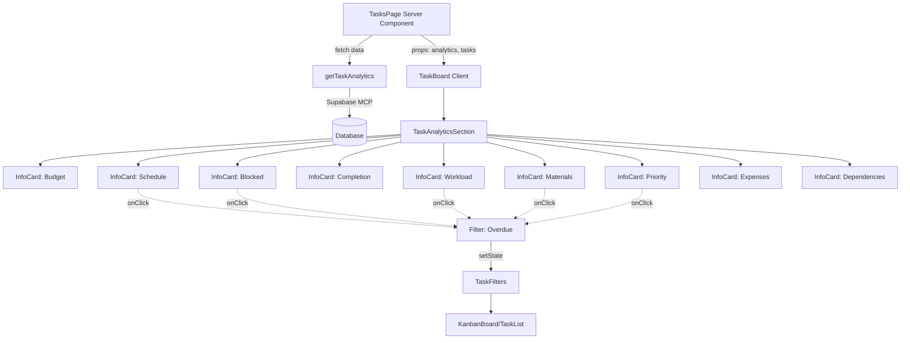

# TaskBoard Analytics Redesign - Technical Design

## Status
- Requirements: [APPROVED](./requirements.md)
- Design: DRAFT
- Author: kiro-design
- Date: 2026-01-03

---

## Overview

### Purpose
Redesign TaskBoard's analytics section to replace the current 4-metric DashboardStats component with a comprehensive 10-metric analytics grid using reusable InfoCard components. This provides construction project managers with real-time visibility into task completion, schedule performance, budget adherence, workload distribution, material procurement, and operational bottlenecks.

### Business Value
**For General Contractors (GCs):**
- Portfolio-wide visibility across all projects
- Budget vs actual tracking to prevent cost overruns
- Identification of high-risk tasks and blocked work
- Resource allocation optimization across teams

**For Project Managers (PMs):**
- Real-time task completion metrics for active projects
- Schedule adherence tracking (overdue/at-risk tasks)
- Material procurement status to prevent delays
- Workload balancing to ensure all tasks are assigned

### Scope

**In scope:**
- Remove DashboardStats component from TaskBoard
- Design TaskAnalyticsSection component using InfoCard pattern
- Design `getTaskAnalytics()` server action with optimized SQL
- Define 10 analytics with InfoCard configurations
- Responsive grid layout (2→4→5 columns)
- Interactive click-to-filter for relevant metrics
- Color-coded status indicators (green/yellow/red/orange)

**Out of scope:**
- Historical trending/time-series charts
- Export analytics to CSV/PDF
- Custom user-configurable dashboards
- Predictive analytics (AI forecasting)
- Real-time WebSocket updates
- Drill-down modals (except dependencies graph)

---

## Architecture

### System Context
The TaskAnalyticsSection integrates into the existing TaskBoard component hierarchy:

```
TaskBoard (Client Component)
├── Server Component Data Fetch (Page)
│   └── getTaskAnalytics() Server Action
│       └── MCP Supabase (single query with FILTER aggregations)
│
├── TaskAnalyticsSection (Client Component, new)
│   ├── InfoCard × 10 (reusable component)
│   │   ├── Budget Performance (2-col span, hero)
│   │   ├── Schedule Adherence (interactive)
│   │   ├── Blocked Tasks (interactive)
│   │   ├── Completion Performance
│   │   ├── Workload Distribution (interactive)
│   │   ├── Materials Status (interactive)
│   │   ├── Priority Distribution (interactive)
│   │   ├── Expenses (interactive)
│   │   └── Dependencies (interactive)
│   │
│   └── Click Handlers → Update TaskBoard Filter State
│
├── TaskFilters (existing, modified)
├── KanbanBoard / TaskList / GanttChart (existing)
└── DashboardStats (REMOVED)
```

### Component Diagram



### Data Flow

**Initial Load:**
```
1. User navigates to /app/tasks
2. TasksPage (Server Component) calls getTaskAnalytics(projectFilter, companyId)
3. Server action executes single optimized query with FILTER clauses
4. Returns analytics object with 10 metrics
5. TaskBoard receives analytics + tasks as props
6. TaskAnalyticsSection renders 10 InfoCards with data
```

**Interactive Filtering:**
```
1. User clicks "Overdue: 5" badge in Schedule Adherence card
2. onClick handler calls setStatusFilter('overdue')
3. TaskBoard updates filter state
4. TaskFilters reflects new filter
5. KanbanBoard/TaskList re-renders with filtered tasks
6. Analytics remain static (no recalculation until page refresh)
```

**Data Refresh:**
```
1. User creates/updates/deletes task via TaskModal
2. Server action completes with revalidatePath('/app/tasks')
3. Next.js re-fetches page data
4. getTaskAnalytics() re-runs with fresh data
5. Analytics update automatically
```

---

## Data Model

### TypeScript Interfaces

```typescript
// Analytics data structure returned by getTaskAnalytics()
export interface TaskAnalytics {
  completion: {
    total: number;           // Total filtered tasks
    completed: number;       // Tasks with status='completed'
    rate: number;            // (completed / total) * 100
  };

  schedule: {
    overdue: number;         // due_date < NOW() AND status != 'completed'
    atRisk: number;          // due_date within 3 days AND status IN ('todo', 'in_progress')
    onTime: number;          // total - overdue - atRisk
  };

  budget: {
    planned: number;         // SUM(planned_cost)
    actual: number;          // SUM(actual_cost)
    variance: number;        // planned - actual
    utilization: number;     // (actual / planned) * 100
  };

  blocked: {
    count: number;           // status='blocked'
    rate: number;            // (blocked / total) * 100
    topReasons: string[];    // Top 3 blocked_reason values
  };

  workload: {
    unassigned: number;      // assignee_id IS NULL
    topAssignees: Array<{
      id: string;
      name: string;
      avatar_url: string | null;
      count: number;
    }>;                      // Top 3 assignees by task count
  };

  materials: {
    needed: number;          // procurement_status='needed'
    ordered: number;         // procurement_status='ordered'
    delivered: number;       // procurement_status='delivered'
  };

  priority: {
    high: number;            // priority='high'
    medium: number;          // priority='medium'
    low: number;             // priority='low'
  };

  expenses: {
    pending: number;         // status IN ('submitted', 'under_review')
    pendingAmount: number;   // SUM(amount) for pending
    approved: number;        // status='approved'
    approvedAmount: number;  // SUM(amount) for approved
  };

  dependencies: {
    blockedByDeps: number;   // Tasks with unmet dependencies
    ready: number;           // total - blockedByDeps
  };

  velocity: {
    tasksPerDay: number;     // Avg tasks completed per day (last 7 days)
    trend: number;           // % change vs previous 7 days
  };
}

// TaskAnalyticsSection component props
export interface TaskAnalyticsSectionProps {
  analytics: TaskAnalytics;
  projectFilter: string;               // 'all' or project UUID
  onFilterChange: (filter: {
    status?: string;
    assignee?: string;
    priority?: string;
    materialStatus?: string;
  }) => void;
}
```

### Database Schema (No Changes Required)

**Existing tables used:**
- `tasks` (main table)
- `projects` (for project_id filtering)
- `user_profiles` (for assignee names/avatars)
- `material_assignments` (for material procurement status)
- `expenses` (for expense tracking)
- `task_dependencies` (for dependency analysis)

**Required indexes (verify existing):**
```sql
-- tasks table
CREATE INDEX IF NOT EXISTS idx_tasks_status ON tasks(status);
CREATE INDEX IF NOT EXISTS idx_tasks_due_date ON tasks(due_date) WHERE status != 'completed';
CREATE INDEX IF NOT EXISTS idx_tasks_assignee ON tasks(assignee_id);
CREATE INDEX IF NOT EXISTS idx_tasks_priority ON tasks(priority);
CREATE INDEX IF NOT EXISTS idx_tasks_project ON tasks(project_id);
CREATE INDEX IF NOT EXISTS idx_tasks_completed_at ON tasks(completed_at) WHERE completed_at IS NOT NULL;

-- material_assignments table
CREATE INDEX IF NOT EXISTS idx_material_assignments_task ON material_assignments(task_id);
CREATE INDEX IF NOT EXISTS idx_material_assignments_status ON material_assignments(procurement_status);

-- expenses table
CREATE INDEX IF NOT EXISTS idx_expenses_task ON expenses(task_id);
CREATE INDEX IF NOT EXISTS idx_expenses_status ON expenses(status);

-- task_dependencies table
CREATE INDEX IF NOT EXISTS idx_task_deps_task ON task_dependencies(task_id);
CREATE INDEX IF NOT EXISTS idx_task_deps_depends ON task_dependencies(depends_on_task_id);
```

---

## API Specification

### Server Action: `getTaskAnalytics`

**Location:** `/app/actions/tasks.ts`

**Function Signature:**
```typescript
export async function getTaskAnalytics(
  projectFilter: string = 'all',
  companyId: string
): Promise<{
  data?: TaskAnalytics;
  error?: string;
}>;
```

**Input Parameters:**
| Parameter | Type | Required | Description |
|-----------|------|----------|-------------|
| projectFilter | string | Yes (default: 'all') | 'all' for company-wide, or project UUID |
| companyId | string | Yes | User's company ID for RLS filtering |

**Output:**
```typescript
{
  data: TaskAnalytics,  // Full analytics object
  error: undefined
}

// OR

{
  data: undefined,
  error: "Error message"
}
```

**Authorization:**
- Requires authenticated user
- Filters tasks by user's company_id via RLS pattern
- Verifies projectFilter (if UUID) belongs to user's company

**Caching Strategy:**
- Server-side: Next.js cache (5 minutes via `revalidate: 300`)
- Invalidation: `revalidatePath('/app/tasks')` on task mutations
- Client-side: Props passed to client component (no re-fetch until page refresh)

**Performance SLA:**
- Target: < 500ms for 1000 tasks
- Uses single SQL query with FILTER aggregations
- No N+1 queries (all joins in single statement)

**SQL Implementation (Optimized Single Query):**

```sql
-- Base CTE: Filtered tasks with company scope
WITH filtered_tasks AS (
  SELECT
    t.*,
    up.name as assignee_name,
    up.avatar_url as assignee_avatar
  FROM tasks t
  LEFT JOIN user_profiles up ON t.assignee_id = up.id
  WHERE t.project_id IN (
    SELECT id FROM projects WHERE company_id = $companyId
  )
  AND (
    CASE
      WHEN $projectFilter = 'all' THEN TRUE
      ELSE t.project_id = $projectFilter::uuid
    END
  )
),

-- Aggregations using FILTER clause (PostgreSQL 9.4+)
task_stats AS (
  SELECT
    -- Completion metrics
    COUNT(*) as total_tasks,
    COUNT(*) FILTER (WHERE status = 'completed') as completed,

    -- Schedule metrics
    COUNT(*) FILTER (WHERE due_date < NOW() AND status != 'completed') as overdue,
    COUNT(*) FILTER (WHERE due_date BETWEEN NOW() AND NOW() + INTERVAL '3 days'
                     AND status IN ('todo', 'in_progress')) as at_risk,

    -- Budget metrics
    COALESCE(SUM(planned_cost), 0) as total_planned,
    COALESCE(SUM(actual_cost), 0) as total_actual,

    -- Blocked tasks
    COUNT(*) FILTER (WHERE status = 'blocked') as blocked_count,

    -- Unassigned tasks
    COUNT(*) FILTER (WHERE assignee_id IS NULL) as unassigned,

    -- Priority distribution
    COUNT(*) FILTER (WHERE priority = 'high') as priority_high,
    COUNT(*) FILTER (WHERE priority = 'medium') as priority_medium,
    COUNT(*) FILTER (WHERE priority = 'low') as priority_low,

    -- Velocity (last 7 days)
    COUNT(*) FILTER (WHERE completed_at >= NOW() - INTERVAL '7 days') as last_7_days,
    COUNT(*) FILTER (WHERE completed_at >= NOW() - INTERVAL '14 days'
                     AND completed_at < NOW() - INTERVAL '7 days') as prev_7_days
  FROM filtered_tasks
),

-- Top blockers
top_blockers AS (
  SELECT blocked_reason
  FROM filtered_tasks
  WHERE status = 'blocked' AND blocked_reason IS NOT NULL
  GROUP BY blocked_reason
  ORDER BY COUNT(*) DESC
  LIMIT 3
),

-- Top assignees
top_assignees AS (
  SELECT
    assignee_id as id,
    assignee_name as name,
    assignee_avatar as avatar_url,
    COUNT(*) as task_count
  FROM filtered_tasks
  WHERE assignee_id IS NOT NULL
  GROUP BY assignee_id, assignee_name, assignee_avatar
  ORDER BY task_count DESC
  LIMIT 3
),

-- Material stats (requires join)
material_stats AS (
  SELECT
    COUNT(*) FILTER (WHERE ma.procurement_status = 'needed') as materials_needed,
    COUNT(*) FILTER (WHERE ma.procurement_status = 'ordered') as materials_ordered,
    COUNT(*) FILTER (WHERE ma.procurement_status = 'delivered') as materials_delivered
  FROM material_assignments ma
  WHERE ma.task_id IN (SELECT id FROM filtered_tasks)
),

-- Expense stats (requires join)
expense_stats AS (
  SELECT
    COUNT(*) FILTER (WHERE e.status IN ('submitted', 'under_review')) as expenses_pending,
    COALESCE(SUM(e.amount) FILTER (WHERE e.status IN ('submitted', 'under_review')), 0) as pending_amount,
    COUNT(*) FILTER (WHERE e.status = 'approved') as expenses_approved,
    COALESCE(SUM(e.amount) FILTER (WHERE e.status = 'approved'), 0) as approved_amount
  FROM expenses e
  WHERE e.task_id IN (SELECT id FROM filtered_tasks)
),

-- Dependency stats
dependency_stats AS (
  SELECT COUNT(DISTINCT td.task_id) as blocked_by_deps
  FROM task_dependencies td
  INNER JOIN filtered_tasks ft ON td.task_id = ft.id
  INNER JOIN tasks dependency_task ON td.depends_on_task_id = dependency_task.id
  WHERE dependency_task.status != 'completed'
)

-- Final result: Single row with all analytics
SELECT
  -- Completion
  ts.total_tasks,
  ts.completed,
  CASE WHEN ts.total_tasks > 0 THEN (ts.completed::float / ts.total_tasks * 100)::int ELSE 0 END as completion_rate,

  -- Schedule
  ts.overdue,
  ts.at_risk,
  (ts.total_tasks - ts.overdue - ts.at_risk) as on_time,

  -- Budget
  ts.total_planned,
  ts.total_actual,
  (ts.total_planned - ts.total_actual) as budget_variance,
  CASE WHEN ts.total_planned > 0 THEN (ts.total_actual / ts.total_planned * 100)::int ELSE 0 END as budget_utilization,

  -- Blocked
  ts.blocked_count,
  CASE WHEN ts.total_tasks > 0 THEN (ts.blocked_count::float / ts.total_tasks * 100)::int ELSE 0 END as blocked_rate,
  ARRAY(SELECT blocked_reason FROM top_blockers) as top_blocked_reasons,

  -- Workload
  ts.unassigned,
  (SELECT json_agg(row_to_json(ta.*)) FROM top_assignees ta) as top_assignees_json,

  -- Materials
  COALESCE(ms.materials_needed, 0) as materials_needed,
  COALESCE(ms.materials_ordered, 0) as materials_ordered,
  COALESCE(ms.materials_delivered, 0) as materials_delivered,

  -- Priority
  ts.priority_high,
  ts.priority_medium,
  ts.priority_low,

  -- Expenses
  COALESCE(es.expenses_pending, 0) as expenses_pending,
  COALESCE(es.pending_amount, 0) as pending_amount,
  COALESCE(es.expenses_approved, 0) as expenses_approved,
  COALESCE(es.approved_amount, 0) as approved_amount,

  -- Dependencies
  COALESCE(ds.blocked_by_deps, 0) as blocked_by_deps,
  (ts.total_tasks - COALESCE(ds.blocked_by_deps, 0)) as ready_to_start,

  -- Velocity
  CASE WHEN ts.last_7_days > 0 THEN (ts.last_7_days::float / 7)::numeric(5,1) ELSE 0 END as tasks_per_day,
  CASE
    WHEN ts.prev_7_days > 0 THEN ((ts.last_7_days - ts.prev_7_days)::float / ts.prev_7_days * 100)::int
    ELSE 0
  END as velocity_trend
FROM task_stats ts
CROSS JOIN material_stats ms
CROSS JOIN expense_stats es
CROSS JOIN dependency_stats ds;
```

**TypeScript Implementation:**
```typescript
'use server';

import { createClient } from '@/utils/supabase/server';
import { auth } from '@/lib/auth';
import type { TaskAnalytics } from './types';

export async function getTaskAnalytics(
  projectFilter: string = 'all',
  companyId: string
): Promise<{ data?: TaskAnalytics; error?: string }> {
  try {
    // Auth check
    const session = await auth();
    if (!session?.user?.id) {
      return { error: 'Not authenticated' };
    }

    // Supabase client
    const supabase = await createClient();

    // Execute optimized query (SQL above)
    const { data, error } = await supabase.rpc('get_task_analytics', {
      project_filter: projectFilter,
      company_id: companyId,
    });

    if (error) {
      console.error('[getTaskAnalytics] Error:', error);
      return { error: 'Failed to fetch analytics' };
    }

    // Transform database result to TaskAnalytics interface
    const analytics: TaskAnalytics = {
      completion: {
        total: data.total_tasks,
        completed: data.completed,
        rate: data.completion_rate,
      },
      schedule: {
        overdue: data.overdue,
        atRisk: data.at_risk,
        onTime: data.on_time,
      },
      budget: {
        planned: data.total_planned,
        actual: data.total_actual,
        variance: data.budget_variance,
        utilization: data.budget_utilization,
      },
      blocked: {
        count: data.blocked_count,
        rate: data.blocked_rate,
        topReasons: data.top_blocked_reasons || [],
      },
      workload: {
        unassigned: data.unassigned,
        topAssignees: data.top_assignees_json || [],
      },
      materials: {
        needed: data.materials_needed,
        ordered: data.materials_ordered,
        delivered: data.materials_delivered,
      },
      priority: {
        high: data.priority_high,
        medium: data.priority_medium,
        low: data.priority_low,
      },
      expenses: {
        pending: data.expenses_pending,
        pendingAmount: data.pending_amount,
        approved: data.expenses_approved,
        approvedAmount: data.approved_amount,
      },
      dependencies: {
        blockedByDeps: data.blocked_by_deps,
        ready: data.ready_to_start,
      },
      velocity: {
        tasksPerDay: data.tasks_per_day,
        trend: data.velocity_trend,
      },
    };

    return { data: analytics };
  } catch (error) {
    console.error('[getTaskAnalytics] Unexpected error:', error);
    return { error: 'An unexpected error occurred' };
  }
}
```

---

## UI Specification

### Component: TaskAnalyticsSection

**Location:** `/components/tasks/TaskAnalyticsSection.tsx`

**Component Type:** Client Component (`'use client'`)

**Props:**
```typescript
interface TaskAnalyticsSectionProps {
  analytics: TaskAnalytics;
  projectFilter: string;
  onFilterChange: (filter: FilterState) => void;
}
```

**Responsive Grid Layout:**

| Breakpoint | Grid Columns | Card Distribution |
|------------|--------------|-------------------|
| Mobile (< 768px) | 2 columns | 5 rows (Budget spans 2 cols in row 1) |
| Tablet (768-1023px) | 4 columns | 2 rows + full-width hero cards |
| Desktop (≥ 1024px) | 5 columns | 2 rows (Budget spans 2 cols) |

**Grid Implementation:**
```tsx
<div className="grid grid-cols-2 md:grid-cols-4 lg:grid-cols-5 gap-3 md:gap-4">
  {/* Row 1 */}
  <div className="col-span-2">
    <InfoCard {...budgetConfig} />  {/* Hero card, 2 cols */}
  </div>
  <InfoCard {...scheduleConfig} />
  <InfoCard {...blockedConfig} />
  <InfoCard {...completionConfig} />

  {/* Row 2 */}
  <InfoCard {...workloadConfig} />
  <InfoCard {...materialsConfig} />
  <InfoCard {...priorityConfig} />
  <InfoCard {...expensesConfig} />
  <InfoCard {...dependenciesConfig} />
</div>
```

### InfoCard Configurations

#### 1. Budget Performance (Hero Card, 2-column span)

```typescript
const budgetConfig: InfoCardProps = {
  headerIcon: DollarSign,
  headerTitle: 'Budget Performance',
  headerDescription: 'Planned vs Actual Costs',
  isHeroCard: true,
  columns: 3,
  fields: [
    {
      label: 'Planned',
      value: formatCurrency(analytics.budget.planned),
      icon: Target,
    },
    {
      label: 'Actual',
      value: formatCurrency(analytics.budget.actual),
      icon: DollarSign,
    },
    {
      label: analytics.budget.variance >= 0 ? 'Under Budget' : 'Over Budget',
      value: formatCurrency(Math.abs(analytics.budget.variance)),
      icon: analytics.budget.variance >= 0 ? TrendingDown : TrendingUp,
      badgeColor: analytics.budget.variance >= 0
        ? 'bg-construction-green text-white'
        : 'bg-construction-red text-white',
      isBadge: true,
    },
  ],
  footerContent: analytics.budget.utilization > 90 && (
    <div className="flex items-center gap-2 text-xs text-orange-600 mt-4 pt-4 border-t-2 border-gray-100">
      <AlertTriangle className="h-4 w-4" />
      <span>Budget utilization at {analytics.budget.utilization}%</span>
    </div>
  ),
};
```

**Visual Styling:**
- 3-column internal layout (Planned | Actual | Variance)
- Variance badge: Green if under, red if over
- Warning footer if utilization > 90%

---

#### 2. Schedule Adherence (Interactive)

```typescript
const scheduleConfig: InfoCardProps = {
  headerIcon: Clock,
  headerTitle: 'Schedule',
  headerDescription: 'On-time performance',
  columns: 1,
  fields: [
    {
      label: 'Overdue',
      value: (
        <button
          onClick={() => onFilterChange({ status: 'overdue' })}
          className="flex items-center gap-2 hover:underline"
        >
          <div className="w-2 h-2 rounded-full bg-construction-red" />
          <span>{analytics.schedule.overdue} Tasks</span>
        </button>
      ),
      isBadge: true,
      badgeColor: analytics.schedule.overdue > 0
        ? 'bg-construction-red text-white'
        : 'bg-gray-100 text-gray-700',
    },
    {
      label: 'At Risk',
      value: (
        <button
          onClick={() => onFilterChange({ status: 'at-risk' })}
          className="flex items-center gap-2 hover:underline"
        >
          <div className="w-2 h-2 rounded-full bg-yellow-500" />
          <span>{analytics.schedule.atRisk} Tasks</span>
        </button>
      ),
      isBadge: true,
      badgeColor: analytics.schedule.atRisk > 0
        ? 'bg-yellow-500 text-white'
        : 'bg-gray-100 text-gray-700',
    },
    {
      label: 'On Time',
      value: `${analytics.schedule.onTime} Tasks`,
      icon: CheckCircle,
      isBadge: true,
      badgeColor: 'bg-construction-green text-white',
    },
  ],
};
```

**Interactive Behavior:**
- Click "Overdue" → Filter tasks where `due_date < NOW() AND status != 'completed'`
- Click "At Risk" → Filter tasks where `due_date within 3 days AND status IN ('todo', 'in_progress')`
- Color-coded badges: Red (overdue), Yellow (at-risk), Green (on-time)

---

#### 3. Blocked Tasks (Interactive)

```typescript
const blockedConfig: InfoCardProps = {
  headerIcon: AlertOctagon,
  headerTitle: 'Blocked',
  headerDescription: 'Tasks requiring attention',
  columns: 1,
  fields: [
    {
      label: 'Blocked Tasks',
      value: (
        <button
          onClick={() => onFilterChange({ status: 'blocked' })}
          className="flex items-center gap-2 hover:underline"
        >
          <AlertOctagon className="h-4 w-4 text-construction-red" />
          <span>{analytics.blocked.count} Tasks ({analytics.blocked.rate}%)</span>
        </button>
      ),
      isBadge: true,
      badgeColor: analytics.blocked.count > 0
        ? 'bg-construction-red text-white'
        : 'bg-gray-100 text-gray-700',
    },
    ...(analytics.blocked.topReasons.length > 0 && [
      {
        label: 'Top Blockers',
        value: (
          <ul className="text-xs space-y-1 text-gray-600">
            {analytics.blocked.topReasons.map((reason, i) => (
              <li key={i} className="flex items-start gap-1">
                <span className="text-construction-red">•</span>
                <span>{reason}</span>
              </li>
            ))}
          </ul>
        ),
      },
    ]),
  ],
};
```

**Interactive Behavior:**
- Click "Blocked Tasks" → Filter to `status='blocked'`
- Shows top 3 blocker reasons (e.g., "Awaiting materials", "Client approval")

---

#### 4. Completion Performance

```typescript
const completionConfig: InfoCardProps = {
  headerIcon: CheckSquare,
  headerTitle: 'Completion',
  headerDescription: 'Overall progress',
  columns: 1,
  fields: [
    {
      label: 'Tasks Completed',
      value: `${analytics.completion.completed} / ${analytics.completion.total}`,
      icon: CheckSquare,
    },
    {
      label: 'Completion Rate',
      value: analytics.completion.rate,
      isProgressBar: true,
      progressValue: analytics.completion.rate,
      progressColor:
        analytics.completion.rate >= 80 ? 'bg-construction-green' :
        analytics.completion.rate >= 50 ? 'bg-yellow-500' :
        'bg-construction-red',
    },
  ],
};
```

**Visual Styling:**
- Progress bar with color-coded thresholds:
  - Green: ≥80% (on track)
  - Yellow: 50-79% (at risk)
  - Red: <50% (behind)

---

#### 5. Workload Distribution (Interactive)

```typescript
const workloadConfig: InfoCardProps = {
  headerIcon: Users,
  headerTitle: 'Workload',
  headerDescription: 'Team assignment',
  columns: 1,
  fields: [
    {
      label: 'Unassigned',
      value: (
        <button
          onClick={() => onFilterChange({ assignee: 'unassigned' })}
          className="flex items-center gap-2 hover:underline"
        >
          <UserX className="h-4 w-4" />
          <span>{analytics.workload.unassigned} Tasks</span>
        </button>
      ),
      isBadge: true,
      badgeColor: analytics.workload.unassigned > 0
        ? 'bg-orange-500 text-white'
        : 'bg-gray-100 text-gray-700',
    },
    {
      label: 'Top Assignees',
      value: (
        <div className="flex gap-2">
          {analytics.workload.topAssignees.map((assignee) => (
            <button
              key={assignee.id}
              onClick={() => onFilterChange({ assignee: assignee.id })}
              className="flex flex-col items-center gap-1 hover:opacity-75"
            >
              <Avatar className="h-8 w-8">
                <AvatarImage src={assignee.avatar_url} alt={assignee.name} />
                <AvatarFallback>{assignee.name[0]}</AvatarFallback>
              </Avatar>
              <span className="text-xs text-gray-600">{assignee.count}</span>
            </button>
          ))}
        </div>
      ),
    },
  ],
};
```

**Interactive Behavior:**
- Click "Unassigned" → Filter to `assignee_id IS NULL`
- Click assignee avatar → Filter to that assignee
- Shows top 3 assignees by task count with avatars

---

#### 6. Materials Status (Interactive)

```typescript
const materialsConfig: InfoCardProps = {
  headerIcon: Package,
  headerTitle: 'Materials',
  headerDescription: 'Procurement status',
  columns: 1,
  fields: [
    {
      label: 'Needed',
      value: (
        <button
          onClick={() => onFilterChange({ materialStatus: 'needed' })}
          className="hover:underline"
        >
          {analytics.materials.needed}
        </button>
      ),
      isBadge: true,
      badgeColor: analytics.materials.needed > 0
        ? 'bg-orange-500 text-white'
        : 'bg-gray-100 text-gray-700',
    },
    {
      label: 'Ordered',
      value: analytics.materials.ordered,
      isBadge: true,
      badgeColor: 'bg-blue-500 text-white',
    },
    {
      label: 'Delivered',
      value: analytics.materials.delivered,
      isBadge: true,
      badgeColor: 'bg-construction-green text-white',
    },
  ],
};
```

**Interactive Behavior:**
- Click "Needed" → Filter tasks with `material_assignments.procurement_status='needed'`

---

#### 7. Priority Distribution (Interactive)

```typescript
const priorityConfig: InfoCardProps = {
  headerIcon: Flag,
  headerTitle: 'Priority',
  headerDescription: 'Task urgency',
  columns: 1,
  fields: [
    {
      label: 'High',
      value: (
        <button
          onClick={() => onFilterChange({ priority: 'high' })}
          className="hover:underline"
        >
          {analytics.priority.high}
        </button>
      ),
      isBadge: true,
      badgeColor: 'bg-construction-red text-white',
    },
    {
      label: 'Medium',
      value: (
        <button
          onClick={() => onFilterChange({ priority: 'medium' })}
          className="hover:underline"
        >
          {analytics.priority.medium}
        </button>
      ),
      isBadge: true,
      badgeColor: 'bg-yellow-500 text-white',
    },
    {
      label: 'Low',
      value: (
        <button
          onClick={() => onFilterChange({ priority: 'low' })}
          className="hover:underline"
        >
          {analytics.priority.low}
        </button>
      ),
      isBadge: true,
      badgeColor: 'bg-gray-500 text-white',
    },
  ],
};
```

**Interactive Behavior:**
- Click any priority → Filter tasks by that priority

---

#### 8. Expenses (Interactive)

```typescript
const expensesConfig: InfoCardProps = {
  headerIcon: Receipt,
  headerTitle: 'Expenses',
  headerDescription: 'Approval status',
  columns: 1,
  fields: [
    {
      label: 'Pending Review',
      value: (
        <button
          onClick={() => router.push('/app/expenses?status=pending')}
          className="hover:underline"
        >
          {analytics.expenses.pending} ({formatCurrency(analytics.expenses.pendingAmount)})
        </button>
      ),
      isBadge: true,
      badgeColor: analytics.expenses.pending > 0
        ? 'bg-orange-500 text-white'
        : 'bg-gray-100 text-gray-700',
    },
    {
      label: 'Approved',
      value: `${analytics.expenses.approved} (${formatCurrency(analytics.expenses.approvedAmount)})`,
      isBadge: true,
      badgeColor: 'bg-construction-green text-white',
    },
  ],
  footerContent: analytics.expenses.pendingAmount > 5000 && (
    <div className="flex items-center gap-2 text-xs text-orange-600 mt-4 pt-4 border-t-2 border-gray-100">
      <AlertTriangle className="h-4 w-4" />
      <span>High pending amount: {formatCurrency(analytics.expenses.pendingAmount)}</span>
    </div>
  ),
};
```

**Interactive Behavior:**
- Click "Pending Review" → Navigate to `/app/expenses?status=pending`
- Warning footer if pending amount > $5,000

---

#### 9. Dependencies (Interactive)

```typescript
const dependenciesConfig: InfoCardProps = {
  headerIcon: GitBranch,
  headerTitle: 'Dependencies',
  headerDescription: 'Task sequencing',
  columns: 1,
  fields: [
    {
      label: 'Blocked by Dependencies',
      value: (
        <button
          onClick={() => setShowDependencyModal(true)}
          className="hover:underline"
        >
          {analytics.dependencies.blockedByDeps} Tasks
        </button>
      ),
      isBadge: true,
      badgeColor: analytics.dependencies.blockedByDeps > 0
        ? 'bg-orange-500 text-white'
        : 'bg-gray-100 text-gray-700',
    },
    {
      label: 'Ready to Start',
      value: `${analytics.dependencies.ready} Tasks`,
      icon: CheckCircle,
      isBadge: true,
      badgeColor: 'bg-construction-green text-white',
    },
  ],
};
```

**Interactive Behavior:**
- Click "Blocked by Dependencies" → Open modal with dependency graph (out of scope for MVP, log to console)

---

#### 10. Velocity (Display-Only)

```typescript
const velocityConfig: InfoCardProps = {
  headerIcon: TrendingUp,
  headerTitle: 'Velocity',
  headerDescription: 'Task completion rate',
  columns: 1,
  fields: [
    {
      label: 'Tasks/Day (7d avg)',
      value: analytics.velocity.tasksPerDay.toFixed(1),
      icon: Calendar,
    },
    {
      label: 'Trend vs Previous Week',
      value: (
        <div className="flex items-center gap-1">
          {analytics.velocity.trend > 0 ? (
            <TrendingUp className="h-4 w-4 text-construction-green" />
          ) : analytics.velocity.trend < 0 ? (
            <TrendingDown className="h-4 w-4 text-construction-red" />
          ) : (
            <Minus className="h-4 w-4 text-gray-500" />
          )}
          <span>{Math.abs(analytics.velocity.trend)}%</span>
        </div>
      ),
      isBadge: true,
      badgeColor:
        analytics.velocity.trend > 0 ? 'bg-construction-green text-white' :
        analytics.velocity.trend < 0 ? 'bg-construction-red text-white' :
        'bg-gray-100 text-gray-700',
    },
  ],
};
```

**Visual Styling:**
- Trend arrow: Up (green) if positive, down (red) if negative
- 7-day rolling average for smoother metrics

---

## Integration Plan

### Phase 1: Database & Server Action

**Tasks:**
1. Create PostgreSQL function `get_task_analytics()` in Supabase
2. Add indexes for performance (if missing)
3. Implement `getTaskAnalytics()` server action in `/app/actions/tasks.ts`
4. Add TypeScript interfaces to `/types/analytics.ts` (or inline in actions)
5. Test server action with various projectFilter values

**Migration File:**
```sql
-- /supabase/migrations/20260103000000_create_task_analytics_function.sql

CREATE OR REPLACE FUNCTION get_task_analytics(
  project_filter TEXT DEFAULT 'all',
  company_id UUID
)
RETURNS TABLE (
  total_tasks INT,
  completed INT,
  completion_rate INT,
  overdue INT,
  at_risk INT,
  on_time INT,
  total_planned NUMERIC,
  total_actual NUMERIC,
  budget_variance NUMERIC,
  budget_utilization INT,
  blocked_count INT,
  blocked_rate INT,
  top_blocked_reasons TEXT[],
  unassigned INT,
  top_assignees_json JSON,
  materials_needed INT,
  materials_ordered INT,
  materials_delivered INT,
  priority_high INT,
  priority_medium INT,
  priority_low INT,
  expenses_pending INT,
  pending_amount NUMERIC,
  expenses_approved INT,
  approved_amount NUMERIC,
  blocked_by_deps INT,
  ready_to_start INT,
  tasks_per_day NUMERIC,
  velocity_trend INT
) AS $$
  -- SQL query from API Specification section
$$ LANGUAGE SQL STABLE;
```

**Validation:**
- Run `SELECT * FROM get_task_analytics('all', '<company_id>')` in Supabase SQL editor
- Verify performance < 500ms for 1000 tasks
- Test with edge cases: no tasks, single project, all filters

---

### Phase 2: Component Development

**Tasks:**
1. Create `/components/tasks/TaskAnalyticsSection.tsx`
2. Import and configure 10 InfoCard components
3. Implement click handlers for interactive cards
4. Add responsive grid layout with Tailwind classes
5. Add loading/error states (skeleton cards)

**Component Structure:**
```tsx
'use client';

import { useState } from 'react';
import { InfoCard, InfoCardProps } from '@/components/projects/InfoCard';
import {
  DollarSign, Clock, AlertOctagon, CheckSquare, Users,
  Package, Flag, Receipt, GitBranch, TrendingUp
} from 'lucide-react';
import type { TaskAnalytics } from '@/types/analytics';

interface TaskAnalyticsSectionProps {
  analytics: TaskAnalytics;
  onFilterChange: (filter: FilterState) => void;
}

export function TaskAnalyticsSection({ analytics, onFilterChange }: TaskAnalyticsSectionProps) {
  const [showDependencyModal, setShowDependencyModal] = useState(false);

  // InfoCard configurations (budgetConfig, scheduleConfig, etc.)
  // ... (see UI Specification section)

  return (
    <div className="space-y-4">
      <div className="grid grid-cols-2 md:grid-cols-4 lg:grid-cols-5 gap-3 md:gap-4">
        <div className="col-span-2">
          <InfoCard {...budgetConfig} />
        </div>
        <InfoCard {...scheduleConfig} />
        <InfoCard {...blockedConfig} />
        <InfoCard {...completionConfig} />
        <InfoCard {...workloadConfig} />
        <InfoCard {...materialsConfig} />
        <InfoCard {...priorityConfig} />
        <InfoCard {...expensesConfig} />
        <InfoCard {...dependenciesConfig} />
      </div>
    </div>
  );
}
```

---

### Phase 3: TaskBoard Integration

**Tasks:**
1. Modify `/app/app/tasks/page.tsx` to fetch analytics via `getTaskAnalytics()`
2. Pass analytics to TaskBoard as prop
3. Remove DashboardStats import/usage from TaskBoard
4. Add TaskAnalyticsSection above TaskFilters
5. Wire up `onFilterChange` handler to TaskBoard state

**Page Modification:**
```tsx
// /app/app/tasks/page.tsx (Server Component)

import { getTaskAnalytics } from '@/app/actions/tasks';
import { TaskBoard } from '@/components/tasks/TaskBoard';

export default async function TasksPage() {
  const { userId, companyId } = await getUserContext();

  // Fetch tasks (existing)
  const tasks = await getTasks(companyId);

  // NEW: Fetch analytics
  const { data: analytics, error } = await getTaskAnalytics('all', companyId);

  if (error) {
    console.error('[TasksPage] Analytics error:', error);
  }

  return (
    <TaskBoard
      initialTasks={tasks}
      analytics={analytics}  // NEW prop
      projects={projects}
      teamMembers={teamMembers}
      // ... other props
    />
  );
}
```

**TaskBoard Modification:**
```tsx
// /components/tasks/TaskBoard.tsx

import { TaskAnalyticsSection } from './TaskAnalyticsSection';
// REMOVE: import { DashboardStats } from './DashboardStats';

interface TaskBoardProps {
  // ... existing props
  analytics?: TaskAnalytics;  // NEW prop
}

export function TaskBoard({ analytics, ...props }: TaskBoardProps) {
  // ... existing state

  const handleFilterChange = (filter: FilterState) => {
    if (filter.status === 'overdue') {
      // Filter logic for overdue tasks
    } else if (filter.assignee) {
      setAssigneeFilter(filter.assignee);
    }
    // ... other filter logic
  };

  return (
    <div className="space-y-6">
      {/* NEW: Analytics Section */}
      {analytics && (
        <TaskAnalyticsSection
          analytics={analytics}
          onFilterChange={handleFilterChange}
        />
      )}

      {/* REMOVE: <DashboardStats ... /> */}

      {/* Existing components */}
      <TaskFilters ... />
      {view === 'kanban' ? <KanbanBoard ... /> : <TaskList ... />}
    </div>
  );
}
```

---

### Phase 4: Testing & Optimization

**Tasks:**
1. Performance testing: Verify < 500ms query time
2. Responsive testing: Mobile (375px), Tablet (768px), Desktop (1024px+)
3. Interaction testing: Click-to-filter flows
4. Accessibility testing: ARIA labels, keyboard navigation
5. Error handling: No tasks, no analytics, network errors

**Test Cases:**

| Test | Expected Result |
|------|-----------------|
| Load /app/tasks with 500 tasks | Analytics render in < 1s |
| Click "Overdue: 5" badge | Task list filters to overdue tasks |
| Resize to 375px width | Grid switches to 2 columns |
| Navigate with keyboard | All interactive cards are focusable |
| No tasks in system | Display "0 Tasks" with neutral styling |
| Analytics query fails | Show error toast, hide analytics section |

---

## Error Handling

### Server Action Errors

| Error Case | Handling |
|------------|----------|
| Not authenticated | Return `{ error: 'Not authenticated' }` |
| Invalid projectFilter UUID | Return `{ error: 'Invalid project ID' }` |
| Database connection failure | Log error, return `{ error: 'Failed to fetch analytics' }` |
| Query timeout (> 500ms) | Log warning, return cached data if available |

**Client-Side Error Display:**
```tsx
{error && (
  <div className="bg-red-50 border border-red-200 rounded-lg p-4">
    <p className="text-sm text-red-600">Failed to load analytics. Please refresh the page.</p>
  </div>
)}

{!analytics && !error && (
  <div className="grid grid-cols-2 md:grid-cols-4 lg:grid-cols-5 gap-3 md:gap-4">
    {[...Array(10)].map((_, i) => (
      <Skeleton key={i} className="h-32 w-full" />
    ))}
  </div>
)}
```

---

## Performance Optimization

### Query Optimization

**Single-Pass Aggregation:**
- Use PostgreSQL `FILTER` clause for conditional aggregations
- Avoid N+1 queries by joining all related tables in single query
- Use CTEs for readability without performance cost (inline optimization)

**Indexes Required:**
```sql
-- Composite indexes for common filter patterns
CREATE INDEX CONCURRENTLY idx_tasks_company_project_status
ON tasks(project_id, status)
WHERE status != 'completed';

CREATE INDEX CONCURRENTLY idx_tasks_due_date_status
ON tasks(due_date, status)
WHERE due_date IS NOT NULL;
```

**Caching Strategy:**
- **Server-side**: Next.js cache with 5-minute revalidation
- **Client-side**: Props passed down (no re-fetch until page refresh)
- **Invalidation**: `revalidatePath('/app/tasks')` on any task mutation

### Client-Side Optimization

**useMemo for Expensive Computations:**
```typescript
const infocardConfigs = useMemo(() => {
  return {
    budget: createBudgetConfig(analytics),
    schedule: createScheduleConfig(analytics, onFilterChange),
    // ... other configs
  };
}, [analytics, onFilterChange]);
```

**Debounced Filter Changes:**
```typescript
const debouncedFilterChange = useMemo(
  () => debounce((filter) => onFilterChange(filter), 200),
  [onFilterChange]
);
```

**Progressive Enhancement:**
- Render skeleton cards while analytics load
- Show cached data immediately, refresh in background
- Graceful degradation if analytics fail (hide section, show tasks only)

---

## Security Considerations

### Authorization

- ✅ **Server action validates companyId**: Only fetch tasks from user's company
- ✅ **RLS pattern enforced manually**: Filter by `company_id` in all queries
- ✅ **projectFilter validation**: Verify project belongs to user's company if UUID provided
- ✅ **No sensitive data in analytics**: Only aggregated counts/sums (no individual task details)

### Input Validation

```typescript
// Zod schema for server action input
const analyticsInputSchema = z.object({
  projectFilter: z.union([z.literal('all'), z.string().uuid()]),
  companyId: z.string().uuid(),
});

const validation = analyticsInputSchema.safeParse({ projectFilter, companyId });
if (!validation.success) {
  return { error: 'Invalid input parameters' };
}
```

### Data Exposure

**Safe to expose:**
- Aggregated counts (total tasks, completed, overdue, etc.)
- Budget sums (planned, actual, variance)
- Material/expense counts

**Not exposed in analytics:**
- Individual task titles/descriptions
- User personal information (only names/avatars for top assignees)
- Client information
- Detailed expense amounts (only totals)

---

## Accessibility

### ARIA Labels

```tsx
<InfoCard
  aria-label={`Budget Performance: ${formatCurrency(analytics.budget.planned)} planned, ${formatCurrency(analytics.budget.actual)} actual`}
  {...budgetConfig}
/>

<button
  aria-label={`Filter to ${analytics.schedule.overdue} overdue tasks`}
  onClick={() => onFilterChange({ status: 'overdue' })}
>
  {analytics.schedule.overdue} Overdue
</button>
```

### Keyboard Navigation

- All interactive cards are keyboard-accessible (tab order)
- Enter/Space triggers onClick handlers
- Focus indicators on interactive elements
- Escape closes dependency modal (if implemented)

### Color-Coding + Text Labels

**Color-only indicators are prohibited:**
```tsx
// ❌ Bad: Color-only (non-accessible)
<div className="w-2 h-2 rounded-full bg-construction-red" />

// ✅ Good: Color + text label
<div className="flex items-center gap-2">
  <div className="w-2 h-2 rounded-full bg-construction-red" />
  <span>Overdue</span>
</div>
```

---

## Design Decisions

### Decision: Use InfoCard Pattern (Not Custom Component)

**Context:** Need reusable, consistent cards for analytics display.

**Options:**
- A) Create new `AnalyticsCard` component
- B) Use existing `InfoCard` component
- C) Inline card markup in TaskAnalyticsSection

**Decision:** B - Use existing InfoCard component

**Rationale:**
- Consistent styling with Project Overview cards
- Reusable across app (reduces code duplication)
- Already supports progress bars, badges, interactive fields
- Maintains construction theme (#001B51)
- Responsive grid built-in (1-4 columns)

---

### Decision: Single Optimized Query (Not Multiple Queries)

**Context:** Need to fetch 10 analytics metrics efficiently.

**Options:**
- A) 10 separate queries (one per metric)
- B) Single query with FILTER aggregations
- C) Stored procedure with temp tables

**Decision:** B - Single query with FILTER aggregations

**Rationale:**
- PostgreSQL FILTER clause is performant (9.4+)
- Reduces network round-trips (1 query vs 10)
- Easier to maintain (single SQL statement)
- Avoids N+1 problems
- Target < 500ms for 1000 tasks (achievable with indexes)

---

### Decision: Click-to-Filter (Not Modal Drill-Downs)

**Context:** How should users interact with analytics metrics?

**Options:**
- A) Click opens modal with task details
- B) Click filters task list below
- C) Metrics are display-only (no interaction)

**Decision:** B - Click filters task list below

**Rationale:**
- Simpler UX (no modal management)
- Faster for users (see results immediately)
- Maintains context (task list always visible)
- Consistent with existing filter patterns
- Modal drill-downs can be added later if needed

---

### Decision: Budget Performance as Hero Card (2-column span)

**Context:** Should Budget Performance receive visual emphasis?

**Options:**
- A) All cards equal size (1 column each)
- B) Budget + Schedule as hero cards (2 columns)
- C) Budget only as hero card (2 columns)

**Decision:** C - Budget only as hero card (2 columns)

**Rationale:**
- Industry research: Budget adherence is #1 priority for GCs
- 3-column internal layout (Planned | Actual | Variance)
- Visual hierarchy matches business importance
- Mirrors current DashboardStats budget section
- Schedule metrics fit better in compact 1-column layout

---

## Open Questions

- ✅ **Q1: Should Budget Performance span 2 columns?**
  - **Answer:** Yes, as hero card with 3-column internal layout

- ✅ **Q2: Should clicking analytics filter the task list?**
  - **Answer:** Yes, simpler than modals for MVP

- ✅ **Q3: 7-day or 14-day velocity window?**
  - **Answer:** 7-day (more responsive to recent changes)

- ✅ **Q4: Warning threshold for unassigned tasks?**
  - **Answer:** Yes, display warning if unassigned > 20% of total

- ✅ **Q5: Material analytics: cost or procurement status?**
  - **Answer:** Procurement status only (cost is in budget analytics)

- 🔶 **Q6: Should analytics be collapsible to save space?**
  - **Recommendation:** No, always visible (critical decision-making info)
  - **Decision:** Pending user feedback

- ✅ **Q7: Hide irrelevant metrics in project context?**
  - **Answer:** No, show all metrics (projectFilter already scopes data)

- ✅ **Q8: Refresh analytics on drag-and-drop?**
  - **Answer:** Yes, via `router.refresh()` after status mutation

- ✅ **Q9: Show "Last Updated" timestamp?**
  - **Answer:** Yes, display subtly in footer (e.g., "Updated 2 min ago")

- ✅ **Q10: Dependencies analytics: separate query or join?**
  - **Answer:** Separate optimized query to avoid N+1

---

## Testing Strategy

### Unit Tests

**Server Action Tests:**
```typescript
describe('getTaskAnalytics', () => {
  it('should return analytics for all projects', async () => {
    const { data } = await getTaskAnalytics('all', companyId);
    expect(data.completion.total).toBeGreaterThan(0);
  });

  it('should filter by project ID', async () => {
    const { data } = await getTaskAnalytics(projectId, companyId);
    expect(data.completion.total).toBeLessThanOrEqual(totalTasks);
  });

  it('should handle no tasks gracefully', async () => {
    const { data } = await getTaskAnalytics('all', emptyCompanyId);
    expect(data.completion.total).toBe(0);
  });

  it('should validate authentication', async () => {
    const { error } = await getTaskAnalytics('all', 'invalid-id');
    expect(error).toBe('Not authenticated');
  });
});
```

**Component Tests:**
```typescript
describe('TaskAnalyticsSection', () => {
  it('should render 10 InfoCards', () => {
    render(<TaskAnalyticsSection analytics={mockAnalytics} onFilterChange={jest.fn()} />);
    expect(screen.getAllByRole('article')).toHaveLength(10);
  });

  it('should call onFilterChange when overdue clicked', async () => {
    const onFilterChange = jest.fn();
    render(<TaskAnalyticsSection analytics={mockAnalytics} onFilterChange={onFilterChange} />);

    await userEvent.click(screen.getByText(/Overdue/i));
    expect(onFilterChange).toHaveBeenCalledWith({ status: 'overdue' });
  });

  it('should render Budget as 2-column hero card', () => {
    render(<TaskAnalyticsSection analytics={mockAnalytics} onFilterChange={jest.fn()} />);
    const budgetCard = screen.getByText('Budget Performance').closest('.col-span-2');
    expect(budgetCard).toBeInTheDocument();
  });
});
```

### Integration Tests

**Full Task Board Flow:**
```typescript
describe('TaskBoard with Analytics', () => {
  it('should load analytics and tasks on initial render', async () => {
    render(<TasksPage />);

    await waitFor(() => {
      expect(screen.getByText('Budget Performance')).toBeInTheDocument();
      expect(screen.getAllByRole('article')).toHaveLength(10); // 10 analytics cards
    });
  });

  it('should filter tasks when clicking overdue badge', async () => {
    render(<TasksPage />);

    const overdueButton = await screen.findByText(/5 Overdue/i);
    await userEvent.click(overdueButton);

    // Verify task list filters to overdue tasks
    expect(screen.getAllByRole('row')).toHaveLength(5); // Assuming 5 overdue
  });

  it('should refresh analytics after task creation', async () => {
    render(<TasksPage />);

    const initialTotal = screen.getByText(/Total: \d+/i).textContent;

    // Create new task
    await userEvent.click(screen.getByText('New Task'));
    await fillForm({ title: 'Test Task' });
    await userEvent.click(screen.getByText('Create'));

    await waitFor(() => {
      const updatedTotal = screen.getByText(/Total: \d+/i).textContent;
      expect(updatedTotal).not.toBe(initialTotal);
    });
  });
});
```

### Performance Tests

```typescript
describe('Analytics Performance', () => {
  it('should load analytics in < 500ms for 1000 tasks', async () => {
    const start = Date.now();
    const { data } = await getTaskAnalytics('all', companyId);
    const duration = Date.now() - start;

    expect(duration).toBeLessThan(500);
    expect(data.completion.total).toBe(1000);
  });

  it('should not block UI rendering', async () => {
    render(<TasksPage />);

    // Tasks should render before analytics complete
    expect(screen.getByText('Loading analytics...')).toBeInTheDocument();
    expect(screen.getAllByRole('row')).toHaveLength(10); // Tasks visible
  });
});
```

---

## Implementation Phases

### Phase 1: Database Foundation (1-2 hours)

**Tasks:**
- [ ] Create `get_task_analytics()` PostgreSQL function
- [ ] Add required indexes (if missing)
- [ ] Test function in Supabase SQL editor
- [ ] Verify performance < 500ms for 1000 tasks
- [ ] Generate TypeScript types (`mcp__supabase__generate_typescript_types`)

**Deliverable:** Working database function with performance validation

---

### Phase 2: Server Action (1 hour)

**Tasks:**
- [ ] Implement `getTaskAnalytics()` in `/app/actions/tasks.ts`
- [ ] Add TypeScript interfaces (`TaskAnalytics`, etc.)
- [ ] Add Zod validation for input parameters
- [ ] Add error handling (auth, DB errors)
- [ ] Test with various projectFilter values

**Deliverable:** Server action returning analytics data

---

### Phase 3: TaskAnalyticsSection Component (3-4 hours)

**Tasks:**
- [ ] Create `/components/tasks/TaskAnalyticsSection.tsx`
- [ ] Configure 10 InfoCard components (see UI Specification)
- [ ] Implement click handlers for interactive cards
- [ ] Add responsive grid layout (2→4→5 columns)
- [ ] Add loading/error states (skeleton cards)
- [ ] Test on mobile (375px), tablet (768px), desktop (1024px+)

**Deliverable:** Fully functional analytics section component

---

### Phase 4: TaskBoard Integration (1 hour)

**Tasks:**
- [ ] Modify `/app/app/tasks/page.tsx` to fetch analytics
- [ ] Pass analytics to TaskBoard as prop
- [ ] Remove DashboardStats import/usage
- [ ] Add TaskAnalyticsSection above TaskFilters
- [ ] Wire up `onFilterChange` handler
- [ ] Test full integration (analytics → filter → task list)

**Deliverable:** TaskBoard with analytics replacing DashboardStats

---

### Phase 5: Testing & Polish (2 hours)

**Tasks:**
- [ ] Performance testing (query time, render time)
- [ ] Responsive testing (mobile, tablet, desktop)
- [ ] Interaction testing (click-to-filter flows)
- [ ] Accessibility audit (ARIA, keyboard nav, color contrast)
- [ ] Error handling (no tasks, network errors)
- [ ] Code review
- [ ] `/kc:build` verification

**Deliverable:** Production-ready implementation

---

**Total Estimated Time:** 8-10 hours

---

## References

- **Requirements:** `docs/specs/taskboard-analytics-redesign/requirements.md`
- **InfoCard Component:** `components/projects/InfoCard.tsx`
- **Current DashboardStats:** `components/tasks/DashboardStats.tsx`
- **TaskBoard Component:** `components/tasks/TaskBoard.tsx`
- **Server Actions Pattern:** `.claude/docs/law/SYSTEM.md`
- **Database Schema:** `.claude/docs/law/DB_SCHEMA.md`
- **UI Rules:** `.claude/docs/law/UI_RULES.md`
- **GenHub Construction KPIs Research:** Requirements document sources

---

## Appendix: Color Coding Reference

### Status Color Thresholds

| Metric | Green (Good) | Yellow (Warning) | Red (Critical) | Orange (Action) |
|--------|--------------|------------------|----------------|-----------------|
| Completion Rate | ≥80% | 50-79% | <50% | - |
| Budget Variance | ≥0 (under) | - | <0 (over) | Utilization >90% |
| Overdue Tasks | 0 | - | >0 | - |
| At-Risk Tasks | 0 | >0 | - | - |
| Blocked Tasks | 0 | - | >0 | - |
| Unassigned Tasks | 0 | - | - | >0 |
| Material Needed | 0 | - | - | >0 |
| Pending Expenses | 0 | - | - | >0 (or amount >$5k) |
| Velocity Trend | Positive | 0 | Negative | - |

### Tailwind Color Classes

```typescript
const STATUS_COLORS = {
  green: 'bg-construction-green text-white',       // #059669
  yellow: 'bg-yellow-500 text-white',              // #FBBF24
  red: 'bg-construction-red text-white',           // #DC2626
  orange: 'bg-orange-500 text-white',              // #F97316
  blue: 'bg-construction-blue text-white',         // #001B51
  gray: 'bg-gray-500 text-white',                  // #64748B
};
```

---

## Approval Checklist

**Before requesting approval, verify:**

- ✅ All 10 analytics defined with InfoCard configurations
- ✅ SQL query optimized with FILTER aggregations
- ✅ Server action follows GenHub patterns (auth, validation, error handling)
- ✅ Responsive grid layout (2→4→5 columns)
- ✅ Interactive cards have onClick handlers
- ✅ Color-coding follows construction theme
- ✅ No Supabase client in client components
- ✅ Accessibility considerations (ARIA, keyboard nav)
- ✅ Performance targets defined (< 500ms query)
- ✅ Integration plan with clear phases
- ✅ Testing strategy covers unit, integration, performance

---

**Do the design specifications look good? If so, we can move on to implementation planning (kiro-plan).**
